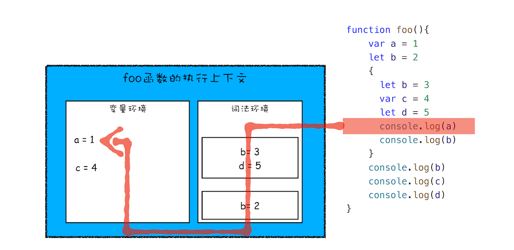

- [前言](#前言)
- [变量提升(var) :bell:](#变量提升var-bell)
  - [那为什么会进行变量提升呢？主要有以下两个原因：](#那为什么会进行变量提升呢主要有以下两个原因)
  - [关于作用域、变量提升、函数表达式、立即函数表达式的经典面试题](#关于作用域变量提升函数表达式立即函数表达式的经典面试题)
  - [变量提升带来的问题](#变量提升带来的问题)
- [作用域](#作用域)
  - [全局作用域和函数作用域](#全局作用域和函数作用域)
  - [块级作用域(let，const， 暂时性死区)](#块级作用域letconst-暂时性死区)
- [作用域链](#作用域链)
  - [词法作用域](#词法作用域)
- [内存管理机制 - 堆和栈 :bell:](#内存管理机制---堆和栈-bell)
  - [栈空间和堆空间简介](#栈空间和堆空间简介)
  - [栈空间的重要作用 - 管理函数调用（创建并切换函数执行上下文）](#栈空间的重要作用---管理函数调用创建并切换函数执行上下文)
  - [有了栈，为什么还要堆？](#有了栈为什么还要堆)
- [闭包 :bell:](#闭包-bell)
  - [延迟解析：V8如何实现闭包？](#延迟解析v8如何实现闭包)
    - [预解析器如何解决闭包给惰性解析带来的问题](#预解析器如何解决闭包给惰性解析带来的问题)
- [什么是V8？](#什么是v8)
- [V8 如何执行 JavaScript 代码？:bell:](#v8-如何执行-javascript-代码bell)
  - [第一步：编译阶段](#第一步编译阶段)
  - [第二步：执行阶段](#第二步执行阶段)
- [V8中的对象表示](#v8中的对象表示)
- [二进制代码如何被CPU执行的？](#二进制代码如何被cpu执行的)

> 参考链接：https://time.geekbang.org/column/intro/100048001

# 前言
网页的工作过程需要使用到两个引擎渲染引擎和JavaScript引擎。它们分别负责不同的事情：**JavaScript引擎**负责执行JavaScript代码，而**渲染引擎**负责渲染网页。

JavaScript引擎提供调用接口被渲染引擎使用，渲染引擎使用JavaScript引擎来处理JavaScript代码并获取结果。

JS引擎，简单来说就是能够提供执行JavaScript代码的运行环境。

JS的引擎包括：**Google V8、JavaScriptCore**等，其中Google V8是主流浏览器的选择。

> 参考文章：[什么是JS引擎](https://www.jianshu.com/p/565dfad8d41e)


# 变量提升(var) :bell:
变量提升指的是：在V8执行js源码前，会先进行**预编译**，预编译期间会将`变量声明`与`函数声明`提升至其对应`作用域`的最顶端。

1. 变量提升只会提升变量名的声明，而不会提升变量的赋值初始化。
2. 函数提升的**优先级大于**变量提升的，即函数提升在变量提升之上。

注意：
* 对于`变量提升`来说：只是将`声明`提升到作用域最顶端，并不会把`赋值`也提升上来。
* 函数定义有声明式和函数字面量式。只有`函数声明`才存在函数提升！

```js
console.log(x) // undefined
console.log(f1); //打印完整对象 ƒ f1(){}
f1(); // test
console.log(f2); // undefined  

var x = 5
function f1() { // 声明式
    console.log('test');
}  
var f2 = function() {}  // 字面量
```
```js
console.log(a);  // [Function: a]
var a = 1;
function a () {}
console.log(a); // 1

// 相当于这样
var a;
function a() {};
console.log(a);
a = 1;
console.log(a)
```
ps: 
* var的**创建和初始化**被提升，赋值不会被提升。
* let的**创建**被提升，初始化和赋值不会被提升。
* function的**创建、初始化和赋值**均会被提升。

## 那为什么会进行变量提升呢？主要有以下两个原因：

- 提高性能：解析和预编译过程中的声明提升可以提高性能，让函数可以在执行时预先为变量分配栈空间
- 容错性更好：

## 关于作用域、变量提升、函数表达式、立即函数表达式的经典面试题
```js
var n = 1;
(function foo(){
    n = 100;
    console.log(n); // 100
}())
console.log(n); // 100
```
原因：
1. 编译阶段，先在全局作用域内声明变量 n 的值为`undefined`，然后声明函数表达式；编译阶段结束。
2. 开始执行阶段，将 1 赋值给 n，函数表达式**立即执行**，欲将 100 赋值给变量 n，但在当前作用域内没有找到 n 的声明，沿着作用域链向上查找，在**全局作用域**内找到了变量 n，将 100 赋给它，接着执行立即函数调用表达式中的打印语句，输出 n，为100。
3. 接着执行后面的打印语句，此时 n 的值已经由 1 被修改为了 100，因此输出 100

```js
var n = 1;
function foo(){
    n = 100;
    console.log(n);
}
console.log(n); // 1
foo() // 100
```
原因：
1. 第一次打印的时候，函数只是被放入作用域，函数没有执行，输出的是全局作用域中声明并赋值好的1；
2. 然后函数执行，将**全局作用域**中的 n 修改为 100，因此输出 100。
   
## 变量提升带来的问题
1. **变量容易在不被察觉的情况下被覆盖掉**
   ```js
    var myname = "极客时间"
    function showName(){
      console.log(myname); // undefined
      if(0){
       var myname = "极客邦"
      }
      console.log(myname); // undefined
    }
    showName()
   ```
   调用栈如下：

   

   JavaScript 会优先从当前的执行上下文中查找变量，由于变量提升，当前的执行上下文中就包含了变量 myname，而值是 undefined，所以获取到的 myname 的值就是 undefined。
2. **本应销毁的变量没有被销毁**
   ```js
    function foo(){
      for (var i = 0; i < 7; i++) {
      }
      console.log(i); 
    }
    foo()
   ```
  最后打印结果都是`7`。因为在创建执行上下文阶段，变量 i 就已经被`提升`了，所以当 for 循环结束之后，变量 i 并没有被销毁。

# 作用域
作用域就是存放**变量和函数**的地方，位置决定了变量的生命周期。通俗地理解，作用域就是变量与函数的可访问范围，即作用域控制着变量和函数的可见性和生命周期。

## 全局作用域和函数作用域
在ES6之前，只有两种作用域：
* `全局作用域`：在 V8 启动过程中就创建了，且一直保存在内存中不会被销毁的，直至 V8 退出。 全局作用域中的对象在代码中的任何地方都能访问，其生命周期伴随着页面的生命周期。
* `函数作用域`：在执行该函数时创建的，并且定义的变量或者函数只能在函数内部被访问。当函数执行结束之后，函数作用域就随之被销毁掉了。
> V8采用`词法(静态)作用域`， 即函数的作用域在函数**定义**的时候就决定了。

## 块级作用域(let，const， 暂时性死区)
但由于变量提升带来的问题，会给人带来误解。所以ES6引入了`let` 和 `const` 关键字，从而使 JavaScript 也能像其他语言一样拥有了`块级作用域`。

let 和 const 的用法如下：
```js
let x = 5
const y = 6
x = 7
y = 9 //报错，const声明的变量不可以修改
```

**作用域块内声明的变量不影响块外面的变量**。例子：
```js
function letTest() {
  let x = 1;
  if (true) {
    let x = 2;  // 不同的变量
    console.log(x);  // 2
  }
  console.log(x);  // 1
}
```

级作用域就是通过**词法环境**的栈结构来实现的，而变量提升是通过**变量环境**来实现，通过这两者的结合，JavaScript 引擎也就同时支持了变量提升和块级作用域了。
* 函数内部通过 var 声明的变量，在编译阶段全都被存放到**变量环境**里面了。
* 通过 let 声明的变量，在编译阶段会被存放到**词法环境**中。
* 在函数的作用域块内部，通过 let 声明的变量并没有被存放到词法环境中。

词法环境和变量环境中查找变量的方式是：**先词法环境 -> 再变量环境**

🌰例子1：



🌰例子2:
```js
let myname= '极客时间'
{
  console.log(myname) // Uncaught ReferenceError: Cannot access 'myname' before initialization
  let myname= '极客邦'
}
```
块作用域内，let声明的变量被提升，但变量只是创建被提升，初始化并没有被提升，在初始化之前使用变量，就会形成一个**暂时性死区**。
> TDZ(暂时性死区)：ES6 明确规定，如果区块中存在let和const命令，这个区块对这些命令声明的变量，从一开始就形成了封闭作用域。凡是在声明之前就使用这些变量，就会报错。简单理解，在let或者const声明之前使用该变量，就会报错。


# 作用域链
其实在每个执行上下文的变量环境中，都包含了一个外部引用，用来**指向外部的执行上下文**，我们把这个外部引用称为 `outer`。

当一段代码使用了一个变量时，JavaScript 引擎首先会在**当前的执行上下文**中查找该变量，如果没有找到js引擎会在`outer`所指向的上下文中查找。我们把这个查找的链条就称为`作用域链`。

🌰例子：


## 词法作用域
词法作用域就是指作用域是由代码中函数声明的位置来决定的，所以词法作用域是静态的作用域，通过它就能够预测代码在执行过程中如何查找标识符。


# 内存管理机制 - 堆和栈 :bell:
> 参考链接：https://juejin.cn/post/6844904004007247880

JavaScript 是一种**弱类型的、动态**的语言。

在 JavaScript 的执行过程中， 主要有三种类型内存空间，分别是`代码空间`、`栈空间`和`堆空间`。其中的代码空间主要是存储可执行代码的，先不进行介绍。


## 栈空间和堆空间简介

* 基本数据类型用`栈`存储。栈会自动分配内存空间，会自动释放。
* 引用数据类型的**值**用`堆`存储（键和值的地址存储于在`栈`内存）。堆动态分配的内存，大小不定也不会自动释放。

>:bell: **闭包变量**先存在`栈`中，然后在预解析器阶段在将变量复制在**堆**空间中，即便外部前函数执行结束之后，也不会释放该变量。

:bell: 对于`赋值`操作，**原始类型**的数据直接完整地复制**变量值**，**对象数据类型**的数据则是复制**引用地址**。

看下面的例子：
```js
let obj = { a: 1 };
let newObj = obj;
newObj.a = 2;
console.log(obj.a);//变成了2
```
因为obj是引用数据类型，`let newObj = obj;`该语句将obj的**引用地址**赋值给了newObj，所以newObj和obj指向的是同一块**堆内存空间**，所以改变newObj等于改变了共同的堆内存。

常见面试题：[《深浅拷贝》](../js/深浅拷贝)。

## 栈空间的重要作用 - 管理函数调用（创建并切换函数执行上下文）

`函数`有两个主要的特性：
1. 可被调用：可以在一个函数中调用另外一个函数，当函数调用发生时，执行代码的控制权将从父函数转移到子函数，子函数执行结束之后，又会将代码执行控制权返还给父函数。
2. 具有作用域机制：是指函数在执行的时候可以将定义在函数内部的变量和外部环境隔离，在函数内部定义的变量我们也称为临时变量，临时变量只能在该函数中被访问，外部函数通常无权访问，当函数执行结束之后，存放在内存中的临时变量也随之被销毁。

通过观察函数的**生命周期**和函数的**资源分配**情况，我们发现，它们都符合**后进先出** (LIFO) 的策略，所以我们选择**栈**（后进先出结构）来管理函数调用关系。

函数执行过程中，栈的变化如下：


函数在执行过程中，其内部的临时变量会按照执行顺序被压入到栈中。

这种管理`函数调用关系`（过程）的栈结构称之为**调用栈**。

|代码片段|执行结果|原因|备注|
|--|--|--|--|
||栈溢出的错误|因为循环嵌套调用了 foo，导致栈无限增，进而导致栈溢出的错误||
||正常执行|因为 setTimeout 会使得 foo 函数在消息队列后面的任务中执行，所以不会影响到当前的栈结构。|涉及**消息队列和事件循环系统**|
||页面卡死|在当前这一轮任务里不停地创建微任务，执行，创建，执行，创建……虽然不会爆栈，但也无法去执行下一个任务，主线程被卡死|涉及**微任务和事件循环**|

用栈来管理函数的**优势**如下：
1. 栈的结构和非常适合函数调用过程。
2. 在栈上分配资源和销毁资源的速度非常快，因为栈空间是连续的，分配空间和销毁空间只需要移动下指针就可以了

**缺点**：
1. 栈空间有限，容易导致**栈溢出**
2. 采用栈来存储相对基本类型更加复杂的对象数据，那么切换上下文(esp指针上下移)的开销将变得巨大
   
## 有了栈，为什么还要堆？
因为栈空间有一个重要的作用是用来切换执行上下文，所以栈空间一般不会设置太大。因此容易产生栈溢出的问题。

为了解决栈空间小导致的栈溢出的问题，所以使用**堆空间**。

存放在堆空间中的数据是**不要求连续**存放的。

|代码片段|堆栈状态|
|--|--|
|||

当使用 new 时，我们会在堆中分配一块空间，在堆中分配空间之后，会返回分配后的地址，我们会把该**地址保存在栈**中。

不过堆内存虽然空间大，能存放大量的数据，但与此同时**垃圾内存的回收会带来更大的开销**，在《垃圾回收机制》章节介绍了V8是如何进行垃圾回收的。

# 闭包 :bell:
在 JavaScript 中，根据词法作用域的规则，内部函数总是可以访问其外部函数中声明的变量，当通过调用一个外部函数返回一个内部函数后，即使该外部函数已经执行结束了，但是内部函数引用外部函数的变量依然保存在内存中，我们就把这些变量的集合称为闭包。比如外部函数是 foo，那么这些变量的集合就称为 foo 函数的闭包。

`闭包 = 函数 + 函数能够访问的自由变量`


## 延迟解析：V8如何实现闭包？
**惰性解析**：解析器在解析的过程中，如果遇到函数声明，那么会**跳过**函数内部的代码，并不会为其生成 AST 和字节码，而仅仅生成顶层代码的 AST 和字节码。

### 预解析器如何解决闭包给惰性解析带来的问题

```js
function foo() {
    var d = 20
    return function inner(a, b) {
        const c = a + b + d
        return c
    }
}
const f = foo()
```
如上面这段代码，inner函数调用了foo函数中的变量d，形成了闭包，这会带来两个问题：

1. 当 foo 执行结束时，变量 d 该不该被销毁？如果不应该被销毁，那么应该采用什么策略？
2. 如果采用了惰性解析，那么当执行到 foo 函数时，V8 只会解析 foo 函数，并不会解析内部的 inner 函数，那么这时候 V8 就不知道 inner 函数中是否引用了 foo 函数的变量 d。

正确的处理方式应该是foo 函数的执行上下文虽然被销毁了，但是 inner 函数引用的 foo 函数中的变量却不能被销毁。

V8用**预解析器**来实现了。当遇到了一个函数，预解析器会对该函数做一次快速的预解析：
1. 判断当前函数是不是存在一些语法上的错误
2. 检查函数内部是否引用了外部变量，如果引用了外部的变量，预解析器会将栈中的变量复制到**堆**中，在下次执行到该函数的时候，直接使用堆中的引用。**即便外部前函数执行结束之后，也不会释放该变量**。

-----

# 什么是V8？
V8 是一个由 Google 开发的开源 `JavaScript 引擎`，目前用在 Chrome 浏览器和 Node.js 中，其核心功能是执行 JavaScript 代码。

V8的宿主环境可以是**浏览器**、**Node.js**或者其他**定制开发环境**
* **浏览器**：为 V8 提供基础的消息循环系统、全局变量、[Web API](https://developer.mozilla.org/en-US/docs/Web/API)(即浏览器提供的一套操作浏览器功能和页面元素的接口)，
* **Node.js**：提供了不同的宿主对象和宿主的 API，但是整个流程依然是相同的，比如 Node.js 也会提供一套消息循环系统，也会提供一个运行时的主线程。
  
而 V8 的核心是实现了 `ECMAScript`标准。V8提供了 ECMAScript 定义的一些对象和一些**核心的函数**，包括了 Object、Function、String。除此之外，V8 还提供了**垃圾回收器**、**协程**等基础内容，不过这些功能依然需要浏览器环境的配合才能完整执行。


# V8 如何执行 JavaScript 代码？:bell:
[参考链接](https://juejin.im/post/5d7f8651f265da03ea5aaf73)


V8 采用混合编译执行和解释执行这两种手段，我们把这种混合使用编译器和解释器的技术称为 `JIT`（Just In Time）技术来执行JS代码。V8 执行 JavaScript 的流程图如下：


> eval()是全局对象的一个函数属性。会将传入的字符串当做 JavaScript 代码进行执行。

**核心流程分为两步：**
1. `编译阶段`：将js代码转换为低级**中间代码**或者机器能够理解的**机器代码**
2. `执行阶段`：执行转换后的代码并输出执行结果

>可以把 V8 看成是一个虚构出来的计算机，也称为虚拟机，虚拟机通过模拟实际计算机的各种功能来实现代码的执行，如模拟实际计算机的 CPU、堆栈、寄存器等，虚拟机还具有它自己的一套指令系统。

> 所以对于 js 代码来说，V8 就是它的整个世界，当 V8 执行 js 代码时，你并不需要担心现实中不同操作系统、体系结构计算机的差异，只需要按照虚拟机的规范写好代码就可以了。

## 第一步：编译阶段
1. **准备基础环境**：包括堆、栈空间，全局执行上文， 全局作用域，消息循环系统，内置函数等。
2. **分词/词法分析**：这个过程是将由字符组成的字符串分解为有意义的代码块。
3. **解析/语法分析** - **解析器**生成抽象语法树（AST）及作用域：V8不理解JS源码，需将其结构化到  `AST`（是便于V8理解的结构）。同时还会生成相关`作用域`。
4. **预解释/代码生成** - 生成**字节码**（或二进制代码）。字节码是介于 AST 和机器代码的中间代码。（**解释器**可直接解释执行字节码，或者将字节码编译为二进制代码然后再执行。这个阶段会进行`变量的提升`）。

## 第二步：执行阶段
执行阶段有以下3部分工作：
1. 创建堆空间和栈空间
2. 创建执行上下文和作用域
3. 构建事件循环系统，并由执行代码
   

> ps：
> 1. 解释器执行字节码：按照顺序解释执行字节码，并输出执行结果。
> 2. 当解释器执行到热点代码（指被重复多次执行的代码）时，会优先执行被**编译器**编译成**机器代码**后的热点代码，以便提升代码的执行速度。
>   * 有一个D8工具(从V8源码编译出来的)，可以输出js代码的AST结构和作用域等。`
d8 --print-ast test.js` 、`d8 --print-scopes test.js`

1. **创建堆空间和栈空间（栈溢出错误是什么？）**
   
   在 Chrome 中，只要开启一个渲染进程，便会**初始化 V8**，同时初始化**堆空间和栈空间**。
   >* **原生类型**的数据存储在**栈**空间
   >* **引用类型**，诸如函数、数组，在浏览器中还有 window 对象、     document 对象等，这些都是存在**堆**空间   

   * 内存堆（emory Heap）：分配内存地址
   * 调用栈（Call Stack）：代码执行

   **栈空间**主要是用来管理 JavaScript **函数**调用的
   * 栈是内存中**连续**的一块空间，同时栈结构是**先进后出**的策略
   * **函数**调用过程中，涉及到**上下文**相关的内容都会存放在栈上 ，如**原生类型**引用到的对象的**地址**、函数的执行状态、this 值等都存在在栈上。
   * 当一个函数执行**结束**，那么该函数的执行上下文便会被**销毁**掉。  
   
   **关于栈溢出问题**   
   栈空间的最大的特点是空间连续，因此栈空间的查找效率非常高，但是通常内存中，很难分配到一块很大的连续空间，因此，**V8 对栈空间的   小做了限制**， 如果函数调用层过深，那么 V8 就有可能抛出栈溢出的误。   
   ```js
   function factorial(n){
     if(n === 1) {return 1;}
       return n*factorial(n-1);
   }
   console.log(factorial(50000)); // VM68:1 Uncaught     RangeError: Maximum call stack size exceeded
   ```
   **堆空间**是一种树形的存储结构，用来存储对象类型的**离散**的数据。引类型：诸如函数、数组，在浏览器中还有 window 对象、document对象等，这些都是   存在**堆**空间。还有全局上下文也是存在**堆**空间中的。

   >堆、栈空间相关知识详解下面《内存管理机制》

2. **创建执行上下文和作用域**
   
   执行上下文中主要包含三部分，**变量环境、词法环境、this关键字**。
   * `this指向`：除开箭头函数的this是编辑阶段确定的之外，其他this都是在代码执行阶段【代码执行阶段 == 执行上下文创建阶段】确认的。
   * `词法环境`：词法环境被用来存储函数声明和变量（`let 和 const`）绑定
   * `变量环境`：变量环境也是一个词法环境，但不同的是词法环境被用来存储函数声明和变量（let 和 const）绑定，而变量环境只用来存储 `var` 变量绑定。
   

   比如在浏览器的环境中，**全局执行上下文**中就包括了 
   * window 对象，
   * 默认指向 window 的 this 关键字
   * 还有一些 Web API 函数，诸如 setTimeout、XMLHttpRequest 等内 容。
   * 词法环境中，则包含了使用 let、const 等变量的内容。
   
   全局执行上下文在 V8 的生存周期内是不会被销毁的，它会一直保存在**堆**中。而函数的执行上下文在函数执行结束之后就会被销毁。
   
   **函数执行上下文栈**当 V8 调用了一个`函数`时，就会进入函数的执行上下文，这时候全局执行上下文 和  当前的函数执行上下文就形成了一个栈结构
   ```js
   var x = 1
   function show_x(){
       console.log(x)
   }
   function bar(){
     show_x()
   }
   bar()
   ```
   


3. **构建事件循环系统，并执行代码**
   
    宿主环境(浏览器、Node.js)还需要为V8构造**事件循环**系统，事件循环系统主要用来处理任务的排队和任务的调度。

>后续会详细介绍**事件循环机制**

# V8中的对象表示
> 参考文章：https://www.cnblogs.com/chargeworld/p/12236848.html
1. 属性分为**命名属性**和**可索引属性**，命名属性存放在 `Properties` 中，可索引属性存放在 `Elements` 中。它们的区别主要体现在键名能否被索引
2. 命名属性有三种不同的存储方式：**对象内属性、快属性和慢属性**，前两者通过**线性**查找进行访问，慢属性通过**哈希存储**的方式进行访问。
3. 总是以相同的顺序初始化对象成员，能充分利用相同的隐藏类(用来描述命名属性是怎么存放的)，进而提高性能。
4. 增加或删除可索引属性，不会引起隐藏类的变化，稀疏的可索引属性会退化为哈希存储。
5. `delete` 操作可能会改变对象的结构，导致引擎将对象的存储方式降级为哈希表存储的方式，不利于 V8 的优化，应尽可能避免使用（当沿着属性添加的反方向删除属性时，对象不会退化为哈希存储）


# 二进制代码如何被CPU执行的？
1. 二进制代码装载进内存，系统会将第一条指令的地址写入到 PC 寄存器中。
2. 读取指令：根据pc寄存器中地址，读取到第一条指令，并将pc寄存器中内容更新成下一条指令地址。
3. 分析指令：并识别出不同的类型的指令，以及各种获取操作数的方法。
4. 执行指令：由于cpu访问内存花费时间较长，因此cpu内部提供了通用寄存器，用来保存关键变量，临时数据等。指令包括加载指令，存储指令，更新指令，跳转指令。如果涉及加减运算，会额外让ALU进行运算。
5. 指令完成后，通过pc寄存器取出下一条指令地址，并更新pc寄存器中内容，再重复以上步骤。