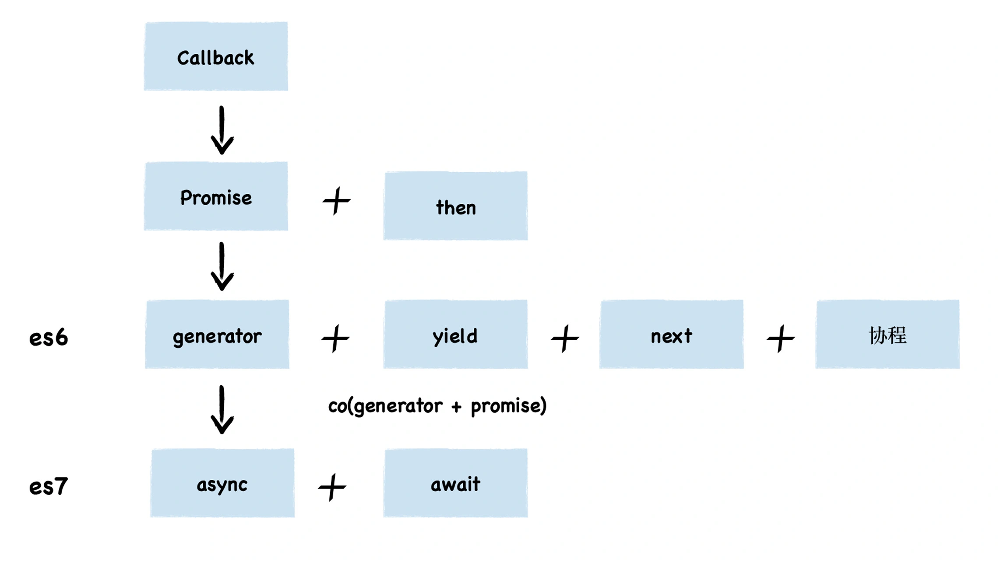

- [V8怎么实现回调函数的？](#v8怎么实现回调函数的)
- [事件循环机制](#事件循环机制)
  - [宏任务(网络请求、文件读写、setTimeout/setInterval)](#宏任务网络请求文件读写settimeoutsetinterval)
  - [微任务（Promise.then(或.reject)、await下一条语句）](#微任务promisethen或rejectawait下一条语句)
  - [nextTick](#nexttick)
  - [宏任务和微任务的执行过程](#宏任务和微任务的执行过程)
  - [EventLoop - 过程详解 :star:](#eventloop---过程详解-star)
  - [面试问题](#面试问题)
- [异步编程发展史](#异步编程发展史)
- [结合Promise和async/await的事件循环例题](#结合promise和asyncawait的事件循环例题)


# V8怎么实现回调函数的？
> 参考链接：https://time.geekbang.org/column/article/227926
回调函数有两种类型：同步回调和异步回调
1. **同步**回调函数是在执行函数内部被执行的
   ```js
   var myArray = ["water", "goods", "123", "like"];
   function handlerArray(indexName,index){
       console.log(index + 1 + ". " + indexName); 
   }
   myArray.forEach(handlerArray)
   ```
2. **异步**回调函数是在执行函数外部被执行的，而是在其他的位置和其他的时间点被执行的。同时异步回调也有两种不同的类型，其典型代表是 `setTimeout` 和 `XMLHttpRequest`。
   * 在 setTimeout 函数内部封装回调消息，并将回调消息添加进消息队列，然后主线程从消息队列中取出回调事件，并执行回调函数。
   * 网络线程在执行下载的过程中，会将一些中间信息和回调函数封装成新的消息，并将其添加进消息队列中，然后主线程从消息队列中取出回调事件，并执行回调函数。

# 事件循环机制
> 参考链接：https://time.geekbang.org/column/article/229532
普通的UI线程架构：每个 UI 线程都拥有一个消息队列，所有的待执行的事件都会被添加进消息队列中，UI 线程会按照一定规则，循环地取出消息队列中的事件，并执行事件。

js在此基础上又延伸出很多新技术，比如**宏任务，微任务**。

## 宏任务(网络请求、文件读写、setTimeout/setInterval)
宏任务：指消息队列中的`等待`被**主线程**执行的事件。常见的宏任务有：
1. 渲染事件
2. 用户交互事件
3. js脚本执行
4. 网络请求、文件读写完成事件
5. 以及`setTimeout/setInterval`这样的定时器回调等等。

PS：**setTomeout的输出顺序，跟其等待的时间也有关系，等待时间越短，越早输出**

为了让这些事件有条不紊地进行，JS引擎需要对之执行的顺序做一定的安排，V8 其实采用的是一种`队列`的方式来存储这些任务， 即**先进来的先执行**。

另外，队列又分为两种：**普通任务队列**和**延迟队列**。其中延迟队列是专门用来处理比如`setTimeout/setInterval`这样的定时器回调任务的。


|代码|执行过程|
|--|--|
|||

>使用setTimeout可以将foo函数转化为**宏任务**放入延迟消息队列中，解决了**栈溢出**的问题

上述提到的，普通任务队列和延迟队列中的任务，都属于**宏任务**。

## 微任务（Promise.then(或.reject)、await下一条语句）
引入微任务的初衷是为了解决异步回调的问题。

微任务：可以看成是一个需要**异步**执行的函数，执行时机是在主函数执行结束之**后**、**当前**宏任务结束之**前**。V8 会为每个宏任务维护一个微任务队列。

微任务带来了两个优势：
* **实时性**：解决了宏任务的时间颗粒度太粗，导致**应用卡顿**的问题。宏任务无法胜任一些对精度和实时性要求较高的场景，微任务可以在实时性和效率之间做一个有效的权衡。
* 解决了浪费 CPU 性能的问题：可以改变我们现在的异步编程模型，使得我们可以使用**同步形式**的代码来编写异步调用。


微任务是基于消息队列、事件循环、UI 主线程还有堆栈而来的，然后基于**微任务**，又可以延伸出`协程、Promise、Generator、await/async` 等现代前端经常使用的一些技术。

常见的**微任务**有
1. `MutationObserver`(可以监听 DOM 的结构变化、属性变化和文本内容的变化，并在发生变化时触发回调函数)、`Promise.then(或.reject)` 
2. 以及以 Promise 为基础开发的其他技术(比如`fetch API`), 还包括 V8 的垃圾回收过程。
3. `await`**后面**的语句会`同步`执行（await后面的语句可以看成是一个`Promise`来执行）。当Promise对象的状态变成`resolve`后，才会执行await的下一句语句，并且`await下一句语句会被当成微任务`添加到当前任务队列的末尾异步执行。


PS:
1. `new Promise(******)`，****** 这个位置的代码是 `同步执行`的。`Promise.then(****)`是**微任务**，会放入微任务队列。
2. 等待await后面的操作执行完毕(即返回Promise`成功状态`)，才会执行下一句语句, 并且会被当成**微任务**放在当前微任务队列末尾。如果得到Promise的`reject`值，则报错并结束该函数的执行，await下一条语句不会执行。

## nextTick
`process.nextTick` 属于**微任务**，是在当前执行栈的尾部，会照成IO阻塞

当事件循环准备进入下一个阶段(去取宏任务)之前，会先检`·nextTick queue`中是否有任务，如果有，那么会先清空这个队列。

当所有当`同步任务`执行完毕之后就会执行`nextTick`


## 宏任务和微任务的执行过程
开始 -> 取第一个宏任务队列里的任务执行(可以认为同步任务队列是第一个task queue) -> 取微任务队列全部任务依次执行 -> 取下一个宏任务队列里的任务执行 -> 再次取出微任务队列全部任务执行 -> … 这样循环往复

## EventLoop - 过程详解 :star:
总结：


1. 一开始整段脚本作为第一个`宏任务`执行，并将**全局执行上下文**压入调用栈。并在执行上下文中创建一个空的微任务队列。
2. 执行过程中`同步代码`直接压入`调用栈`直接执行，`宏任务`进入宏任务队列(即消息队列)，`微任务`进入微任务队列
3. "调用栈"中的所有同步任务执行完毕，当前宏任务执行完出队，理解检查当前`微任务队列`，如果有则依次执行，直到微任务队列为空
4. 执行队首新的宏任务，回到2，依此循环，直到宏任务和微任务队列都为空。

**PS：**
* 同一次事件循环中，微任务永远在宏任务之前执行。
* 微任务是在当前的任务快要执行结束之前执行的，宏任务是消息队列中的任务，主线程执行完一个宏任务之后，便会接着从消息队列中取出下一个宏任务并执行。  

**具体例子：**
```js
function bar(){
  console.log('bar')
  Promise.resolve().then(
    (str) =>console.log('micro-bar')
  ) 
  setTimeout((str) =>console.log('macro-bar'),0)
}


function foo() {
  console.log('foo')
  Promise.resolve().then(
    (str) =>console.log('micro-foo')
  ) 
  setTimeout((str) =>console.log('macro-foo'),0)
  
  bar()
}
foo()
console.log('global')
Promise.resolve().then(
  (str) =>console.log('micro-global')
) 
setTimeout((str) =>console.log('macro-global'),0)
```

打印结果：
```js
foo
bar
global
micro-foo
micro-bar
micro-global
macro-foo
macro-bar
macro-global
```

<details>
<summary>过程分析</summary>

1. 一开始整段脚本作为第一个`宏任务`执行，并将**全局执行上下文**压入调用栈。
   
   
2. 执行 foo 函数的调用，V8 会先创建 foo 函数的执行上下文，并将其压入到栈中。先执行同步代码，打印`foo`。接着执行 `Promise.resolve`，这会触发一个 micro-foo **微**任务，V8 会将该微任务添加进微任务队列。然后执行 `setTimeout` 方法。该方法会触发了一个 macro-foo **宏**任务，V8 会将该宏任务添加进消息队列。
   
   
3. foo 函数调用了 bar 函数，那么 V8 需要再创建 bar 函数的执行上下文，并将其压入栈中。也是先执行同步代码，打印`bar`。接着执行 `Promise.resolve`，这会触发一个 micro-bar **微**任务，该微任务会被添加进微任务队列。然后执行 `setTimeout` 方法，这也会触发一个 macro-bar **宏**任务，宏任务同样也会被添加进消息队列
   
   
4. bar 函数执行结束并退出，bar 函数的执行上下文也会从栈中弹出，紧接着 foo 函数执行结束并退出，foo 函数的执行上下文也随之从栈中被弹出。紧接着就执行同步代码， `console.log('global')`。
   
   
5. 紧接着就要执行**全局环境**中的代码 Promise.resolve 了，这会触发一个 micro-global 微任务，V8 会将该微任务添加进微任务队列。接着又执行 setTimeout 方法，该方法会触发了一个 macro-global 宏任务，V8 会将该宏任务添加进消息队列。
   
    
6. 当全局执行上下文环境中的代码执行完毕后，V8 会检查**微任务队列**，如果微任务队列中存在微任务，那么 V8 会依次取出微任务，并按照顺行执行(**先进先出**)。micro-foo、micro-bar、micro-global。
   
   
7. 等微任务队列中的所有**微任务**都执行完成之后，当前的宏任务也就执行结束了.接。来主线程会继续重复执行从**消息队列**中取出任务、执行任务的过程。于正常情况下，取出宏任务的顺序是按照**先进先出**的顺序，所有最后打印出来的顺序是：macro-foo、macro-bar、macro-global。

</details>


## 面试问题
1. **执行宏任务时，遇到了微任务会怎么样执行？**
   
   执行宏任务时，遇到微任务，会将该微任务放进微任务队列的末尾，当当前宏任务执行完毕之后，再按顺序执行微任务队列里面的任务。
2. **执行宏任务，遇到了宏任务呢？执行微任务，遇到宏任务呢？**
   
   这两种情况一样，都会将宏任务放进宏任务队列的末尾。

   始终牢记，微任务优先级高于宏任务，每一个宏任务执行完之后，一定会先去检查微任务队列是否有任务，等微任务全部执行完之后，才会继续执行下一个宏任务。
3. **在微任务触发新的微任务，会怎么样？**
   
   当执行微任务时遇到微任务，会将新遇到的微任务放在当前微任务的末尾，等微任务队列清空之后，再执行下一个宏任务。
4. **在微任务中循环地触发新的微任务呢？**
   ```js
   function foo() {
     return Promise.resolve().then(foo)
   }
   foo()
   ```
   当前的宏任务无法退出，导致消息队列中其他的宏任务是无法被执行的，具体体现为页面**卡死**。但**不会造成栈溢出错误**，因为由于 V8 每次执行微任务时，都会退出当前foo函数的调用栈。

# 异步编程发展史
详见[《异步编程(promise、generator、async,await)》](../js/异步编程(promise、generator、async,await))章节
<!-- **回调地狱**是为了实现代码顺序执行而出现的一种操作，它会造成我们的代码可读性非常差，后期不好维护。如下代码，变形成了回调地狱：
```js
doAsync1(function(result1) {
  doAsync2(result1, function(result2) {
    doAsync3(result2, function(result3) {
      console.log(result3);
    });
  });
});
```

## Promise
Promise：将原来的用回调函数的异步编程方法转成用`relsove`和`reject`触发事件， 用`then`和`catch`捕获成功或者失败的状态执行相应代码的异步编程的方法。

```js
// 1. 创造promise实例
const promise = new Promise((resolve, reject) => {
  // ... some code

  if (/* 异步操作成功 */){
    resolve(value);
  } else {
    reject(error);
  }
});

// 2. Promise实例生成以后，可以用then方法分别指定resolved状态和rejected状态的回调函数。
promise.then((val) => {
  // success
}, (error) => {
  // failure
});
```

## 生成器Generators/ yield
Generator函数是将函数**分步骤阻塞**，只有主动调用`next()`才能进行下一步。

* 语法上，首先可以把它理解成，Generator 函数是一个状态机，封装了多个内部状态。
* Generator 函数除了状态机，还是一个遍历器对象生成函数。
* 可暂停函数, yield可暂停，next方法可启动，每次返回的是yield后的表达式结果。
* yield表达式本身没有返回值，或者说总是返回undefined。next方法可以带一个参数，该参数就会被当作上一个yield表达式的返回值。

**例子**
```js
function *foo(x) {
  let y = 2 * (yield (x + 1))
  let z = yield (y / 3)
  return (x + y + z)
}
let it = foo(5)
console.log(it.next())   // => {value: 6, done: false}
console.log(it.next(12)) // => {value: 8, done: false}
console.log(it.next(13)) // => {value: 42, done: true}
```
分析：
1. 首先 Generator 函数调用和普通函数不同，它会返回一个迭代器
2. 当执行第一次 next 时，传参会被忽略，并且函数暂停在 yield (x + 1) 处，所以返回 5 + 1 = 6
3. 当执行第二次 next 时，传入的参数12就会被当作上一个yield表达式的返回值，如果你不传参，yield 永远返回 undefined。此时 let y = 2 * 12，所以第二个 yield 等于 2 * 12 / 3 = 8
4. 当执行第三次 next 时，传入的参数13就会被当作上一个yield表达式的返回值，所以 z = 13, x = 5, y = 24，相加等于 42

实际开发一般会配合`co`库去使用。co是一个为Node.js和浏览器打造的基于生成器的流程控制工具，借助于Promise，你可以使用更加优雅的方式编写非阻塞代码。

我们可以通过 Generator 函数解决回调地狱的问题.
```js
function *fetch() {
    yield ajax(url, () => {})
    yield ajax(url1, () => {})
    yield ajax(url2, () => {})
}
let it = fetch()
let result1 = it.next()
let result2 = it.next()
let result3 = it.next()
```

## async/await：异步编程的“终极”方案
async本质上是generator的语法糖,自带一个状态机，在await的部分`等待`返回， 返回后`自动`执行下一步。`内置了执行器`。

而且相较于Promise,async的优越性就是把每次异步返回的结果从then中拿到最外层的方法中，不需要链式调用，只要用`同步`的写法就可以了。更加直观而且，更适合处理`并发`调用的问题。

>MDN 的定义: async 是一个通过异步执行并隐式`返回 Promise `作为结果的函数。

* async/await是基于Promise实现的，它不能用于普通的回调函数。
* async/await与Promise一样，是非阻塞的。
* async/await使得异步代码看起来像同步代码，这正是它的魔力所在。
* async 表示这是一个async函数，而await只能在这个函数里面使用。
* await 会将后面的语句可以看成是一个`Promise`来执行
* await 表示在这里**等待**await后面的操作执行完毕(等待返回Promise`成功状态`)才会恢复async函数的执行（执行await下一条语句），并得到 resolve 的值，作为 await 表达式的运算结果。如果得到Promise的`reject`值，则报错并结束该函数的执行，await下一条语句不会执行。
  ```js
   const fn =  new Promise((resolve, reject) => {
     // ... some code
     if (/* 异步操作成功 */){
       resolve('成功了');
     } else {
       reject('出错了');
     }
   })

   fn.then(res => {
      console.log(res); // 成功了
   }).catch(err => {
      console.log(err); // 出错了
   });

   // 等同于
   try {
      const val = await fn(); 
      console.log(val); // 成功了
   }catch (err) {
      console.log(err); // 出错了
   }
  ```
* await 后面紧跟着的代码是一个耗时的操作或者是一个异步操作。
* await 后面必须是一个`Promise对象`，如果不是会被转化为一个已完成状态的Promise

## 总结
 -->


# 结合Promise和async/await的事件循环例题
**例题一：**
```js
console.log(1)
setTimeout(()=>{console.log(2)},1000)
async function fn(){
    console.log(3)
    setTimeout(()=>{console.log(4)},20)
    return Promise.reject() // 可以被try-catch捕获
}
async function run(){
    console.log(5)
    await fn()
    console.log(6)
}
run()
//需要执行150ms左右，虽然第二个setTimeout已经到达时间，但不会执行，
for(let i=0;i<90000000;i++){}
setTimeout(()=>{
    console.log(7)
    new Promise(resolve=>{
        console.log(8)
        resolve()
    }).then(()=>{console.log(9)})
},0)
console.log(10)
```
结果：`1 5 3 10 7 8 9 4 2`


解释：
1. 首先执行同步代码，输出 1，遇见第一个setTimeout，将其回调放入任务队列（宏任务）当中，
2. 继续往下执行运行run(),打印出 5，
3. 并往下执行，遇见 await fn()，将其放入任务队列（微任务）
4. await fn() 当前这一行代码执行时，
5. fn函数会立即执行的,打印出3，
6. 遇见第二个setTimeout，将其回调放入任务队列（宏任务），
7. await fn() 下面的代码需要等待返回Promise`成功状态`才会执行，所以6是不会被打印的。
8. 继续往下执行，遇到for循环同步代码，`需要等150ms,虽然第二个setTimeout已经到达时间，但不会执行`，
9. 遇见第三个setTimeout，将其回调放入任务队列（宏任务），然后打印出10。
值得注意的是，这个定时器 推迟时间0毫秒实际上达不到的。根据HTML5标准，setTimeOut推迟执行的时间，最少是4毫秒。
10. 同步代码执行完毕，此时没有微任务，就去执行宏任务，
11. 上面提到**已经到点**的setTimeout先执行，打印出**7**
12. 然后new Promise的时候会立即把executor函数执行(是**同步**操作)，打印出8
13. 然后在执行resolve时，触发微任务，于是打印出9
14. 当前宏任务执行完毕，再去消息队列里面去下一个**已经到点**的setTimeout宏任务，打印出4
15. 最后执行第一个setTimeout的宏任务，打印出2

ps：`setTomeout的输出顺序，跟其等待的时间也有关系，等待时间越短，越早输出`


**例题二：**

把例题一中的`return Promise.reject()`改成`return Promise.resolve()`，输出结果是什么

结果：`1 5 3 10 6 7 8 9 4 2`

解释：

当Promise对象的状态变成`resolve`后，才会执行await的下一句语句，并且`await下一句语句会被当成微任务`添加到**当前**任务队列的末尾异步执行。

其他顺序不变

**例题3：**
```js
new Promise(resolve => {
    resolve(1);
    
    Promise.resolve().then(() => {
    	// t2
    	console.log(2)
    });
    console.log(4)
}).then(t => {
	// t1
	console.log(t)
});
console.log(3);
```
结果：`4->3->2->1`

解释：
1. script 任务先运行。首先遇到 Promise 实例，构造函数首先执行，所以首先输出了 4。此时 microtask 的任务有 t2 和 t1，且顺序为t2 -> t1
2. script 任务继续运行，输出 3。至此，第一个宏任务执行完成。
3. 执行所有的微任务，先后取出 t2 和 t1，分别输出 2 和 1
4. 代码执行完毕

*为什么 t2 会先执行呢？*理由如下：

Promise.resolve 方法允许调用时不带参数，直接返回一个resolved 状态的 Promise 对象。立即 resolved 的 Promise 对象，是在本轮“事件循环”（event loop）的结束时，而不是在下一轮“事件循环”的开始时

**例题4：**
```js
async function async1(){
    console.log('async1 start');
    await async2()  // async2是同步 await 之后的任务也是微任务（async1 end）
    console.log('async1 end') 
}
async function async2(){
    console.log('async2')
}
console.log('script start')
setTimeout(function(){
    console.log('setTimeout0')
},0)
setTimeout(function(){
    console.log('setTimeout3')
},0)
setImmediate(()=>console.log('setImmediate'))
process.nextTick(()=>console.log('nextTick')) // 当所有当同步任务执行完毕之后就会执行nextTick
async1()
new Promise(function(resolve){
    console.log('promise1')
    resolve()
    console.log('promise2') // 这个虽然放在了resolve（）之后，但也是同步任务，会被立即执行
}).then(function(){
    console.log('promise3')
})
console.log('script end')
```
结果：
```
script start
async1 start
async2
promise1
promise2
script end
nextTick
async1 end
promise3
setTimeout0
setTimeout3
setImmediate
```


