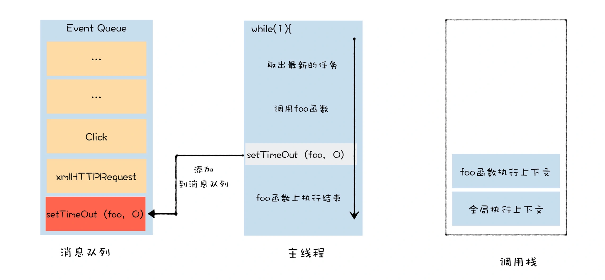
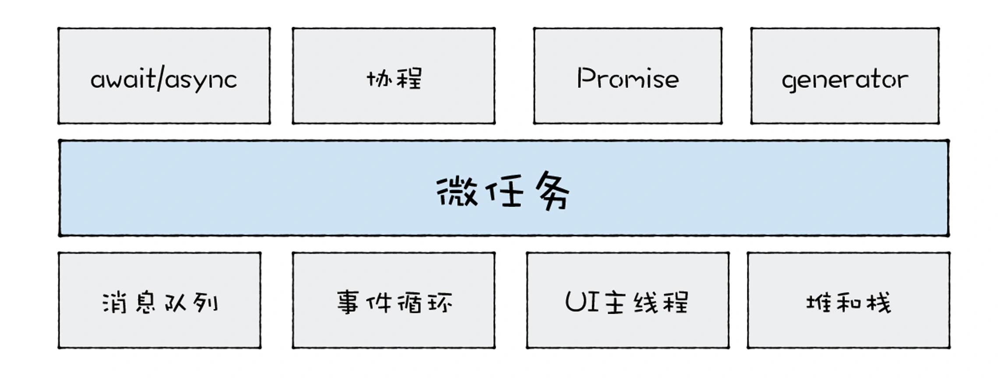
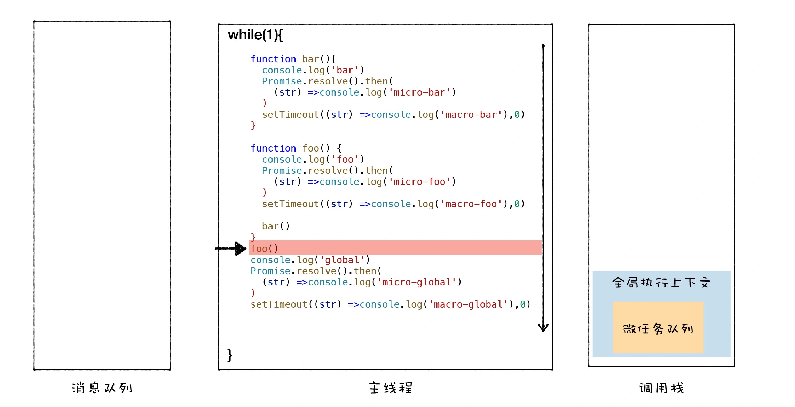
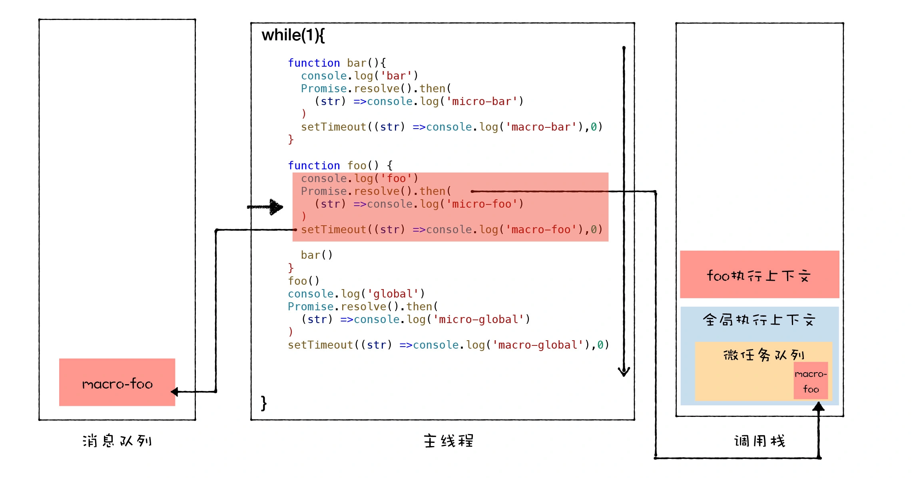
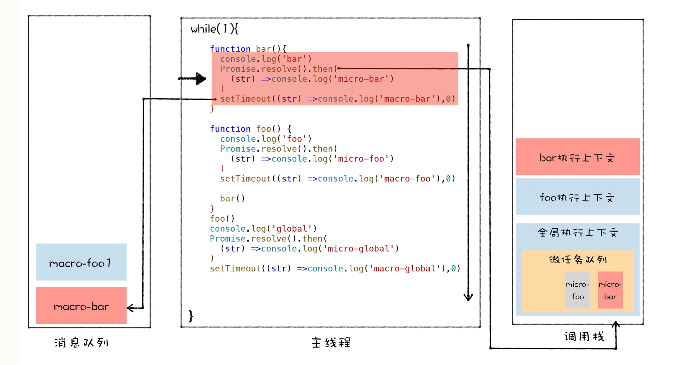
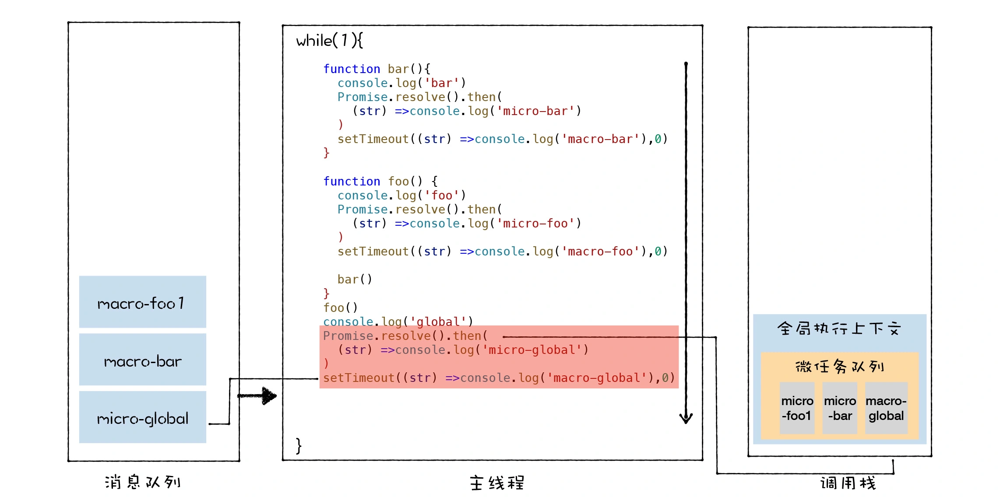
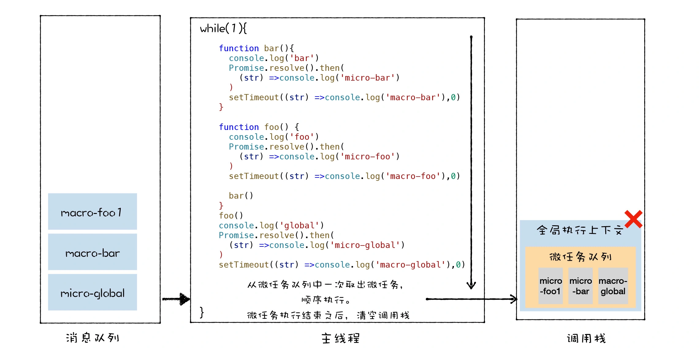

- [V8怎么实现回调函数的？](#v8怎么实现回调函数的)
- [事件循环机制](#事件循环机制)
  - [宏任务](#宏任务)
  - [微任务](#微任务)
  - [宏任务和微任务的执行过程](#宏任务和微任务的执行过程)
  - [EventLoop - 过程详解](#eventloop---过程详解)
  - [面试问题](#面试问题)
- [事件循环和async/await](#事件循环和asyncawait)


# V8怎么实现回调函数的？
> 参考链接：https://time.geekbang.org/column/article/227926
回调函数有两种类型：同步回调和异步回调
1. **同步**回调函数是在执行函数内部被执行的
2. **异步**回调函数是在执行函数外部被执行的。同时异步回调也有两种不同的类型，其典型代表是 `setTimeout` 和 `XMLHttpRequest`。
   * 在 setTimeout 函数内部封装回调消息，并将回调消息添加进消息队列，然后主线程从消息队列中取出回调事件，并执行回调函数。
   * 网络线程在执行下载的过程中，会将一些中间信息和回调函数封装成新的消息，并将其添加进消息队列中，然后主线程从消息队列中取出回调事件，并执行回调函数。

# 事件循环机制
> 参考链接：https://time.geekbang.org/column/article/229532
普通的UI线程架构：每个 UI 线程都拥有一个消息队列，所有的待执行的事件都会被添加进消息队列中，UI 线程会按照一定规则，循环地取出消息队列中的事件，并执行事件。

js在此基础上又延伸出很多新技术，比如**宏任务，微任务**。

## 宏任务
宏任务：指消息队列中的`等待`被**主线程**执行的事件。常见的宏任务有：
1. 渲染事件
2. 用户交互事件
3. js脚本执行
4. 网络请求、文件读写完成事件
5. 以及`setTimeout/setInterval`这样的定时器回调等等。

为了让这些事件有条不紊地进行，JS引擎需要对之执行的顺序做一定的安排，V8 其实采用的是一种`队列`的方式来存储这些任务， 即**先进来的先执行**。

另外，队列又分为两种：**普通任务队列**和**延迟队列**。其中延迟队列是专门用来处理比如`setTimeout/setInterval`这样的定时器回调任务的。


|代码|执行过程|
|--|--|
|||

>使用setTimeout可以将foo函数转化为**宏任务**放入延迟消息队列中，解决了**栈溢出**的问题

上述提到的，普通任务队列和延迟队列中的任务，都属于**宏任务**。

## 微任务
引入微任务的初衷是为了解决异步回调的问题。

微任务：可以看成是一个需要**异步**执行的函数，执行时机是在主函数执行结束之**后**、**当前**宏任务结束之**前**。V8 会为每个宏任务维护一个微任务队列。

微任务带来了两个优势：
* **实时性**：解决了宏任务的时间颗粒度太粗，导致**应用卡顿**的问题。宏任务无法胜任一些对精度和实时性要求较高的场景，微任务可以在实时性和效率之间做一个有效的权衡。
* 解决了浪费 CPU 性能的问题：可以改变我们现在的异步编程模型，使得我们可以使用**同步形式**的代码来编写异步调用。



微任务是基于消息队列、事件循环、UI 主线程还有堆栈而来的，然后基于**微任务**，又可以延伸出`协程、Promise、Generator、await/async` 等现代前端经常使用的一些技术。

常见的**微任务**有
1. `MutationObserver`(提供了监视对 DOM 树所做更改的能力)、`Promise.then(或.reject)` 
2. 以及以 Promise 为基础开发的其他技术(比如`fetch API`), 还包括 V8 的垃圾回收过程。
3. `await`**后面**的语句会`同步`执行。但 `await下面的语句会被当成微任务`添加到当前任务队列的末尾异步执行。

## 宏任务和微任务的执行过程
开始 -> 取第一个宏任务队列里的任务执行(可以认为同步任务队列是第一个task queue) -> 取微任务队列全部任务依次执行 -> 取下一个宏任务队列里的任务执行 -> 再次取出微任务队列全部任务执行 -> … 这样循环往复

## EventLoop - 过程详解
总结：
1. 一开始整段脚本作为第一个`宏任务`执行，并将**全局执行上下文**压入调用栈。并在执行上下文中创建一个空的微任务队列。
2. 执行过程中`同步代码`直接压入`调用栈`直接执行，`宏任务`进入宏任务队列(即消息队列)，`微任务`进入微任务队列
3. "调用栈"中的所有同步任务执行完毕，当前宏任务执行完出队，理解检查当前`微任务队列`，如果有则依次执行，直到微任务队列为空
4. 执行队首新的宏任务，回到2，依此循环，直到宏任务和微任务队列都为空。

**PS：**
* 同一次事件循环中，微任务永远在宏任务之前执行。
* 微任务是在当前的任务快要执行结束之前执行的，宏任务是消息队列中的任务，主线程执行完一个宏任务之后，便会接着从消息队列中取出下一个宏任务并执行。  

**具体例子：**
```js
function bar(){
  console.log('bar')
  Promise.resolve().then(
    (str) =>console.log('micro-bar')
  ) 
  setTimeout((str) =>console.log('macro-bar'),0)
}


function foo() {
  console.log('foo')
  Promise.resolve().then(
    (str) =>console.log('micro-foo')
  ) 
  setTimeout((str) =>console.log('macro-foo'),0)
  
  bar()
}
foo()
console.log('global')
Promise.resolve().then(
  (str) =>console.log('micro-global')
) 
setTimeout((str) =>console.log('macro-global'),0)
```

打印结果：
```js
foo
bar
global
micro-foo
micro-bar
micro-global
macro-foo
macro-bar
macro-global
```

**过程分析：**
1. 一开始整段脚本作为第一个`宏任务`执行，并将**全局执行上下文**压入调用栈。
   
   
2. 执行 foo 函数的调用，V8 会先创建 foo 函数的执行上下文，并将其压入到栈中。先执行同步代码，打印`foo`。接着执行 `Promise.resolve`，这会触发一个 micro-foo **微**任务，V8 会将该微任务添加进微任务队列。然后执行 `setTimeout` 方法。该方法会触发了一个 macro-foo **宏**任务，V8 会将该宏任务添加进消息队列。
   
   
3. foo 函数调用了 bar 函数，那么 V8 需要再创建 bar 函数的执行上下文，并将其压入栈中。也是先执行同步代码，打印`bar`。接着执行 `Promise.resolve`，这会触发一个 micro-bar **微**任务，该微任务会被添加进微任务队列。然后执行 `setTimeout` 方法，这也会触发一个 macro-bar **宏**任务，宏任务同样也会被添加进消息队列
   
   
4. bar 函数执行结束并退出，bar 函数的执行上下文也会从栈中弹出，紧接着 foo 函数执行结束并退出，foo 函数的执行上下文也随之从栈中被弹出。紧接着就执行同步代码， `console.log('global')`。
   
   
5. 紧接着就要执行**全局环境**中的代码 Promise.resolve 了，这会触发一个 micro-global 微任务，V8 会将该微任务添加进微任务队列。接着又执行 setTimeout 方法，该方法会触发了一个 macro-global 宏任务，V8 会将该宏任务添加进消息队列。
   
    
6. 当全局执行上下文环境中的代码执行完毕后，V8 会检查**微任务队列**，如果微任务队列中存在微任务，那么 V8 会依次取出微任务，并按照顺行执行(**先进先出**)。micro-foo、micro-bar、micro-global。
   
   
7. 等微任务队列中的所有**微任务**都执行完成之后，当前的宏任务也就执行结束了.接。来主线程会继续重复执行从**消息队列**中取出任务、执行任务的过程。于正常情况下，取出宏任务的顺序是按照**先进先出**的顺序，所有最后打印出来的顺序是：macro-foo、macro-bar、macro-global。

## 面试问题
1. **执行宏任务时，遇到了微任务会怎么样执行？**
   
   执行宏任务时，遇到微任务，会将该微任务放进微任务队列的末尾，当当前宏任务执行完毕之后，再按顺序执行微任务队列里面的任务。
2. **执行宏任务，遇到了宏任务呢？执行微任务，遇到宏任务呢？**
   
   这两种情况一样，都会将宏任务放进宏任务队列的末尾。

   始终牢记，微任务优先级高于宏任务，每一个宏任务执行完之后，一定会先去检查微任务队列是否有任务，等微任务全部执行完之后，才会继续执行下一个宏任务。
3. **在微任务触发新的微任务，会怎么样？**
   
   当执行微任务时遇到微任务，会将新遇到的微任务放在当前微任务的末尾，等微任务队列清空之后，再执行下一个宏任务。
4. **在微任务中循环地触发新的微任务呢？**
   ```js
   function foo() {
     return Promise.resolve().then(foo)
   }
   foo()
   ```
   当前的宏任务无法退出，导致消息队列中其他的宏任务是无法被执行的，具体体现为页面**卡死**。但**不会造成栈溢出错误**，因为由于 V8 每次执行微任务时，都会退出当前foo函数的调用栈。

# 事件循环和async/await
