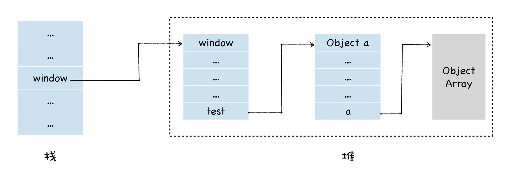
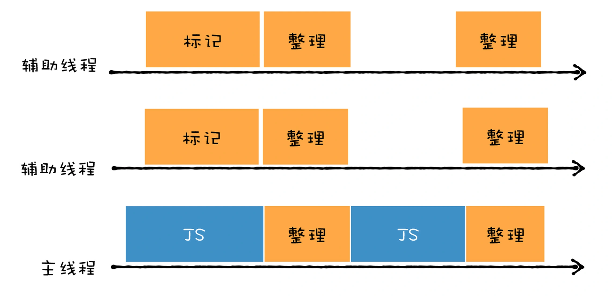

- [前言](#前言)
  - [垃圾数据如何产生？](#垃圾数据如何产生)
- [垃圾回收(Garbage Collection)算法](#垃圾回收garbage-collection算法)
  - [副垃圾回收器 - 新生代垃圾回收 - Scavenge算法](#副垃圾回收器---新生代垃圾回收---scavenge算法)
  - [主垃圾回收器 - 老生代垃圾回收 - 标记/清除(Mark-Sweep)算法， 标记/整理(Mark-Compact)算法](#主垃圾回收器---老生代垃圾回收---标记清除mark-sweep算法-标记整理mark-compact算法)
- [垃圾回收算法的优化](#垃圾回收算法的优化)
  - [并行回收 - 副垃圾回收器](#并行回收---副垃圾回收器)
  - [增量回收](#增量回收)
  - [并发 (concurrent) 回收](#并发-concurrent-回收)
  - [主垃圾回收器 = 并行 + 增量 + 并发](#主垃圾回收器--并行--增量--并发)
- [内存泄露](#内存泄露)
  - [常见的几种内存泄露情况](#常见的几种内存泄露情况)
  - [如何发现内存泄露](#如何发现内存泄露)

> 参考链接：https://time.geekbang.org/column/article/230845
# 前言
JavaScript 是一门自动垃圾回收的语言，也就是说，我们不需要去手动回收垃圾数据，这一切都交给 **V8** 的垃圾回收器来完成。V8 为了更高效地回收垃圾，引入了两个垃圾回收器，它们分别针对着不同的场景。

## 垃圾数据如何产生？
无论是使用什么语言，我们都会频繁地使用数据，这些数据会被存放到栈和堆中，通常的方式是在内存中创建一块空间，使用这块空间，在不需要的时候回收这块空间。

```js
window.test = new Object()
window.test.a = new Uint16Array(100)
```
当 JavaScript 执行这段代码的时候，会先为 window 对象添加一个 test 属性，并在堆中创建了一个空对象，并将该对象的**地址**指向了 window.test 属性。随后又创建一个大小为 100 的数组，并将属性地址指向了 test.a 的属性值。此时的内存布局图如下所示：



如果此时，我将另外一个对象赋给了 a 属性，代码如下所示：

```js
window.test.a = new Object()
```

此时内存布局如下：


此时Array对象变成了垃圾数据，因为我们无法访问到此对象

但这个数组对象不会一直占用内存空间，因为 V8 虚拟机中的**垃圾回收器**会帮你自动清理。

# 垃圾回收(Garbage Collection)算法
**大体步骤：**
* 第一步：通过 GC Root 标记空间中**活动对象**和**非活动对象**。
  * 目前 V8 采用的可访问性（reachability）算法来判断堆中的对象是否是活动对象。可通过CG root访问到的是**活动对象**，需在内存中保留。否则，是非活动对象，不需要保留。
  * 常见的GC root有：
    1. 全局的 window 对象（位于每个 iframe 中）
    2. 文档 DOM 树，由可以通过遍历文档到达的所有原生 DOM 节点组成；
    3. 存放栈上变量。
*  第二步：**回收非活动对象**所占据的内存：在标记完成后，统一清理内存中所有被标记为非活动对象。
*  第三步：做内存整理。


由于受*代际假说*的影响，目前 V8 采用了以下两个垃圾回收器：
* **副垃圾回收器 -Minor GC (Scavenger)**，主要负责新生代区域(存放的是生存时间**短**的对象)的垃圾回收。
* **主垃圾回收器 -Major GC**，主要负责老生代区域(存放生存时间**久**的对象)的垃圾回收。
  
> V8 的堆内存，是新生代内存和老生代内存之和。
> 
> 新生代通常只支持 1～8M 的容量，而老生代支持的容量就大很多了。所以V8 分别使用两个不同的垃圾回收器，以便更高效地实施垃圾回收。

## 副垃圾回收器 - 新生代垃圾回收 - Scavenge算法
副垃圾回收器主要负责新生代的垃圾回收。

新生代区域中对象的特点：对象占用空间小，存活时间短，触发回收操作频繁。


**Scavenge算法**
Scavenge 算法把新生代空间对半划分为两个区域，一半是**对象区域 (from-space)，一半是空闲区域 (to-space)**。


新加入的对象都会存放到**对象**区域，当**对象区域**快被写满时，就需要执行一次垃圾清理操作。

**Scavenge算法具体步骤如下：**
1. V8会把**对象区**中的对象做一遍检查，将数据分为活动数据和垃圾数据。然后把**活动数据**对象复制到**空闲区**，同时它还会把这些对象有序地排列起来，相当于完成了内存整理操作。垃圾数据直接回收即可。
   
   
2. 对象区与空闲区进行**角色翻转**，也就是原来的对象区域变成空闲区域，原来的空闲区域变成了对象区域。这样就完成了一次垃圾回收。如此循环。
   

优点：
1. 有效解决了内存碎片的问题。
2. 时间性能非优秀：因为每次执行回收时都有从对象区**复制**到空闲区的操作，需要时间成本，所以**为了执行效率，一般新生区的空间会被设置得比较小**。正是因为新生区的空间不大，所以很容易被存活的对象装满整个区域，便很快执行下一次垃圾回收。

缺点：Scavenge 算法内存只能使用新生代内存的一半

## 主垃圾回收器 - 老生代垃圾回收 - 标记/清除(Mark-Sweep)算法， 标记/整理(Mark-Compact)算法
刚刚介绍了新生代的回收方式，那么新生代中的变量如果经过**多次回收**后依然存在，那么就会被放入到**老生代内存**中，这就是`对象晋升策略`。

老生代中的对象的特点：对象占用空间大，存活时间长，触发回收操作不频繁。

若要在老生代中使用 Scavenge 算法进行垃圾回收，复制这些大的对象将会花费比较多的时间，从而导致回收执行效率不高，同时还会浪费一半的空间。所以，主垃圾回收器是采用**标记/清除（Mark-Sweep）算法**进行垃圾回收的。

**标记/清除（Mark-Sweep）算法具体步骤如下：**
1. **标记阶段：** 从一组根元素开始，递归遍历这组根元素，在这个遍历过程中，能到达的元素称为活动对象，没有到达的元素就可以判断为垃圾数据。
2. **垃圾清除阶段：** 它和副垃圾回收器的垃圾清除过程完全不同，主垃圾回收器会**直接**将标记为垃圾的数据清理掉。

你可以理解这个过程是清除掉下图中红色标记数据的过程，你可参考下图大致理解下其清除过程：


对垃圾数据进行标记，然后清除，这就是**标记/清除算法**，该算法的缺点很明显，会产生大量**不连续**的内存碎片。

为了解决碎片过多会导致大对象无法分配到足够的连续内存的问题，引入了另外一种算法，**标记/整理（Mark-Compact）**。

这个算法的标记过程仍然与标记/清除算法里的是一样的，先标记可回收对象，但后续步骤不是直接对可回收对象进行清理，而是让所有存活的对象都向一端移动，然后直接清理掉这一端之外的内存。你可以参考下图：


>V8 引擎并没有采用**引用计数算法**作为主要的垃圾回收策略

# 垃圾回收算法的优化
由于 JavaScript 是运行在主线程之上的，因此，一旦执行垃圾回收算法，都需要将正在执行的 JavaScript 脚本**暂停**下来，待垃圾回收完毕后再恢复脚本执行。我们把这种行为叫做**全停顿**。全停顿的执行效果如下图所示：


为了解决全停顿而造成的用户体验的问题，V8 团队经过了很多年的努力，向现有的垃圾回收器添加**并行、并发和增量**等垃圾回收技术。这些技术主要是从两方面来解决垃圾回收效率问题的：
* 第一，**将一个完整的垃圾回收的任务拆分成多个小的任务**，这样就消灭了单个长的垃圾回收任务；
* 第二，**将标记对象、移动对象等任务转移到后台线程进行**，这会大大减少主线程暂停的时间，改善页面卡顿的问题，让动画、滚动和用户交互更加流畅。

## 并行回收 - 副垃圾回收器
并行回收，是指垃圾回收器在主线程上执行的过程中，还会开启多个协助线程，同时执行同样的回收工作，其工作模式如下图所示：


执行垃圾标记的过程中，主线程并不会同时执行 JavaScript 代码。

采用并行回收时，垃圾回收所消耗的时间，等于总体辅助线程所消耗的时间（辅助线程数量乘以单个线程所消耗的时间），再加上一些同步开销的时间。

V8 的**副垃圾回收器**所采用的就是并行策略。它在执行垃圾回收的过程中，启动了多个线程来负责**新生代**中的垃圾清理操作，这些线程同时将对象空间中的数据移动到空闲区域。由于数据的地址发生了改变，所以还需要同步更新引用这些对象的指针。

虽然提升了效率，但这还是**全停顿**的垃圾回收方式。

## 增量回收
增量式垃圾回收，是指垃圾收集器将标记工作分解为**更小**的块，并且穿插在主线程不同的任务之间执行。采用增量垃圾回收时，垃圾回收器没有必要一次执行完整的垃圾回收过程，每次执行的只是整个垃圾回收过程中的一小部分工作，具体流程你可以参看下图：


增量回收是并发的（concurrent），要实现增量执行，需要满足两点要求：
1. 垃圾回收可以被随时暂停和重启，暂停时需要保存当时的扫描结果，等下一波垃圾回收来了之后，才能继续启动。
2. 在暂停期间，被标记好的垃圾数据如果被 JavaScript 代码修改了，那么垃圾回收器需要能够正确地处理。

在没有采用增量算法之前，V8 使用**黑色和白色**来标记数据。

如果内存中的数据只有两种状态，非黑即白，那么当你暂停了当前的垃圾回收器之后，再次恢复垃圾回收器，那么垃圾回收器就不知道从哪个位置继续开始执行了。

为了解决这个问题，V8 采用了三色标记法，除了黑色和白色，还额外引入了灰色：
* 黑色表示这个节点被 GC Root 引用到了，而且该节点的子节点都已经标记完成了 ;
* 灰色表示这个节点被 GC Root 引用到，但子节点还没被垃圾回收器标记处理，也表明**目前正在处理这个节点**；
* 白色表示这个节点没有被访问到，如果在本轮遍历结束时还是白色，那么这块数据就会被收回。

引入灰色标记之后，垃圾回收器就可以依据当前内存中**有没有灰色节点**，来判断整个标记**是否完成**，如果没有灰色节点了，就可以进行清理工作了。如果还有灰色标记，当下次恢复垃圾回收器时，便从灰色的节点开始继续执行。

## 并发 (concurrent) 回收
增量回收是在主线程上执行的，如果主线程繁忙的时候，增量垃圾回收操作依然会增加主线程处理任务的吞吐量。

为了在不阻塞主线程的情况下，执行垃圾回收操作，引入了**并发回收机制**。

所谓并发回收，是指主线程在执行 JavaScript 的过程中，辅助线程能够在后台完成执行垃圾回收的操作。并发标记的流程大致如下图所示：


并发回收的优势非常明显，主线程**不会被挂起**，JavaScript 可以自由地执行 ，在执行的同时，辅助线程可以执行垃圾回收操作。

但是并发回收却是这三种技术中最难的一种，这主要由以下两个原因导致的：
* 第一，当主线程执行 JavaScript 时，堆中的内容随时都有可能发生变化，从而使得辅助线程之前做的工作完全无效；
* 第二，主线程和辅助线程极有可能在同一时间去更改同一个对象，这就需要额外实现读写锁的一些功能了。

## 主垃圾回收器 = 并行 + 增量 + 并发
V8 的主垃圾回收器就融合了上面介绍的三种机制，来实现垃圾回收.


**主垃圾回收器**同时采用了这三种策略：
* 首先主垃圾回收器主要使用**并发标记**，我们可以看到，在主线程执行 JavaScript，辅助线程就开始执行标记操作了，所以说标记是在辅助线程中完成的。
* 标记完成之后，再执行**并行**清理操作。主线程在执行清理操作时，多个辅助线程也在执行清理操作。
* 另外，主垃圾回收器还采用了**增量标记**的方式，清理的任务会穿插在各种 JavaScript 任务之间执行。

# 内存泄露
不再用到的内存，没有及时释放，就叫做**内存泄漏**。

如果应用使用的内存越来越多，就会严重影响性能，甚至导致浏览器的崩溃。

V8的**垃圾回收机制**虽然能回收绝大部分的垃圾内存，但是还是存在回收不了的情况。

## 常见的几种内存泄露情况
1. **全局变量**
   
   在**非严格模式**下当引用未声明的变量时，会在**全局对象**中创建一个新变量。
   ```js
   function foo（arg）{ 
     bar =“some text”; // bar将泄漏到全局.
   }
   ```
   * 原因：全局变量是根据定义无法被垃圾回收机制收集。
   * 解决办法：严格模式（use strict）+ eslint检查
2. **被遗忘的定时器和回调函数**
   ```js
    var someResource = getData();
    setInterval(function() {
        var node = document.getElementById('Node');
        if(node) {
            node.innerHTML = JSON.stringify(someResource));
            // 定时器也没有清除
        }
        // node、someResource 存储了大量数据 无法回收
    }, 1000);   
   ```
   * 原因：定时器会在后台持续执行，即便定时器执行完，也还是会占用内存和CPU，直到被清除或者页面被卸载，因此它的回收不是**立即**发生的。
   * 解决办法：在定时器完成工作的时候，手动清除定时器`clearTimeout()`, `clearInterval()`，保证及时回收。
3. **脱离 DOM 的引用**
   ```js
   var refA = document.getElementById('refA');
   document.body.removeChild(refA); // dom删除了
   console.log(refA, "refA");  // 但是还存在引用，能console出整个div，没有被回收 
   ```
   * 原因：保留了DOM节点的**引用**，无法被GC回收
   * 解决方法：`refA = null`
4. **闭包**
   
   **注意: 闭包本身没有错,不会引起内存泄漏.而是使用错误导致.**
   ```js
   function closure() {
     const name = 'xianshannan'
     return () => {
       return name
         .split('')
         .reverse()
         .join('')
     }
   }
   const reverseName = closure()
   ```
   在当前执行环境未结束的情况下，该段代码造成了内存泄露。
   
   * 原因：name 变量是被 closure 返回的函数调用了，但是返回的函数没被使用，这个场景下 name 就属于垃圾内存。name 不是必须的，但是还是占用了内存，也不可被回收。
   * 解决办法：正确使用闭包
5. 被遗忘的事件监听器
   ```js
    const Demo: React.FC = () => {
      useEffect(() => {
        window.addEventListener('resize', () => {})// 这里做一些操作
      }, []);
      return <></>;
    }
   ```
   上面的组件销毁的时候，resize 事件还是在监听中，里面涉及到的内存都是没法回收的（浏览器会认为这是必须的内存，不是垃圾内存） 

   需在组件销毁前移除相关事件
   ```js
   const Demo: React.FC = () => {
      useEffect(() => {
        window.addEventListener('resize', () => {})// 这里做一些操作
        return () => { //此处编写 组件即将被卸载前执行的代码
          window.removeEventListener('resize', () => {})
        }
      }, []);
      return <></>;
    }
   ```
6. 被遗忘的ES6 Set引用类型成员
   ```js
   let map = new Set();
   let value = { test: 22};
   map.add(value);
   
   value = null;
   ```
   * 解决办法
     1. `map.delete(value);`
     2. 使用 `WeakSet`，WeakSet 的成员是弱引用，即垃圾回收机制不考虑 WeakSet 对该对象的引用，也就是说，如果其他对象都不再引用该对象，那么垃圾回收机制会自动回收该对象所占用的内存，不考虑该对象还存在于 WeakSet 之中。
7. 被遗忘的ES6 Map引用类型键名
   ```js
   let map = new Map();
   let key = new Array(5 * 1024 * 1024);
   map.set(key, 1);
   key = null;
   ```
   * 解决办法
     1. `map.delete(key);`
     2. 使用 `WeakMap`，WeakMap 的键名是弱引用。
   
## 如何发现内存泄露
[参考链接](https://cloud.tencent.com/developer/article/1444558)
1. Task Manager：用来粗略地查看内存使用情况
   
   入口：`右上角三个点 -> 更多工具 -> 任务管理器`，然后`右键表头 -> 勾选JS使用的内存`
   

2. Performance：用来观察内存变化趋势
   
3. Memory：这个面板有3个工具，分别是堆快照、内存分配情况和内存分配时间轴：
   * 堆快照（Take Heap Snapshot），用来具体分析各类型对象存活情况，包括实例数量、引用路径等等
   * 内存分配情况（Record Allocation Profile），用来查看分配给各函数的内存大小
   * 内存分配时间轴（Record Allocation Timeline），用来查看实时的内存分配及回收情况