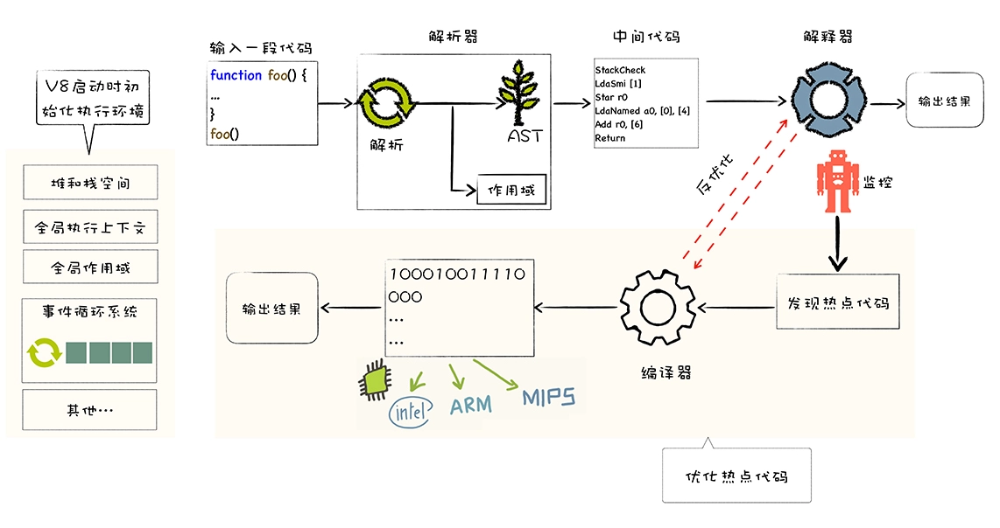

- [什么是V8？](#什么是v8)
- [V8 又是怎么执行 JavaScript 代码？](#v8-又是怎么执行-javascript-代码)

> 参考链接：https://time.geekbang.org/column/article/211682
# 什么是V8？
V8 是一个由 Google 开发的开源 `JavaScript 引擎`，目前用在 Chrome 浏览器和 Node.js 中，其核心功能是执行易于人类理解的 JavaScript 代码。

# V8 又是怎么执行 JavaScript 代码？
核心流程分为两步：
1. `编译`：将js代码转换为低级中间代码或者机器能够理解的机器代码
2. `执行`：执行转换后的代码并输出执行结果

>可以把 V8 看成是一个虚构出来的计算机，也称为虚拟机，虚拟机通过模拟实际计算机的各种功能来实现代码的执行，如模拟实际计算机的 CPU、堆栈、寄存器等，虚拟机还具有它自己的一套指令系统。

> 所以对于 js 代码来说，V8 就是它的整个世界，当 V8 执行 js 代码时，你并不需要担心现实中不同操作系统、体系结构计算机的差异，只需要按照虚拟机的规范写好代码就可以了。

V8 执行 js 的流程图：

1. 执行前的准备工作：准备`基础环境`，包括“堆、栈空间”“全局执行上下文”“全局作用域”“消息循环系统”“内置函数”等。
2. 生成抽象语法树（AST）及作用域：V8不理解JS源码，需将其结构化得到`AST`（是便于V8理解的结构）。同时还会生成相关`作用域`。
3. 生成字节码：字节码是介于 AST 和机器代码的中间代码。解释器可以直接执行字节码。
4. 解释器执行字节码：按照顺序解释执行字节码，并输出执行结果。
5. 当解释器执行到热点代码时，会优先执行编译成机器代码后的热点代码

> ps：
> 1. 热点代码是指被重复多次执行的代码。
> 2. 有一个D8工具(从V8源码编译出来的)，可以输出js代码的AST结构和作用域等。`
d8 --print-ast test.js` 、`d8 --print-scopes test.js`

