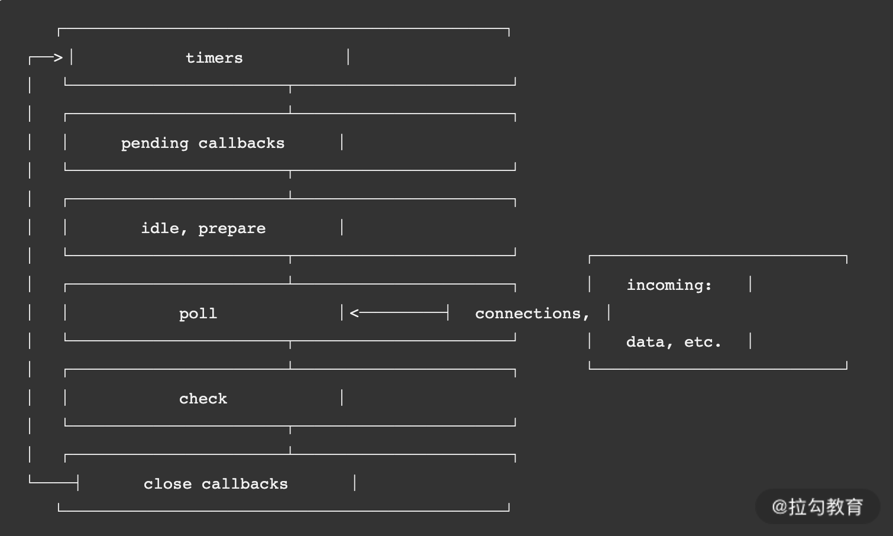

- [前言](#前言)
- [事件循环：高性能到底是如何做到的？](#事件循环高性能到底是如何做到的)
  - [Node.js 循环原理](#nodejs-循环原理)
    - [运行起点](#运行起点)
    - [Node.js事件循环](#nodejs事件循环)
  - [实践分析](#实践分析)
- [应用场景：Node.js 作为后台可以提供哪些服务？](#应用场景nodejs-作为后台可以提供哪些服务)

# 前言

工程化最重要的就是 `Webpack` 工具，而 Webpack 核心是基于 `Node.js` 来运行的，当然还有其他场景比如说 SSR 的实现以及前端的一些工具化场景。这些应用最终目标都是为了**提升前端研发效率或者保证研发质量**。但并没有真正地应用到 Node.js 核心特点，而后端服务应用才是真正地应用 Node.js 异步事件驱动的特性。

Node.js分别应用在前端应用和后端服务应用发区别如下：

|差异点|前端应用|后端服务应用|
|--|--|--|
|运行环境|运行在本地|运行在远程服务器|
|受众用户|服务本地开发者|服务真实用户|
|问题调试|调试简单|复杂，需要日志埋点|
|关注点|提升研发效率或质量|保证安全与稳定|

因为**运行环境**上的差异，会引发什么不同点呢：

- 首先我们需要应用工具将服务发布到远程机器上，这里就涉及**devops 工具**；
- 我们需要保证远程服务的安全与稳定，这就涉及一些进程管理工具，例如我们常见的 **PM2**；
- 我们需要判断远程服务运行是否正常，这就涉及远程服务的**监控和告警机制**；
- 遇到运行问题时，我们需要通过远程日志来定位分析问题，这就涉及**日志打印和跟踪染色**。

**受众群体**

- 前端工程化一般都是服务于开发者，比如我自己在本地应用 Webpack 打包或者将 ES6、ES7 转为 ES5 语法等，都是基于开发者工具，而这部分用户则是我们开发者自己。前端工程化侧重于为开发者**提升研发效率或者研发质量**。
- 而后端服务应用则服务于真实的用户群体，为用户提供各种交互体验方面的数据处理等。需要关注服务的**稳定与安全、并发性能、扩容方案以及性能优化**。

**问题调试**

- 前端工程化在本地运行，你可以随意地 `console.log` 打印日志进行调试
- 作为后端服务应用，需要考虑一些**高性能日志打印工具**。其次在服务端运行，你可能会遇到诸如内存泄漏、句柄泄漏或者进程异常退出等问题，因此这里就需要这类工具和方法来分析定位现网问题。

>如果有面试官问：你主要用 Node.js 做了哪些事情，这些应用中，你觉得哪些场景真正发挥出了 Node.js 的特性？
>可以从是前端工程化的应用和是后端服务应用这两方面去回答

# 事件循环：高性能到底是如何做到的？

Node.js 10+ 版本后虽然在运行结果上与浏览器一致，但是两者在原理上一个是基于&**浏览器**，一个是基于 `libuv` 库。浏览器核心的是**宏任务和微任务**，而在 Node.js 还有**阶段性任务执行阶段**。

事件循环通俗来说就是一个无限的 while 循环。

1. 谁来启动这个循环过程，循环条件是什么？
2. 循环的是什么任务呢？
3. 循环的任务是否存在优先级概念？
4. 什么进程或者线程来执行这个循环？
5. 无限循环有没有终点？

## Node.js 循环原理



一流程包含 6 个阶段，每个阶段代表的含义如下所示。

1. `timers`：本阶段执行已经被 `setTimeout()` 和 `setInterval()`调度的回调函数，简单理解就是由这两个函数启动的回调函数。
2. `pending callbacks`：本阶段执行某些**系统操作**（如 TCP 错误类型）的回调函数。
3. `idle、prepare`：仅系统内部使用，你只需要知道有这 2 个阶段就可以。
4. `poll`：检索新的 `I/O` 事件，执行与 I/O 相关的回调，其他情况 Node.js 将在适当的时候在此阻塞。这也是最复杂的一个阶段，所有的事件循环以及回调处理都在这个阶段执行，接下来会详细分析这个过程。
5. `check`：`setImmediate()` 回调函数在这里执行，setImmediate 并不是立马执行，而是当事件循环 poll 中没有新的事件处理时就执行该部分
6. `close callbacks`：执行一些关闭的回调函数，如 `socket.on('close', ...)`。

### 运行起点

- Node.js 启动后；
- setTimeout 回调函数；
- setInterval 回调函数；
- 也可能是一次 I/O 后的回调函数。

### Node.js事件循环

在上面的核心流程中真正需要关注循环执行的就是 **poll** 这个过程。在 poll 过程中，主要处理的是异步 I/O 的回调函数，以及其他几乎所有的回调函数，**异步 I/O 又分为网络 I/O 和文件 I/O**。

事件循环的主要包含微任务和宏任务。具体是怎么进行循环的呢？如下图所示。


- **微任务**：在 Node.js 中微任务包含 2 种——`process.nextTick` 和 `Promise`。微任务在事件循环中优先级是最高的，因此在同一个事件循环中有其他任务存在时，优先执行微任务队列。并且process.nextTick 和 Promise 也存在优先级，**process.nextTick 高于 Promise**。
- **宏任务**：在 Node.js 中宏任务包含 4 种——`setTimeout、setInterval、setImmediate 和 I/O`。宏任务在微任务执行之后执行，因此在同一个事件循环周期内，如果既存在微任务队列又存在宏任务队列，那么**优先将微任务队列清空，再执行宏任务队列**。
  
在图的左侧，我们可以看到有一个核心的**主线程**，它的执行阶段主要处理三个核心逻辑。

- 同步代码。
- 将异步任务插入到微任务队列或者宏任务队列中。
- 执行微任务或者宏任务的回调函数。在主线程处理回调函数的同时，也需要判断是否插入微任务和宏任务。根据优先级，先判断微任务队列是否存在任务，存在则先执行微任务，不存在则判断在宏任务队列是否有任务，有则执行。

例子：
```js
const fs = require('fs');
setTimeout(() => { // 新的事件循环的起点
    console.log('1'); 
    fs.readFile('./config/test.conf', {encoding: 'utf-8'}, (err, data) => {
        if (err) throw err;
        console.log('read file sync success');
    });
}, 0);
/// 回调将会在新的事件循环之前
fs.readFile('./config/test.conf', {encoding: 'utf-8'}, (err, data) => {
    if (err) throw err;
    console.log('read file success');
});
/// 该部分将会在首次事件循环中执行
Promise.resolve().then(()=>{
    console.log('poll callback');
});
// 首次事件循环执行
```

执行结果：
`2 --> poll callback --> 1 --> read file success --> read file sync success`

解释：

1. 整个过程优先执行主线程的第一个事件循环过程，所以先执行**同步逻辑**，先输出 2。
2. 接下来执行**微任务**，输出 poll callback。
3. 再执行**宏任务**中的 fs.readFile 和 setTimeout，由于 fs.readFile 优先级高，先执行 fs.readFile。但是**处理时间长于 1ms，因此会先执行 setTimeout 的回调函数**，输出 1。这个阶段在执行过程中又会产生新的宏任务 fs.readFile，因此又将该 fs.readFile 插入宏任务队列末尾。
4. 执行下一个宏任务，输出read file success
5. 最后由于只剩下宏任务了 fs.readFile，因此执行该宏任务，并等待处理完成后的回调，输出 read file sync success。

且**主线程会因为回调函数的执行而被阻塞**

当所有的微任务和宏任务都清空的时候，虽然当前没有任务可执行了，但是也并**不能代表循环结束了**。因为可能存在当前还未回调的异步 I/O，所以**这个循环是没有终点的**，只要进程在，并且有新的任务存在，就会去执行。

## 实践分析

**Node.js 不善于处理 CPU 密集型的业务**，可能会导致性能问题。
>CPU 密集型的业务一般指需要大量使用 CPU 运算能力的业务，如图像处理、视频编码、科学计算等。这些业务需要大量的计算资源，且计算过程中需要高速缓存和内存的支持。相比之下，I/O 密集型的业务则更依赖于输入/输出操作，比如网络服务和数据库操作。因为 I/O 操作相对于 CPU 运算来说比较耗时，所以它们的性能瓶颈往往是磁盘或者网络带宽等 I/O 瓶颈。

如果要实现一个耗时 CPU 的计算逻辑，处理方法有 2 种：

1. 直接在主业务流程中处理；
   
   ```js
   const http = require('http');
   // 创建 http 服务，简单返回
   const server = http.createServer((req, res) => {
       res.write(`${startCount() + nextCount()}`);
       res.end();
   });

   // 从 0 计算到 500000000 的和
   function startCount() {
       let sum = 0;
       for(let i=0; i<500000000; i++){
           sum = sum + i;
       }
       return sum;
   }

   // 从 500000000 计算到 1000000000 之间的和
   function nextCount() {
       let sum = 0;
       for(let i=500000000; i<1000000000; i++){
           sum = sum + i;
       }
       return sum;
   }
   // 启动服务
   server.listen(4000, () => {
       console.log('server start http://127.0.0.1:4000');
   });
   ```

   经过测试，运行结果大概在`1.1s`左右
2. 通过网络异步 I/O 给其他进程处理。优化的思想是将上面的两个计算函数 startCount 和 nextCount 分别交给其他两个进程来处理，然后主进程应用异步网络 I/O 的方式来调用执行。

    ```js
    const http = require('http');
    const rp = require('request-promise');
    
    // 创建 http 服务，简单返回
    const server = http.createServer((req, res) => {
        Promise.all([startCount(), nextCount()]).then((values) => {
            let sum = values.reduce(function(prev, curr, idx, arr){
                return parseInt(prev) + parseInt(curr);
            })
            res.write(`${sum}`);
            res.end(); 
        })
    });

    // 从 0 计算到 500000000 的和
    async function startCount() {
        return await rp.get('http://127.0.0.1:5000');
    }

    // 从 500000000 计算到 1000000000 之间的和
    async function nextCount() {
        return await rp.get('http://127.0.0.1:6000');
    }

    //启动服务
    server.listen(4000, () => {
        console.log('server start http://127.0.0.1:4000');
    });
    ```
    运行结果大概在`0.5s`左右

结论：

1. 异步网络 I/O 充分利用了 Node.js 的**异步事件驱动能力**，将耗时 CPU 计算逻辑给到其他进程来处理，而无须等待耗时 CPU 计算，可以直接处理其他请求或者其他部分逻辑。
2. 且**Node.js的主线程是单线程执行的，但是 Node.js 存在多线程执行**，多线程包括 setTimeout 和异步 I/O 事件。其实 Node.js 还存在其他的线程，包括垃圾回收、内存优化等。**主要还是主线程来循环遍历当前事件**。

# 应用场景：Node.js 作为后台可以提供哪些服务？

一个大型的系统，其后台可能有如下系统模块


- 网关，处理请求转发和一些通用的逻辑，例如我们常见的 Nginx；
- 业务网关，处理业务相关的逻辑，比如一些通用的协议转化、通用的鉴权处理，以及其他统一的业务安全处理等；
- 运营系统，负责我们日常的运营活动或者运营系统；
- 业务系统，负责我们核心的业务功能的系统；
- 中台服务，负责一些通用 App 类的服务，比如配置下发、消息系统及用户反馈系统等；
- 各类基础层，这些就是比较单一的核心后台服务，例如用户模块，这就需要根据不同业务设计不同的核心底层服务

Node.js适合做什么呢？

1. 业务网关
2. 中台服务
3. 其他相关 - 运营系统，因为类运营系统往往逻辑复杂，同时需要根据业务场景进行多次迭代、不断优化。往往这些活动并发很高，但是可以不涉及底层数据库的读写，而更多的是缓存数据的处理。

Node.js不适合做什么呢？
一些密集型 CPU 运算的服务则非常不适合使用 Node.js 来处理。比如：

- 图片处理
- 大字符串、大数组类处理
- 大文件读写处理