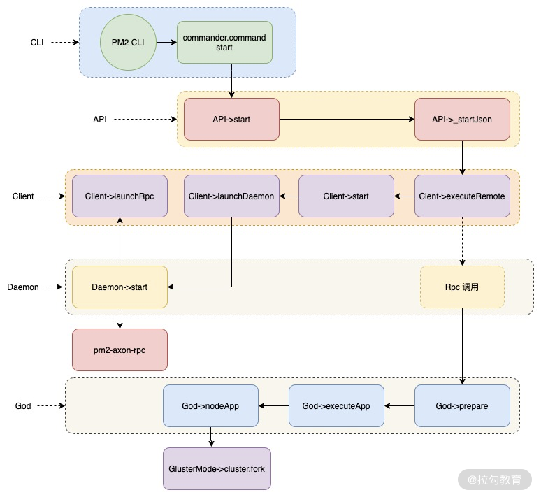

- [单线程问题](#单线程问题)
- [cluster 模式](#cluster-模式)
  - [例子](#例子)
  - [原理](#原理)
    - [多进程端口问题](#多进程端口问题)
    - [负载均衡原理](#负载均衡原理)
  - [总结](#总结)
- [PM2原理](#pm2原理)

在线上我们要考虑使用多核 CPU，充分利用服务器资源，这里就用到多进程解决方案，所以本讲介绍 PM2 的原理以及如何应用一个 cluster 模式启动 Node.js 服务。

# 单线程问题

在[《核心篇1-事件循环、应用场景》](./%E6%A0%B8%E5%BF%83%E7%AF%871-%E4%BA%8B%E4%BB%B6%E5%BE%AA%E7%8E%AF%E3%80%81%E5%BA%94%E7%94%A8%E5%9C%BA%E6%99%AF.md)中分析了 Node.js 主线程是单线程的，如果我们使用 node app.js 方式运行，就启动了一个进程，只能在一个 CPU 中进行运算，无法应用服务器的多核 CPU，因此我们需要寻求一些解决方案。

想到的解决方案肯定是**多进程分发策略**，即主进程接收所有请求，然后通过一定的负载均衡策略分发到不同的 Node.js 子进程中。如图的方案所示：


这一方案有 2 个不同的实现：

1. 主进程监听一个端口，子进程不监听端口，通过主进程分发请求到子进程；
2. 主进程和子进程分别监听不同端口，通过主进程分发请求到子进程。

在 Node.js 中的 `cluster 模式`使用的是第一个实现。

# cluster 模式

cluster 模式，即一个主进程和多个子进程，从而形成一个集群的概念。

## 例子

先实现一个简单的 app.js

```js
// app.js

const http = require('http');

// 创建 http 服务，简单返回
const server = http.createServer((req, res) => {
    res.write(`hello world, start with cluster ${process.pid}`);
    res.end();
});

// 启动服务
server.listen(3000, () => {
    console.log('server start http://127.0.0.1:3000');
});

console.log(`Worker ${process.pid} started`);
```

用 cluster 模式来包装这个服务，代码如下：

```js
const cluster = require('cluster');
const instances = 2; // 启动进程数量
if (cluster.isMaster) {
    for(let i = 0;i<instances;i++) { // 使用 cluster.fork 创建子进程
        cluster.fork();
    }
} else {
    require('./app.js');
}
```

首先判断是否为主进程：

- 如果是则使用 cluster.fork 创建子进程；
- 如果不是则为子进程 require 具体的 app.js。

用`node cluster.js`命令启动服务，然后在多次运行`curl "http://127.0.0.1:3000/"`命令

控制台输出：

```
hello world, start with cluster 4543
hello world, start with cluster 4542
hello world, start with cluster 4543
hello world, start with cluster 4542
```

`4543` 和 `4542` 就是我们 `fork` 出来的两个**子进程**

## 原理

首先我们需要搞清楚两个问题：

- Node.js 的 cluster 是如何做到**多个进程监听一个端口的**，实现多进程共同处理高并发请求的目的；
- Node.js 是**如何进行负载均衡请求分发的**。

### 多进程端口问题

在 cluster 模式中存在 master 和 worker 的概念，**master 就是主进程，worker 则是子进程**。

master 进程和 worker 进程的创建方式。如下所示：

```js
const cluster = require('cluster');
const instances = 2; // 启动进程数量
if (cluster.isMaster) {
    for(let i = 0;i<instances;i++) { // 使用 cluster.fork 创建子进程
        cluster.fork();
    }
} else {
    require('./app.js');
}
```

一次 require 的 cluster 对象就默认是一个 `master`。

> `if (cluster.isMaster)` 逻辑判断是通过**进程环境变量**来进行的。

因此**第一次**调用 cluster 模块是 master 进程，而后都是子进程。且主进程和子进程 require 文件不同。

具体过程如下：

1. `cluster.js` 首次运行的时候，`isMaster === true` 这时候会创建一个**父进程**。
2. 在我们代码中调用了两次的 cluster.fork() 方法
3. `cluster.fork()` 源码中会调用 `child_process` 的 `fork` 方法来启动新的进程，在调用 cluster.fork() 时会将进程运行参数全部传递给 child_process fork() 方法，通过这个方法启动了一个**新进程**；
4. `child_process.fork()` 的时候会**重新运行 node 的启动命令**，这时候就会**重新运行 cluster.js** 这个文件，而这时候 `isMaster === false` 所以会去 `requre('app.js')`了。（在 fork 子进程的时候，如果父进程还没有创建，会创建父进程）
5. 在 app.js 中虽然是启动了监听端口，由于**监听端口的方法被重写了**，因此只是向主进程发送了一个消息，告诉父进程可以向我发送消息了，因此可以**一个端口多个进程来服务**。

主子进程之间的通信方式，就是我们常听到的 **IPC 通信方式**。

### 负载均衡原理

这里会涉及 Node.js cluster 模块中的两个模块。

- `round_robin_handle.js`（非 Windows 平台应用模式），这是一个轮询处理模式，也就是轮询调度分发给空闲的子进程，处理完成后回到 worker 空闲池子中，这里要注意的就是如果绑定过就会复用该子进程，如果没有则会重新判断，这里可以通过上面的 app.js 代码来测试，用浏览器去访问，你会发现每次调用的子进程 ID 都会不变。
- `shared_handle.js`（ Windows 平台应用模式），通过将文件描述符、端口等信息传递给子进程，子进程通过信息创建相应的 SocketHandle / ServerHandle，然后进行相应的端口绑定和监听、处理请求。

## 总结

 cluster 模块应用 child_process 来创建子进程，子进程通过复写掉 cluster._getServer 方法，从而在 server.listen 来保证只有主进程监听端口，主子进程通过 IPC 进行通信，其次主进程根据平台或者协议不同，应用两种不同模块（round_robin_handle.js 和 shared_handle.js）进行请求分发给子进程处理。

# PM2原理

PM2 是**守护进程管理器**，可以帮助你管理和保持应用程序在线。PM2 入门非常简单，它是一个简单直观的 CLI 工具，可以通过 NPM 安装。

PM2 启动时可以带一些配置化参数,

```js
module.exports = {
    apps : [{
      name: "nodejs-column", // 启动进程名
      script: "./app.js", // 启动文件
      instances: 2, // 启动进程数
      exec_mode: 'cluster', // 多进程多实例
      env_development: {
        NODE_ENV: "development",
        watch: true, // 开发环境使用 true，其他必须设置为 false
      },
      env_testing: {
        NODE_ENV: "testing",
        watch: false, // 开发环境使用 true，其他必须设置为 false
      },
      env_production: {
        NODE_ENV: "production",
        watch: false, // 开发环境使用 true，其他必须设置为 false
      },
      log_date_format: 'YYYY-MM-DD HH:mm Z',
      error_file: '~/data/err.log', // 错误日志文件，必须设置在项目外的目录，这里为了测试
      out_file: '~/data/info.log', //  流水日志，包括 console.log 日志，必须设置在项目外的目录，这里为了测试
      max_restarts: 10,
    }]
  }
```

PM2进程创建管理的整体流程如图所示：



1. `CLI`（lib/binaries/CLI.js）处理命令行输入，如我们运行的命令：`pm2 start pm2.config.js --env development`
2. `API`（lib/API.js）对外暴露的各种命令行调用方法，比如上面的 start 命令对应的 `API->start` 方法
3. `Client`（lib/Client.js）可以理解为命令行接收端，负责**创建守护进程 `Daemon`**，并与 Daemon（lib/Daemon.js）保持 RPC 连接。
4. `God` （lib/God.js）主要负责进程的创建和管理，主要是通过 `Daemon` 调用，`Client -(通过RPC方式)-> Daemon --> God`。
5. 最终在 God 中调用 `ClusterMode`（lib/God/ClusterMode.js）模块，在 ClusterMode 中调用 Node.js 的 `cluster.fork` 创建**子进程**

