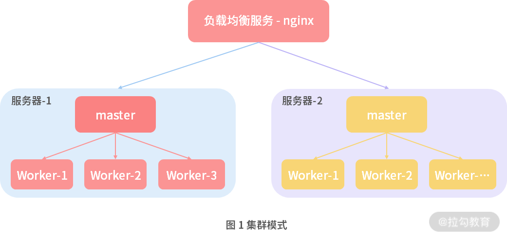

- [哪些因素会影响 Node.js 性能？](#哪些因素会影响-nodejs-性能)
  - [代码逻辑](#代码逻辑)
  - [集群服务](#集群服务)
  - [其他相关](#其他相关)
- [优化-CPU 过载保护设计：如何在服务层面确保系统稳定？](#优化-cpu-过载保护设计如何在服务层面确保系统稳定)
  - [什么是过载保护？](#什么是过载保护)
  - [CPU 过载保护方案](#cpu-过载保护方案)
    - [获取 CPU 使用率](#获取-cpu-使用率)
    - [避免出现误处理, 概率丢弃](#避免出现误处理-概率丢弃)
    - [优先级处理](#优先级处理)
- [优化 -  I/O 方面](#优化----io-方面)
  - [5种I/O模型](#5种io模型)
  - [磁盘 I/O](#磁盘-io)
  - [网络 I/O](#网络-io)
- [优化：缓存与应用：多级缓存策略介绍与应用要点](#优化缓存与应用多级缓存策略介绍与应用要点)
  - [缓存概念](#缓存概念)
  - [缓存问题](#缓存问题)
    - [缓存雪崩](#缓存雪崩)
    - [缓存穿透](#缓存穿透)
    - [缓存击穿](#缓存击穿)
  - [实现多级缓存](#实现多级缓存)

# 哪些因素会影响 Node.js 性能？

Node.js 作为后台服务性能是非常关键的一点，而影响 Node.js 的性能不仅仅要考虑其本身的因素，还应该考虑所在服务器的一些因素。前面我们介绍的 Node.js 的事件循环机制和 cluster 模式就是一种 Node.js 潜在的内在因素，而网络 I/O 、磁盘 I/O 以及其他内存、句柄的一些问题则是因为服务器的资源因素导致的性能问题。本讲就详细地分析影响其性能的因素原因，以及部分的优化解决方案。

## 代码逻辑

影响性能的一个最大的原因就是在写 Node.js 代码时，没有注重性能影响问题，接下来我们就从三个方面来分析下到底哪些代码会出现性能影响。

1. **CPU 密集型计算**：因主动避免大的循环，字符串转换，图片、视频的计算处理
2. **网络I/O**：应关注通道服用量（减少TCP握手）、增加缓存、长链接链接池（比如 MySQL、Mamcached 或者 Redis，为了避免排队使用长链接的问题，可以使用链接池，）等优化点
3. **磁盘 I/O**：在实际开发过程中，最常见的磁盘 I/O 场景，那就是**日志模块**，因为日志是需要写文件，从而会有频繁的日志写入。

 I/O 不会影响整体 Node.js 服务的性能，但是会因为 I/O 影响服务器系统，从而侧面影响到 Node.js 性能。

## 集群服务

后台服务一般都有集群的概念，无论是多机器部署，还是单机器（Node.js cluster 模式），具体我们画一个集群的架构例子，如下图所示。在进程分发的主节点 Nginx 和 Master 都可能会存在性能影响因素点，本讲核心是介绍 Node.js，因此我们主要看 `cluster 模式`的性能影响问题。



在`cluster模式`中，`主进程master`，因为所有的请求都必须经过 master 进程进行分发，同时接收处理 worker 进程的返回。

在实际开发过程中，遇到一个问题，由于我们所用机器是一个 96 核以上的服务器，因此启用了比较多的 worker 进程，而主进程只有一个，从而在单机高并发时（2 万以上的每秒并发请求）会导致 master 进程处理瓶颈，这样就影响到了服务性能，并且这时候你会发现 worker 进程的 CPU 并没有任何压力。

以上这点非常重要，在生产环境下一般很难发现这类问题，不过你应该有一个这样的概念：大概在 **2 万以上的并发**时，master 进程会存在性能瓶颈。

## 其他相关

1. **内存限制**：
   在 32 位服务器上 Node.js 的内存限制是 0.7 G，而在 64 位服务器上则是 1.4 G，而这个限制主要是因为 Node.js 的垃圾回收线程在超过限制内存时，回收时长循环会大于 1s，从而会影响性能问题。

   现网我们一般会启用多个进程，如果每个进程损耗 1.4 G，那么加起来可能超出了服务器内存上限，从而导致服务器瘫痪。其次如果内存不会超出服务器上限，而是在达到一定上限时，也就是我们上面说的 0.7 G和 1.4 G，会导致服务器重启，从而会导致接口请求失败的问题。

2. **巨柄限制**：
   句柄可以简单理解为一个 ID 索引，通过这个索引可以访问到其他的资源，比如说文件句柄、网络 I/O 操作句柄等等，而一般服务器句柄都有上限。当 Node.js 没有控制好句柄，比如说无限的打开文件并未关闭，就会出现句柄泄漏问题，而这样会导致服务器异常，从而影响 Node.js 服务。

   以上这两点我们都需要有一定的工具检测方法，在服务上限之前进行检测，其次也需要有一定的定位的方法，在出现现网异常时，能够定位出具体的问题

# 优化-CPU 过载保护设计：如何在服务层面确保系统稳定？

## 什么是过载保护？

这个词最早出现是在电路方面，在出现短路或者电压承载过大时，会触发电源的过载保护设备，该设备要不熔断、要不跳闸切断电源。

在服务端也是相似的原理，首先我们需要设计一个过载保护的服务，在**过载触发时，切断用户服务直接返回报错，在压力恢复时，正常响应用户请求**。

在 Node.js 中最大的瓶颈在于 **CPU**，因此我们需要针对 CPU 的过载进行保护。当 CPU 使用率超出一定范围时，进行请求熔断处理，直接报错返回，接下来我们来看下具体的实现原理。

## CPU 过载保护方案

在实现方案前，我们需要思考几个关键的问题：

- 获取当前进程所在的 CPU 使用率的方法；
- 应尽量避免影响服务性能；
- 什么时候触发过载，能否减少误处理情况；
- 请求丢弃方法和优先级；

接下来我们看下这几个部分的实现方法。

### 获取 CPU 使用率

Node.js 进程启动后，都会绑定在单核 CPU 上。假设机器有 2 个 CPU 内核，我们只启动了一个进程，那么在没有其他外在因素影响的情况下，Node.js 即使跑满 CPU，也最多只占用了 50% 的总机器的 CPU 利用率。**因此这里我需要获取该进程 CPU 使用率**。

**我们需要获取当前进程下的 CPU 使用情况，而不是整体机器的 CPU，因此需要使用 PS 这个命令，而不是利用 Node.js 本身的 OS 模块**。

首先我们需要使用一个命令：

```
$ ps -p ${process.pid} -o pid,rss,vsz,pcpu,comm
```

- pid 是进程 ID；
- rss 是实际内存占用；
- vsz 是虚拟内存占用；
- pcpu 是 CPU 使用率；
- comm 是进程执行的指令。

获取CPU使用率都是基于以上命令实现的，再进行逻辑处理和计算，得到符合项目要求的CPU使用率结果。具体如何实现，先忽略

### 避免出现误处理, 概率丢弃

在获取 CPU 值以后，我们可以根据当前 CPU 的情况进行一些丢弃处理，但是应尽量避免出现误处理的情况。比如当前 CPU 某个时刻出现了过高，但是立马恢复了，这种情况下我们是不能进行丢弃请求的，**只有当 CPU 长期处于一个高负载情况下才能进行请求丢弃**。

即使要丢请求，也需要**根据概率来丢弃**，而不是每个请求都丢弃，我们需要根据三个变量：

- `overloadTimes`，用 o 表示，指 CPU 过载持续次数，该值越高则丢弃概率越大，设定取值范围为 0 ~ 10；
- `currentCpuPercentage`，用 c 表示，指 CPU 当前负载越高，占用率越大则丢弃概率越大，这里设定范围为 0 ~ 10，10 代表是最大值 100% ；
- `baseProbability`，用 b 表示，是负载最大时的丢弃概率，取值范围为 0 ~ 1。

丢弃概率简单的计算公式如下：
```
P = (0.1 * o) * Math.exp(c) / (10 * Math.exp(10)) * b
```

具体代码实现：
```js
/**
 * @description 获取丢弃概率
 */
_setProbability() {
     let o = overloadTimes >= 100 ? 100 : overloadTimes;
     let c = currentCpuPercentage >= 100 ? 10 : currentCpuPercentage/10;
     currentProbability = ((0.1 * o) * Math.exp(c) / maxValue * this.baseProbability).toFixed(4);
}

/**
 * @description 获取一个概率值
 */
_getRandomNum(){
    return Math.random();
}

/**
 * @description 判断当前的随机数是否大于等于概率值，如果小于概率值则丢弃该请求，大于则认为允许请求继续访问
 */
isAvailable(path, uuid) {
    if(isOverload) {
      if(this._getRandomNum() <= this._getProbability()) {
          return false;
      }
      return true;
    }
    return true;
}
```

以上只是最简单的实现，在某些情况下，我们需要做一定的优化，避免一些重要的请求无法触达用户，因此还需要做一些优化级和同一个 uuid 进行优化的策略。

### 优先级处理

- 优先级问题，因为有些核心的请求我们不希望用户在访问时出现丢弃的情况，比如支付或者其他核心重要的流程；
- 其次对于一个用户，我们允许了该用户访问其中一个接口，那么其他接口在短时间内应该也允许请求，不然会导致有些接口响应成功，有些失败，那么用户还是无法正常使用。

优先级实现最简单的方式，就是接受一个**白名单参数**，如果设置了则会在白名单中的请求通过处理，无须校验，如果不在才会进行检查

# 优化 -  I/O 方面

前面说过， I/O 不会影响整体 Node.js 服务的性能，但是会因为 I/O 影响服务器系统，从而侧面影响到 Node.js 性能。本节着重介**绍磁盘 I/O** 和**网络 I/O** 两个方面在研发过程中注意的要点。

## 5种I/O模型

I/O 在系统层面会有 2 个阶段（以读为例子）：

- 第一个阶段是读取文件，将文件放入操作系统内核缓冲区；
- 第二阶段是将内核缓冲区拷贝到应用程序地址空间。

I/O 分为以下 5 种模型

- 阻塞 I/O：例如读取一个文件，我们必须要等待文件读取完成后，才能执行其他逻辑，而当前是无法释放 CPU 的，因此无法去处理其他逻辑。
- 非阻塞 I/O：我们发起了一个读取文件的指令，系统会返回正在处理中，然后这时候如果要释放进程中的 CPU 去处理其他逻辑，必须使用**轮询**的判断方法看是否读取完成了。
- 多路复用 I/O：这一模型主要是为了**解决轮询调度的问题**，我们可以将这些 `I/O Socket` 处理的结果统一交给一个**独立线程**来处理，当处理完成后，就**主动**告诉业务，处理完成了，这样不需要每个业务都来进行轮询查询了。
  
  它包括目前常见的三种类型：select 、poll 和 epoll。这三者只会告知文件读取进入了操作系统内核缓冲区，也就是上面我们所说的第一阶段，但是第二阶段**从内核拷贝到应用程序地址空间还是同步等待的**。
- 信号驱动 I/O：这种模式和多路复用的区别在于不需要有其他线程来处理，而是在完成了读取进入操作系统内核缓冲区后，立马通知，也就是第一阶段可以由系统层面来处理，不需要独立线程来管理，但是第二阶段还是和多路复用一样。
- **异步 I/O**：和信号驱动不同的是，异步 I/O 是**两个阶段都完成了以后，才会通知**，并不是第一阶段完成。
  我们常说的Node.js 是一个异步 I/O 这个是没有错的。具体来说 Node.js 是其 libv 库自行实现的一种类似异步 I/O 的模型，对于 Node.js 应用来说是一个异步 I/O，因此无须处理两个过程，而在 libv 内部实现，则是多线程的一个 epoll 模型。

## 磁盘 I/O

- 写I/O
  - 不需要获取写入结果时，则**不需要进行回调处理**，减少主线程压力，比如最常见的例子就是写日志；
  - 可以使用**文件流**的方式，避免重复的打开同一个文件，损耗不必要的打开和关闭文件的过程；
  - 为了缓解写并发对系统的压力，可以将需要写入的日志放入一个**临时内存**中
- 读I/O
  - 且需要获取读取结果时，能够使用**缓存**尽量使用缓存
  - 且无法进行缓存的，则尽量考虑不使用本地磁盘 I/O 操作
  - 涉及大文件读取操作时，则应使用**数据流**的方式，而不是一次性读取内存中进行处理。

## 网络 I/O

在后台服务中常见的网络 I/O 有如下几种类型：

- 缓存型，如 MemCache、Redis；
- 数据存储型，如 MySQL、MongoDB；
- 服务型，如内网 API 服务或者第三方 API。

网络 I/O 的成本是最高的，因为会涉及两个最重要的点：

- 依赖其他服务的性能；
- 依赖服务器之间的延时。

我们可以从以下几个方面来考虑优化的策略：

- **减少与网络 I/O 的交互**，比如缓存已获取的内容；
- 使用**更高性能的**网络 I/O 替代其他性能较差的、成本更高的网络 I/O 类型，比如数据库读写的 I/O 成本是明显高于缓存型的，因此可以使用缓存型网络 I/O 替换存储型；
- 降低目标网络 I/O 服务的并发压力，可以采用**异步队列**方式。

这里解释一下什么叫**异步队列**。

举一个用户抢票的例子，如果每个用户抢票，我们都执行一次查询并且购票，那么对于目标机器则压力非常大，特别像 12306 这种几亿人同时抢的情况，那么这里就可以采用异步队列的方式，也就是用户发送请求后只告知用户，你已经进入队列，但是真正情况是**用户的请求会缓存在一个队列**中，再一个个前往具体的网络 I/O 服务中，独立去处理，这时候并发压力就可控，因此也不会出现性能问题。


如图所示，假设我们现在有 3 个（实际情况可能几千万甚至几亿）用户同时向服务器请求，这时候服务器肯定是处理不过来的，只能告诉用户，你的请求我们已经收到了，并且在处理中了，请耐心等待通知。这时候将用户的请求放到一个队列中，然后通过另外一个服务，定时从队列中获取待处理的消息，根据实际情况处理完成后，将处理后的结果通知给具体的每个用户。

异步队列一个比较高性能的网络 I/O ，通过一个高性能网络 I/O 将其他的业务逻辑封装，让用户无感知，只是**延迟了用户收到结果的时间**。

# 优化：缓存与应用：多级缓存策略介绍与应用要点


## 缓存概念

**缓存是临时的一块存储空间**，用于存放**访问频次较高的数据**，用空间换响应速度，核心是减少用户对**数据库的查询压力**。
  
- **临时**，为了避免存储空间的浪费，我们应该尽量设置数据缓存的时间，当过期时自动销毁；
- **存储空间**，一般选择读写性能较高的内存（本地内存或者共享内存），有些会应用 SSD 进一步提升性能；
- **访问频次较高的数据**，为了避免存储空间的浪费，应该尽量选择访问频次较高的数据，切莫将任何数据放入缓存；
- **数据库的查询压力**，我们需要将一些复杂的数据库查询进行缓存，减少数据库访问压力，从而提升用户的响应速度。

## 缓存问题

如果没有应用好缓存，将会导致一些不可见或者说很难定位的现网事故，主要是三点：**缓存雪崩、缓存击穿和缓存穿透**。

### 缓存雪崩

前面提到了数据缓存中的过期概念，并且强调了当数据未及时写入缓存却已过期时，会导致数据库的查询压力过大。为了避免这种情况，可以采取以下措施：

1. **避免所有数据都设置同一个过期时间节点**，应该按数据类型、数据更新时效性来设置。
2. **数据过期时间应大于数据更新节点时间**，并考虑更新时长，同时增加更新失败异常告警提示。
3. 对于一些高频或高负荷数据，也可不设置过期时间，采用程序控制方式进行移除或更替

### 缓存穿透

在缓存数据中，访问频率高的数据应该被缓存，但如果是查询空数据，就不能单纯地直接访问缓存，因为缓存中可能没有这些数据。这时就会出现缓存击穿的情况，而要避免这种情况，可以采用以下措施：

1. 过滤掉一些可以从程序中处理的无效请求数据。
2. 对查询为空的结果也进行缓存，这样下次用户访问时就能直接从缓存中返回数据。
3. 使用布隆过滤器将这些空数据的键名缓存到缓存中，这样可以节省内存空间，并提升效率。

### 缓存击穿

这个概念和缓存雪崩有点类似。但不是大面积的缓存过期失效，而是**某个访问频次较高的数据失效了**，从而导致这一刻高并发的请求全部穿透到了数据库，从而数据库并发压力较高，响应较慢。可以采用以下措施：

1. 对于一些高频、查询较为复杂的数据，也可不设置过期时间，采用程序控制方式进行移除或更替
2. 数据过期时间应大于数据更新节点时间
3. 使用原子操作方案，当多个数据都需要前往数据库查询同一个数据时，告知程序缓存正在生成中，并且告知其他程序可以读取上一次缓存数据，避免同时读取同一份数据。

## 实现多级缓存

本地缓存 + 共享缓存

> Redis（Remote Dictionary Server）是一个开源的内存数据存储系统，常用作数据库、缓存和消息代理。它支持多种数据结构，如字符串（strings）、哈希表（hashes）、列表（lists）、集合（sets）和有序集合（sorted sets）等，这些数据结构可以在内存中直接操作，使得 Redis 具有非常高的读写性能。

