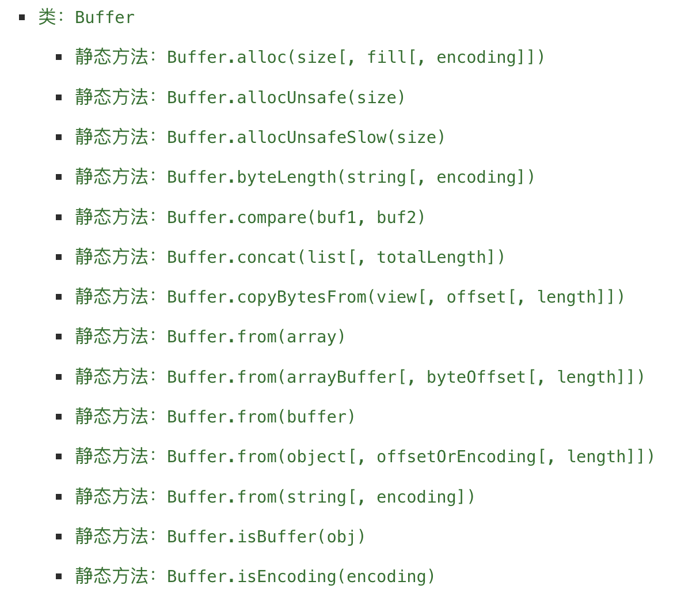

- [fs模块](#fs模块)
  - [文件读取](#文件读取)
  - [文件描述符](#文件描述符)
    - [open获取文件描述符](#open获取文件描述符)
    - [文件描述符的使用](#文件描述符的使用)
  - [文件写入](#文件写入)
  - [文件夹的操作](#文件夹的操作)
- [Buffer \& Stream](#buffer--stream)
  - [Buffer](#buffer)
    - [Buffer 和字符串](#buffer-和字符串)
    - [Buffer与中文](#buffer与中文)
    - [Buffer其他创建方式](#buffer其他创建方式)
    - [Buffer与文件读取](#buffer与文件读取)
  - [Buffer使用场景](#buffer使用场景)
  - [Stream 流](#stream-流)
    - [Readable](#readable)
    - [Writeable](#writeable)
    - [pipe方法](#pipe方法)

# fs模块
>https://developer.aliyun.com/article/1172081?spm=a2c6h.24874632.expert-profile.47.c49c5b1ePFJic0
对于任何一个为**服务端服务**的语言或者框架来说，通常都会有自己的文件系统：

- 因为服务器需要将各种数据、文件等放置到不同的地方；
- 比如用户数据可能大多数都是放到数据库的；
- 比如某些配置文件或者用户资源（图片、音视频）都是以文件的形式存在操作系统上的
而 Node 也有自己的文件系统操作模块。就是 fs（File System） 。

借助于 Node 帮我们封装的文件系统，我们可以在任何的操作系统（window、Mac OS、Linus）上面直接去操作文件。这也是 Node 可以开发服务器的一大原因，也是它可以成为前端自动化脚本等热门工具的原因。

Node 文件系统的 API 非常多，这些 API大多数都提供了三种操作方式：

- `同步操作文件`：代码会被阻塞，不会继续执行；
- `异步回调函数操作文件`：代码不会被阻塞，需要传入回调函数，当返回结果时，回调函数被执行；
- `异步 Promise 操作文件`：代码不会被阻塞，通过 fs.promises 调用方法操作，会返回一个 Promise，可以通过 then、catcth 进行处理

## 文件读取
我们先创建一个 aaa.txt 的文件，随便写入一行 `Hello World`，接着调用 api 读取这个文件的内容。
主要用到`readFileSync`和`readFile`这两个api

- `readFileSync`同步读取
  ```js
  // 引入 fs 模块
  const fs = require("fs");
  
  // 1. 同步读取
  const file = fs.readFileSync("./aaa.txt");
  console.log(file); // file是一个buffer <Buffer 48 65 ****>
  console.log("后续的代码");
  ```
  如果想看到具体的文本，我们有两种方式实现。
  - 在 file 后加上 `toString()`
    ```js
    const file1 = fs.readFileSync("./aaa.txt");
    console.log(file1.toString());
    console.log("后续的代码");
    ```
  - readFileSync 第二个参数中添加 `encoding: 'utf-8'`
    ```js
    const file2 = fs.readFileSync("./aaa.txt", { encoding: "utf-8" });
    console.log(file2);
    console.log("后续的代码");
    ```
- `readFile`(异步+回调函数)
   ```js
   // 2.1 异步 + 回调函数 readFile
   fs.readFile("./aaa.txt", { encoding: "utf-8" }, (err, data) => {
     if (err) {
       console.error("读取文件错误", err);
       return
     }
     console.log(data); // Hello World
   });
   console.log("后续的代码");
   ```
- `readFile` (异步 + Promise)
  ```js
  fs.promises
    .readFile("./aaa.txt", { encoding: "utf-8" })
    .then((res) => {
      console.log(res.toString());
    })
    .catch((err) => {
      console.error("读取文件错误", err);
    });
  console.log("后续的代码");
  ```


## 文件描述符

什么是文件描述符？

- 在常见的操作系统上，对于每个进程，内核都维护着一张当前打开着的文件的表格
- 在每个打开的文件都分配了一个称为文件描述符的简单的数字标识符
- 在系统层，所有文件系统操作都是用这些文件描述符来标识和跟踪每个特定的文件
- Windows 系统使用了一个虽然不同但概念上类似的机制来跟踪资源。

为了简化用户的工作，Node.js 抽象出操作系统之间的特定差异，并为所有打开的文件分配了一个数字型的文件描述符。

### open获取文件描述符
```js
const fs = require("fs");

fs.open("./aaa.txt", (err, fd) => {
  console.log(fd); // 20
});
```
可以看到此时 aaa.txt 的文件描述符为 20

文件描述符，可用于从文件读取数据、写入数据、或请求相关文件的信息


### 文件描述符的使用


## 文件写入
有文件的读取，就会有写入

- 文件的读取：`fs.readFile(path[,options],callback)`
- 文件的写入：`fs.writeFile(file,data[,options],callback)`

```js
const fs = require("fs");

let content = "aaaa";

fs.writeFile("./foo.txt", content, { encoding: "utf-8", flag: "a+" }, (err) => {
  console.log(err);
});
```
在上面的代码中，你会发现有一个对象类型 `options`，这个就是写入时填写的 option 参数：
- `flag`：写入的方式
  - `w` 打开文件写入（默认）
  - `w+` 打开文件进行读写（可读可写），如果不存在则创建文件
  - `r` 打开文件进行读取，读取时的默认值
  - `r+` 打开文件进行读写，如果不存在那么抛出异常
  - `a` 打开要写入的文件，将流放在文件末尾。如果不存在则创建文件；
  - `a+` 打开文件进行读写（可读可写），将流放在文件末尾。如果不存在则创建文件
- `encoding`：字符编码
  - `ASCII 编码`：ASCII 码占用一个字节( 8 位)，一共可以表示 256 个字符。
  - `GBXXXX 编码`：为了显示中文设计的一套编码规则（著名的 GB2312）
  - `GBK 编码`：相比于 GB2312，多收录了包括古汉语、繁体、日语朝鲜语等汉字，在中文版Windows 操作系统下, 通常使用的编码方式都是 GBK 编码
  - `Unicode`：Unicode（统一码、万国码、单一码、标准万国码）是业界的一种标准，它可以使电脑得以体现世界上数十种文字的系统。
  - `UTF-8/-16/-32`


## 文件夹的操作

`mkdir` 创建文件夹
```js
fs.mkdir("./coder/aaa", (err) => {
  console.log(err); 
});
```
`readdir` 读取文件夹
```js
fs.readdir("./coder", (err, files) => {
  console.log(err, files); // null ['aaa', 'bbb', 'ccc.txt']
});
```
`rename` 文件、文件夹重命名
```js
fs.rename("./coder", "./coderyjw", (err) => {
  if (err) {
    console.log("重命名失败", err);
  }
});
```

# Buffer & Stream
>https://developer.aliyun.com/article/1172082?spm=5176.26934562.main.2.78f422c05TgSt9#slide-4
## Buffer

Node 为了可以方便开发者完成更多功能，提供给了我们一个 Buffer类用来创建一个专门存放**二进制数据的缓存区**，并且它是全局的。

通常，数据的移动是为了处理或者读取它，并根据它进行决策。伴随着时间的推移，每一个过程都会有一个最小或最大数据量。如果数据到达的速度比进程消耗的速度快，那么少数早到达的数据会处于等待区等候被处理。

这里的**等待区**就指的`缓冲区（Buffer）`，它是计算机中的一个小物理单位，通常位于计算机的 RAM 中。

### Buffer 和字符串
Buffer 相当于是一个字节的数组，数组中的每一项对应一个字节的大小：

如果我们希望将一个字符串放入到 Buffer 中，是怎么样的过程呢？

```js
const buffer = new Buffer("hello");

console.log(buffer);
```
打印结果如下：


可以看到打印出的 Buffer 对象包含了五个 由两位**十六进制**组成的数字。
如果去查询 ASCII 表的话会发现，这五个十六进制数正好对应着英文字母的 `h e l l o`

### Buffer与中文
Buffer 默认是以 `utf-8` 为默认编码存储中文的

前面使用 `new Buffer()` 创建了一个 Buffer 对象，事实上由于安全性和可用性的问题，Node 已经废弃了这种方法，推荐使用` Buffer.alloc()`、`Buffer.allocUnsafe()` 或者`Buffer.from()` 这三种方法创建 Buffer 对象

例如：
```
const buf = Buffer.from("你好");
console.log(buf); // <Buffer e4 bd a0 e5 a5 bd>
```

**乱码的问题：**

一般乱码的问题都是因为**编码与解码**使用了不同的方法而导致的。

在 `Buffer.from()` 方法中，我们还可以添加**第二个参数**来规定使用哪种编码方式
```js
const fs = require("fs");

const buf = Buffer.from("你好", "utf16le");

console.log(buf.toString("utf16le"));
console.log(buf.toString("utf8"));
```

### Buffer其他创建方式
关于 Buffer 的创建方式还有很多


重点说一下`Buffer.alloc(len)`，它可以向内存申请一个为`len个字节长度`的 Buffer，里面的默认数据是 00。

```js
const buf = Buffer.alloc(8);
console.log(buf); // <Buffer 00 00 00 00 00 00 00 00>

buf[0] = "w".charCodeAt();
buf[1] = 100;
buf[2] = 0x66;

console.log(buf); // <Buffer 77 64 66 00 00 00 00 00>
console.log(buf[0]); // 119
console.log(buf[2].toString()); // 102
```
### Buffer与文件读取

`fs 模块`中 readFile 的回调是一个 `Buffer`

**文本的读取**
```js
const fs = require("fs");

fs.readFile("./test.txt", (err, data) => {
  console.log(data); // <Buffer 48 65 6c 6c 6f 20 57 6f 72 6c 64>
  console.log(data.toString()); // Hello World
});
```
**图片的读取**
```js
const fs = require("fs");

fs.readFile("./image.png", (err, data) => {
  console.log(data); // <Buffer 89 50 4e 47 0d 0a 1a 0a 00 00 ... 1878012 more bytes>
});
```

## Buffer使用场景

- `I/O 操作`：以是文件或网络 I/O
- `zlib.js`：zlib.js 为 Node.js 的核心库之一，其利用了缓冲区（Buffer）的功能来操作二进制数据流，提供了压缩或解压功能。
- `加解密`：

## Stream 流

我们可以想象当我们从一个文件中读取数据时，文件的二进制数据会源源不断的被读取到我们程序中，而这个一连串的字节，就是我们程序中的流。

所以我们可以这样理解流：

- 它是**连续**字节的一种表现形式和抽象概念
- 流应该是**可读的**，也是**可写的**

再上一章讲文件的读写时，我们已经可以直接通过 `readFile` 和 `writeFile` 的方式读写文件了，为什么还需要流呢？

- 直接读写的方式，虽然简单，但是无法控制一些细节的操作
- 比如**从什么位置开始读、读到什么位置、一次性读取多少个字节**
- 读到**某个位置**后，**暂停读取**，某个时刻恢复继续读取等等
- 或者这个**文件非常大**，比如一个视频文件，一次性全部读取并不合适

**node.js 中的 4 种 基本流类型**

- `Writable` ：可写的数据流。例如，`fs.createWriteStream()`允许我们使用流将数据写入文件。
- `Readable` ：可读的数据流。例如，`fs.createReadStream()`允许我们读取文件内容。
- `Duplex` ：既可读又可写的双工流。 例如`net.Socket`。
- `Transform`  ：可以在读写数据时修改或转换数据的转换流。例如，在文件压缩的实例中（一个已压缩的文件），你可以在写入压缩的数据时，从文件中读取解压缩后的数据。例如`zlib.createDeflate()`

这里我们通过 fs 的操作，学习一下 `Writable、Readable`

### Readable

之前我们读取一个文件的信息，如下：
```js
fs.readFile("./test.txt", (err, data) => {
  console.log(data.toString()); // Hello World
});
```
这种方式是**一次性**将一个文件中所有的内容都读取到程序（内存）中，但是这种读取方式就会出现我们之前提到的很多问题，比如文件过大、读取的位置、结束的位置、一次读取的大小；

这个时候，我们可以使用 `createReadStream`

通过 Readable 读取一个文件信息
- 创建文件的Readable
  ```js
  const read = fs.createReadStream('./test.txt', {
    start: 3, //文件读取开始的位置；
    end: 8, // 文件读取结束的位置；
    highWaterMark: 4 // 一次性读取字节的长度，默认是 64kb
  })
  ```
 - 通过监听 data 事件，获取读取到的数据
   ```js
   read.on("data", (data) => {
     console.log(data);
   });
   ```
 - 也可以做一些其他的操作：监听其他事件、暂停或恢复
   ```js
   read.on("open", (fd) => {
     console.log("文件被打开", fd);
   });
   
   read.on("end", () => {
     console.log("文件读取结束");
   });
   
   read.on("close", () => {
     console.log("文件被关闭");
   });
      
      // 暂停读取，两秒后再读取
      read.pause();
      setTimeout(() => {
        read.resume();
      }, 2000);
   ```
### Writeable

之前我们写入一个文件的方式是这样的
```js
fs.writeFile('./test.txt',"内容",(err)=>{
})
```
这种方式相当于**一次性**将所有的内容写入到文件中，但是这种方式也有很多问题：比如我们希望一点点写入内容，精确每次写入的位置等；

这个时候，我们可以使用 `createWriteStream`

**用流的方式写入文件**
```js
const writer = fs.createWriteStream("./test.txt", {
  flags: "a+",
  start: 8,
});

writer.write("你好啊", (err) => {
  console.log("写入成功");
});

writer.on("open", () => {
  console.log("文件打开了");
});

writer.on("finish", () => {
  console.log("文件写入结束");
});

writer.on("close", () => {
  console.log("文件关闭");
});
```

### pipe方法

正常情况下，我们可以将读取到的 输入流，手动的放到 输出流中进行写入：

```js
const reader = fs.createReadStream("./test.txt");
const writer = fs.createWriteStream("./bar.txt");

reader.on("data", (data) => {
  console.log(data);

  writer.write(data, (err) => {
    console.log(err);
  });
});
```

我们也可以通过` pipe `来完成这样的操作：
```js
reader.pipe(writer)
```