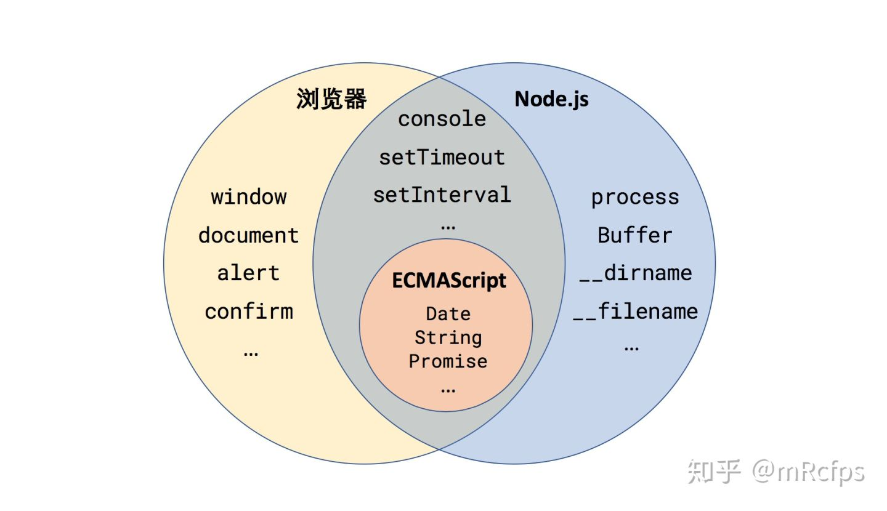

- [Node概述](#node概述)
  - [什么是Node？](#什么是node)
  - [Node架构](#node架构)
  - [Node.js特点及应用场景](#nodejs特点及应用场景)
- [Node的异步I/O 事件循环机制 - Libuv提供](#node的异步io-事件循环机制---libuv提供)
  - [例子](#例子)
  - [Node.js事件循环](#nodejs事件循环)
  - [浏览器与Node的Event Loop 差异](#浏览器与node的event-loop-差异)
  - [Node10+的宏任务和微任务](#node10的宏任务和微任务)
- [内存控制 - 垃圾回收机制，内存泄露](#内存控制---垃圾回收机制内存泄露)
- [Node全局对象](#node全局对象)
- [Node模块机制](#node模块机制)
- [内置类库](#内置类库)
  - [EventEmitter 事件](#eventemitter-事件)
  - [网络](#网络)
- [如何运行 Node 代码](#如何运行-node-代码)
  - [在 REPL 中交互式输入和运行；](#在-repl-中交互式输入和运行)
  - [Node 解释器执行](#node-解释器执行)

>1. [一杯茶的时间，上手Node.js](https://zhuanlan.zhihu.com/p/97413574)
>2. [狼叔：如何正确学习node.js](https://cnodejs.org/topic/5ab3166be7b166bb7b9eccf7)
>3. [Node.js学习指南](https://blog.poetries.top/node-learning-notes/notes/base/01-%E7%8E%AF%E5%A2%83%E6%90%AD%E5%BB%BA.html#%E8%AE%A4%E8%AF%86-node-js)
>4. [Node.js官网文档](http://nodejs.cn/learn/introduction-to-nodejs)
---

# Node概述
## 什么是Node？
Node（或者说 Node.js，两者是等价的）是 JavaScript 的一种运行环境。

我们知道 JavaScript 都是在浏览器中执行的，用于给网页添加各种动态效果，那么可以说浏览器也是 JavaScript 的运行环境。两个运行环境差异如下图所示：


两个运行环境共同包含了 ECMAScript，也就是剥离了所有运行环境的 JavaScript 语言标准本身。

浏览器端 JavaScript 还包括了：BOM(即浏览器Browser对象，包含Window对象、Navigator对象、Screen对象、History对象、Location对象、存储对象等)、DOM(即html的DOM)

Node.js 则是包括V8引擎(Chrome 浏览器中的JS引擎)。而 Node.js 则进一步将 V8 引擎加工成可以在任何操作系统中运行 JavaScript 的平台。
## Node架构


Node.js 是基于 Chrome V8引擎构建的，由事件循环（Event Loop）分发 I/O 任务，最终工作线程（Work Thread）将任务丢到线程池（Thread Pool）里去执行，而事件循环只要等待执行结果就可以了。

node架构分为三层：
- **第一层**，Node.js 标准库，这部分是由js编写的，即我们使用过程中直接能调用的 API,在源码中的 lib 目录下可以看到。
- **第二层**，Node bindings，这一层是 js 与底层 `C/C++` 能够沟通的关键，前者通过 bindings 调用后者，相互交换数据，是第一层和第三层的桥梁。
- **第三层**，是支撑 Node.js 运行的关键，由 C/C++ 实现，是node实现的一些底层逻辑。
  - 其中`Libuv`，为 Node.js 提供了**跨平台，线程池，事件池，异步 I/O** 等能力，是 Node.js 如此强大的关键。
  - `Chrome V8` 解释并执行 JavaScript 代码（这就是为什么浏览器能执行 JavaScript 原因）

## Node.js特点及应用场景
**特点**
1. **异步非阻塞I/O**：Node.js的事件模型和I/O模型使得它能够高效地处理大量并发连接，从而提高了应用程序的性能和吞吐量。
2. **事件驱动**：Node.js基于事件驱动的编程模型，通过响应事件来进行异步编程，避免了传统同步阻塞式编程中的线程死锁和资源争用等问题。
3. **多进程单线程**：node.js是**多进程单线程**的语言，利用`child_process`技术来克服单线程的劣势。通过`master-worker`的管理方式来管理各个工作进程。**多进程**不是为了解决高并发，主要是解决了单进程模式下 Node.js CPU 利用率不足的情况，充分利用多核 CPU 的性能。
4. **跨平台**：Node是基于`libuv`实现跨平台的。
   <!--  -->

**应用场景**
1. I/O密集型
2. 非CPU密集型

# Node的异步I/O 事件循环机制 - Libuv提供

> [事件循环](https://zhuanlan.zhihu.com/p/100090251)

## 例子
```js
setTimeout(() => {
  console.log('timer1');
  Promise.resolve().then(function() {
    console.log('promise1');
  });
}, 0);
setTimeout(() => {
  console.log('timer2');
  Promise.resolve().then(function() {
    console.log('promise2');
  });
}, 0);
```
这段代码在浏览器环境中的输出结果是`timer1 promise1 timer2 promise`。详见[《V8-事件循环机制》](../../Google%20V8/V8(2)%20-%20%E4%BA%8B%E4%BB%B6%E5%BE%AA%E7%8E%AF%E6%9C%BA%E5%88%B6.md)
用`node10`之前的版本运行这段代码时输出的结果是出人意料的`timer1 timer2 promise1 promise2`。

很明显node的事件循环机制和浏览器的存在不同

## Node.js事件循环
和JavaScript类似，Node.js 在主线程里维护了一个**事件队列**，当接到请求后，就将该请求作为一个事件放入这个队列中，然后继续接收其他请求。

<!-- 而当主线程空闲时(没有请求接入时)，就开始循环事件队列，检查队列中是否有要处理的事件，这时要分两种情况：

- 如果是`非 I/O 任务`，就亲自处理，并通过回调函数返回到上层调用；
- 如果是 `I/O 任务`，就从 线程池 中拿出一个`线程`来处理这个事件，并指定回调函数，然后继续循环队列中的其他事件。
- 当线程中的 I/O 任务完成以后，就执行指定的回调函数，并把这个完成的事件放到事件队列的尾部，等待事件循环，当主线程再次循环到该事件时，就直接处理并返回给上层调用。（I/O 处理方面Node使用了`Libuv`，Libuv 是一个基于事件驱动的跨平台抽象层，封装了不同操作系统一些底层特性，对外提供统一的 API，事件循环机制也是它里面的实现。） -->
  


一流程包含 6 个阶段，每个阶段代表的含义如下所示。

1. `timers`定时器阶段：这个阶段检查是否有到期的定时器函数，如果有则执行到期的定时器回调函数。包含 `setTimeout()` 和 `setInterval()`这两个API的回调函数。执行完毕后，转移到下一个阶段。
2. `pending callbacks`：处理上一轮循环中的**异步I/O操作的回调函数**。
3. `idle、prepare`：仅系统内部使用，你只需要知道有这 2 个阶段就可以。在这个阶段中，Node.js会在事件循环中保持阻塞状态，等待额外的I/O事件或者计时器回调函数被加入到队列中。
4. **`poll`**：检索新的 `I/O` 事件，执行与 I/O 相关的回调，其他情况 Node.js 将在适当的时候在此阻塞。这也是最复杂的一个阶段，**所有的事件循环以及回调处理都在这个阶段执行**。有一个**概念观察者**，有`文件 I/O 观察者，网络 I/O 观察者`等，它会观察是否有新的请求进入，包含读取文件等待响应，等待新的 socket 请求，这个阶段在某些情况下是会阻塞的。当poll阶段队列为空的时候，进入check阶段
5. `check`：执行`setImmediate()` 回调函数，setImmediate 并不是立马执行，而是当事件循环 poll 中没有新的事件处理时就执行该部分
6. `close callbacks`：处理socket的close事件`socket.on('close', ...)`，以及其他关闭的回调函数。

>- `setTimeout(fn, delay)` 会在多少毫秒后将 fn 加入到 timer 队列中，等待到期后执行。
>- `setInterval(fn, interval)` 会每隔多少毫秒将 fn 加入到 timer 队列中，等待到期后执行。
>- `setImmediate(fn)` 会在当前事件循环的 check 阶段立即执行 fn，而不是等待到下一次事件循环再执行。

除了上述6个阶段，还存在`process.nextTick`，其不属于事件循环的任何一个阶段，它属于该阶段与下阶段之间的过渡, 即本阶段执行结束, 进入下一个阶段前, 所要执行的回调，类似**插队**。
```js
setTimeout(() => {
 console.log('timer1')
 Promise.resolve().then(function() {
   console.log('promise1')
 })
}, 0)
process.nextTick(() => {
 console.log('nextTick')
 process.nextTick(() => {
   console.log('nextTick')
   process.nextTick(() => {
     console.log('nextTick')
   })
 })
})
```
对于以上代码，永远都是先把` nextTick `全部打印出来。


流程图如下所示：


## 浏览器与Node的Event Loop 差异


- **浏览器环境**下，微任务队列是每个宏任务执行完之后执行。
- 在 **Node.js** 微任务会在事件循环的各个阶段之间执行，也就是一个阶段执行完毕，就会去执行微任务队列的任务。

所以，回到上面的例子，过程如下：
1. 主代码执行，将 2 个 定时器 依次放入 I/O任务队列最后进入timer队列，
2. 主代码执行完毕，调用栈空闲，开始进行事件循环首先进入 timers 阶段
3. 执行 timer1 的回调函数，打印 `timer1`，并将 promise1.then 回调放入 microtask 队列，同样的步骤执行 timer2，打印 `timer2`；
4. 至此，timer 阶段执行结束，event loop 进入下一个阶段之前，执行 microtask 队列的所有任务，依次打印 `promise1、promise2`。


而`node11+`之后，node在setTimeOut执行后会**手动清空微任务队列，以保证结果贴近浏览器**。

## Node10+的宏任务和微任务
在Node中，同样存在宏任务和微任务，与浏览器中的事件循环相似:
- **微任务**：`process.nextTick` 和 `Promise`。微任务在事件循环中优先级是最高的，因此在同一个事件循环中有其他任务存在时，优先执行微任务队列。并且process.nextTick 和 Promise 也存在优先级，**process.nextTick 高于 Promise**。
- **宏任务**：`setTimeout、setInterval、setImmediate 和 I/O`。宏任务在微任务执行之后执行，因此在同一个事件循环周期内，如果既存在微任务队列又存在宏任务队列，那么**优先将微任务队列清空，再执行宏任务队列**。


# 内存控制 - 垃圾回收机制，内存泄露

node.js的内存控制得益于`V8引擎`。因此这部分的内容详见[《V8-垃圾回收机制，内存泄露》](../../Google%20V8/V8(3)%20-%20%E5%9E%83%E5%9C%BE%E5%9B%9E%E6%94%B6%E6%9C%BA%E5%88%B6%EF%BC%8C%E5%86%85%E5%AD%98%E6%B3%84%E9%9C%B2.md)


# Node全局对象
JavaScript在各个运行环境下的全局对象的比较：



可以分为四类：
1. 浏览器专属，例如 `window、alert` 等等；
2. Node 专属，例如 `process、Buffer、__dirname、__filename` 等等；
3. 浏览器和 Node 共有，但是实现方式不同，例如 `console（第一节中已提到）、setTimeout、setInterval` 等；
4. 浏览器和 Node 共有，并且属于 ECMAScript 语言定义的一部分，例如 `Date、String、Promise` 等；

重点关注Node专属全局对象：

**procss**

process 全局对象可以说是 Node.js 的灵魂，它是管理当前 Node.js 进程状态的对象，提供了与操作系统的简单接口。可在Node REPL中查看process对象。它有以下属性：
- pid：进程编号
- env：系统环境变量
- argv：命令行执行此脚本时的输入参数
- platform：当前操作系统的平台
- exit：实现退出 Node.js 程序的函数，等

**Buffer**

Buffer 全局对象让 JavaScript 也能够轻松地处理二进制数据流，结合 Node 的流接口（Stream），能够实现高效的二进制文件处理。

**__filename 和 __dirname**

分别代表当前所运行 Node 脚本的文件路径和所在目录路径。

ps: __filename 和 __dirname 只能在 Node 脚本文件中使用，在 REPL 中是没有定义的。


**使用node全局对象**
```js
// test.js
setTimeout(() => {
  console.log('Hello World!');
}, 3000);

console.log('当前进程 ID', process.pid);
console.log('当前脚本路径', __filename);

const time = new Date();
console.log('当前时间', time.toLocaleString());
```
执行输出如下：（Hello World! 会延迟三秒输出）
```js
$ node timer.js
当前进程 ID 1961
当前脚本路径 /Users/wanwan/Desktop/test.js
当前时间 2022/5/7 下午5:56:15
Hello World!
```

在 setTimeout 等待的 3 秒内，程序并没有阻塞，而是继续向下执行，这就是 Node.js 的`异步非阻塞`!

# Node模块机制
在ES2015之前，js语言本身没有模块化的机制，构建复杂应用也没有统一的接口标准。人们通常使用一系列的`<script>` 标签来导入相应的模块（依赖），如下：
```js
<head>
  <script src="fileA.js"></script>
  <script src="fileB.js"></script>
</head>
```
这种方式会带来很多问题：
1. 导入的多个 JS 文件直接作用于全局命名空间，很容易产生命名冲突
2. 导入的 JS 文件之间不能相互访问
3. 导入的 script 无法被轻易去除或修改

因此，有几个常见的模块化规范被提出:
1. AMD（Asynchronous Module Definition）规范
2. `CommonJS规范`，Node.js 所实现的正是这一模块标准。`module.exports/require`
3. ES6 Module： `import/export`

> ps:​ 
> 
> – require 是运行时调用，因此 require 理论上可以运用在代码的任何地方；
>
> – import 是编译时调用，因此必须放在文件开头；

Node 模块可分为两大类：
- 核心模块：Node 提供的内置模块，在安装 Node 时已经被编译成二进制可执行文件
- 文件模块：用户编写的模块，可以是自己写的，也可以是通过 npm 安装的。

Node为了实现模块机制，引入了三个新的全局对象（Node专属）: `require、exports、modules`。

**require**
require 用于导入其他 Node 模块，其参数接受一个字符串代表模块的名称或路径，通常被称为模块标识符。具体有以下三种形式。
```js
// 直接写模块名称,导入内置库或第三方模块，node会通过module.paths找到目标模块
const os = require('os');
const express = require('express');

// 通过相对路径导入其他模块
const utils = require('./utils');

// 通过绝对路径导入其他模块
const utils = require('/home/xxx/MyProject/utils');
```

**exports**：可用exports导出模块内容供给外部使用

**module**
module对象有以下字段:


* `id`：模块的唯一标识符，如果是被运行的主程序则为 `.`，如果是被导入的模块（则等同于此文件名（即下面的 filename 字段）
* `path`和`filename`：模块所在路径和文件名
* `exports`：模块所导出的内容，实际上之前的 exports 对象是指向 module.exports 的引用。
* `parent`和`children`：用于记录模块之间的导入关系
* `loaded`：模块是否被加载。只有 children 中列出的模块才会被加载。
* `paths`：这个就是 Node 搜索文件模块的路径列表，Node 会从第一个路径到最后一个路径依次搜索指定的 Node 模块，找到了则导入，找不到就会报错。
> 仔细观察会发现 Node 文件模块查找路径（module.paths）的方式其实是这样的：先找当前目录下的 node_modules，没有的话再找上一级目录的 node_modules，还没找到的话就一直向上找，直到根目录下的 node_modules。

ps：[exports、module.exports和export、export default的区别](https://segmentfault.com/a/1190000010426778)

# 内置类库
## EventEmitter 事件
回调函数和事件机制共同组成了 Node 的异步世界。
Node 中的事件都是通过 `events` 核心模块中的 `EventEmitter` 这个类实现的。该类包括两个最关键的方法：

* on：用来监听事件的发生
* emit：用来触发新的事件
```js
const EventEmitter = require('events').EventEmitter;
const emitter = new EventEmitter();

// 监听 connect 事件，注册回调函数
emitter.on('connect', function (username) {
  console.log(username + '已连接');
});

// 触发 connect 事件，并且加上一个参数（即上面的 username）
emitter.emit('connect', 'wanwan');
```


## 网络


# 如何运行 Node 代码
运行 Node 代码通常有两种方式：

## 在 REPL 中交互式输入和运行；


例子： **命令行开发：接受输入参数, 通过 process.argv 读取命令行参数**
有以下4个文件
```js
// info.js
const os = require('os');

function printProgramInfo() {
  console.log('当前用户', os.userInfo().username);
  console.log('当前进程 ID', process.pid);
  console.log('当前脚本路径', __filename);
}

module.exports = printProgramInfo;
```
```js
function getCurrentTime() {
  const time = new Date();
  return time.toLocaleString();
}

exports.getCurrentTime = getCurrentTime;
```
```js
const printProgramInfo = require('./info');
const datetime = require('./datetime');

// 读取命令行参数
const waitTime = Number(process.argv[3]);
const message = process.argv[5];

setTimeout(() => {
  console.log(message);
}, waitTime*1000);

printProgramInfo();
console.log('当前时间', datetime.getCurrentTime());
```
```js
console.log(process.argv);
```
在REPL中分别执行这两行命令：
1. `node args.js --time 5 --message "hi wanwan"`

1. `node timer.js --time 5 --message "hi wanwan"`，输出如下：
    ```
    当前用户 wanwan
    当前进程 ID 46631
    当前脚本路径 /Users/wanwan/Desktop/ node-test/info.js
    当前时间 2022/5/9 下午7:42:28
    hi wanwan
    ```

## Node 解释器执行

将代码写入 JS 文件，并用 Node 执行。
创建test.js文件，里面代码内容为：`console.log('Hello World!');`
然后用 Node 解释器执行这个文件：
```
$ node test.js
Hello World!
```
来对比一下，在浏览器和 Node 环境中执行这行代码有什么区别：
- 在浏览器运行 console.log 调用了 BOM，实际上执行的是 `window.console.log('Hello World!')`
- Node 首先在所处的操作系统中创建一个新的进程，然后向标准输出打印了指定的字符串， 实际上执行的是 `process.stdout.write('Hello World!\n')`
