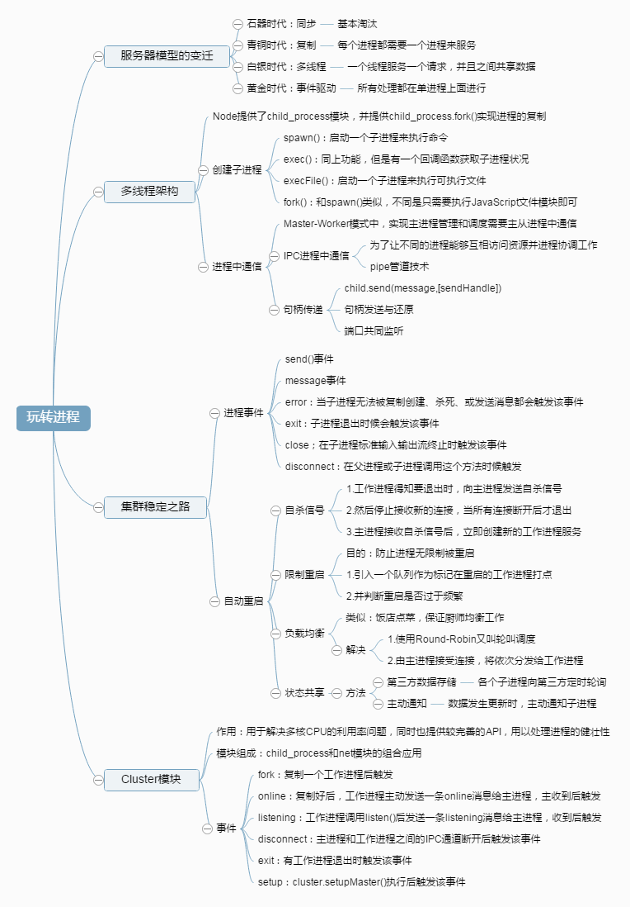
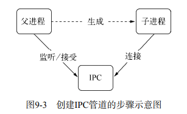
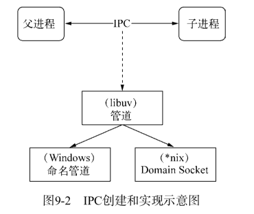
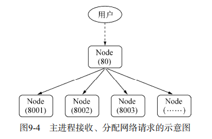
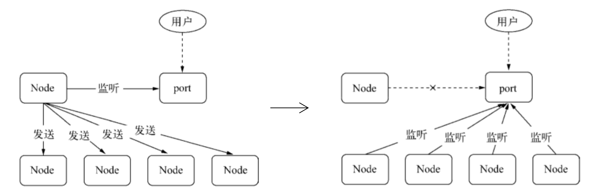
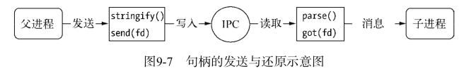
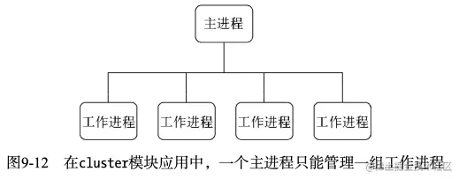
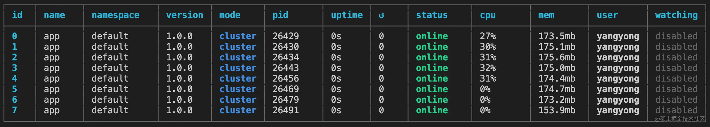

- [服务器变迁](#服务器变迁)
- [多进程架构 - child\_process 模块](#多进程架构---child_process-模块)
  - [child\_process - 创建子进程](#child_process---创建子进程)
  - [进程之间的通信](#进程之间的通信)
  - [句柄传递](#句柄传递)
    - [句柄发送](#句柄发送)
    - [句柄还原](#句柄还原)
    - [总结](#总结)
    - [端口共同监听](#端口共同监听)
- [集群稳定之路](#集群稳定之路)
- [Cluster模块](#cluster模块)
  - [Cluster原理](#cluster原理)
  - [Cluster事件](#cluster事件)
  - [pm2](#pm2)



Node 基于 `V8 引擎`构建，采用**单线程模型**，所有的 JavaScript 将会运行在单个进程的单个线程上。

优点：
- 没有多线程中常见的锁以及线程同步的问题，操作系统在调度时也能减少上下文切换，提高 CPU 使用率

缺点：
- 硬件资源的浪费：如今 CPU 基本均是多核的，真正的服务器往往还有多个 CPU，一个 Node 进程只能利用一个核，这带来硬件资源的浪费。
- Node 运行在单线程之上，一个单线程抛出异常而没有被捕获，将会导致**进程的崩溃**。

**格来说，Node 并非真正的单线程，Node 自身中还有 I/O 线程存在，这些 I/O 线程由底层 libuv 处理，这部分线程对于 JavaScript 而言是透明的，只有 C++ 扩展时才会关注到，JavaScript 代码运行在 V8 上，是单线程的。**

# 服务器变迁
1. 同步：最早服务器是同步模型，一次只能处理一个请求，其它请求都需要等待当前请求处理完毕。
2. 复制进程：每一个连接使用一个进程来服务，采用进程的复制实现，代价非常昂贵。
3. 多线程：一个线程处理一个请求，线程相对进程开销要小很多，线程直接可以共享数据，利用线程池减少创建和销毁线程的开销。
4. 事件驱动：Node 和 Nginx 采用事件驱动的方式实现，避免了不必要的内存开销和上下文切换。
5. 协程：基于协程实现的服务器，比如 Golang 目前也非常流行，协程是用户级别线程，它对于内核透明，完全由用户自己进行程序之间的调用。

# 多进程架构 - child_process 模块
>https://www.imyangyong.com/blog/2019/09/node/Node%E5%A4%9A%E8%BF%9B%E7%A8%8B%E6%9E%B6%E6%9E%84%E7%9A%84%E5%8E%9F%E7%90%86/#%E7%AB%AF%E5%8F%A3%E5%85%B1%E5%90%8C%E7%9B%91%E5%90%AC

Node 提供 `child_process 模块`来实现多核 CPU 的利用。child_process.fork() 函数来实现进程的复制。

`worker.js` 代码如下：
```js
var http = require('http')
http.createServer(function(req, res) {
  res.writeHead(200, { 'Content-Type': 'text/plain' })
  res.end('Hello World\n')
}).listen(Math.round((1 + Math.random()) * 1000), '127.0.0.1')
```
通过 `node worker.js` 启动它，会监听 1000 到 2000 之间的一个随机端口。

`master.js` 代码如下：
```js
var fork = require('child_process').fork
var cpus = require('os').cpus()
for (var i = 0; i < cpus.length; i++) {
  fork('./worker.js')
}
```
这段代码根据 CPU 数量复制出对应的 Node 进程数，Linux 系统下通过 ps aux | grep worker.js 查看进程的数量。

```
$ ps aux | grep worker.js
lizhen 1475 0.0 0.0 2432768 600 s003 S+ 3:27AM 0:00.00 grep worker.js
lizhen 1440 0.0 0.2 3022452 12680 s003 S 3:25AM 0:00.14 /usr/local/bin/node ./worker.js
lizhen 1439 0.0 0.2 3023476 12716 s003 S 3:25AM 0:00.14 /usr/local/bin/node ./worker.js
lizhen 1438 0.0 0.2 3022452 12704 s003 S 3:25AM 0:00.14 /usr/local/bin/node ./worker.js
lizhen 1437 0.0 0.2 3031668 12696 s003 S 3:25AM 0:00.15 /usr/local/bin/node ./worker.js
```

这种通过 Master 启多个 Worker 的模式就是**主从模式**，进程被分为主进程和工作进程。主进程不负责具体的业务，而是负责调度和管理工作进程，它是趋于稳定的。

通过 fork() 复制的进程都是独立的进程，这个进程中有着**独立的 V8 实例**，它需要至少 30ms 的启动时间和至少 10MB 的内存。因此 fork 依然是**昂贵的**。

以上，都离不开`child_process模块`，它是 Node.js 中一个非常重要的模块，主要功能有：

- 创建子进程
- 主进程与子进程通信
- 主进程读取子进程返回结果
  
> https://lz5z.com/Node.js%E4%B8%ADchild_procss%E6%A8%A1%E5%9D%97/

## child_process - 创建子进程 
child_process 模块给予 Node 可以随意创建子进程的能力
- spawn() 启动一个子进程执行命令。
- exec() 启动子进程执行命令，通过回调函数获取子进程状态。
- execFile() 启动一个子进程执行可执行文件。
- fork() 通过制定需要执行的 JavaScript 文件创建 Node 子进程。

```js
var cp = require('child_process')
cp.spawn('node', ['worker.js'])
cp.exec('node worker.js', function (err, stdout, stderr) {
 // some code
})
cp.execFile('worker.js', function (err, stdout, stderr) {
 // some code
})
cp.fork('./worker.js')
```

## 进程之间的通信

parent.js
```js
var cp = require('child_process')
var n = cp.fork(__dirname + '/sub.js')
n.on('message', function (m) {
  console.log('PARENT got message:', m)
})
n.send({hello: 'world'})
```

sub.js
```js
process.on('message', function (m) {
  console.log('CHILD got message:', m)
})
process.send({foo: 'bar'})
```
通过 `fork()` 或者其它 API，创建子进程之后，为了实父子程之间的通信，父进程与子进程之间会创建 `IPC` 通道。通过 IPC 通道，父子进程之间才能通过 `message() 和 send()` 传递信息。


进程间通信原理：
IPC 即进程间通信，Node 使用`管道(pipe)`技术实现 IPC ，具体实现细节由 `libuv` 提供。在 Windows 下由命名管道（named pipe）实现，Linux 下采用 Unix Domain Socket 实现。表现在应用层上的进程间通信只有简单的 `message 事件`和 `send() `方法。父进程在实际创建子进程之前，会创建 IPC 通道并监听它，然后才真正创建出子进程，并且通过环境变量 NODE_CHANNEL_FD 告诉子进程这个 IPC 通道的**文件描述符**。子进程通过这个文件描述符去连接这个已存在的 IPC 通道，从而完成父子进程之间的连接。属于双向通行。


建立好进程之间的 IPC 后，那么现在的问题是**如何将多个进程间监听同一个端口呢？**

>我们知道多进程监听一个端口，只有一个进程会成功。

有两种方式，代理模式和句柄传递

**代理模式**
通常的做法是让每个进程监听不同的端口，其中主进程监听主端口（如80），主进程对外接收所有的网络请求，再将这些请求分别代理到不同的端口的进程上。如下图所示：


通过代理不仅能解决端口重复监听的问题，还能适当的做负载均衡。

由于进程每接收一个连接都会用掉一个**文件描述符**，因此代理方案中客户端连接到代理进程，代理进程连接到工作进程的过程需要用掉两个文件描述符，操作系统的文件描述符是有限的，代理方式需要一倍数量的文件描述符影响了系统的扩展能力。

## 句柄传递

### 句柄发送

为了解决上述问题，Node 引入了进程间传递**句柄**的功能。`send()` 方法除了能通过 IPC 发送数据外，还能发送句柄。第二个可选参数就是句柄，如下所示：
`child.send(message, [sendHandle])`

句柄是一种可以用来标识资源的引用，比如句柄可以标识一个服务器端的 socket 对象，一个客户端的 socket 对象，一个 UDP scoket，一个管道等。

目前，进程对象 send() 方法可以发送的句柄类型包括以下几种：

- net.Socket: TCP 套接字
- net.Server: TCP 服务器，任意建立在 TCP 服务上的应用层服务器都可以享受到它带来的好处。
- net.Natice: C++ 层面的 UDP 套接字
- dgram.Socket: UDP 套接字
- dgram.Native: C++ 层面的 UDP 套接字

发送句柄意味着主进程接收到 socket 请求后，可以去掉代理这种方案,直接将 socket 发送给工作进程，而不是重新与工作进程之间建立新的 socket 连接来转发数据。


```js
// parent.js
var cp = require('child_process');
var child1 = cp.fork('child.js');

// 创建 tcp server object and send the handle
var tcp = require('net').createServer();
tcp.on('connection', function (socket) {
  socket.end('handle by parent\n');
});

tcp.listen(1337, function() {
  child1.send('server', tcp);
  // 关掉
  tcp.close();
});

// child.js
var http = require('http');
// 创建 http server
var server = http.createServer(function (req, res) {
  res.writeHead(200, {'Content-Type': 'text/plain'});
  res.end('handle by child, pid is ' + process.pid + '\n');
});

process.on('message', function (m, tcp) {
  if (m === 'server') {
    tcp.on('connection', function (socket) {
      // 触发 http server connection 事件
      server.emit('connection', socket);
    })
  }
});
```
通过 node 启动查看效果：
```js
$ curl "http://127.0.0.1:1337/"
handle by child, pid is 24852
$ curl "http://127.0.0.1:1337/"
handle by child, pid is 24851
```
所有的请求都是由子进程处理。整个过程中，服务的过程发生了一次改变，主进程发送完 TCP 句柄 并关闭监听之后，由左图变右图：



我们神奇地发现，多个子进程可以同时监听相同的端口，也没有异常发生。这是为什么？先按下不表


### 句柄还原

send() 方法在将消息发送到 IPC 管道前，将消息组装成两个对象，一个是 message ，另一个是 handle。

message 会包装成内部消息，其参数如下所示：
```js
{
  cmd: 'NODE_HANDLE',
  type: 'net.Server',
  msg: message,
}
```

发送到 IPC 管道中 message对象 和 句柄 都会通过 `JSON.stringify()` 进行序列化，所以最终发送到 IPC 通道中的信息都是字符串

连接了 IPC 通道的子进程可以读取到父进程发来的消息，将字符串通过 JSON.parse() 解析还原为对象后，才触发 message 事件将消息体传递给应用层使用。在这个过程中，消息对象还要被进行过滤处理，message.cmd 的值如果以 NODE_ 为前缀，它将响应一个内部事件 internalMessage 。如果 message.cmd 的值为 `NODE_HANDLE` ，它将取出 `message.type` 值 和得到的 **句柄中的文件描述符**一起还原出一个对应的对象。这个过程示意图如下：



> 由于底层细节不被应用层感知，所以在子进程中，开发者会有一个种服务器就是从父进程中直接传递过来的错觉。值得注意的是，Node 进程之间只有消息传递，不会真正地传递对象，这种错觉是抽象封装的结果。

### 总结
其过程是这样的：

**master**:
- 传递消息和句柄。【send(message, [handle])】
- 将消息包装成内部消息对象，再使用 JSON.stringify 序列化为字符串。【send()内部做的事情】
- JSON.stringify方法序列化句柄。
- 将序列化的消息和句柄发送到 IPC channel。
**worker**:
- JSON.parse 反序列化消息字符串 => 消息对象(message)。
- 如果 message.cmd 为 NODE_ 前缀，触发内部消息事件（internalMessage）监听器。
- 如果 message.cmd 为 NODE_HANDLE ，取出 message.type 。
- JSON.parse 反序列化句柄，取出句柄中的文件描述符。
- message.type 与 文件描述符 共同还原出一个对应的对象。
### 端口共同监听
这里的多进程为何可监听同一接口？而不出现异常。

Node 底层对每个端口监听都设置了 `SO_REUSEAEER` 选项，这个选项的涵义是不同进程可以就相同的网卡和端口进行监听，这个服务器端套接字可以被不同的进程复用，如下所示：

```js
setsockopt(tcp->io_watcher.fd, SOL_SOCKET, SO_REUSEADDR, &on, sizeof(on))
```
由于独立启动的进程互相直接并不知道文件描述符，所以监听相同端口时就会失败。但对于 `send()` 发送的句柄还原出来的服务而言，它们的文件描述符是相同的，所以找到的是**同一 socket 套接字**，那么监听相同端口不会引起异常。

多个应用监听相同端口时，文件描述符同一时间只能被某个进程所用。换言之就是网络请求向服务器端发送时，只有一个幸运的进程能够抢到连接，也就是说只有它能为这个请求进程服务。这些进程是**抢占式的**。

>自 Node v0.8版本以后，直接引入了 cluster 模块 ，方便工程师开发，而不用直接通过 child_process 底层来实现。
# 集群稳定之路

搭建好了集群，充利用了多核CPU资源，但还需考虑下面的细节：
- 性能问题
- 多个工作进程的存活状态管理
- 工作进程的平滑启动
- 配置或者静态数据的动态重新载入
- 其他

TODO： 进程事件、 自动重启、负载均衡、 状态共享

# Cluster模块
>https://juejin.cn/post/6943167766904078367
>https://juejin.cn/post/6943871907733176357

单个 Node.js 实例运行在单个线程中。 为了充分利用多核系统，有时需要启用一组 Node.js 进程去处理负载任务。
在 Node v0.8 版本之前，实现多进程架构必须通过 `child_process` 来实现，要创建单机 Node 集群，由于有这么多细节需要处理，对普通工程师而言是一件相对较难的工作。
**Node v0.8** 引入了 `cluster模块` ，用以解决多核 CPU 利用率的问题，同时也提供了较完善的 API ，用以处理进程的健壮性问题。

`cluster模块` 可以创建**共享服务器端口的子进程**。
```js
// 推荐写法，主、子进程分离
// server.js
const cluster = require('cluster');
const numCPUs = require('os').cpus().length;

cluster.setupMaster({ 
  exec: "worker.js"  // 此参数为工作进程的文件路径
});

for (var i = 0; i < numCPUs; i++) { 
  // 创建多个工作进程之后, 程序就会相应启动n次工作进程
  // 这里指定工作进程为 worker.js 文件，所以其执行n次
  cluster.fork(); 
}

// worker.js
// 工作进程可以共享任何 TCP 连接。
// 在本例子中，共享的是 HTTP 服务器。
http.createServer((req, res) => {
  res.writeHead(200);
  res.end('你好世界\n');
}).listen(8000);

console.log(`工作进程 ${process.pid} 已启动`);
```
执行 `node server.js` 将会得到与前文创建子进程集群效果相同。。就官方的文档而言，它更喜欢如下的形式作为示例：
```js
// 官方示例，个人不推荐
const cluster = require('cluster');
const http = require('http');
const numCPUs = require('os').cpus().length;

// 执行时判断当前运行的进程为主进程还是工作进程，主进程就创建多个工作进程，工作进程就创建http server应用
if (cluster.isMaster) {
  console.log(`主进程 ${process.pid} 正在运行`);

  // 衍生(fork)工作进程。
  for (let i = 0; i < numCPUs; i++) {
    // 创建多个工作进程之后, 程序就会相应启动n次工作进程
    // 这里工作进程与主进程为同一文件，所以其执行n + 1次此文件
    cluster.fork();
  }

  cluster.on('exit', (worker, code, signal) => {
    console.log(`工作进程 ${worker.process.pid} 已退出`);
  });
} else {
  // 工作进程可以共享任何 TCP 连接。
  // 在本例子中，共享的是 HTTP 服务器。
  http.createServer((req, res) => {
    res.writeHead(200);
    res.end('你好世界\n');
  }).listen(8000);

  console.log(`工作进程 ${process.pid} 已启动`);
}
```

运行代码，则工作进程会共享 8000 端口：
```js
$ node server.js
主进程 3596 正在运行
工作进程 4324 已启动
工作进程 4520 已启动
工作进程 6056 已启动
工作进程 5644 已启动
```

在进程中判断是主进程还是工作进程，主要取决于环境变量中是否有 `NODE_UNIQUE_ID `，如下所示：
```js
cluster.isWorker = ('NODE_UNIQUE_ID' in process.env); 
cluster.isMaster = (cluster.isWorker === false);
```


>通过 `cluster.setupMaster()` 创建子进程而不是使用 cluster.fork() ，程序结构不再凌乱，逻辑分明，代码的可读性和可维护性较好。

## Cluster原理
事实上，`cluster` 模块就是 `child_process` 和 `net` 模块的组合应用。

cluster 启动时，会在内部启动 TCP 服务器，在 cluster.fork() 子进程时，将这个 **TCP 服务器端的 socket 的文件描述符**发送给 工作进程

- 如果进程是通过 `cluster.fork()` 复制出来的，那么它的环境变量里就存在 `NODE_UNIQUE_ID` ，如果工作进程中存在 listen() 侦听网络端口的调用，它将拿到该文件描述符，通过 `SO_REUSEADDR` 端口重用，从而实现**多个子进程共享端口**。
- 对于普通方法启动的进程，则不存在文件描述符传递共享等事情。

在 `cluster` 内部隐式创建 TCP 服务器的方式对使用者来说十分透明，但也正是这种方式使得它无法如直接使用 `child_process` 那样灵活。在 cluster 模块应用中，一个主进程只能管理一组工作进程，如下所示：



## Cluster事件
对于健壮性处理，cluster模块也暴露了相当多的事件。

- fork: 复制一个工作进程后，触发该事件。
- online: 复制好一个工作进程后，工作进程主动发送一条online消息给主进程，主进程收到消息后，触发该事件。
- listening: 工作进程中调用listen()（共享了服务器端Socket）后，发送一条listening消息给主进程，主进程收到消息后，触发该事件。
- disconnect: 主进程和工作进程之间IPC通道断开后，触发该事件。
- exit: 有工作进程退出时，触发该事件。
- setup: cluster.setupMaster()执行后，触发该事件。

这些事件大多跟 `child_process` 模块的事件相关，在进程间消息传递的基础上完成的封装。这些事件对于增强应用的健壮性已经足够了。


## pm2
>https://juejin.cn/post/6943871907733176357#heading-3

在实际应用中，我们使用 `cluster` 模块**手动创建**管理我们的工作进程。我们首先确定要生成的 worker 数量（使用 CPU 核数），然后手动生成 worker，最后，监听任何挂掉的 worker，这样我们就可以生成新的 worker。在我们非常简单的应用程序中，我们不得不编写大量代码来处理集群。

有一种工具可以帮助更好地管理进程 —— `PM2 进程管理器`。PM2 是一个用于 Node.js 应用的生产进程管理器，它带有内置的负载均衡器。当正确配置后，PM2 将自动在集群模式下运行你的应用程序，为你生成 worker，并在 worker 死亡时负责生成新的 worker。PM2 可以很容易地停止、删除和启动进程，它还有一些监控工具，可以帮助你监控和调整应用的性能。

有以下应用程序
```js
const express = require('express');
const app = express();
const port = 3000;

app.get('/', (req, res) => {
  res.send('Hello World!');
})

app.get('/api/:n', function (req, res) {
  let n = parseInt(req.params.n);
  let count = 0;

  if (n > 5000000000) n = 5000000000;

  for(let i = 0; i <= n; i++){
    count += i;
  }

  res.send(`Final count is ${count}`);
})

app.listen(port, () => {
  console.log(`App listening on port ${port}`);
})
```
我们用pm2来启动：`pm2 start app.js -i 0`

`-i <number of workers>` 告知 PM2 以集群模式（cluster_mode）启动应用程序。如果 <number of workers> 设为 `0`，PM2 将依据你的 **CPU内核数** 尽可能多的生成 worker。

现在，你的应用程序在集群模式（cluster_mode）下运行，这不需要修改代码。

在终端中，你会得到一个工作进程的详细信息的表格：


你可以通过以下命令停止应用程序：`pm2 stop app.js`

每次运行服务需要执行 `pm2 start app.js -i 0`，这看起来很麻烦，你可以把它们存储到配置文件中 -- [Ecosystem File](https://pm2.keymetrics.io/docs/usage/application-declaration/#ecosystem-file)。这个文件允许你为不同的应用程序生成各自的配置，这对于微服务应用程序来说很有用。

```json
module.exports = {
  apps : [{
    name: "app",
    script: "app.js",
    instances : 0,
    exec_mode : "cluster"
  }]
}
```
现在，你可以这样启动应用：`pm2 start ecosystem.config.js`
