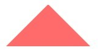

- [如何在html文件中引入css资源](#如何在html文件中引入css资源)
- [文字换行](#文字换行)
- [单行文本溢出显示省略号](#单行文本溢出显示省略号)
- [多行文本溢出显示省略号](#多行文本溢出显示省略号)
- [flex弹性布局](#flex弹性布局)
  - [flex容器属性](#flex容器属性)
  - [项目属性](#项目属性)
- [响应式布局](#响应式布局)
- [怎么设置一个圆形？如果设置的值超过50%会发生什么？](#怎么设置一个圆形如果设置的值超过50会发生什么)
- [如何画三角形](#如何画三角形)
- [如何原地旋转一个元素](#如何原地旋转一个元素)

### 如何在html文件中引入css资源
有两种方式引入：
1. 通过`<link>`标签
2. 通过`<style>`标签

```html
<!DOCTYPE html>
<html>
<head>
  <title>引入CSS示例</title>
  
  <!-- 引入外部CSS文件 -->
  <link rel="stylesheet" href="styles.css">

  <!-- 嵌入CSS代码 -->
  <style>
    body {
      background-color: lightblue;
    }
    h1 {
      color: red;
    }
  </style>
</head>
<body>
  <h1>Hello, World!</h1>
  <p>This is an example of using CSS in HTML.</p>
</body>
</html>
```

### 文字换行
* `overflow-wrap(word-wrap)`通用换行控制是否保留单词
* `word-break` 针对多字节文本文字 中文句子也是单词
* `white-space` 空白处是否换行
  
### 单行文本溢出显示省略号

```css
overflow: hidden;
text-overflow: ellipsis;
white-space: no-wrap; // 控制换行的重要属性
```

### 多行文本溢出显示省略号
```css
overflow: hidden;
text-overflow: ellipsis;
display: -webkit-box;
-webkit-line-clamp: 3;
-webkit-box-orient: vertical;
```

### flex弹性布局
#### flex容器属性
- `flex-direction`：属性决定主轴的方向（即项目的排列方向），默认row水平方向。
  1. row（默认值）：主轴为水平方向，起点在左端。
  2. row-reverse：主轴为水平方向，起点在右端。
  3. column：主轴为垂直方向，起点在上沿。
  4. column-reverse：主轴为垂直方向，起点在下沿。
- `flex-wrap`：是否换行
  - nowrap（默认）：不换行
  - wrap：换行，第一行在上方。
  - wrap-reverse：换行，第一行在下方。
- `justify-content`：属性定义了项目在主轴上的对齐方式
  - flex-start（默认值）：左对齐
  - flex-end：右对齐
  - center： 居中
  - space-between：两端对齐，项目之间的间隔都相等。
  - space-around：每个项目两侧的间隔相等。所以，项目之间的间隔比项目与边框的间隔大一倍。
- `align-items`：属性定义项目在交叉轴上如何对齐
  - flex-start：交叉轴的起点对齐。
  - flex-end：交叉轴的终点对齐。
  - center：交叉轴的中点对齐。
  - baseline: 项目的第一行文字的基线对齐。
  - stretch（默认值）：如果项目未设置高度或设为auto，将占满整个容器的高度。
- `align-content`：属性定义了多根轴线的对齐方式。如果项目只有一根轴线，该属性不起作用。
  1. flex-start：与交叉轴的起点对齐。
  2. flex-end：与交叉轴的终点对齐。
  3. center：与交叉轴的中点对齐。
  4. space-between：与交叉轴两端对齐，轴线之间的间隔平均分布。
  5. space-around：每根轴线两侧的间隔都相等。所以，轴线之间的间隔比轴线与边框的间隔大一倍。
  6. stretch（默认值）：轴线占满整个交叉轴。
#### 项目属性
- `order`：属性定义项目的排列顺序。数值越小，排列越靠前，默认为0。
- `flex-grow`：属性定义项目的放大比例，默认为0，即如果存在剩余空间，也不放大。
- `flex-shrink`：属性定义了项目的缩小比例，默认为1，即如果空间不足，该项目将缩小。
- `flex-basis`：属性定义了在分配多余空间之前，项目占据的主轴空间（main size）。它的默认值为auto，即项目的本来大小
- `flex`：属性是flex-grow, flex-shrink 和 flex-basis的简写，默认值为0 1 auto
- `align-self`：属性允许单个项目有与其他项目不一样的对齐方式，可覆盖align-items属性。默认值为auto，表示继承父元素的align-items属性，如果没有父元素，则等同于stretch。

### 响应式布局
1. **媒体查询和确定分割点**
   - 移动端优先首先使用的是`min-width`，PC端优先使用的`max-width`
      ```css
      /* 移动端优先 */
      /* iphone6 7 8 */
      body {
          background-color: yellow;
      }
      /* iphone 5 */
      @media screen and (max-width: 320px) {  /*范围是 0-320px*/
          body { background-color: red; }
      }
      /* iphone6 7 8 plus */
      @media screen and (min-width: 414px) { /*范围是 414-768px*/
          body { background-color: blue; }
      }
      /* ipad */
      @media screen and (min-width: 768px) {
          body { background-color: green; }
      }
      /* pc */
      @media screen and (min-width: 1100px) {
          body { background-color: black; }
      }
      ```
      ```css
      /* pc优先 */
      /* pc width > 1024px */
      body { background-color: yellow; }
      /* ipad pro */
      @media screen and (max-width: 1024px) {
          body { background-color: #FF00FF; }
      }
      /* ipad */
      @media screen and (max-width: 768px) {
          body { background-color: green; }
      }
      /* iphoneX */
      @media screen and (max-width: 375px) and (-webkit-device-pixel-ratio: 3) {
          body { background-color: #0FF000; }
      }
      /* iphone6 7 8 */
      @media screen and (max-width: 375px) and (-webkit-device-pixel-ratio: 2) {
          body { background-color: #0FF000; }
      }
      /* iphone5 */
      @media screen and (max-width: 320px) {
          body { background-color: #0FF000; }
      }
      ```
2. 百分比布局，rem布局，视口单位
   - **百分比布局**：Bootstrap里面的栅格系统就是利用百分比来定义元素的宽高。
     - 缺点：1. 计算困难，2. 各个属性中如果使用百分比，相对父元素的属性并不是唯一的。比如，子元素的top和bottom（left和right）如果设置百分比，则相对于直接非static定位(默认定位)的父元素的高度(宽度)
   - **rem布局**：是CSS3新增的单位，rem单位都是相对于**根元素html的font-size**来决定大小的,根元素的font-size相当于提供了一个基准。 因此，如果通过rem来实现响应式的布局，只需要根据视图容器的大小，动态的改变font-size即可
     > em：em会继承**父级元素**的字体大小
     - 实现：利用媒体查询，设置在不同设备下的字体大小。
       ```css
       /* pc width > 1100px */
       html{ font-size: 100%;} /* 关键 */
       body {
           background-color: yellow;
           font-size: 1.5rem;
       }
       /* ipad pro */
       @media screen and (max-width: 1024px) {
           body {
             background-color: #FF00FF;
             font-size: 1.4rem;
           }
       }
       /* ipad */
       @media screen and (max-width: 768px) {
           body {
             background-color: green;
             font-size: 1.3rem;
           }
       }
       /* iphone6 7 8 plus */
       @media screen and (max-width: 414px) {
           body {
             background-color: blue;
             font-size: 1.25rem;
           }
       }
       ```
   - **视口单位`vw/vh`**：`vw`表示相对于视图窗口的宽度，`vh`表示相对于视图窗口高度。1vw 等于视口宽度的1%，即视窗宽度是100vw。
    - 缺点：它是利用视口单位实现的布局，依赖视口大小而自动缩放，失去了响应式的意义
   - **rem + 视口单位**：

### 怎么设置一个圆形？如果设置的值超过50%会发生什么？
```css
#circle {
    background: lightblue;
    border-radius: 50%;
    width: 100px;
    height: 100px;
}
```

```css
border-radius: 12px

/* 等同于，分左上，左下，右上，右下四个角，且还有水平半径和垂直半径 */
border-top-left-radius: 12px 12px
border-top-right-radius: 12px 12px
border-bottom-left-radius: 12px 12px
border-bottom-left-radius: 12px 12px
```

### 如何画三角形
```html
<div class="delta"></div>
```

```css
.delta {
    width: 0px;
    height: 0px;
    border: 50px solid transparent;
    border-bottom-color: #ff6b6b;
    border-top-width: 0px;
}
```



### 如何原地旋转一个元素
要在CSS中实现一个元素的原地旋转，你可以使用`transform`属性和`@keyframes`关键帧动画。

首先，使用CSS的`@keyframes`关键帧动画定义一个旋转动画。你可以指定不同的关键帧来控制元素的旋转方式和时间。以下是一个例子：

```css
@keyframes rotate {
  0% {
    transform: rotate(0deg);
  }
  100% {
    transform: rotate(360deg);
  }
}
```

在这个例子中，`@keyframes`定义了一个名为`rotate`的关键帧动画。从0%到100%的过程中，元素将以顺时针方向从0度旋转到360度。

接下来，你可以将这个动画应用到你想要旋转的元素上，通过使用`animation`属性指定关键帧动画的名称、持续时间、重复次数等。例如：

```css
.element {
  animation: rotate 2s infinite;
}
```

在这个例子中，我们将`rotate`动画应用到一个名为`.element`的元素上，动画持续2秒，无限次重复。

最后，你可以通过在HTML文件中使用相应的类或ID来将样式应用到你想要旋转的元素上。例如：

```html
<div class="element">这是一个元素</div>
```

请注意，这个方法会使元素原地旋转，而不会改变元素在文档中的位置。

希望这些信息能对你有所帮助！如果你有其他问题，请随时提问。