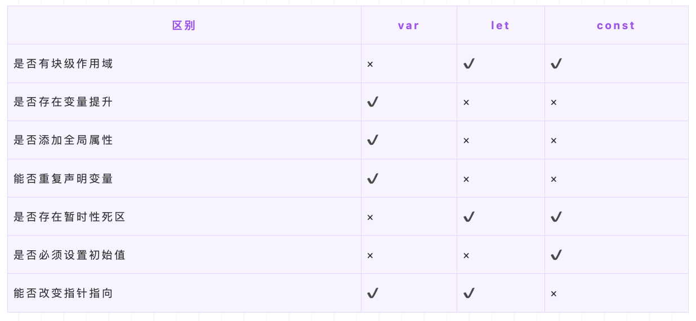

- [解决原有语法的缺陷和不足](#解决原有语法的缺陷和不足)
  - [let const var](#let-const-var)
- [对原有语法的增强](#对原有语法的增强)
  - [结构赋值](#结构赋值)
  - [模版字符串](#模版字符串)
  - [字符串新增方法](#字符串新增方法)
  - [函数参数增强：参数默认值](#函数参数增强参数默认值)
  - [...操作符：收起剩余数据、展开数组](#操作符收起剩余数据展开数组)
  - [?.可选链](#可选链)
  - [箭头函数](#箭头函数)
    - [箭头函数和普通函数的区别](#箭头函数和普通函数的区别)
- [新增对象、全新的方法、全新的功能](#新增对象全新的方法全新的功能)
  - [Object.assign()](#objectassign)
  - [Object.is()](#objectis)
  - [proxy](#proxy)
  - [Reflect: 封装操作对象的统一API](#reflect-封装操作对象的统一api)
  - [用于处理异步，解决回调函数的地狱式嵌套问题，promise, async/await](#用于处理异步解决回调函数的地狱式嵌套问题promise-asyncawait)
- [全新的数据结构和数据类型](#全新的数据结构和数据类型)
  - [class 类](#class-类)
  - [Set](#set)
  - [Map](#map)
    - [Map和Object有什么区别](#map和object有什么区别)
  - [weakMap](#weakmap)
  - [Symbol新的数据结构，唯一值](#symbol新的数据结构唯一值)
  - [for ... of 遍历](#for--of-遍历)

ES6改动很大，可以简单分为四类

- 解决原有语法的缺陷和不足
- 对原有语法进行增强
- 新增对象、全新的方法，全新的功能
- 新增对象、全新的方法，全新的功能

# 解决原有语法的缺陷和不足

## let const var

- **块级作用域**： 块作用域由 `{ }` 包裹，`let和const`具有块级作用域，var不存在块级作用域。块级作用域解决了ES5中的两个问题：
  - 内层变量可能覆盖外层变量
  - 用来计数的循环变量泄露为全局变量
- **变量提升**： `var`存在变量提升，let和const不存在变量提升，即在变量只能在声明之后使用，否在会报错。
- 给全局添加属性： 浏览器的全局对象是window，Node的全局对象是global。var声明的变量为全局变量，并且会将该变量添加为全局对象的属性，但是let和const不会。
- **重复声明**： var声明变量时，可以重复声明变量，后声明的同名变量会覆盖之前声明的遍历。const和let不允许重复声明变量。
- **暂时性死区**： 在使用let、const命令声明变量之前，该变量都是不可用的。这在语法上，称为暂时性死区。使用var声明的变量不存在暂时性死区。
- **初始值设置**： 在变量声明时，var 和 let 可以不用设置初始值。而const声明变量必须设置初始值。
- **指针指向**： let和const都是ES6新增的用于创建变量的语法。 let创建的变量是可以更改指针指向（可以重新赋值）。但const声明的变量是不允许改变指针的指向。



# 对原有语法的增强

## [结构赋值](https://es6.ruanyifeng.com/#docs/destructuring)

## [模版字符串](https://es6.ruanyifeng.com/#docs/string#%E6%A8%A1%E6%9D%BF%E5%AD%97%E7%AC%A6%E4%B8%B2)

```js
let str = `生成一个随机数：${ Math.random() }` 
```

## [字符串新增方法](https://es6.ruanyifeng.com/#docs/string-methods)

## 函数参数增强：参数默认值

```js
const fn = function (x=1, y) {
      console.log(x)
      console.log(y)
    }
    fn()
```

## ...操作符：收起剩余数据、展开数组

- 收取剩余参数：取代arguments，arguments是一个类数组，...操作符是一个数组类型，可以使用数组方法
  1. 仅使用一次
  2. 放在参数最后

    ```js
     const fn = function (x, ...y) {
          console.log(y.slice(0))
        }
        fn(1,2,3,4,5)
    ```

- 展开数组

    ```js
    const spredArr = [1,2,3,4]
    console.log(...spredArr)
    console.log.apply(this, spredArr) //es5代替方案
    ```

## ?.可选链

## 箭头函数

- 箭头函数没有自己的this对象，它的this指向**上级作用域**永远不变

  ```js
      const name = 'tony'
      const person = {
        name: 'tom',
        say: () => console.log(this.name),
        sayHello: function () {
          console.log(this.name)
        },
        sayHi: function () {
          setTimeout(function () {
            console.log(this.name)
          }, 500)
        },
        asyncSay: function () {
          setTimeout(()=>console.log(this.name), 500)
        }
      }
      person.say()  //tony this指向window对象
      person.sayHello() //tom
      person.sayHi() //tony
      person.asyncSay()  //tom
  ```
- call()、apply()、bind()等方法不能改变箭头函数中this的指向
- 箭头函数不能作为构造函数使用
- 箭头函数没有自己的arguments
- 箭头函数没有prototype

### 箭头函数和普通函数的区别
1. **语法**：箭头函数使用箭头(`=>`)来定义函数，而普通函数使用`function`关键字。
2. `this` 的指向：箭头函数没有自己的`this`，它会继承外层作用域的`this`。而普通函数的`this`指向调用它的对象或者undefined（在严格模式下）。
3. **构造函数**：箭头函数不能被用作构造函数，不能使用`new`关键字实例化。普通函数可以作为构造函数来创建新的对象。
   - `new`操作简单来说，分为四步： 1.JS内部首先会先生成一个对象； 2. 再把函数中的this指向该对象； 3. 然后执行构造函数中的语句； 4. 最终返回该对象实例。
4. `arguments` 对象：箭头函数没有自己的`arguments`对象，它会继承外层作用域的`arguments`。普通函数有自己的`arguments`对象。
   ```js
   function outer(val1, val2) {
       let argOut = arguments;
       console.log(argOut);    // 111,222
       let fun = () => {
           let argIn = arguments;
           console.log(argIn);     // 111,222
           console.log(argOut === argIn);  // true
       };
       fun();
   }
   outer(111, 222);
   ```
5. 箭头函数没有原型`prototype`
6. **返回值**：箭头函数如果只有一行代码并且没有使用大括号包裹，则会自动将该行代码的结果作为返回值返回。普通函数需要使用`return`关键字来明确指定返回值。

总的来说，箭头函数适用于简短的函数和不需要独立的`this`和`arguments`的场景，而普通函数适用于需要更多灵活性和特定行为的场景。
# 新增对象、全新的方法、全新的功能

## Object.assign()

用于合并多个对象，第一个参数就是最终的返回值，如果对象的属性名相同，后面的覆盖前面的

```js
    let objA = {
      a: 'aa',
      b: 'bb'
    }
    let objB = {
      b: 'dd',
      c: 'ee'
    }
    let result = Object.assign({}, objA, objB) // Object.assign({}, a,b)这种使用方式是深拷贝
    result.a = 'cc'
    console.log(objA, result) //{a: "aa", b: "bb"} {a: "cc", b: "dd", c: "ee"}
```

## Object.is()

判断两个值是否相等(严等于)，返回布尔值

用途：es5中，对于0的判断不区分正负值，-0 == +0返回true，NaN == NaN返回 返回false；
Object.is()规避了这些问题

```js
+0 === -0 //true
NaN === NaN // false

Object.is(+0, -0) // false
Object.is(NaN, NaN) // true

Object.is({}, {}) // false
```

## proxy

## Reflect: 封装操作对象的统一API

Reflect的目的是使用同一套方式去操作对象

```js
    const obj = {
      name: '111',
      age: '22'
    }
    // 判断对象某个属性是否存在
    console.log(Reflect.has(obj,'name'))
    // 删除某个属性
    console.log(Reflect.deleteProperty(obj, 'name'))
    // 获取对象key
    console.log(Reflect.ownKeys(obj))
```

## 用于处理异步，解决回调函数的地狱式嵌套问题，promise, async/await

详见[异步编程(promise、generator、async,await)](../js/异步编程(promise、generator、async,await))

# 全新的数据结构和数据类型

## class 类

es5写法

```js
function People (name) {
  // 设置实例属性
  this.name = name;
}
// 设置实例的共享方法
People.prototype.sayHi = function () {
  console.log(this.name)
}
let p = new People('tom')
p.sayHi()
```

es6 class写法

```js
class Peopel {
  constructor (name) {
    this.name = name
  }
  say () {
    console.log(this.name)
  }
}
const p = new Peopel('tony')
p.say()
```

类的继承

```js
class Peopel {
  constructor (name) {
    this.name = name
  }
  say () {
    console.log(this.name)   //tom，在子类的sayAge中调用
  }
}
class Worker extends Peopel {
  constructor (name,age) {
    super(name)
    this.age = age
  }
  sayAge () {
    super.say()
    console.log(this)  // Worker {name: "tom", age: 18}
    console.log(this.age) // 18
  }
}
const p = new Worker('tom', 18)
p.sayAge()
```

super可以作为函数调用，也可以作为对象调用
作为函数调用时，只能在子类的constructor中调用

## Set

类似于数组，但是成员的值都是唯一的，没有重复的值。

## Map

es5中的对象key只能是字符串，map的key可以是任意数据类型, 可以通过get,set,has等操作map

Map数据结构有以下操作方法：

- `size`： map.size 返回Map结构的成员总数。
- `set(key,value)`：设置键名key对应的键值value，然后返回整个Map结构，如果key已经有值，则键值会被更新，否则就新生成该键。（因为返回的是当前Map对象，所以可以链式调用）
- `get(key)`：该方法读取key对应的键值，如果找不到key，返回undefined。
- `has(key)`：该方法返回一个布尔值，表示某个键是否在当前Map对象中。
- `delete(key)`：该方法删除某个键，返回true，如果删除失败，返回false。
- `clear()`：map.clear()清除所有成员，没有返回值。

Map结构原生提供是三个遍历器生成函数和一个遍历方法

- `keys()`：返回键名的遍历器。
- `values()`：返回键值的遍历器。
- `entries()`：返回所有成员的遍历器。
  ```js
  const map = new Map([
       ["foo",1],
       ["bar",2],
  ])
  for(let items of map.entries()){
      console.log(items);  // ["foo",1]  ["bar",2]
  }
  ```
- `forEach()`：遍历Map的所有成员。
  
### Map和Object有什么区别
- **键的类型**：`Object` 的键只能是**字符串或符号类型**，而 `Map` 的键可以是任意类型的值，包括函数、对象和基本数据类型。
- **键值对的顺序**：`Object` 的键值对是按插入顺序排列的。在遍历时，键值对可能不是按照插入的顺序返回。`Map` 对键值对的顺序有保证，且可以使用 Map 的内置方法进行有序遍历。
- **长度计算**：`Object` 的大小计算需要使用 `Object.keys(obj).length`，而 `Map` 可以直接使用 `map.size`。
- **Iterating**：Map 自身支持迭代，Object 不支持。


## weakMap

WeakMap 对象也是一组键值对的集合，其中的**键是弱引用**的。其**键必须是对象**，原始数据类型不能作为key值，而值可以是任意的。

WeakMap的键名所引用的对象都是**弱引用**，即垃圾回收机制不将该引用考虑在内。因此，新建的weakMap对象不用了，垃圾回收机制就会释放该对象所占用的内存。也就是说，**一旦不再需要，WeakMap 里面的键名对象和所对应的键值对会自动消失，不用手动删除引用**。

## Symbol新的数据结构，唯一值

用途：防止全局对象中，某个属性名重名，产生冲突；定义私有属性，外部访问不到，且遍历不到

## for ... of 遍历
`for…of` 是ES6新增的遍历方式，允许遍历一个含有iterator接口的数据结构（数组、对象等）并且返回各项的**值**，和ES3中的`for…in`的区别如下:
- for…of 遍历获取的是对象的键值，for…in 获取的是对象的键名；
- for… in 会遍历对象的整个原型链，性能非常差不推荐使用，而 for … of 只遍历当前对象不会遍历原型链；
- 对于数组的遍历，for…in 会返回数组中所有可枚举的属性(包括原型链上可枚举的属性)，for…of 只返回数组的下标对应的属性值；

总结： for...in 循环主要是为了遍历`对象`而生，不适用于遍历数组；for...of 循环可以用来遍历数组、类数组对象，字符串、Set、Map 以及 Generator 对象。

```js
const arr = [1, 2, 3, 4];
for (const num of arr) {
  console.log(num);
}

const obj = { foo: 'bar', baz: 42 };
for (const prop of Object.keys(obj)) {
  console.log(prop);
}
for (var propName in obj) {
  console.log(propName + ": " + obj[propName]);
}
```