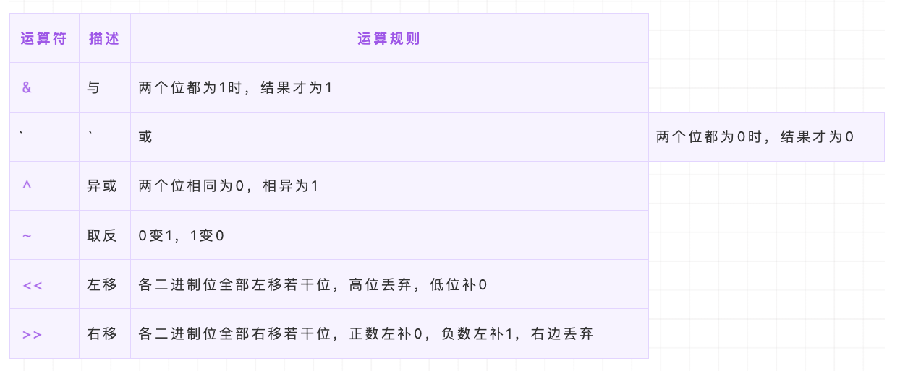

- [JavaScript脚本延迟加载的方式有哪些？](#javascript脚本延迟加载的方式有哪些)
- [常见的位运算符有哪些？其计算规则是什么？](#常见的位运算符有哪些其计算规则是什么)
- [js函数的Arguments对象](#js函数的arguments对象)
- [常见的Dom操作](#常见的dom操作)
- [use strict是什么意思 ? 使用它区别是什么？](#use-strict是什么意思--使用它区别是什么)
- [forEach和map方法有什么区别](#foreach和map方法有什么区别)

### JavaScript脚本延迟加载的方式有哪些？

延迟加载就是等页面加载完成之后再加载 JavaScript 文件。 js 延迟加载有助于提高页面加载速度。

- `defer 属性`： 给 js 脚本添加 defer 属性，这个属性会让脚本的加载与文档的解析同步解析，然后在文档解析完成后再执行这个脚本文件，这样的话就能使页面的渲染不被阻塞。多个设置了 defer 属性的脚本按规范来说最后是顺序执行的，但是在一些浏览器中可能不是这样。
- `async 属性`： 给 js 脚本添加 async 属性，这个属性会使脚本异步加载，不会阻塞页面的解析过程，但是当脚本加载完成后立即执行 js 脚本，这个时候如果文档没有解析完成的话同样会阻塞。多个 async 属性的脚本的执行顺序是不可预测的，一般不会按照代码的顺序依次执行。
- `动态创建 DOM 方式`： 动态创建 DOM 标签的方式，可以对文档的加载事件进行监听，当文档加载完成后再动态的创建 script 标签来引入 js 脚本。
- `使用 setTimeout 延迟方法`： 设置一个定时器来延迟加载js脚本文件
- `让 JS 最后加载`： 将 js 脚本**放在文档的底部**，来使 js 脚本尽可能的在最后来加载执行。

### 常见的位运算符有哪些？其计算规则是什么？



### js函数的Arguments对象

Arguments 对象只定义在函数体中，包括了函数的参数和其他属性。在函数体中，arguments 指代该函数的 Arguments 对象。
```js
function foo(name, age, sex) {
    console.log(arguments);
}

foo('name', 'age', 'sex')
```
打印结果如下：

- length属性，表示实参的长度
- callee 属性，通过它可以调用函数自身。

使用ES6的 ... 运算符，我们可以轻松转成数组。
```js
function func(...arguments) {
    console.log(arguments); // [1, 2, 3]
}

func(1, 2, 3);
```

### 常见的Dom操作

例子：
```js
<html>
  <head>
    <title>DEMO</title>
  </head>
  <body>
    <div id="container"> 
      <h1 id="title">我是标题</h1>
    </div>   
  </body>
</html>
```

1. DOM 节点的获取
   ```js
    getElementById // 按照 id 查询
    getElementsByTagName // 按照标签名查询
    getElementsByClassName // 按照类名查询
    querySelectorAll // 按照 css 选择器查询
   ```
2. DOM 节点的创建，比如要求添加一个有内容的 span 节点到 id 为 title 的节点后面
   ```js
    // 首先获取父节点
    var container = document.getElementById('container')
    // 创建新节点
    var targetSpan = document.createElement('span')
    // 设置 span 节点的内容
    targetSpan.innerHTML = 'hello world'
    // 把新创建的元素塞进父节点里去
    container.appendChild(targetSpan)
   ```
3. DOM 节点的删除，比如需要删除 id 为 title 的元素
   ```js
   // 获取目标元素的父元素
   var container = document.getElementById('container')
   // 获取目标元素
   var targetNode = document.getElementById('title')
   // 删除目标元素
   container.removeChild(targetNode)

   // 或者通过子节点数组来完成删除：
   // 获取目标元素的父元素
   var container = document.getElementById('container')
   // 获取目标元素
   var targetNode = container.childNodes[1]
   // 删除目标元素
   container.removeChild(targetNode)
   ```
4. 修改 DOM 元素， 比如需要调换 title 和 content 的位置
   ```js
   // 获取父元素
   var container = document.getElementById('container')   
    
   // 获取两个需要被交换的元素
   var title = document.getElementById('title')
   var content = document.getElementById('content')
   // 交换两个元素，把 content 置于 title 前面
   container.insertBefore(content, title)
   ```
   

### use strict是什么意思 ? 使用它区别是什么？

`use strict` 是一种 ECMAscript5 添加的（严格模式）运行模式，这种模式使得 Javascript 在更严格的条件下运行。设立严格模式的目的如下：

- 消除 Javascript 语法的不合理、不严谨之处，减少怪异行为;
- 消除代码运行的不安全之处，保证代码运行的安全；
- 提高编译器效率，增加运行速度；
- 为未来新版本的 Javascript 做好铺垫。

区别：

- 禁止使用 with 语句。
- 禁止 this 关键字指向全局对象。
- 对象不能有重名的属性。


### forEach和map方法有什么区别

forEach 和 map 方法都是 JavaScript 中操作`数组`的常用方法。它们的主要区别在于它们返回值的不同。

- `forEach` 方法在数组中遍历每个元素并执行指定的函数。它**不会返回任何值**。
  ```js
  var arr = [1, 2, 3, 4, 5];
  arr.forEach(function(item) {
    console.log(item);
  });
  ```
- map 方法则是创建一个**新数组**，其中包含对原始数组中每个元素执行指定函数所返回的结果。它不会修改原始数组。

forEach 更适合在你只是需要对每个元素进行操作时使用，而 map 则更适合在你需要创建一个新的数组并将其填充为操作结果时使用。