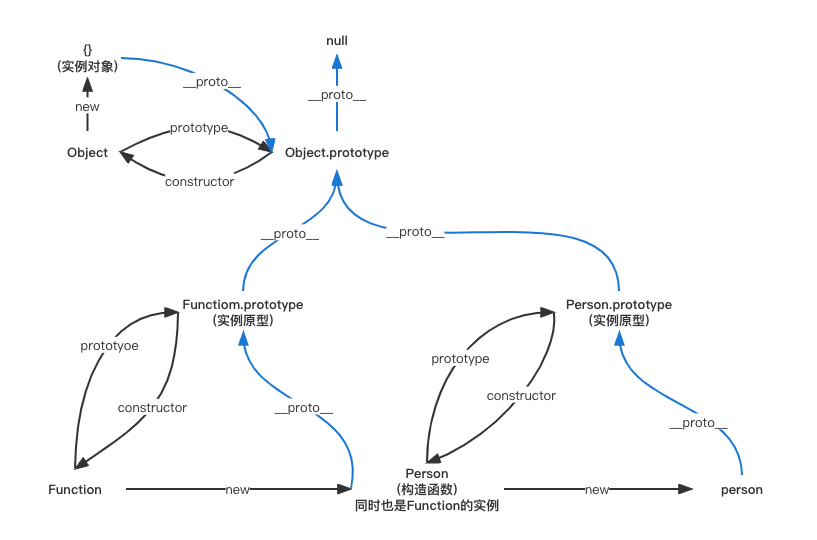

- [原型和原型链](#原型和原型链)
- [词法（静态）作用域与动态作用域](#词法静态作用域与动态作用域)
  - [什么是作用域](#什么是作用域)
  - [静态、动态作用域](#静态动态作用域)
- [执行上下文栈](#执行上下文栈)
- [变量对象](#变量对象)
- [作用域链](#作用域链)
- [从ECMAScript规范解读this](#从ecmascript规范解读this)
- [this对象](#this对象)
  - [this绑定规则](#this绑定规则)
- [执行上下文](#执行上下文)

## 原型和原型链
>参考资料：https://github.com/mqyqingfeng/Blog/issues/2



每个对象都可以有一个原型`_proto_`，这个原型还可以有它自己的原型，以此类推，形成一个**原型链**。

查找特定属性的时候，我们先去这个对象里去找，如果没有的话就去它的原型对象里面去，如果还是没有的话再去向原型对象的原型对象里去寻找...... 


**通过上图可知：**
```js
function Person() {}

var person = new Person();

console.log(person.__proto__ == Person.prototype) // true
console.log(Person.prototype.constructor == Person) // true
// 顺便学习一个ES5的方法,可以获得对象的原型
console.log(Object.getPrototypeOf(person) === Person.prototype) // true
```

**需要注意的三个点**
* constructor属性
    ```js
    function Person() { }
    var person = new Person();
    console.log(person.constructor === Person); // true
    ```
    当获取 person.constructor 时，其实 person 中并没有 constructor 属性,当不能读取到constructor 属性时，会从 person 的原型也就是 Person.prototype 中读取，正好原型中有该属性，所以：
    `person.constructor === Person.prototype.constructor === Person`
* `__proto__`属性
    
    绝大部分浏览器都支持这个非标准的方法访问原型，然而它并不存在于 Person.prototype 中，实际上，它是来自于 Object.prototype 
* 真的是继承吗？

    继承意味着`复制`操作，然而 JavaScript 默认并不会复制对象的属性，相反，JavaScript 只是在两个对象之间创建一个`关联`，这样，一个对象就可以通过委托访问另一个对象的属性和函数，所以与其叫继承，委托的说法反而更准确些。


## 词法（静态）作用域与动态作用域
>参考链接：https://github.com/mqyqingfeng/Blog/issues/3
### 什么是作用域
* 作用域是指程序源代码中定义变量的区域。
* 作用域规定了如何查找变量，也就是确定当前执行代码对变量的访问权限。
### 静态、动态作用域
* 词法(静态)作用域：函数的作用域在函数**定义**的时候就决定了。<font color=red>js采用此方式</font>
* 动态作用域：函数的作用域是在函数调用的时候才决定的。
例子：
```js
var value = 1;

function foo() {
    console.log(value);
}

function bar() {
    var value = 2;
    foo();
}

bar(); // 结果是 ???
```

如果是**静态作用域**，结果是**1**。原因：执行 foo 函数，先从 foo 函数内部查找是否有局部变量 value，如果没有，就根据<font color=red>书写的</font>位置，查找上面一层的代码，也就是 value 等于 1

如果是**动态作用域**，结果是**2**。原因：执行 foo 函数，依然是从 foo 函数内部查找是否有局部变量 value。如果没有，就从<font color=red>调用函数的作用域</font>，也就是 bar 函数内部查找 value 变量，所以结果会打印 2。

ps：bash是采用动态作用域的。

再看一个例子：
```js
var scope = "global scope";
function checkscope(){
    var scope = "local scope";
    function f(){
        return scope;
    }
    return f();
}
checkscope();
```
```js
var scope = "global scope";
function checkscope(){
    var scope = "local scope";
    function f(){
        return scope;
    }
    return f;
}
checkscope()();
```
两段代码打印出来的都是`local scope`。
因为JavaScript采用的是词法作用域，函数的作用域基于函数创建的位置。

## 执行上下文栈
>参考链接：
>
>https://github.com/mqyqingfeng/Blog/issues/4

对于每个**执行上下文**，都有三个重要属性：
* 变量对象(Variable object，VO)
* 作用域链(Scope chain)
* this


接上一节最后一个例子，其执行上下文栈如下：
第一段：
```js
ECStack.push(<checkscope> functionContext);
ECStack.push(<f> functionContext);
ECStack.pop();
ECStack.pop();
```
第二段：
```js
ECStack.push(<checkscope> functionContext);
ECStack.pop();
ECStack.push(<f> functionContext);
ECStack.pop();
```

再看一个例子：
```js
function foo() { console.log('foo1'); }
foo(); // 'foo2'

function foo() { console.log('foo2'); }
foo(); // 'foo2'
```
原因：js内部机制会把函数声明提到最前面，效果如下
```js
function foo() { console.log('foo1'); }
function foo() { console.log('foo2'); }
foo();
foo();
```

## 变量对象
变量对象会包括：
1. 函数的所有形参 (如果是函数上下文)
    * 由名称和对应值组成的一个变量对象的属性被创建
    * 没有实参，属性值设为 undefined
2. 函数声明
    * 由名称和对应值（函数对象(function-object)）组成一个变量对象的属性被创建
    * 如果变量对象已经存在相同名称的属性，则完全替换这个属性
3. 变量声明
    * 由名称和对应值（undefined）组成一个变量对象的属性被创建；
    * 如果变量名称跟已经声明的形式参数或函数相同，则变量声明不会干扰已经存在的这类属性

总结：
1. 全局上下文的变量对象初始化是全局对象（在浏览器控制台下， `this === window // true`）
2. 函数上下文的变量对象初始化只包括 Arguments 对象
3. 在进入执行上下文时会给变量对象添加形参、函数声明、变量声明等初始的属性值
4. 在代码执行阶段，会再次修改变量对象的属性值

## 作用域链
>https://github.com/mqyqingfeng/Blog/issues/6

对于每个执行上下文，都有三个重要属性：
* 变量对象(Variable object，VO)
* **作用域链(Scope chain)**
* this

作用域链定义：当查找变量的时候，会先从当前上下文的变量对象中查找，如果没有找到，就会从父级(词法层面上的父级)执行上下文的变量对象中查找，一直找到全局上下文的变量对象，也就是全局对象。这样由多个执行上下文的变量对象构成的链表就叫做作用域链。

## 从ECMAScript规范解读this
> https://github.com/mqyqingfeng/Blog/issues/7
ES语言类型，除了Undefined, Null, Boolean, String, Number, Object这些之外，还有一种规范类型。规范类型是用来描述ES语言结构和语言类型的，规范类型包括：**Reference**, List, Completion, Property Descriptor, Property Identifier, Lexical Environment, 和 Environment Record。

其中Reference与this有着密切的关系。

Reference由3部分组成
* base value：属性所在的对象或者就是 EnvironmentRecord，它的值只可能是 undefined, an Object, a Boolean, a String, a Number, or an environment record 其中的一种。
* referenced name：属性的名称
* strict reference
* `GetValue`：用于从 Reference 类型获取对应值

比如
```js
var foo = 1;

// 对应的Reference是：
var fooReference = {
    base: EnvironmentRecord,
    name: 'foo',
    strict: false
};

GetValue(fooReference) // 1;
```
```js
var foo = {
    bar: function () {
        return this;
    }
};
 
foo.bar(); // foo

// bar对应的Reference是：
var BarReference = {
    base: foo,
    propertyName: 'bar',
    strict: false
};
```

3年过去了，还是看不懂

## this对象
> this对象代表函数运行时，自动生成的一个内部对象，只能在函数内部使用。 ——阮一峰

this的指向在函数定义的时候是确定不了的，只有函数执行的时候才能确定this到底指向谁，**实际上this的最终指向的是那个调用它的对象**

这说明this关键字只与函数的执行环境有关，而与声明环境没有关系。

### this绑定规则
默认绑定、隐式绑定、显式绑定、new绑定、箭头函数

* **默认绑定**：默不满足其他的绑定方式，而执行的绑定规则。默认绑定会把this绑定到全局对象。
    ```js
    function foo(){
     var num=2;
     this.num++
     console.log(this.num)
    }
    var num=0;
    foo()//1
    ```
    上面代码中就实现了默认绑定，在foo方法的代码块中操作的是window.num++。
* **隐式绑定（上下文绑定）**：函数被调用的位置有上下文，或者是该函数的引用地址被某个对象的属性引用，并通过对象的属性直接运行该函数。此时this会被绑定成当前对象。
  ```js
    function foo(){
        console.log(this.name)
    }
    var bar={
        name:'shiny',
        foo:foo
    }
    bar.foo()//shiny
  ```
* **显示绑定，`call,apply,bind`**
  ```js
    function foo(){
        console.log(this.age)
    }
    var shiny={
       age:20
    }
    foo.call(shiny)//20

    function bar(){
    console.log(this.age)
    }
    var red={
    age:18
    }
    bar.apply(red)//18
  ```
* **new绑定**：new创建对象的过程如下
    * 创建一个空对象，从堆内存里开辟了一块内存
    * 绑定新对象的this：让构造函数中的`this指向这个空对象`，并执行构造函数函数体
    * 设置原型链：将新创建的对象的_proto_成员指向构造函数对象的prototype成员对象
    * 返回对象：如果构造函数执行结果有返回值并且是一个对象, 返回执行的结果, 否则, 返回新创建的对象。 
* **箭头函数**：es6的this可以通过箭头函数直接绑定在该函数的执行的作用域上。箭头函数中使用的 this，其实是直接包含它的那个函数或函数表达式中的 this。
  ```js
  const obj = {
        getArrow() {
            return () => {
                // 这里的 this 是 getArrow() 中的 this，由 getArrow() 的调用方式决定
                console.log(this === obj);
            };
        }
    };
    const arrow = obj.getArrow();
    arrow();        // true
  ```
  ```js
  // ES5，由 Babel 转译
    var obj = {
        getArrow: function getArrow() {
            var _this = this;
            return function () {
                console.log(_this === obj);
            };
        }
    };
  ```
  ps： 箭头函数不能用 new调用，不能 bind() 到某个对象(虽然 bind() 方法调用没问题，但是不会产生预期效果)。

## 执行上下文
