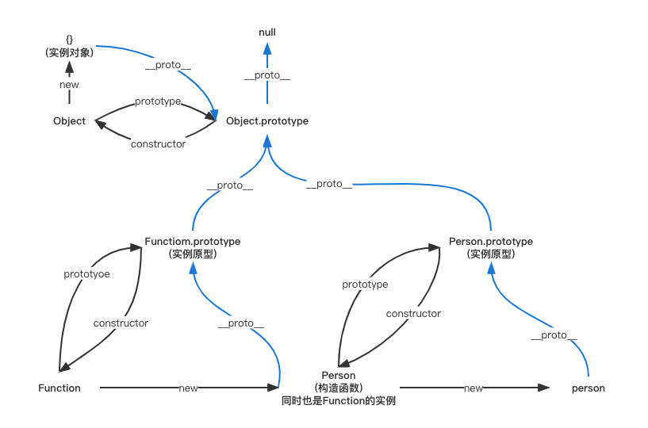

## 原型和原型链
>参考资料：https://github.com/mqyqingfeng/Blog/issues/2



每个对象都可以有一个原型`_proto_`，这个原型还可以有它自己的原型，以此类推，形成一个**原型链**。

查找特定属性的时候，我们先去这个对象里去找，如果没有的话就去它的原型对象里面去，如果还是没有的话再去向原型对象的原型对象里去寻找...... 


**通过上图可知：**
```js
function Person() {}

var person = new Person();

console.log(person.__proto__ == Person.prototype) // true
console.log(Person.prototype.constructor == Person) // true
// 顺便学习一个ES5的方法,可以获得对象的原型
console.log(Object.getPrototypeOf(person) === Person.prototype) // true
```

**需要注意的三个点**
* constructor属性
    ```js
    function Person() { }
    var person = new Person();
    console.log(person.constructor === Person); // true
    ```
    当获取 person.constructor 时，其实 person 中并没有 constructor 属性,当不能读取到constructor 属性时，会从 person 的原型也就是 Person.prototype 中读取，正好原型中有该属性，所以：
    `person.constructor === Person.prototype.constructor === Person`
* `__proto__`属性
    
    绝大部分浏览器都支持这个非标准的方法访问原型，然而它并不存在于 Person.prototype 中，实际上，它是来自于 Object.prototype 
* 真的是继承吗？

    继承意味着`复制`操作，然而 JavaScript 默认并不会复制对象的属性，相反，JavaScript 只是在两个对象之间创建一个`关联`，这样，一个对象就可以通过委托访问另一个对象的属性和函数，所以与其叫继承，委托的说法反而更准确些。

