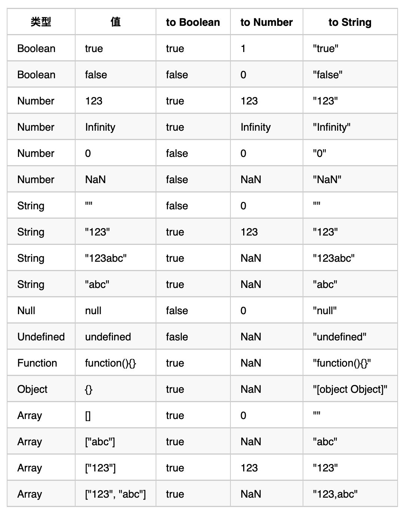

- [js 数据类型](#js-数据类型)
- [js 类型判断](#js-类型判断)
  - [typeOf](#typeof)
  - [Object.prototype.toString.call(\*\*\*)](#objectprototypetostringcall)
  - [instanceof](#instanceof)
    - [手写instanceof](#手写instanceof)
- [类型转换](#类型转换)
  - [抽象方法ToPrimitive](#抽象方法toprimitive)
    - [ToPrimitive 转换为原始值的规则](#toprimitive-转换为原始值的规则)
    - [`valueOf方法和toString方法解析`](#valueof方法和tostring方法解析)
  - [String、Boolean、Number、对象之间的相互转换](#stringbooleannumber对象之间的相互转换)
    - [其他类型转为字符串类型](#其他类型转为字符串类型)
    - [其他类型转为Number类型](#其他类型转为number类型)
    - [其他类型转为Boolean类型](#其他类型转为boolean类型)
    - [对象转为其他类型（原始类型）](#对象转为其他类型原始类型)
  - [隐式类型转换](#隐式类型转换)
    - [数学运算符中的隐式类型转换](#数学运算符中的隐式类型转换)
      - [减、乘、除](#减乘除)
      - [加法](#加法)
    - [逻辑语句中的类型转换](#逻辑语句中的类型转换)
      - [单个变量](#单个变量)
      - [比较运算符](#比较运算符)
      - [使用 == 比较中的5条规则](#使用--比较中的5条规则)
      - [== 和 ===有什么区别？](#-和-有什么区别)
  - [显示类型转换](#显示类型转换)
    - [ToString](#tostring)
    - [ToNumber](#tonumber)
    - [ToBoolean](#toboolean)
  - [附录：类型转换表](#附录类型转换表)

# js 数据类型
基本类型： null，undefined，boolean，number，string，symbol（new in es6），bingInt。
引用类型：Object 类型、Array 类型、Date 类型、RegExp 类型、Function 类型 等。
# js 类型判断
## typeOf
```js
typeof 1                ---> 'number'
typeof 'hello'          ---> 'string'
typeof function() {}    ---> 'function'
typeof undefined        ---> 'undefined'
typeof Symbol()         ---> 'symbol'
typeof false            ---> 'boolean'
typeof b                ---> 'undefined' // b 没有声明，但是还会显示 undefined
typeof 10n              ---> 'bigint'
     
typeof [1,2,3]          ---> 'object'
typeof {a:1,b:2}        ---> 'object'
typeof new Date()       ---> 'object'
typeof /12/g	        ---> 'object'
typeof new Set()        ---> 'object'
typeof new Map()        ---> 'object'
     
typeof null             ---> 'object' // 原因：在系统存储变量的方式中，000 开头代表是对象，然而 null 表示为全零

typeof NaN              ---> 'number'
```
typeof是用来判断变量**基本类型**的关键字，但`typeof null==='object'`，是个js的老bug

## Object.prototype.toString.call(***)
```js
var number = 1;            // [object Number]
var string = '123';        // [object String]
var boolean = true;        // [object Boolean]
var und = undefined;       // [object Undefined]
var nul = null;            // [object Null]
var obj = {a: 1}           // [object Object]
var array = [1, 2, 3];     // [object Array]
var date = new Date();     // [object Date]
var error = new Error();   // [object Error]
var reg = /a/g;            // [object RegExp]
var func = function a(){}; // [object Function]

function foo(){}
console.log(Object.prototype.toString.call(new foo())); //[object Object]
```

从**react源码**中获取判断变量类型的灵感：
```js
const getType = (a) => Object.prototype.toString.call(a).split(" ")
    .slice(1)
    .join(" ")
    .split("]")[0];
```

## instanceof
instanceof原理：用来判断一个构造函数的prototype属性所指向的对象是否存在另外一个要检测对象的原型链上。

instanceof**无法判断数组、日期类型**
```js
[] instanceof Array  // true
[] instanceof Object // true
```
原因：Array的原型是Object，而instanceof的实现原理是在原型链上遍历

### 手写instanceof
```js
function myInstanceof(left,right) {
    // left.__proto__ == Object.getPrototypeOf(left)
     // Object.getPrototypeOf() 方法返回指定对象的原型
     let proto = left.__proto__;
     let prototype = right.prototype
     while(true) {
         //查找到尽头，还没找到
         if(proto === null) return false;
         //找到相同的原型对象
         if(proto === prototype) return true;
         proto = proto.__proto__;
     }
}

function Student(name, age) {
	this.name = name;
	this.age = age;
}
function Teacher(name, age) {
	this.name = name;
	this.age = age;
}
const a = new Student('LIN', 12);
console.log(myInstanceof(a, Student));
console.log(myInstanceof(a, Teacher));
```


# 类型转换

在 JavaScript 有两种类型转换的方式，分别是**隐式类型转换**和**显示类型转换**。

因为 JavaScript 是一种弱类型的语言，在一个表达式中，运算符两边的类型可以不同（比如一个字符串和一个数字相加），JavaScript 解释器会在运算之前将它们的类型进行转换

## 抽象方法ToPrimitive
在介绍隐式类型转换之前先看看ToPrimitive，和String、Boolean、Number、对象之间的相互转换
在对象转原始类型的时候，一般会调用内置的 ToPrimitive 方法，而 ToPrimitive 方法则会调用 OrdinaryToPrimitive 方法。

`ToPrimitive(input, PreferredType?)`
* input是要转换的值，
* PreferredType是可选参数，可以是Number或String类型。默认值是`Number`。他只是一个转换标志，转化后的结果并不一定是这个参数所值的类型，但是转换结果一定是一个原始值（或者报错）。

### ToPrimitive 转换为原始值的规则
* 如果PreferredType被标记为Number，则会进行下面的操作流程来转换输入的值。
    1. 如果输入的值已经是一个原始值，则`直接返回`它
    2. 否则，如果输入的值是一个对象，则调用该对象的`valueOf()`方法，
       如果valueOf()方法的返回值是一个原始值，则返回这个原始值。
    3. 否则，调用这个对象的`toString()`方法，如果toString()方法返回的是一个原始值，则返回这个原始值。
    4. 否则，抛出TypeError异常。

* 如果PreferredType被标记为String
    1.  如果输入的值已经是一个原始值，则`直接返回`它
    2. 否则，调用这个对象的`toString()`方法，如果toString()方法返回的是一个原始值，则返回这个原   始值。
    3. 否则，如果输入的值是一个对象，则调用该对象的`valueOf()`方法，
       如果valueOf()方法的返回值是一个原始值，则返回这个原始值。
    4. 否则，抛出TypeError异常。


**结论：ToPrimitive规则，是引用类型向原始类型转变的规则，如果没有特别指定PreferredType，则默认为Number，它遵循`先valueOf后toString`的模式期望得到一个原始类型。**
### `valueOf方法和toString方法解析`
该两个方法一定在对象中存在

**1. valueOf()**
* `Number, Boolean, String`这三种构造函数生成的基础值的对象形式，通过valueOf转换后会变成相应的原始值
  ```js
  var num = new Number('123');
  num.valueOf(); // 123
  
  var str = new String('12df');
  str.valueOf(); // '12df'
  
  var bool = new Boolean('fd');
  bool.valueOf(); // true
  ```
* Date这种特殊的对象，会被转换为日期的毫秒的形式的数值
  ```js
  var a = new Date();
  a.valueOf(); // 1515143895500
  ```
* 除此之外返回的都为this，即对象本身
  ```js
  var a = new Array();
  a.valueOf() === a; // true
  
  var b = new Object({});
  b.valueOf() === b; // true
  ```

**2. tostring()**
* `Number、Boolean、String、Array、Date、RegExp、Function`这几种构造函数生成的对象，通过toString转换后会变成相应的字符串的形式，因为这些构造函数上封装了自己的toString方法。
  ```js
  var num = new Number('123sd');
  num.toString(); // 'NaN'
  
  var str = new String('12df');
  str.toString(); // '12df'
  
  var bool = new Boolean('fd');
  bool.toString(); // 'true'
  
  var arr = new Array(1,2);
  arr.toString(); // '1,2'
  
  var d = new Date();
  d.toString(); // "Wed Oct 11 2017 08:00:00 GMT+0800 (中国标准时间)"
  
  var func = function () {}
  func.toString(); // "function () {}"
  ```
* 除这些对象及其实例化对象之外，其他对象返回的都是该对象的类型，都是继承的`Object.prototype.toString`方法。
  ```js
  var obj = new Object({});
  obj.toString(); // "[object Object]"

  Math.toString(); // "[object Math]"
  ```

## String、Boolean、Number、对象之间的相互转换
###  其他类型转为字符串类型
* null：转为"null"。
* undefined：转为"undefined"。
* Boolean：true转为"true"，false转为"false"。
* Number：11转为"11"，科学计数法11e20转为"1.1e+21"。
* 数组：
  * 空数组`[]` 转为空字符串`""`
  * 如果数组中的元素有null或者undefined,同样当做`空字符串`处理，
  * [1,2,3,4]转为"1,2,3,4"，相当于调用数组的`.join(',')`方法。PS：['1','2','3','4']也是转为"1,2,3,4"
* 函数：function a(){}转为字符串是"function a(){}"。
* 一般对象：相当于调用对象的`toString()`方法，返回的是"[object,object]"。

### 其他类型转为Number类型
* null：转为 0。
* undefined：转为NaN。
* Boolean：true转为1，false转为0。
* 字符串：如果是纯数字的字符串，则转为对应的数字，如11转为"11"，"1.1e+21"转为1.1e+21，空字符串转为0，其余情况则为`NaN`。
* 数组：数组首先会被转换成`原始类型`，即primitive value(参考`ToPrimitive`)，得到原始类型后再根据上面的转换规则转换。
  * :star:`ToPrimitive规则`，是引用类型向原始类型转变的规则，它遵循先valueOf后toString的模式期望得到一个原始类型。
* 对象：和数组一样

### 其他类型转为Boolean类型
只有`null，undefined，0，false，NaN，空字符串`这6种情况转为布尔值结果为`false`，其余全部为true

### 对象转为其他类型（原始类型）
* 当对象转为其他原始类型时，会先调用对象的`valueOf()`方法，如果valueOf()方法返回的是原始类型，则直接返回这个原始类型
* 如果valueOf()方法返回的是不是原始类型或者valueOf()方法不存在，则继续调用对象的toString()方法，如果toString()方法返回的是原始类型，则直接返回这个原始类型，如果不是原始类型，则直接报错`抛出异常`。
* Date对象会先调用`toString()`


## 隐式类型转换
> 参考链接：https://www.freecodecamp.org/chinese/news/javascript-implicit-type-conversion/#--2

隐式转换就是自动转换，通常发生在一些数学运算中。

JavaScript 中，表达式中包含以下运算符时，会发生**隐式类型转换**：；
* 逻辑运算符：逻辑与（&&）、逻辑或（||）、逻辑非（!）；
* 算术运算符：加（+）、减（-）、乘（*）、除（/）、取模（%）
* 字符串运算符：+、+=。
* 比较运算符：>, >=, <, <=, ==, ===, !=, !===

### 数学运算符中的隐式类型转换
#### 减、乘、除
:star:**我们在对各种非Number类型运用数学运算符(- * /)时，会先将非Number类型转换为Number类型。** 转换规则参考《其他类型转为Number类型》章节
```js
1 - true // 0， 首先把 true 转换为数字 1， 然后执行 1 - 1
1 - null // 1,  首先把 null 转换为数字 0， 然后执行 1 - 0
1 * undefined //  NaN, undefined 转换为数字是 NaN
['5'] - true // 4 , ['5']变成5， true变成1
2 * ['5'] //  10， ['5']首先会变成 '5', 然后再变成数字 5
2 * [1,2,3] // NaN, [1,2,3]会先变成转成原始类型'1,2,3'，然后再转成Number类型变成‘NaN’
```
#### 加法
:star:**为什么加法要区别对待？因为JS里 +还可以用来拼接字符串。谨记以下3条：(优先级由高到低)**
1. 当一侧为`String`类型，被识别为**字符串拼接**，并会优先将另一侧转换为`字符串`类型。
2. 当一侧为`Number`类型，另一侧为`原始类型`，则将原始类型转换为`Number`类型。
3. 当一侧为`Number`类型，另一侧为`引用类型`，将引用类型和Number类型转换成`字符串`后拼接。
4. 当两侧不为`String`或`Number`， 将其转换成`字符串`后拼接。

```js
123 + '123' // '123123'   （规则1）
123 + null  // 123    （规则2）
123 + true // 124    （规则2）
123 + {}  // '123[object Object]'    （规则3）
[1,2,3] + '1' // '1,2,31' （规则1）
['1','2','3'] + '1' // '1,2,31' （规则1）
[1, 2] + [2, 1] // '1,22,1' （规则4）

'a' + + 'b' // "aNaN" (规则1)
// 因为相当于'a' + (+ 'b'), 而(+ 'b')相当于字符串转为number类型，结果为NaN，所以'a' + NaN = 'aNaN'
```

### 逻辑语句中的类型转换
当我们使用 if while for 语句时，我们期望表达式是一个Boolean，所以一定伴随着隐式类型转换。而这里面又分为三种情况

#### 单个变量
:star:**如果只有单个变量，会先将变量转换为Boolean值。**

只有 `null undefined '' NaN 0 false` 这几个是 `false`，其他的情况都是 true，比如 {} , []。

#### 比较运算符
1. 如果是对象，就通过 toPrimitive 转换对象
2. 如果是字符串，就通过 unicode 字符索引来比较
```js
console.log('a' < 'b') // true
console.log([] < 'b') // true
```

#### 使用 == 比较中的5条规则
1. 规则 1：NaN和其他任何类型比较永远返回false（包括和他自己）。
   ```js
   NaN == NaN // false
   ```
2. 规则 2：Boolean 和其他任何类型比较，Boolean 首先被转换为 Number 类型。
   ```js
   true == 1  // true 
   true == '2'  // false, 先把 true 变成 1，而不是把 '2' 变成 true
   true == ['1']  // true, 先把 true 变成 1， ['1']拆箱成 '1', 再参考规则3
   true == ['2']  // false, 同上
   undefined == false // false ，首先 false 变成 0，然后参考规则4
   null == false // false，同上
   ```
3. 规则 3：String和Number比较，先将String转换为Number类型。
   ```js
   123 == '123' // true, '123' 会先变成 123
   '' == 0 // true, '' 会首先变成 0
   ```
4. 规则 4：null == undefined比较结果是true，除此之外，null、undefined和其他任何结果的比较值都为false。
5. 规则 5: 原始类型和引用类型做比较时，引用类型会依照`ToPrimitive规则`转换为原始类型。
   >ToPrimitive规则，是引用类型向原始类型转变的规则，它遵循先valueOf后toString的模式期望得到一个原始类型。

   如果还是没法得到一个原始类型，就会抛出 `TypeError`。
   ```js
   '[object Object]' == {} 
   // true, 对象和字符串比较，对象通过 toString 得到一个基本类型值
   '1,2,3' == [1, 2, 3] 
   // true, 同上  [1, 2, 3]通过 toString 得到一个基本类型值
   ```
6. 规则 6: 类型相同时，没有类型转换，内存地址不同，则返回false。
   ```js
   let a = [1,2,3]
   let a = [1,2,3]
   console.log(a == b) // false
   ```
**看几道经典例题：**
例题一：
```js
var a = {
  valueOf: function () {
     return 1;
  },
  toString: function () {
     return '123'
  }
}
true == a // true;
// 首先，x与y类型不同，x为boolean类型，先转为number类型 1。
// 接着，x为number，y为object类型，对y进行原始转换，ToPrimitive(a, ?),没有指定转换类型，默认number类型。首先调用`valueOf`方法，返回1，得到原始类型1。
// 最后 1 == 1， 返回true。
```
例题二：
```js
[] == !{} // true
/**
1、! 运算符优先级高于==，故先进行！运算。
2、!{}运算结果为false(转Boolean类型,调用ToNumber())，结果变成 [] == false比较。
3、根据规则 2，将[]转成Number类型。结果变成 [] == 0。
4、按照规则5，比较变成ToPrimitive([]) == 0。
    按照上面规则进行原始值转换，[]会先调用valueOf函数，返回this。
   不是原始值，继续调用toString方法，x = [].toString() = ''。
   故结果为 '' == 0比较。
5、根据规则 3，等式左边x = ToNumber('') = 0。
   所以结果变为： 0 == 0，返回true，比较结束。
*/
```

例题三：
```js
const a = {
  i: 1,
  toString: function () {
    return a.i++;
  }
}
if (a == 1 && a == 2 && a == 3) {
  console.log('hello world!'); // 可以打印
}
/**
1、当执行a == 1 && a == 2 && a == 3 时，会从左到右一步一步解析，首先 a ==  1，根据规则5转换。ToPrimitive(a， Number) == 1。
2、ToPrimitive(a, Number)，按照上面原始类型转换规则，会先调用valueOf方法，a的valueOf方法继承自Object.prototype。返回a本身，而非原始类型，故会调用toString方法。
3、因为toString被重写，所以会调用重写的toString方法，故返回1，注意这里是i++，而不是++i，它会先返回i，在将i+1。故ToPrimitive(a, Number) = 1。也就是1 == 1，此时i = 1 + 1 = 2。
4、执行完a == 1返回true，会执行a == 2，同理，会调用ToPrimitive(a, Number)，同上先调用valueOf方法，在调用toString方法，由于第一步，i = 2此时，ToPrimitive(a, Number) = 2， 也就是2 == 2, 此时i = 2 + 1。
5、同上可以推导 a == 3也返回true。故最终结果 a == 1 && a == 2 && a == 3返回true
*/
```
例题四：
```js
[undefined] == false //  true
/**
 * 1. 根据规则2， Boolean 首先被转换为 Number 类型。变成[undefined] == 0
 * 2. 根据规则5， [undefined]转为原始类型。[undefined]先调用valueOf会返回本身，再调用toString()（undefined会被当成空字符串处理）, 变成''。此时变成  '' == 0
 * 3. 根据规则规则3， ''转为number类型为0.此时变成0 == 0。所以结果为true
 * */
```

#### == 和 ===有什么区别？
* ===叫做严格相等，是指：左右两边不仅值要相等，`类型`也要相等，例如'1'===1的结果是false，因为一边是string，另一边是number。
* ==不像===那样严格，对于一般情况，只要值相等，就返回true，但==还涉及一些`类型转换`，它的转换规则如下：
* 两边的类型是否相同，相同的话就比较值的大小，例如1==2，返回false
* 判断的是否是null和undefined，是的话就返回true
* 判断的类型是否是String和Number，是的话，把String类型转换成Number，再进行比较
* 判断其中一方是否是Boolean，是的话就把Boolean转换成Number，再进行比较
* 如果其中一方为Object，且另一方为String、Number或者Symbol，会将Object转换成字符串，再进行比较
```js
console.log({a: 1} == true); // false
console.log({a: 1} == "[object Object]"); // true
```


## 显示类型转换
JavaScript 中，强制类型转换主要是通过调用全局函数来实现的，例如 Number()、Boolean()、parseInt()、parseFloat() 等。

### ToString

### ToNumber

### ToBoolean

## 附录：类型转换表
