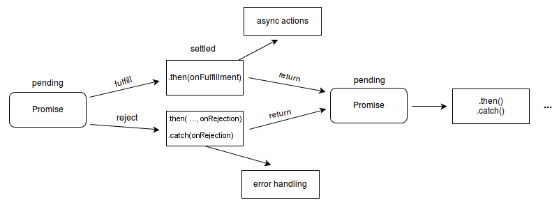

- [前言](#前言)
- [回调函数](#回调函数)
- [Promise](#promise)
  - [为什么Promise要引入微任务？](#为什么promise要引入微任务)
  - [手写Promise](#手写promise)
- [Generator/yield](#generatoryield)
- [Async/Await](#asyncawait)

# 前言

我们知道Javascript语言的执行环境是"单线程"。也就是指一次只能完成一件任务。如果有多个任务，就必须排队，前面一个任务完成，再执行后面一个任务。

但是只要有一个任务耗时很长，后面的任务都必须排队等着，会拖延整个程序的执行。

为了解决这个问题，Javascript语言将任务的执行模式分成两种：同步和异步。下面介绍几种异步编程方式。

JS 异步编程进化史：callback -> promise -> generator -> async + await

# 回调函数

回调函数是异步编程最基本的方法

```js
doAsync1(function(result1) {
  doAsync2(result1, function(result2) {
    doAsync3(result2, function(result3) {
      console.log(result3);
    });
  });
});
```

缺点：代码可维护性，可读性很差，有**回调地狱**问题。

# Promise

>Promise 对象用于表示一个异步操作的最终状态（完成或失败），以及其返回的值。

Promise 本意为承诺，我们可以理解为程序承诺过一段时间后会给你一个结果。Promise 是一个**对象**，可以保存三个状态 每一时刻必须有一个状态。这样使得异步方法可以像**同步方法**那样返回值。

Promise状态：

- 成功 `Fulfilled`
- 失败 `Rejected`
- 处理中 `Pending`

promise有以下两个特点：

- 对象的状态不受外界影响。只有异步操作的结果，可以决定当前是哪一种状态，任何其他操作都**无法改变这个状态**。
- 一旦状态改变，就不会再变，任何时候都可以得到这个结果。



例子：

```js
const myPromise = new Promise((resolve, reject) => {
  // ... some code
  if (/* 异步操作成功 */){
    resolve(value);
  } else {
    reject(error);
  }
});

myPromise
  .then(() => {
    // success
  }, () => {
    // failure
  })
  .then(handleResolvedB, handleRejectedB)
  .then(handleResolvedC, handleRejectedC)
  .catch(err => { console.log(err) });
```

- `.then()`方法可以接受两个回调函数作为参数。第一个回调函数是Promise对象的状态变为`Fulfilled`时调用，第二个回调函数是Promise对象的状态变为`Rejected`时调用。其中，第二个函数是可选的，不一定要提供。这两个函数都接受Promise对象传出的值作为参数。
- 每一个 `.then()` 方法还会返回一个新生成的 promise 对象，这个对象可被用作**链式调用**。
- `.catch()`方法会捕获到没有捕获的异常。

**Promise实例方法**

```js
Promise.prototype.then()

// Promise.prototype.catch 用于指定出错时的回调，是特殊的then方法，catch之后，可以继续 .then
Promise.prototype.catch() 
Promise.prototype.catch = function (onRejected) {
    return this.then(null, onRejected);
}

// 不管成功还是失败，都会走到finally中,并且finally之后，还可以继续then。并且会将值原封不动的传递给后面的then.
Promise.prototype.finally() 
Promise.prototype.finally = function (callback) {
    return this.then((value) => {
        return Promise.resolve(callback()).then(() => {
            return value;
        });
    }, (err) => {
        return Promise.resolve(callback()).then(() => {
            throw err;
        });
    });
}
```

**Promise对象方法**

```js
Promise.all([p1, p2, p3])   //只要p1、p2、p3之中有一个被rejected，p的状态就变成rejected,只有p1、p2、p3的状态都变成fulfilled，p的状态才会变成fulfilled
Promise.race([p1, p2, p3])  //只要p1、p2、p3之中有一个实例率先改变状态，p的状态就跟着改变
Promise.allSettled()
Promise.any()
Promise.resolve(obj) // 直接返回一个fulfilled状态的 Promise 实例。
Promise.reject()  // 返回一个新的 Promise 实例，该实例的状态为rejected。
```

例题：参数是一个promise对象，如果在一秒钟之内，promise没有返回结果的话就自动reject（），如果有就返回promise返回的结果

```js
const p = Promise.race([
  fetch('/resource-that-may-take-a-while'),
  new Promise(function (resolve, reject) {
    setTimeout(() => reject(new Error('request timeout')), 1000)
  })
]);

p
.then(console.log)
.catch(console.error);
```

优点：

1. 解决了回调地狱的问题
2. 实现错误冒泡后一站式处理，解决每次任务中判断错误、增加代码混乱度的问题

缺点：

## 为什么Promise要引入微任务？

Promise 中的**执行函数是同步**进行的，但是里面存在着异步操作，在异步操作结束后会调用 `resolve` 方法，或者中途遇到错误调用 `reject` 方法，这两者都是作为`微任务`进入到 EventLoop 中。

PS：
new Promise(###)，### 这个位置的代码是 同步执行的。`Promise.then(###)`是微任务，会放入微任务队列。

## 手写Promise

[从零实现promise](https://segmentfault.com/a/1190000016550260)
```js
class Promise{
    constructor(executer){//构造函数constructor里面是个执行器
      this.status = 'pending';//默认的状态 pending
      this.value = undefined//成功的值默认undefined
      this.reason = undefined//失败的值默认undefined
      //状态只有在pending时候才能改变
      let resolveFn = value =>{
        //判断只有等待时才能resolve成功
        if(this.status == pending){
          this.status = 'resolve';
          this.value = value;
        }
      }
      //判断只有等待时才能reject失败
      let rejectFn = reason =>{
        if(this.status == pending){
          this.status = 'reject';
          this.reason = reason;
        }
      }    
      try{
        //把resolve和reject两个函数传给执行器executer
        executer(resolve,reject);
      }catch(e){
        reject(e);//失败的话进catch
      }
    }
    then(onFufilled,onReject){
      //如果状态成功调用onFufilled
      if(this.status = 'resolve'){
        onFufilled(this.value);
      }
      //如果状态失败调用onReject
      if(this.status = 'reject'){
        onReject(this.reason);
      }
    }
  }
```

# Generator/yield

Generator函数是将函数**分步骤阻塞**，只有主动调用`next()`才能进行下一步。

* 语法上，首先可以把它理解成，Generator 函数是一个状态机，封装了多个内部状态。
* Generator 函数除了状态机，还是一个遍历器对象生成函数。
* 可暂停函数, yield可暂停，next方法可启动，每次返回的是yield后的表达式结果。
* yield表达式本身没有返回值，或者说总是返回undefined。next方法可以带一个参数，该参数就会被当作上一个yield表达式的返回值。

**例子**
```js
function *foo(x) {
  let y = 2 * (yield (x + 1))
  let z = yield (y / 3)
  return (x + y + z)
}
let it = foo(5)
console.log(it.next())   // => {value: 6, done: false}
console.log(it.next(12)) // => {value: 8, done: false}
console.log(it.next(13)) // => {value: 42, done: true}
```

分析：

1. 首先 Generator 函数调用和普通函数不同，它会返回一个迭代器
2. 当执行第一次 next 时，传参会被忽略，并且函数暂停在 yield (x + 1) 处，所以返回 5 + 1 = 6
3. 当执行第二次 next 时，传入的参数12就会被当作上一个yield表达式的返回值，如果你不传参，yield 永远返回 undefined。此时 let y = 2 * 12，所以第二个 yield 等于 2 * 12 / 3 = 8
4. 当执行第三次 next 时，传入的参数13就会被当作上一个yield表达式的返回值，所以 z = 13, x = 5, y = 24，相加等于 42

实际开发一般会配合`co`库去使用。co是一个为Node.js和浏览器打造的基于生成器的流程控制工具，借助于Promise，你可以使用更加优雅的方式编写非阻塞代码。

我们可以通过 Generator 函数解决回调地狱的问题.

```js
function *fetch() {
    yield ajax(url, () => {})
    yield ajax(url1, () => {})
    yield ajax(url2, () => {})
}
let it = fetch()
let result1 = it.next()
let result2 = it.next()
let result3 = it.next()
```

# Async/Await
async本质上是generator的语法糖,自带一个状态机，在await的部分`等待`返回， 返回后`自动`执行下一步。`内置了执行器`。

而且相较于Promise,async的优越性就是把每次异步返回的结果从then中拿到最外层的方法中，不需要链式调用，只要用`同步`的写法就可以了。更加直观而且，更适合处理`并发`调用的问题。

>MDN 的定义: async 是一个通过异步执行并隐式`返回 Promise`作为结果的函数。

- async/await是基于`Promise`实现的，它不能用于普通的回调函数。
- async/await与Promise一样，是非阻塞的。
- async/await使得**异步代码看起来像同步代码**。
- async 表示这是一个async函数，而await只能在这个函数里面使用。
- await 会将后面的语句可以看成是一个`Promise`来执行。
- await 表示在这里**等待**await后面的操作执行完毕(等待返回Promise`成功状态`)才会恢复async函数的执行（执行await下一条语句），并得到 `resolve` 的值，作为 await 表达式的运算结果。如果得到Promise的`reject`值，则报错并结束该函数的执行，await下一条语句不会执行。
  
  ```js
   const fn =  new Promise((resolve, reject) => {
     // ... some code
     if (/* 异步操作成功 */){
       resolve('成功了');
     } else {
       reject('出错了');
     }
   })

   fn.then(res => {
      console.log(res); // 成功了
   }).catch(err => {
      console.log(err); // 出错了
   });

   // 等同于
   try {
      const val = await fn(); 
      console.log(val); // 成功了
   }catch (err) {
      console.log(err); // 出错了
   }
  ```

- await 后面紧跟着的代码是一个耗时的操作或者是一个异步操作。
- await 后面必须是一个`Promise对象`，如果不是会被转化为一个已完成状态的Promise
  
  ```js
  async function async1() {
    return "1"
  }
  console.log(async1()) // -> Promise {<resolved>: "1"}
  ```

凡是加上 async 的函数都默认返回一个 Promise 对象。可以使用then方法添加回调函数。当函数执行的时候，一旦遇到await就会先返回，等到异步操作完成，再接着执行函数体内后面的语句。

**Async/Await并发请求**：如果请求两个文件，毫无关系，可以通过并发请求

```js
let fs = require('fs')
function read(file) {
  return new Promise(function(resolve, reject) {
    fs.readFile(file, 'utf8', function(err, data) {
      if (err) reject(err)
      resolve(data)
    })
  })
}
function readAll() {
  read1()
  read2()//这个函数同步执行
}
async function read1() {
  let r = await read('1.txt','utf8')
  console.log(r)
}
async function read2() {
  let r = await read('2.txt','utf8')
  console.log(r)
}
readAll() // 2.txt 3.txt
```
