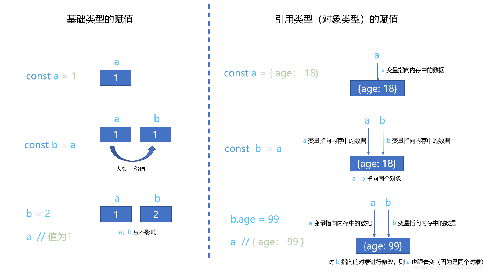

- [深浅拷贝](#深浅拷贝)
  - [浅拷贝](#浅拷贝)
  - [深拷贝](#深拷贝)
    - [for/for in](#forfor-in)
    - [JSON.parse/stringfy](#jsonparsestringfy)
    - [Object.assign](#objectassign)
    - [解构赋值](#解构赋值)
    - [深度优先遍历 - 递归](#深度优先遍历---递归)
    - [广度优先遍历-深拷贝](#广度优先遍历-深拷贝)

# 深浅拷贝

js有8种数据类型：

1. Null
2. Nndefined，
3. Boolean，
4. Number
5. String，
6. Symbol（new in es6），
7. BingInt
8. Object

其中前7中为**基本（原始）数据类型**。

Object为**引用类型**，包括：Object 类型、Array 类型、Date 类型、RegExp 类型、Function 类型 等。

- 基本数据类型：值存储在`栈`内存中
- 引用类型：键和值的地址存储于在`栈`内存，值存储于`堆`内存。

在JavaScript中，

- 基础类型值的复制是直接拷贝一份新的一模一样的数据，这两份数据**相互独立**，互不影响。
- 而引用类型值（Object类型）的复制是传递对象的引用（也就是对象所在的内存地址，即指向对象的指针），相当于多个变量**指向同一个对象**，那么只要其中的一个变量对这个对象进行修改，其他的变量所指向的对象也会跟着修改（因为它们指向的是同一个对象）。



**深浅拷贝问题**主要针对的是`Object`类型，基础类型的值本身即是复制一模一样的一份，不区分深浅拷贝。

- `浅拷贝`：B复制了A，当修改A时，如果**B也跟着变了**，说明这是浅拷贝
- `深拷贝`：B复制了A，当修改A时，如果**B不变**，说明这是深拷贝
  
## 浅拷贝

原因：
直接将对象赋值给一个新变量，实际上是将存储在栈中的值赋值给新变量，对于引用类型来说赋值的是地址。所以当操作新的引用类型变量的时候，实际上还是操作原对象。

- `Object.assign()`对象的拷贝，用于将所有可枚举属性的值从一个或多个源对象分配到目标对象。它将返回目标对象。
- `concat()`浅拷贝数组 用于连接两个或多个数组
- `slice()`浅拷贝 从已有的数组中返回选定的元素。
- `...`展开运算符

以上几种操作均为浅拷贝

## 深拷贝

原理：
深拷贝的原理就是定义一个新的对象，遍历源对象的属性并赋给新对象的属性。

### for/for in

```js
function deepCopy_1(obj) {
    var copy_obj = {};
    for(let item in obj){
        copy_obj[item] = obj[item];
    }
    return copy_obj;
}
```

### JSON.parse/stringfy

```js
function deepCopy_2(obj) {
    return JSON.parse(JSON.stringify(obj));
}
```

缺点：undefined、function、正则、Error类型没有拷贝成功。

### Object.assign

Object.assign() 方法用于将所有可枚举属性的值从一个或多个源对象复制到目标对象。它将返回目标对象。

Object.assign是一种浅拷贝，但是可以通过Object.assign({},obj1,obj2...)的方法深拷贝。

```js
function deepCopy_3(obj) {
    return Object.assign({},obj);
}
```

### 解构赋值

```js
function deepCopy_4(obj) {
    return {...obj};
}
```

### 深度优先遍历 - 递归

为了**解决循环引用**的问题（自身有个key对应的value又是自身），我们必须记录要拷贝的这个对象之前是不是已经被深拷贝过一次，如果已经被拷贝过一次，就直接返回拷贝的时候对应的内存空间即可（不然会进入递归的无限循环，造成栈内存溢出）。

```js
// getType方法是用来获取变量准确的类型，引用类型包括Object 类型、Array 类型、Date 类型、RegExp 类型、Function 类型
const getType = (obj) => Object.prototype.toString.call(obj).slice(8,-1);

// isObject方法是用来判断是否是引用类型, 注意Object 类型、Array 类型、Date 类型、RegExp 类型这四种类型用typeof判断结果都是'object'
const isObject = (target) =>
    (typeof target === 'object' || typeof target === 'function') && target !== null;    // date regExp 的typeof都会被判断为'object'

function deepClone(target, map = new Map()) {
    if (!!map.get(target)) {
        return map.get(target);
    }

    if(target instanceof Date) {
      return new Date(target);
    } else if(target instanceof RegExp) {
      return new RegExp(target);
    } else if(typeof target === 'function') {
      return new Function('return ' + target.toString());
    } else if (isObject(target)) {  // 只写这一个isObject的if，那如果初始的target他是基本数据类型呢，你也要返回他的值进行赋值吧，所以要多加下面一个else return target的判断        
        // 判断是否是引用类型，如果是引用类型的拷贝 要另起一个内存空间
        let cloneObj = Array.isArray(target) ? [] : {};
        // 需要记录当前这个引用类型target被拷贝过
        map.set(target, cloneObj);   // target 对应的value设置成 拷贝后的内存地址。
        for (key in target) {
            // https://developer.mozilla.org/zh-CN/docs/Web/JavaScript/Reference/Statements/for...in hasOwnProperty是拿到自己本身有的key，不会拿到原型链上继承来的key
            if (target.hasOwnProperty(key)) { // 这个判断的目的是为了避免访问非target本身的属性（比如继承来的属性），也可以使用getOwnPropertyNames()这个方法
              cloneObj[key] = deepClone(target[key], map);
            }
        }
        return cloneObj;
    }
     else {
      return target;
    }
}
```

### 广度优先遍历-深拷贝

```js
// getType方法是用来获取变量准确的类型，引用类型包括Object 类型、Array 类型、Date 类型、RegExp 类型、Function 类型
const getType = (obj) => Object.prototype.toString.call(obj).slice(8,-1);

function deepCopyBFS(obj) {
 if (obj === null) return null;
    if (typeof obj !== "object") return obj;
 if (obj.constructor === Date) return new Date(obj);

 let res = {};
   const origin = [obj];
   const copy = [res];
   const vistied = new Set([obj]);

   while (origin.length) {
     const _obj = origin.shift();
     const copyObj = copy.shift();

     Object.keys(_obj).forEach(k => {
       const item = _obj[k];
       if (getType(item) === 'Object' || getType(item) === 'Array') {
         if (vistied.has(item)) {
           copyObj[k] = item;
         } else {
           vistied.add(item);
           copyObj[k] = getType(item) === 'Object' ? {} : [];
           origin.push(item);
           copy.push(copyObj[k]);
         }
       } else if (typeof item === 'function') {
         copyObj[k] = eval(`(${item.toString()})`);
       } else {
         copyObj[k] = item;
       }
     })
   }
   return res;
}
```
