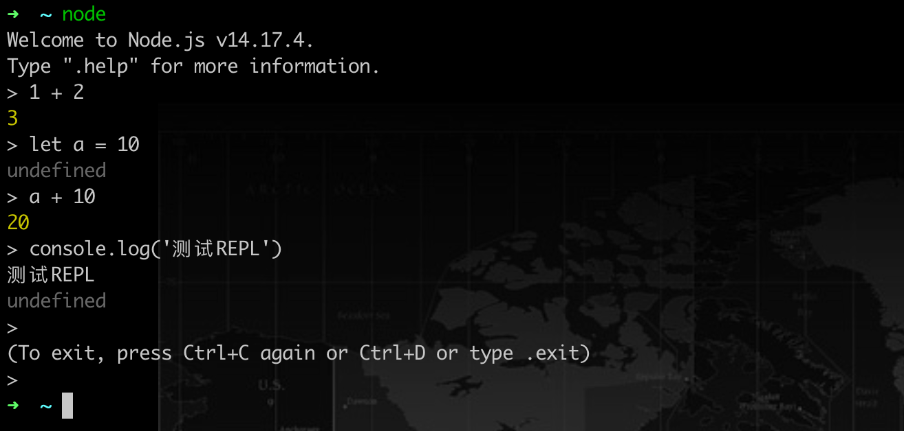
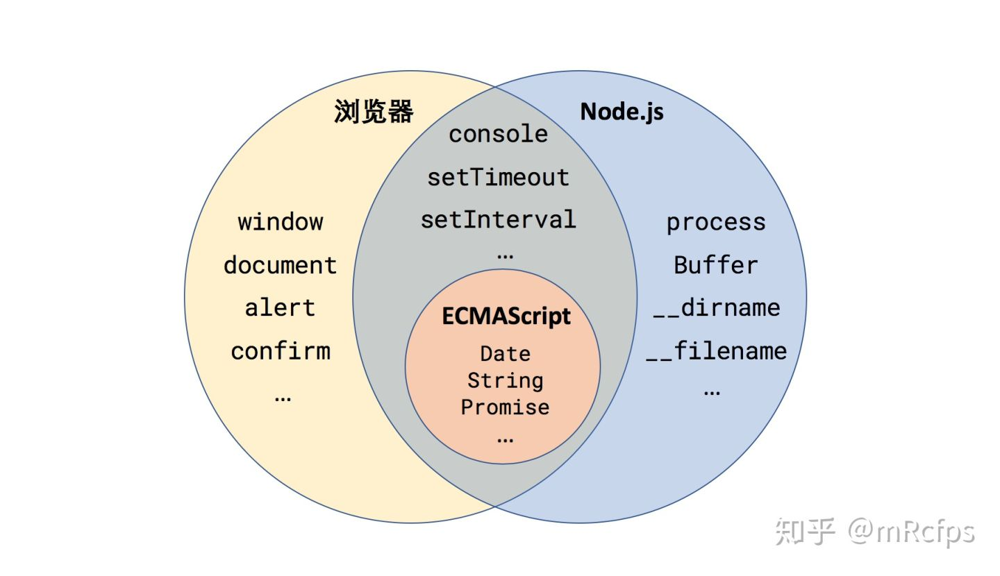

# 参考资料：
1. [一杯茶的时间，上手Node.js](https://zhuanlan.zhihu.com/p/97413574)


---
# 起步
## 什么是Node？
Node（或者说 Node.js，两者是等价的）是 JavaScript 的一种运行环境。

我们知道 JavaScript 都是在浏览器中执行的，用于给网页添加各种动态效果，那么可以说浏览器也是 JavaScript 的运行环境。两个运行环境差异如下图所示：

两个运行环境共同包含了 ECMAScript，也就是剥离了所有运行环境的 JavaScript 语言标准本身。

浏览器端 JavaScript 还包括了：BOM(window对象)、DOM(document对象)

Node.js 则是包括V8引擎(Chrome 浏览器中的JS引擎)。而 Node.js 则进一步将 V8 引擎加工成可以在任何操作系统中运行 JavaScript 的平台。

## 运行 Node 代码
运行 Node 代码通常有两种方式：
1. 在 REPL 中交互式输入和运行；

2. 将代码写入 JS 文件，并用 Node 执行。
创建test.js文件，里面代码内容为：`console.log('Hello World!');`
然后用 Node 解释器执行这个文件：
    ```
    $ node test.js
    Hello World!
    ```
    来对比一下，在浏览器和 Node 环境中执行这行代码有什么区别：
    - 在浏览器运行 console.log 调用了 BOM，实际上执行的是 `window.console.log('Hello World!')`
    - Node 首先在所处的操作系统中创建一个新的进程，然后向标准输出打印了指定的字符串， 实际上执行的是 `process.stdout.write('Hello World!\n')`

## Node全局对象
JavaScript在各个运行环境下的全局对象的比较：

可以分为四类：
1. 浏览器专属，例如 `window、alert` 等等；
2. Node 专属，例如 `process、Buffer、__dirname、__filename` 等等；
3. 浏览器和 Node 共有，但是实现方式不同，例如 `console（第一节中已提到）、setTimeout、setInterval` 等；
4. 浏览器和 Node 共有，并且属于 ECMAScript 语言定义的一部分，例如 `Date、String、Promise` 等；

重点关注Node专属全局对象：

**procss**

process 全局对象可以说是 Node.js 的灵魂，它是管理当前 Node.js 进程状态的对象，提供了与操作系统的简单接口。可在Node REPL中查看process对象。它有以下属性：
- pid：进程编号
- env：系统环境变量
- argv：命令行执行此脚本时的输入参数
- platform：当前操作系统的平台、等

**Buffer**

Buffer 全局对象让 JavaScript 也能够轻松地处理二进制数据流，结合 Node 的流接口（Stream），能够实现高效的二进制文件处理。

**__filename 和 __dirname**

分别代表当前所运行 Node 脚本的文件路径和所在目录路径。

ps: __filename 和 __dirname 只能在 Node 脚本文件中使用，在 REPL 中是没有定义的。

**使用node全局对象**
```js
// test.js
setTimeout(() => {
  console.log('Hello World!');
}, 3000);

console.log('当前进程 ID', process.pid);
console.log('当前脚本路径', __filename);

const time = new Date();
console.log('当前时间', time.toLocaleString());
```
执行输出如下：（Hello World! 会延迟三秒输出）
```js
$ node timer.js
当前进程 ID 1961
当前脚本路径 /Users/wanwan/Desktop/test.js
当前时间 2022/5/7 下午5:56:15
Hello World!
```

在 setTimeout 等待的 3 秒内，程序并没有阻塞，而是继续向下执行，这就是 Node.js 的`异步非阻塞`!

## Node模块机制