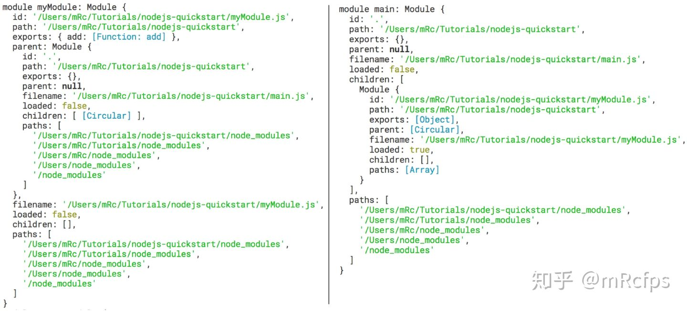
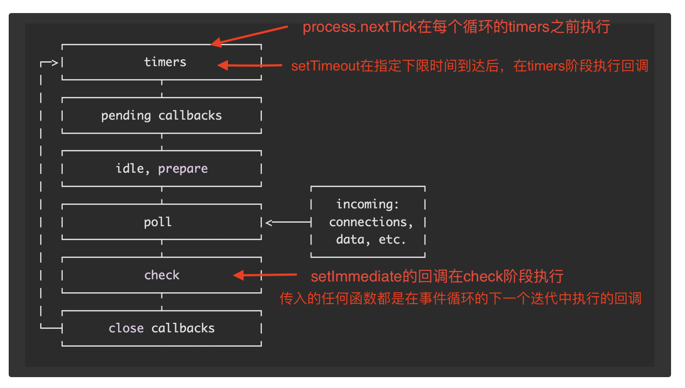

# 参考资料：
1. [一杯茶的时间，上手Node.js](https://zhuanlan.zhihu.com/p/97413574)

2. [狼叔：如何正确学习node.js](https://cnodejs.org/topic/5ab3166be7b166bb7b9eccf7)

2. [Node.js学习指南](https://blog.poetries.top/node-learning-notes/notes/base/01-%E7%8E%AF%E5%A2%83%E6%90%AD%E5%BB%BA.html#%E8%AE%A4%E8%AF%86-node-js)

3. [Node.js官网文档](http://nodejs.cn/learn/introduction-to-nodejs)
---
# node架构

Node.js 是基于 Chrome V8引擎构建的，由事件循环（Event Loop）分发 I/O 任务，最终工作线程（Work Thread）将任务丢到线程池（Thread Pool）里去执行，而事件循环只要等待执行结果就可以了。
- Chrome V8 解释并执行 JavaScript 代码（这就是为什么浏览器能执行 JavaScript 原因）
- libuv 由事件循环和线程池组成，负责所有 I/O 任务的分发与执行
---
# 起步
## 什么是Node？
Node（或者说 Node.js，两者是等价的）是 JavaScript 的一种运行环境。

我们知道 JavaScript 都是在浏览器中执行的，用于给网页添加各种动态效果，那么可以说浏览器也是 JavaScript 的运行环境。两个运行环境差异如下图所示：

两个运行环境共同包含了 ECMAScript，也就是剥离了所有运行环境的 JavaScript 语言标准本身。

浏览器端 JavaScript 还包括了：BOM(window对象)、DOM(document对象)

Node.js 则是包括V8引擎(Chrome 浏览器中的JS引擎)。而 Node.js 则进一步将 V8 引擎加工成可以在任何操作系统中运行 JavaScript 的平台。

## 运行 Node 代码
运行 Node 代码通常有两种方式：
1. 在 REPL 中交互式输入和运行；

2. 将代码写入 JS 文件，并用 Node 执行。
创建test.js文件，里面代码内容为：`console.log('Hello World!');`
然后用 Node 解释器执行这个文件：
    ```
    $ node test.js
    Hello World!
    ```
    来对比一下，在浏览器和 Node 环境中执行这行代码有什么区别：
    - 在浏览器运行 console.log 调用了 BOM，实际上执行的是 `window.console.log('Hello World!')`
    - Node 首先在所处的操作系统中创建一个新的进程，然后向标准输出打印了指定的字符串， 实际上执行的是 `process.stdout.write('Hello World!\n')`

## Node全局对象
JavaScript在各个运行环境下的全局对象的比较：

可以分为四类：
1. 浏览器专属，例如 `window、alert` 等等；
2. Node 专属，例如 `process、Buffer、__dirname、__filename` 等等；
3. 浏览器和 Node 共有，但是实现方式不同，例如 `console（第一节中已提到）、setTimeout、setInterval` 等；
4. 浏览器和 Node 共有，并且属于 ECMAScript 语言定义的一部分，例如 `Date、String、Promise` 等；

重点关注Node专属全局对象：

**procss**

process 全局对象可以说是 Node.js 的灵魂，它是管理当前 Node.js 进程状态的对象，提供了与操作系统的简单接口。可在Node REPL中查看process对象。它有以下属性：
- pid：进程编号
- env：系统环境变量
- argv：命令行执行此脚本时的输入参数
- platform：当前操作系统的平台
- exit：实现退出 Node.js 程序的函数，等

**Buffer**

Buffer 全局对象让 JavaScript 也能够轻松地处理二进制数据流，结合 Node 的流接口（Stream），能够实现高效的二进制文件处理。

**__filename 和 __dirname**

分别代表当前所运行 Node 脚本的文件路径和所在目录路径。

ps: __filename 和 __dirname 只能在 Node 脚本文件中使用，在 REPL 中是没有定义的。


**使用node全局对象**
```js
// test.js
setTimeout(() => {
  console.log('Hello World!');
}, 3000);

console.log('当前进程 ID', process.pid);
console.log('当前脚本路径', __filename);

const time = new Date();
console.log('当前时间', time.toLocaleString());
```
执行输出如下：（Hello World! 会延迟三秒输出）
```js
$ node timer.js
当前进程 ID 1961
当前脚本路径 /Users/wanwan/Desktop/test.js
当前时间 2022/5/7 下午5:56:15
Hello World!
```

在 setTimeout 等待的 3 秒内，程序并没有阻塞，而是继续向下执行，这就是 Node.js 的`异步非阻塞`!

## Node模块机制
在ES2015之前，js语言本身没有模块化的机制，构建复杂应用也没有统一的接口标准。人们通常使用一系列的`<script>` 标签来导入相应的模块（依赖），如下：
```js
<head>
  <script src="fileA.js"></script>
  <script src="fileB.js"></script>
</head>
```
这种方式会带来很多问题：
1. 导入的多个 JS 文件直接作用于全局命名空间，很容易产生命名冲突
2. 导入的 JS 文件之间不能相互访问
3. 导入的 script 无法被轻易去除或修改

因此，有两大模块化规范被提出:
1. AMD（Asynchronous Module Definition）规范
2. `CommonJS规范`，Node.js 所实现的正是这一模块标准。

### Node 模块机制浅析
Node 模块可分为两大类：
- 核心模块：Node 提供的内置模块，在安装 Node 时已经被编译成二进制可执行文件
- 文件模块：用户编写的模块，可以是自己写的，也可以是通过 npm 安装的。

Node为了实现模块机制，引入了三个新的全局对象（Node专属）: `require、exports、modules`。

**require**
require 用于导入其他 Node 模块，其参数接受一个字符串代表模块的名称或路径，通常被称为模块标识符。具体有以下三种形式。
```js
// 直接写模块名称,导入内置库或第三方模块，node会通过module.paths找到目标模块
const os = require('os');
const express = require('express');

// 通过相对路径导入其他模块
const utils = require('./utils');

// 通过绝对路径导入其他模块
const utils = require('/home/xxx/MyProject/utils');
```

**exports**：可用exports导出模块内容供给外部使用

**module**
module对象有以下字段:

* `id`：模块的唯一标识符，如果是被运行的主程序则为 `.`，如果是被导入的模块（则等同于此文件名（即下面的 filename 字段）
* `path`和`filename`：模块所在路径和文件名
* `exports`：模块所导出的内容，实际上之前的 exports 对象是指向 module.exports 的引用。
* `parent`和`children`：用于记录模块之间的导入关系
* `loaded`：模块是否被加载。只有 children 中列出的模块才会被加载。
* `paths`：这个就是 Node 搜索文件模块的路径列表，Node 会从第一个路径到最后一个路径依次搜索指定的 Node 模块，找到了则导入，找不到就会报错。
> 仔细观察会发现 Node 文件模块查找路径（module.paths）的方式其实是这样的：先找当前目录下的 node_modules，没有的话再找上一级目录的 node_modules，还没找到的话就一直向上找，直到根目录下的 node_modules。

ps：[exports、module.exports和export、export default的区别](https://segmentfault.com/a/1190000010426778)

**命令行开发：接受输入参数, 通过 process.argv 读取命令行参数**
有以下4个文件
```js
// info.js
const os = require('os');

function printProgramInfo() {
  console.log('当前用户', os.userInfo().username);
  console.log('当前进程 ID', process.pid);
  console.log('当前脚本路径', __filename);
}

module.exports = printProgramInfo;
```
```js
function getCurrentTime() {
  const time = new Date();
  return time.toLocaleString();
}

exports.getCurrentTime = getCurrentTime;
```
```js
const printProgramInfo = require('./info');
const datetime = require('./datetime');

// 读取命令行参数
const waitTime = Number(process.argv[3]);
const message = process.argv[5];

setTimeout(() => {
  console.log(message);
}, waitTime*1000);

printProgramInfo();
console.log('当前时间', datetime.getCurrentTime());
```
```js
console.log(process.argv);
```
在REPL中分别执行这两行命令：
1. `node args.js --time 5 --message "hi wanwan"`

2. `node timer.js --time 5 --message "hi wanwan"`，输出如下：
    ```
    当前用户 wanwan
    当前进程 ID 46631
    当前脚本路径 /Users/wanwan/Desktop/ node-test/info.js
    当前时间 2022/5/9 下午7:42:28
    hi wanwan
    ```
### npm
在前面timer.js 所在的文件夹运行`npm init`，会生成**package.json 文件**， 安装两个包，`npm install commander ora`
```
{
  "name": "test",
  "version": "1.0.0",
  "description": "a cool time",
  "main": "timer.js",
  "scripts": {
    "test": "echo \"Error: no test specified\" && exit 1"
  },
  "author": "wanwan",
  "license": "ISC",
  "dependencies": {
    "commander": "^9.2.0",
    "ora": "^6.1.0"
  }
}
```
**npm scripts，也就是 npm 脚本**
在 package.json 中有个字段叫 scripts，这个字段就定义了全部的 npm scripts。npm scripts分两大类：
1. 预定义脚本： test、start、install、publish 等等，直接通过 `npm scriptName` 运行，例如 npm test，所有预定义的脚本可查看[文档](https://docs.npmjs.com/cli/v8/using-npm/scripts)
2. 自定义脚本：需通过`npm run <scriptName>`运行

## 监听exit事件
回调函数和事件机制共同组成了 Node 的异步世界。
Node 中的事件都是通过 `events` 核心模块中的 `EventEmitter` 这个类实现的。该类包括两个最关键的方法：

* on：用来监听事件的发生
* emit：用来触发新的事件
```js
const EventEmitter = require('events').EventEmitter;
const emitter = new EventEmitter();

// 监听 connect 事件，注册回调函数
emitter.on('connect', function (username) {
  console.log(username + '已连接');
});

// 触发 connect 事件，并且加上一个参数（即上面的 username）
emitter.emit('connect', 'wanwan');
```

---


# 跟着官网文档学习

## 使用Node.js输出到命令行
Node.js 提供了 console 模块，该模块提供了大量非常有用的与命令行交互的方法。
它基本上与浏览器中的 console 对象相同。

**打印堆栈踪迹**
可以使用 console.trace() 实现：
```js
const function2 = () => console.trace()
const function1 = () => function2()
function1()
```
输出：
```
Trace
    at function2 (repl:1:33)
    at function1 (repl:1:25)
    at repl:1:1
    at ContextifyScript.Script.runInThisContext (vm.js:44:33)
    at REPLServer.defaultEval (repl.js:239:29)
    at bound (domain.js:301:14)
    at REPLServer.runBound [as eval] (domain.js:314:12)
    at REPLServer.onLine (repl.js:440:10)
    at emitOne (events.js:120:20)
    at REPLServer.emit (events.js:210:7)
```

**计算耗时**
```js
const doSomething = () => console.log('测试')
const measureDoingSomething = () => {
  console.time('doSomething()')
  //做点事，并测量所需的时间。
  doSomething()
  console.timeEnd('doSomething()')
}
measureDoingSomething()
```
输出
```
测试
doSomething(): 0.255ms
```
推荐包：`chalk`（着色）、`Progress`（进度条）
## 从命令行接收输入
可用readline模块来实现
```js
const readline = require('readline').createInterface({
  input: process.stdin,
  output: process.stdout
})

readline.question(`你叫什么名字?`, name => {
  console.log(`你好 ${name}!`)
  readline.close()
})
```
推荐包：`Inquirer.js`

## npx包运行器
npx 可以运行使用 Node.js 构建并通过 npm 仓库发布的代码。

## 事件循环
[深入理解NodeJS事件循环机制](https://juejin.cn/post/6844903999506923528)


## 浏览器和node事件循环的区别
// TODO：浏览器和node事件循环的区别

## js异步编程和回调
终于搞清楚`回调`是什么意思了！
JavaScript诞生于浏览器内部，一开始的主要工作是响应用户的操作。有的时候不知道用户何时单击按钮。 因此，为点击事件定义了一个事件处理程序。 该事件处理程序会接受一个函数，该函数会在该事件被触发时被调用，这就叫回调。
```
document.getElementById('button').addEventListener('click', () => {
  //被点击
})
```
回调是一个简单的函数，会作为值被传给另一个函数，并且仅在事件发生时才被执行。

但回调引起的代码嵌套问题，也不容忽视。

因此，随着发展回调函数也有了很多替代品，比如：`promise`, `Async/Await`...

```js
const promiseToDoSomething = () => {
  return new Promise(resolve => {
    setTimeout(() => resolve('做些事情'), 10000)
  })
}

const watchOverSomeoneDoingSomething = async () => {
  const something = await promiseToDoSomething()
  return something + ' 查看'
}

const watchOverSomeoneWatchingSomeoneDoingSomething = async () => {
  const something = await watchOverSomeoneDoingSomething()
  return something + ' 再次查看'
}

watchOverSomeoneWatchingSomeoneDoingSomething().then(res => {
  console.log(res)
})
```

Async/await 使对于编译器而言，让异步代码变得像同步代码一样好理解。

## Node.js事件触发器--events模块
[events事件模块](http://nodejs.cn/api/events.html)提供了`eventEmitter`类，用于处理事件。该类提供了`on`和`emit`方法。
* `emit`用于触发事件
* `on`用于添加触发事件的回调函数（会在时间被触发时执行）

```js
const EventEmitter = require('events')
const eventEmitter = new EventEmitter()

eventEmitter.on('start', (age) => {
  console.log('开始', age)
})

eventEmitter.emit('start', 18)
```

## 搭建HTTP服务器 -- http模块
`HTTP`模块是 Node.js 网络的关键模块。
通过以下代码引入：`const http = require('http')`

该模块提供了一些属性、方法、以及类。
### 属性
1. `http.METHODS`：该属性列出了http所有的方法

2. `http.STATUS_CODES`: 此属性列出了所有的 HTTP 状态代码及其描述
3. `http.globalAgent`: 指向 Agent 对象的全局实例，该实例是 `http.Agent` 类的实例。用于管理 HTTP 客户端连接的持久性和复用，它是 Node.js HTTP 网络的关键组件。

等
### 方法
1. `http.createServer()`: 返回 `http.Server` 类的新实例。
用法如下：
```js
const server = http.createServer((req, res) => {
  //使用此回调处理每个单独的请求。
})
```
2. `http.request()`：发送 HTTP 请求到服务器，并创建 `http.ClientRequest` 类的实例。
3. `http.get()`: 类似于 http.request()，但会自动地设置 HTTP 方法为 GET，并自动地调用 req.end()。

等

### 类
HTTP 模块提供了 5 个类：
- `http.Agent`：

  Node.js 会创建 http.Agent 类的全局实例，以管理 HTTP 客户端连接的持久性和复用。

  该对象会确保对服务器的每个请求进行排队并且单个 socket 被复用。

  它还维护一个 socket 池。 出于性能原因，这是关键。
- `http.ClientRequest`：

  当 http.request() 或 http.get() 被调用时，会创建 http.ClientRequest 对象。

  ```js
  // http client 例子
  var client = http.get('http://127.0.0.1:3000', function (clientRes){
      clientRes.pipe(process.stdout);
  });
  ```

  由http.get()方法返回的就是http.ClientRequest类的实例对象。该类拥有很多事件和方法，具体看参考[文档](http://nodejs.cn/api/http.html#class-httpclientrequest)。例如：
    * end(): 完成发送请求。

- `http.Server`：

  当使用 http.createServer() 创建新的服务器时，通常会返回此类的实例化对象，即服务器对象。

  该类拥有很多事件和方法，具体可参考[文档](http://nodejs.cn/api/http.html#class-httpserver)。例如：
    * close() 停止服务器不再接受新的连接。
    * listen() 启动 HTTP 服务器并监听连接。
- `http.ServerResponse`

  由 http.Server 创建，并作为第二个参数传给它触发的 request 事件。

  ```js
  const server = http.createServer((req, res) => {
  //res 是一个 http.ServerResponse 对象。
  })
  ```

  该类有有很多属性和方法，具体可参考[文档](http://nodejs.cn/api/http.html#requestenddata-encoding-callback)
- `http.IncomingMessage`：

  IncomingMessage对象是由http.Server或http.ClientRequest创建的，并作为`第一参数`分别传递给http.Server的'request'事件和http.ClientRequest的'response'事件。它可用于访问`响应`状态、标头和数据。

  http.IncomingMessage 对象可通过以下方式创建：
    - http.Server，监听 request 事件时。
    - http.ClientRequest，监听 response 事件时。
  ```js
  var http = require('http');

  // http server 例子
  var server = http.createServer(function(serverReq,  serverRes){
      var url = serverReq.url;
      serverRes.end( '您访问的地址是：' + url );
  });

  server.listen(3000);

  // http client 例子
  var client = http.get('http://127.0.0.1:3000',  function(clientRes){
      clientRes.pipe(process.stdout);
  });
  ```
  上诉代码中的`serverReq/clientRes`就是 http.IncomingMessage实例对象。

## buffer 缓冲区

## 使用WebAssembly
WebAssembly是一种运行在现代网络浏览器中的新型代码，并且提供新的性能特性和效果。它设计的目的不是为了手写代码,而是为诸如C、C++和Rust等低级源语言提供一个高效的编译目标。

而且，你在不知道如何编写WebAssembly代码的情况下就可以使用它。WebAssembly的模块可以被导入的到一个网络app（或Node.js）中，并且暴露出供JavaScript使用的WebAssembly函数。JavaScript框架不但可以使用WebAssembly获得巨大性能优势和新特性，而且还能使得各种功能保持对网络开发者的易用性。

WebAssembly 并`不是一门编程语言`，而是一份字节码标准，需要使用高级编程语言(c、c++等)编译出字节码放到 WebAssembly 的虚拟机中运行（有点像 Java ），目前主流浏览器都已经支持 WebAssembly。

翻译成人话就是：WebAssembly不是一门语言，它只是一种“工具”，可以将非js语言编译成可以在浏览器上运行的代码，使得浏览器可执行的代码不局限于js脚本。

[WebAssembly各浏览器兼容性](https://caniuse.com/?search=WebAssembly)

# 进阶node

## node内存分配，内存溢出
// TODO：学习node内存相关知识
