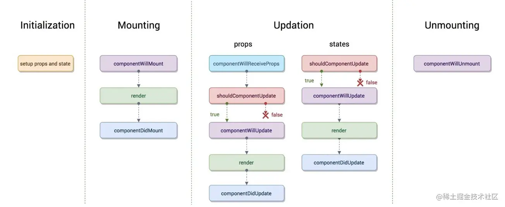

React篇（建议可以从第四点的reack-hooks学习大全开始看）

# 了解useCallback、useMemo、React.memo的使用时机

>学习地址： https://juejin.cn/post/7010278471473594404、https://juejin.cn/post/6844904001998176263

# React.useRef

**基础用法：**`const valueRef = useRef(value);`

**useRef特性：**

* 组件重新渲染（在组件的整个生命周期内），useRef的引用仍*不会改变*；

* useRef的改变不会让组件重新渲染（render）；

* useRef能够获取到dom；

```js
import { useRef,useEffect } from "react";
export default function App() {
    const ref = useRef() // 和dom节点绑在一起，不需要初始值
    useEffect(()=>{
        console.log(ref.current); // 打印结果：<div>ref获取dom</div>
    },[])
    return (
        <div>
            <div ref={ref}>ref获取dom</div>
        </div>
    )
}
```

`useRef`和`createRef`两者都可以去获取dom，但是createRef在组件每次渲染都会重新调用一次createRef，而useRef并不会。

**使用场景：**

1. 保持分页状态，将pageNo和pageSize可以存在useRef里

   在分页的table里面做了些操作（比如说添加），然后添加完，当要refresh这个组件时不想从第一页开始继续查看，这时候可以从useRef里取到重渲染前的页码。

>学习地址：[https://www.jb51.net/article/209497.html](https://www.jb51.net/article/209497.html) 、[https://codeantenna.com/a/rxsWJmuOgR](https://codeantenna.com/a/rxsWJmuOgR)

# react ref属性 和 Refs

# react 生命周期 和hooks

旧生命周期：



新生命周期：（v16.3）


废弃了`componentWillMount componentWillReceiveProps componentWillUpdate` 这三个生命周期钩子函数。

并为他们取了别名`UNSAFE_componentWillMount UNSAFE_componentWillReceiveProps UNSAFE_componentWillUpdate`。

|  class组件   | hooks组件  |  作用  |
|  ----  | ----  | ----  |
| constructor  | useState |  初始化state  |
| getDerivedStateFormProps  | useState返回的更新state的函数 |  更新state  |
| shouldComponentUpdate  | useMemo |  指定的state发生改变时才更新组件  |
| render  | 无 |  渲染dom，返回reactDom（不能在render中执行setState，否则会触发死循环导致内存崩溃）  |
| getSnapshotBeforeUpdate  | useRef |  访问Dom  |
| componentDidMount  | useEffect |  组件挂载后执行  |
| componentDidUpdate  | useEffect |  组件更新后执行  |
| componentWillUnmount  | useEffect里面返回的函数 |  卸载之前执行  |


>参考链接 [https://juejin.cn/post/6914112105964634119](https://juejin.cn/post/6914112105964634119)


# reack-hooks
> 学习地址 https://github.com/puxiao/react-hook-tutorial
**Hooks规则、特性：**
* Hooks只能运行在函数组件中，不能运行在类组件中。只能运行在函数组件的“内部顶层中”。

    Hooks不能运行在if/for等其他函数的代码体内，不允许被if/for等包裹住。
    
    可以在React的函数组件中调用Hooks，可以在自定义Hooks中调用其他Hooks。

* Hooks函数必须为纯函数

    所谓纯函数就是函数内部不能修改可能影响执行结果的任意参数，确保每次执行的代码结果都是一样的

* 尽管函数组件拥有了类组件多大多数的相似特性，但有一点除外：函数组件中没有类组件中“自定义state”的特性，因此你无法在函数组件中使用“this.state.xx”这样的代码

    没有不代表功能的缺失，恰恰相反，因为当你充分了解Hooks之后，你会发现函数组件内部自定义数据状态功能远远超出类组件

* hooks可以实现全局共享数据，代替Redux。

**hooks优势：**
hooks的出现可以解决一些类组件的缺点，比如：
1. 复杂且不容易理解的“this”
2. 类组件组件数据状态逻辑不能重用。
通过自定义Hook，可以数据状态逻辑从组件中抽离出去，这样同一个Hook可以被多个组件使用，解决组件数据状态逻辑并不能重用的问题。
3. 组件之间传值过程复杂、复杂场景下代码难以组织在一起。
通过React内置的`useState()、useEffect()`函数分别可以降低state复杂度和可维护性、将多个生命周期函数关联成一个处理函数。

## *useState*
useState能够解决类组件 所有自定义变量只能存储在this.state 的问题。

类组件定义state：
```js
constructor(props) {
    super(props);
    this.state = {
      name:'wanwan',
      age:18
    }
}
```
函数组件使用useState：（基本使用方法）
```js
// state为简单类型
const [name,setName] = useState('wanwan');
const [age,setAge] = useState(18);

//state为object
const [person, setPerson] = useState({name:'wanwan',age:18});
//修改person的age属性的正确姿势
setPerson({...person,age:18});
```

需要注意，类组件中setState赋值过程是异步的，同样在Hook中 setXxx 赋值也是`异步的`。例如：
```js
function Component() {
  const initCount = 0;
  const [count, setCount] = useState(initCount);
  const change = (value) => {
    for(let i=0; i<3; i++){
        setCount(value+1);
    }
  }

  return <div>
    {count}
    <button onClick={() => {change(initCount)}}>init</button>
  </div>
}
export default Component;
```
通过for循环，执行了3次setCount(count+1)，那么你觉得count会 +3 吗？

答案是：肯定不会。无论for循环执行几次，最终实际结果都将是仅仅执行一次 +1。


虽然执行了3次setCount(count+1)，可是每一次修改后的count并不是立即生效的。当第2次和第3次执行时获取到count的值和第1次获取到的count值是一样的，所以最终其实相当于仅执行了1次。

解决方法：`不直接赋值，而是采用“箭头函数返回值的形式”赋值。`
```js
const change = (value) => {
    for(let i=0; i<3; i++){
        setCount(prevData => prevData+1);
    }
  }
```

state最好避免使用复杂类型的值：
1. 对于简单类型的值，例如String、Number 新旧值一样的情况下是不会引起重新渲染的；
2. 对于复杂类型的值，即使新旧值 “看上去是一样的” 也会引起`重新渲染`。除非新旧值指向同一个对象，或者可以说成新旧值分别是同一个对象的引用；


## *useEffect*
他的作用是“勾住”函数组件中某些生命周期函数。例如`componentDidMount`(组件被挂载完成后)、`componentDidUpdate`(组件重新渲染完成后)、`componentWillUnmount`(组件即将被卸载前)

useState可以修改数据，数据变更会触发组件重新渲染，上面3个就是和组件渲染关联最紧密的生命周期函数。

`useEffect(effect,[deps])`函数可以传入2个参数，第1个参数为我们定义的执行函数、第2个参数是依赖关系(可选参数)。若一个函数组件中定义了多个useEffect，那么他们实际执行顺序是按照在代码中定义的先后顺序来执行的。
使用方式:
```js
useEffect(() => {
    //此处编写 组件挂载之后和组件重新渲染之后执行的代码
    ...

    return () => {
        //此处编写 组件即将被卸载前执行的代码
        ...
    }
},[deps])
```
1. effect 函数主体内容中的代码，就是组件挂载之后和组件重新渲染之后你需要执行的代码；
2. effect 函数 return 出去的返回函数主体内容中的代码，就是组件即将被卸载前你需要执行的代码；
3. 第2个参数 [deps]，为可选参数，若有值则向React表明该useEffect是依赖哪些变量发生改变而触发的；

`effect`补充说明
1. 若你不需要在组件卸载前执行任何代码，那么可以忽略不写 effect 中的 return相关代码；

`[deps]`补充说明：
1. 若缺省，则组件挂载、组件重新渲染、组件即将被卸载前，每一次都会触发该useEffect；
2. 若传值，则必须为数组，数组的内容是函数组件中通过useState自定义的变量或者是父组件传值过来的props中的变量，告诉React只有数组内的变量发生变化时才会触发useEffect；
3. 若传值，但是传的是`空数组[]`，则表示该useEffect里的内容仅会在“挂载完成后和组件即将被卸载前”执行一次；


useEffect还可以用来解决类组件某些执行代码被分散在不同的生命周期函数中的问题。

例如：
举例1：若某类组件中有变量a，默认值为0，当组件第一次被挂载后或组件重新渲染后，将网页标题显示为a的值。

在类组件中：
```js
//为了更加清楚看到每次渲染，我们在网页标题中 a 的后面再增加一个随机数字
componentDidMount(){
    document.title = `${this.state.a} - ${Math.floor(Math.random()*100)}`;
}
componentDidUpdate(){
    document.title = `${this.state.a} - ${Math.floor(Math.random()*100)}`;
}
```
相同的代码需要在componentDidMount、componentDidUpdate中写两次。

在函数组件中使用useEffect：
```js
import React, { useState,useEffect} from 'react';

function Component() {
  const [a, setA] = useState(0);//定义变量a，并且默认值为0
  useEffect(() => {
      //无论是第一次挂载还是以后每次组件更新，修改网页标题的执行代码只需要在这里写一次即可
      document.title = `${a} - ${Math.floor(Math.random()*100)}`;
  })
  const clickAbtHandler = (eve) =>{
      setA(a+1);
  }
  return <div>
      {a}
      <button onClick={clickAbtHandler}>a+1</button>
    </div>
}

export default Component;
```


## *useContext*
它的作用是“勾住”获取由React.createContext()创建、<XxxContext.Provider>添加设置的共享数据value值。useContext可以替代<XxxContext.Consumer>标签，简化获取共享数据的代码。

我们知道，原本不同级别的组件之间传递属性值，必须逐层传递，即使中间层的组件不需要这些数据。

在旧版的react中，可以通过以下方式进行数据传递：[参考链接](https://zh-hans.reactjs.org/docs/context.html#reactcreatecontext)

1. 在组件顶层或单独的模块中，由React.createContext()创建一个共享数据对象；
2. 在父组件中添加共享数据对象的引用，通过且只能通过`<XxxContext.provider value={{xx:'xxx'}}></XxxContext.provider>`的形式将数据传递给子组件。
3. 若某一层的子组件需要用到共享数据对象的数据，则可通过`<XxxContext.Consumer></XxxContext.Consumer>`获取到数据；
4. 在类组件中除了`<XxxContext.Consumer>`标签，还有另外一种获取共享数据方式：`static xxx = XxxContext`; 但是这种形式在函数组件中无法使用。

**`useContext`是`<XxxContext.Consumer>`的替代品，可以大量简化获取共享数据值的代码。**

### 基本使用方法：
```js
import GlobalContext from './global-context'; //引入共享数据对象

function Component(){
  const global = useContext(GlobalContext); //在函数组件中声明一个变量来代表该共享数据对象的value值
  //若想获取共享数据对象中的属性xxx的值，直接使用global.xxx即可
  return <div>
    {global.xxx}
  </div>
}
```
需要注意的是，这里执行的依然是`单向数据流`，只可以获取global.xx，不可以直接更改global.xx。

### 父组件同时传递多个共享数据值给1个子组件：
```js
import React,{ useContext } from 'react'

const UserContext = React.createContext();
const NewsContext = React.createContext();

function AppComponent() {
  return (
    <UserContext.Provider value={{name:'puxiao'}}>
        <NewsContext.Provider value={{title:'Hello React Hook.'}}>
            <ChildComponent />
        </NewsContext.Provider>
    </UserContext.Provider>
  )
}

function ChildComponent(){
  const user = useContext(UserContext);
  const news = useContext(NewsContext);
  return <div>
    {user.name} - {news.title}
  </div>
}

export default AppComponent;
```
1. 父组件同时要实现传递2个共享数据对象value值，需要使用<XxxContext.Provider value={obj}>标签进行2次嵌套。
2. 子组件使用了useContext，他可以自由随意使用父组件传递过来的共享数据value，并不需要多次嵌套获取。


### 为什么不使用Redux？
在Hook出现以前，React主要负责视图层的渲染，并不负责组件数据状态管理，所以才有了第三方Redux模块，专门来负责React的数据管理。

但是自从有了Hook后，使用React Hook 进行函数组件开发，实现数据状态管理变得切实可行。只要根据实际项目需求，使用useContext以及下一章节要学习的useReducer，一定程度上是可以满足常见需求的。

`但useContext不能完全替代redux`，因为Context不支持只订阅Context中局部的value，只要context valve一变，所有依赖了此Context的组件就全部render。

## *useReducer*
useReducer是useState的升级版(实际上应该是原始版)，可以实现复杂逻辑修改，而不是像useState那样只是直接赋值修改。

当state 逻辑较复杂且包含多个子值，或者下一个 state 依赖于之前的 state 等场景下，更适合用useReducer。并且，使用 useReducer 还能给那些会触发深更新的组件做性能优化，因为你可以向子组件传递 dispatch 而不是回调函数 。

### 基础用法：

`const [state, dispatch] = useReducer(reducer, initialArg, init);`

```js
function init(initialCount) {
  return {count: initialCount};
}

function reducer(state, action) {
  switch (action.type) {
    case 'increment':
      return {count: state.count + 1};
    case 'decrement':
      return {count: state.count - 1};
    case 'reset':
      return init(action.payload);
    default:
      throw new Error();
  }
}
const initialState = {count: 0};
function Counter({initialCount}) {
  const [state, dispatch] = useReducer(reducer, initialCount, init); // 惰性初始化:将 init 函数作为 useReducer 的第三个参数传入，这样初始 state 将被设置为 init(initialArg)
  return (
    <>
      Count: {state.count}
      <button
        onClick={() => dispatch({type: 'reset', payload: initialCount})}>
        Reset
      </button>
      <button onClick={() => dispatch({type: 'decrement'})}>-</button>
      <button onClick={() => dispatch({type: 'increment'})}>+</button>
    </>
  );
}
```

### 使用useContext和useReducer实现操作全局共享数据
> 参考链接：https://github.com/puxiao/react-hook-tutorial/blob/master/09%20useReducer%E9%AB%98%E7%BA%A7%E7%94%A8%E6%B3%95.md

在运营活动的项目中（qcact-base）也是采用了这样的方式来实现状态管理，父组件暴露了个方法给子组件，子组件执行了父组件提供的方法，就会触发相应的dispatch。

所以，`使用 useReducer + useContext 可以完全替代redux`。

> Recoil dobux
## *useCallback、useMemo*
`useCallback`他的作用是“勾住”组件属性中某些处理函数，创建这些函数对应在react原型链上的变量引用。useCallback第2个参数是处理函数中的依赖变量，只有当依赖变量发生改变时才会重新修改并创建新的一份处理函数。
```js
const memoizedCallback = useCallback(
  () => {
    doSomething(a, b);
  },
  [a, b],
);
```
在a和b的变量值不变的情况下，memoizedCallback的引用不变。即：useCallback的第一个入参函数会被缓存，从而达到渲染性能优化的目的。

`useMemo`他的作用是“减少组件重新渲染时不必要的函数计算”。
```js
const memoizedValue = useMemo(() => computeExpensiveValue(a, b), [a, b]);
```
在a和b的变量值不变的情况下，memoizedValue的值不变。即：useMemo函数的第一个入参函数不会被执行，从而达到节省计算量的目的。

> https://juejin.cn/post/6844904001998176263

## *useRef*


# react-redux在类组件中的使用（比较老的用法，但是公司老旧项目会有）

> 学习地址：https://github.com/Wscats/react-tutorial/tree/master/react/redux


# React Diff 原理解析
> 参考链接：https://km.woa.com/articles/show/511997

# React 的 render 异常处理机制
> 参考链接：https://km.woa.com/articles/show/539330