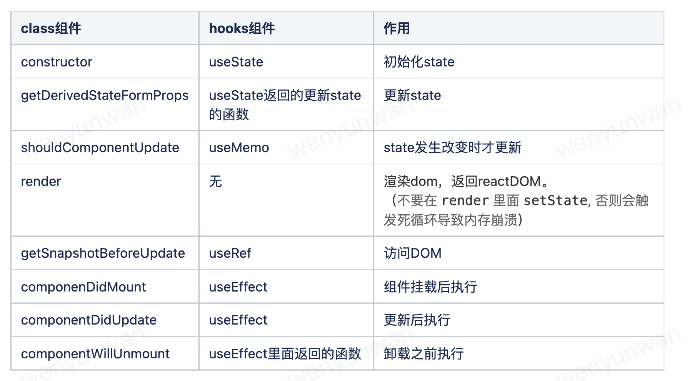

# React篇（建议可以从第四点的reack-hooks学习大全开始看）

## 了解useCallback、useMemo、React.memo的使用时机

*学习地址： [https://juejin.cn/post/7010278471473594404](https://juejin.cn/post/7010278471473594404)*

## React.useRef

**基础用法：**`const valueRef = useRef(value);`

**useRef特性：**

* 组件重新渲染（在组件的整个生命周期内），useRef的引用仍*不会改变*；

* useRef的改变不会让组件重新渲染（render）；

* useRef能够获取到dom；

```js
import { useRef,useEffect } from "react";
export default function App() {
    const ref = useRef() // 和dom节点绑在一起，不需要初始值
    useEffect(()=>{
        console.log(ref.current); // 打印结果：<div>ref获取dom</div>
    },[])
    return (
        <div>
            <div ref={ref}>ref获取dom</div>
        </div>
    )
}
```

`useRef`和`createRef`两者都可以去获取dom，但是createRef在组件每次渲染都会重新调用一次createRef，而useRef并不会。

**使用场景：**

1. 保持分页状态，将pageNo和pageSize可以存在useRef里

   在分页的table里面做了些操作（比如说添加），然后添加完，当要refresh这个组件时不想从第一页开始继续查看，这时候可以从useRef里取到重渲染前的页码。

*学习地址：[https://www.jb51.net/article/209497.html](https://www.jb51.net/article/209497.html) 、[https://codeantenna.com/a/rxsWJmuOgR](https://codeantenna.com/a/rxsWJmuOgR)*

## react ref属性 和 Refs

## react 生命周期 和hooks

旧生命周期：


新生命周期：（v16.3）


废弃了`componentWillMount componentWillReceiveProps componentWillUpdate` 这三个生命周期钩子函数。并为他们取了别名`UNSAFE_componentWillMount UNSAFE_componentWillReceiveProps UNSAFE_componentWillUpdate`。



*参考链接 [https://juejin.cn/post/6914112105964634119](https://juejin.cn/post/6914112105964634119)*

## reack-hooks

按顺序学习 *学习地址 [https://github.com/puxiao/react-hook-tutorial](https://github.com/puxiao/react-hook-tutorial)*

## react-redux在类组件中的使用（比较老的用法，但是公司老旧项目会有）

*学习地址 [https://github.com/Wscats/react-tutorial/tree/master/react/redux](https://github.com/Wscats/react-tutorial/tree/master/react/redux)*

## dobux
