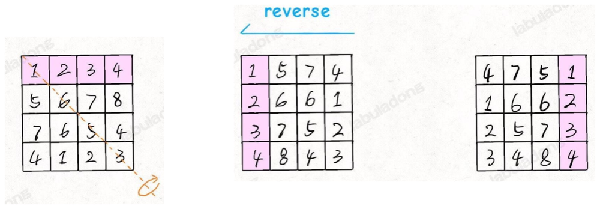
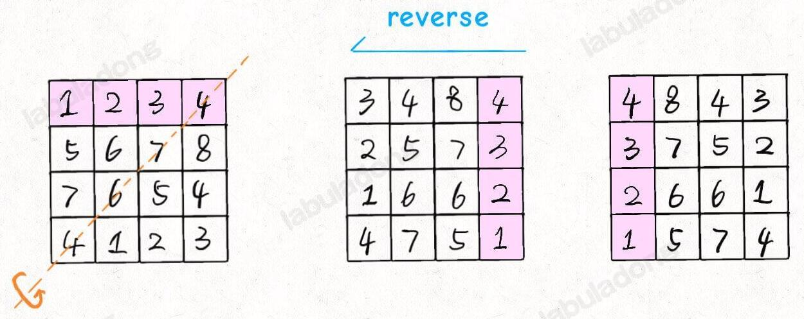

## 顺/逆时针旋转矩阵

**解题思路**：
(以顺时针旋转 90 度为例)

1. 我们可以先将 n x n 矩阵 matrix 按照左上到右下的对角线进行镜像对称
2. 然后再对矩阵的每一行进行反转

如果是逆时针旋转 90 度，则

LC.48 [旋转图像](https://leetcode.cn/problems/rotate-image/)

## 矩阵的螺旋遍历

思路：

LC.54 [螺旋矩阵](https://leetcode.cn/problems/spiral-matrix/)
