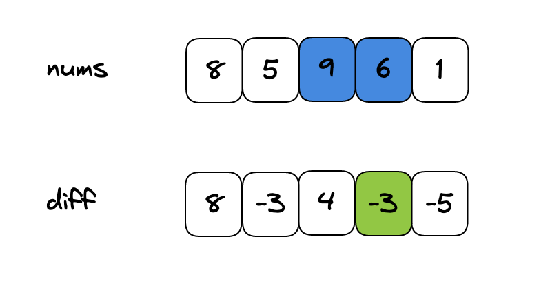
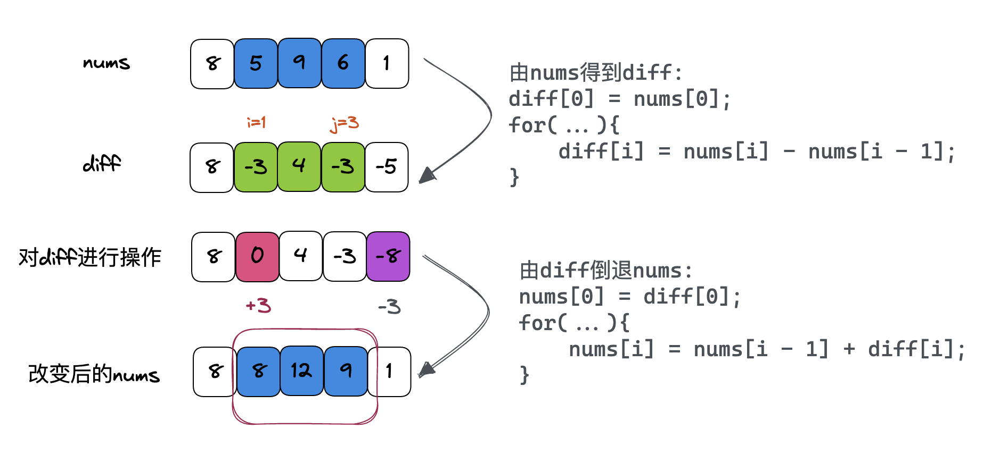

**差分数组**的主要适用场景是频繁对原始数组的某个区间的**元素**进行增减

**常规**的思路很容易，你让我给区间 nums[i..j] 加上 val，那我就一个 for 循环给它们都加上呗，还能咋样？这种思路的时间复杂度是 O(N)，由于这个场景下对 nums 的修改非常频繁，所以效率会很**低下**。


**差分数组**类似前缀和技巧构造的 prefix 数组，我们先对 `nums` 数组构造一个 `diff` 差分数组，`diff[i]` 就是 `nums[i]` 和 `nums[i-1]` 之差：

```js
let diff = new Array(nums.length);
// 构造差分数组
diff[0] = nums[0];
for (int i = 1; i < nums.length; i++) {
    diff[i] = nums[i] - nums[i - 1];
}
```


通过这个 diff 差分数组是可以反推出原始数组 nums 的，代码逻辑如下：
```js
let nums = new Array(diff.length);
// 根据差分数组构造结果数组
nums[0] = diff[0];
for (int i = 1; i < diff.length; i++) {
    nums[i] = nums[i - 1] + diff[i];
}
```
这样构造差分数组 diff，就可以**快速进行区间增减的操作**，如果你想对区间 nums[i..j] 的元素全部加 3，那么只需要让 `diff[i] += 3`，然后再让 `diff[j+1] -= 3`即可。

例如，让nums数组[1, 3]区间的元素全部加3，即i=1, j=3。过程如下：


```js
class Difference {
    /* 构造函数：输入一个初始数组，区间操作将在这个数组上进行 */
    constructor(nums) {
        this.nums = nums;
        this.diff = new Array(nums.length);
        // 根据初始数组构造差分数组
        this.diff[0] = nums[0];
        for (let i = 1; i < nums.length; i++) {
            this.diff[i] = nums[i] - nums[i - 1];
        }
    }

    /* 给闭区间 [i, j] 增加 val（可以是负数）*/
    increment(i, j, val) {
        this.diff[i] += val;
        if (j + 1 < this.diff.length) { // 说明是对 nums[i] 及以后的整个数组都进行修改，那么就不需要再给 diff 数组减 val 了
            this.diff[j + 1] -= val;
        }
    }

    /* 返回结果数组 */
    result() {
        let res = new Array(this.diff.length);
        // 根据差分数组构造结果数组
        res[0] = this.diff[0];
        for (let i = 1; i < this.diff.length; i++) {
            res[i] = res[i - 1] + this.diff[i];
        }
        return res;
    }
}
```