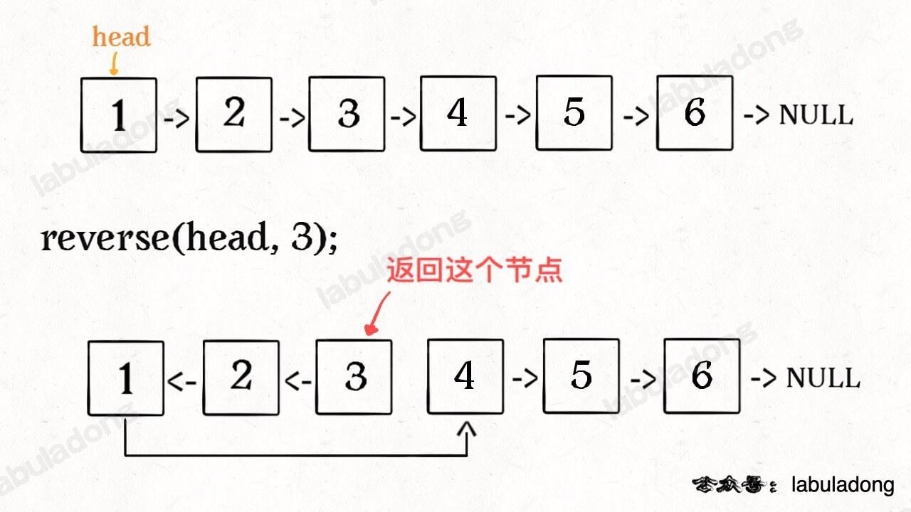
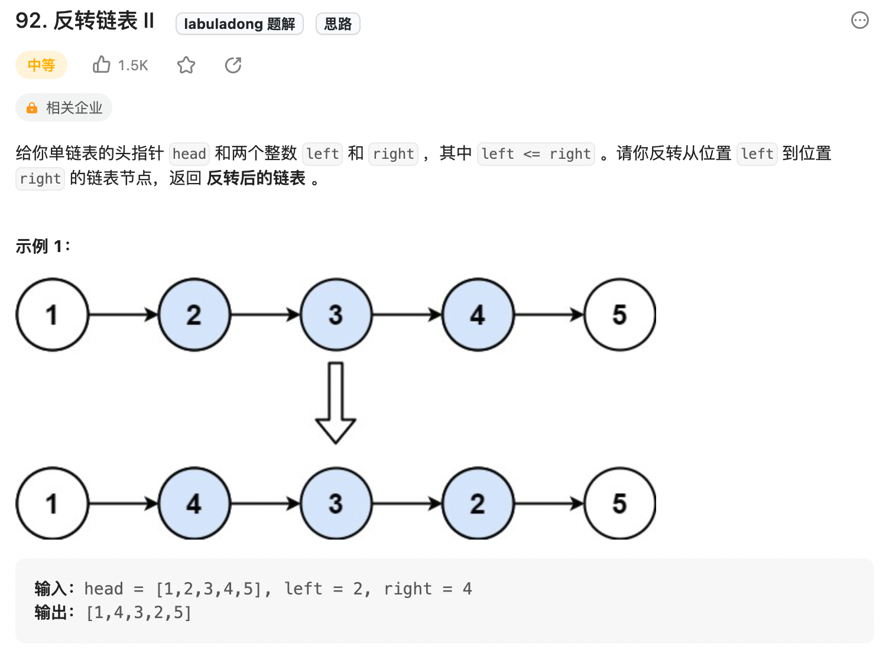

**先看反转链表前N个节点**


```js
let successor = null; // 后驱节点
var reverseN = function(head, n) {
    if (n === 1) {
        // 记录第 n + 1 个节点
        successor = head.next;
        return head;
    }
    let last = reverse(head.next, n-1);
    head.next.next = head;
    // 让反转之后的 head 节点和后面的节点连起来
    head.next = successor;
    return last;
}
```
**反转链表的一部分**



没看懂