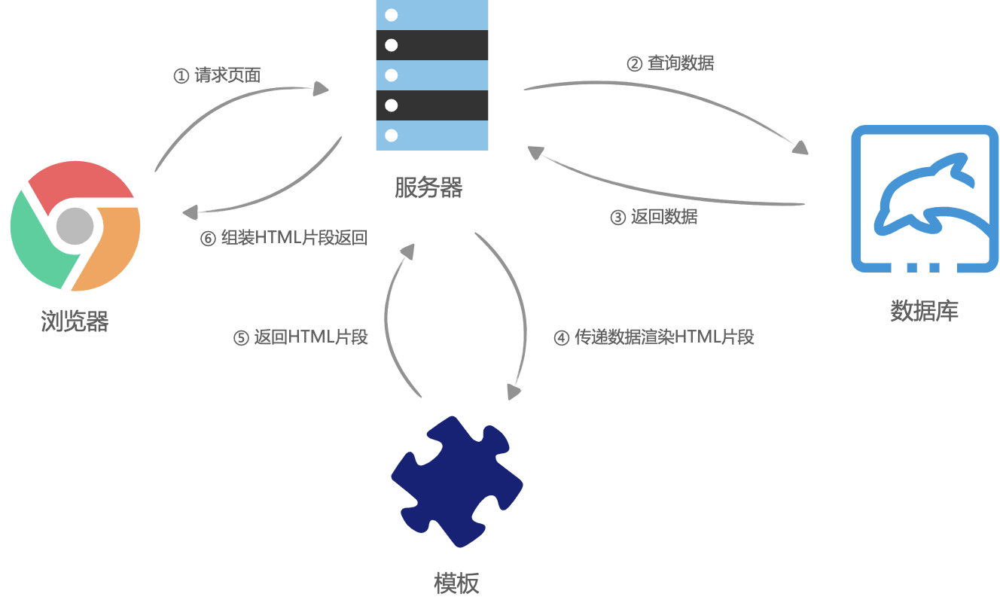

## 没有ajax的时候，页面渲染过程
在没有AJAX的时候，几乎所有应用都是服务端渲染（此时服务器渲染非现在的服务器渲染）。过程：浏览器请求页面URL，然后服务器接收到请求之后，到数据库查询数据，将数据丢到后端的组件模板（php、asp、jsp等）中，并渲染成HTML片段，接着服务器在组装这些HTML片段，组成一个完整的HTML，最后返回给浏览器，这个时候，浏览器已经拿到了一个完整的被服务器动态组装出来的HTML文本，然后将HTML渲染到页面中，过程没有任何JavaScript代码的参与。

缺点：
* 每次更新页面的一小的模块，都需要重新请求一次页面，重新查一次数据库，重新组装一次HTML
* 前端JavaScript代码和后端（jsp、php、jsp）代码混杂在一起，使得日益复杂的WEB应用难以维护

## CSR - 客户端渲染
有了nodejs之后，项目可以做到前后端分离。

浏览器请求URL，前端服务器直接返回一个`空的静态HTML文件`，然后加载了很多`渲染页面需要的 js 脚本`和 CSS 样式表，浏览器拿到 HTML 文件后开始加载脚本和样式表，并且执行脚本，这个时候脚本请求后端服务提供的API，获取数据，获取完成后将数据通过js脚本动态的将数据`渲染`到页面中，完成页面显示。

优点：
* 前后端分离，开发效率高。

缺点：
* 前端响应速度慢，特别是首屏，这样用户是受不了的。
* 不利于SEO优化，因为爬虫不认识SPA，所以它只是记录了一个页面。

重点：`加载完js资源后，在前端生成DOM树。`

## SSR - 服务端渲染
浏览器请求URL，前端服务器接收到URL请求之后，根据不同的URL，前端服务器向后端服务器请求数据，请求完成后，`前端服务器会组装一个携带了具体数据的HTML文本`，并且返回给浏览器，浏览器得到HTML之后开始渲染页面，同时，浏览器加载并执行 js 脚本，给页面上的元素绑定事件，让页面变得可交互，当用户与浏览器页面进行交互，如跳转到下一个页面时，浏览器会执行 js 脚本，向后端服务器请求数据，获取完数据之后再次执行 js 代码动态渲染页面。

优点：
* 尽量不占用前端的资源，前端这块耗时少，速度快。
* 有利于SEO优化，因为在后端有完整的html页面，所以爬虫更容易爬取信息。

缺点：
* 不利于前后端分离，开发的效率降低了。
* 对html的解析，对前端来说加快了速度，但是加大了服务器的压力。

`CSR和SSR本质的区别：是谁来完成了html的完整拼接，服务端渲染是在服务端生成DOM树，客户端渲染是在客户端生成DOM树。`

## SSG - 静态页面生成
// TODO: 待补充

___

> 参考文章
> 1. https://www.modb.pro/db/29765
> 2. https://github.com/yacan8/blog/issues/30