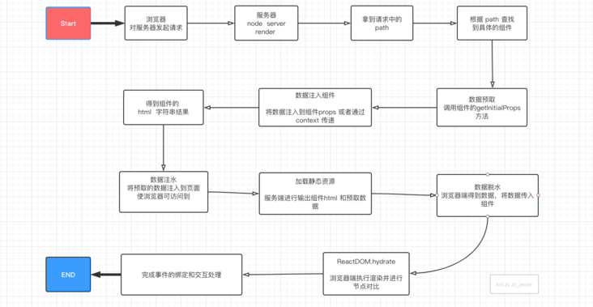

- [没有ajax的时候，页面渲染过程](#没有ajax的时候页面渲染过程)
- [CSR - 客户端渲染](#csr---客户端渲染)
- [SSR - 服务端渲染](#ssr---服务端渲染)
  - [SSR的实现方式](#ssr的实现方式)
  - [react 服务端渲染如何处理路由](#react-服务端渲染如何处理路由)
  - [Next.js](#nextjs)
  - [服务端渲染相关面试题](#服务端渲染相关面试题)
- [SSG - 静态页面生成](#ssg---静态页面生成)
- [ISR - 增量式网站渲染](#isr---增量式网站渲染)
- [同构渲染](#同构渲染)
  - [路由同构](#路由同构)
  - [数据同构（预取同构）](#数据同构预取同构)
  - [渲染同构](#渲染同构)
    - [数据注水](#数据注水)
    - [数据脱水](#数据脱水)
- [SEO](#seo)


> 参考文章
> 1. https://www.modb.pro/db/29765
> 2. https://github.com/yacan8/blog/issues/30
> 3. https://juejin.cn/post/6991397899317805064#heading-4

## 没有ajax的时候，页面渲染过程

在没有AJAX的时候，几乎所有应用都是服务端渲染（此时服务器渲染非现在的服务器渲染）。过程：浏览器请求页面URL，然后服务器接收到请求之后，到数据库查询数据，将数据丢到后端的组件模板（php、asp、jsp等）中，并渲染成HTML片段，接着服务器在组装这些HTML片段，组成一个完整的HTML，最后返回给浏览器，这个时候，浏览器已经拿到了一个完整的被服务器动态组装出来的HTML文本，然后将HTML渲染到页面中，过程没有任何JavaScript代码的参与。


缺点：
* 每次更新页面的一小的模块，都需要重新请求一次页面，重新查一次数据库，重新组装一次HTML
* 前端JavaScript代码和后端（jsp、php、jsp）代码混杂在一起，使得日益复杂的WEB应用难以维护

## CSR - 客户端渲染

有了nodejs之后，项目可以做到前后端分离。

浏览器请求URL，**前端服务器**直接返回一个`空的静态HTML文件`，然后需要通过网络请求 `JS bundle` 和 css ，浏览器拿到 HTML 文件后开始加载脚本和样式表，并且执行脚本，这个时候脚本请求后端服务提供的API，获取数据，获取完成后将数据通过js脚本动态的将数据`渲染`到页面中，完成页面显示。


优点：

- 前后端分离，开发效率高。

缺点：

- 前端响应速度慢，特别是首屏，这样用户是受不了的。
- 不利于SEO优化，搜索引擎访问页面时，只会看 HTML 中的内容，默认是不会执行 JS，所以抓取不到页面的具体内容

重点：客户端渲染通常需要从服务器端获取数据和模板，然后在**浏览器端**进行数据绑定和渲染。

## SSR - 服务端渲染

浏览器请求URL，前端服务器接收到URL请求之后，根据不同的URL，前端服务器向后端服务器请求数据，请求完成后，`前端服务器会组装一个携带了具体数据的HTML文本`，并且返回给浏览器，浏览器得到HTML之后开始渲染页面，同时，浏览器加载并执行 js 脚本，给页面上的元素绑定事件，让页面变得可交互，当用户与浏览器页面进行交互，如跳转到下一个页面时，浏览器会执行 js 脚本，向后端服务器请求数据，获取完数据之后再次执行 js 代码动态渲染页面。(即，在服务端直接**实时同构渲染**当前用户访问的页面，返回的 HTML 包含页面具体内容，提高用户的体验。)


优点：

- 尽量不占用前端的资源，前端这块耗时少，速度快。
- 有利于SEO优化，因为在后端有完整的html页面，所以爬虫更容易爬取信息。
- 更好的安全性：由于服务端渲染是在服务器端完成的，可以更好地保护敏感数据，不会暴露在客户端环境中。

缺点：

- 不利于前后端分离，开发的效率降低了。
- 对html的解析，对前端来说加快了速度，但是加大了服务器的压力。

`CSR和SSR本质的区别：是谁来完成了html的完整拼接，服务端渲染是在服务端生成DOM树，客户端渲染是由浏览器生成DOM树。`

### SSR的实现方式

服务端渲染的实现一般有两种方法，分别是：

- 在服务器端使用`模板引擎`渲染页面，然后将渲染好的 HTML 发送给客户端展示。这种方式比较适用于传统的后端开发语言，如 PHP、Java 等。
- 在前端框架中使用服务器端渲染插件或库，如 `Next.js`、`Nuxt.js` 等，使得在服务器端也可以渲染 React、Vue 等前端框架渲染的页面并生成 HTML。

实现服务端渲染需要注意以下几点：

- 服务器环境：服务端渲染需要 Node.js 运行环境。
- 构建工具：需要使用 Webpack 等工具来打包渲染的代码。
- 渲染引擎：需要使用 React 官方提供的渲染引擎 `ReactDOMServer.renderToString()` 或者 `ReactDOMServer.renderToStaticMarkup()` 来进行渲染。
- 路由处理：因为服务端渲染是针对某一个页面进行渲染的，需要服务端也能够正确的解析浏览器地址路由。

### react 服务端渲染如何处理路由

React 服务端渲染中处理路由有两种主要方式：静态路由和动态路由。静态路由是指路由信息在应用启动时就已经确定，而动态路由是指路由信息在应用运行时才会动态变化。

对于静态路由，你可以使用第三方的路由库如 React Router 来处理。在服务端，你可以在 `renderToString() `方法中使用 StaticRouter 组件来渲染路由信息。例如：

```javascript
import { StaticRouter } from 'react-router-dom';
import App from './App';

const context = {};
const html = ReactDOMServer.renderToString(
  <StaticRouter location={request.url} context={context}>
    <App />
  </StaticRouter>
);
```

这里我们通过 StaticRouter 组件将当前请求的 URL 传递给路由器，并将路由器渲染的结果插入到 HTML 中。如果你希望在服务端和客户端之间进行同构，在客户端也需要使用相同的路由器和配置。

对于动态路由，你需要自己编写一个路由模块并将其加载到服务端应用中。你可以在路由模块中根据用户请求的 URL 动态生成路由配置，并使用 React Router 的 matchPath 方法进行匹配。例如：

```javascript
const routeResult = routes.find(route => matchPath(req.url, route));
if (!routeResult) {
  next();
  return;
}
const { component } = routeResult;
const initialProps = await (component.getInitialProps ? component.getInitialProps({ req, res }) : Promise.resolve({}));
const context = { initialProps };
const html = ReactDOMServer.renderToString(
  <StaticRouter location={req.url} context={context}>
    <App />
  </StaticRouter>
);
```

在这个例子中，我们首先使用 `matchPath` 方法找到用户请求的 URL 对应的路由，然后根据路由中定义的组件渲染页面。如果定义了 getInitialProps 方法，我们还需要执行它来获取组件的初始化数据。最后，将组件渲染成实际的 HTML 并返回。

### Next.js

Next.js主要是通过以下几个核心机制实现服务端渲染的：

- **服务端渲染(SSR)**：Next.js利用React的服务端渲染能力，在服务器端生成HTML代码，并将其发送给浏览器端；
- **预取机制**（数据同构）：Next.js在路由系统中提供预取机制，可以在页面渲染前预先获取异步数据，然后将获取到的数据注入到组件的props中，这样在组件渲染时就可以直接使用数据。这个机制可以加速页面渲染速度，提升用户体验。
- 自动代码分割：Next.js会自动将页面代码分割成小块，只在必须的时候才会加载这些代码块，减少了无用的代码加载，从而提高页面加载速度。
- 静态文件服务：Next.js提供了静态文件服务，可以为项目的资源提供有效的访问路径，同时也可以缓存一些静态文件，减少请求次数，提高性能。

总的来说，Next.js提供了一套完整的服务端渲染解决方案，不但提高了网站的性能，同时也可以方便的在React应用中使用服务端渲染和其他相关技术。

### 服务端渲染相关面试题

- 你是否了解客户端渲染和服务端渲染？它们有何区别？
- 为什么要使用服务端渲染，它有哪些优势和劣势？
- 如何在 React 和 Vue 中实现服务端渲染？
- 在服务端渲染中，如何处理异步数据请求？
- 如何缓存服务端渲染后的内容？
- 你是否遇到过服务端渲染的性能问题？如何解决？
- 在使用服务端渲染时，如何保证 SEO 优化？
  
## SSG - 静态页面生成

SSG(Static Site Generation) 是指在应用**编译构建时预先渲染页面，并生成静态的 HTML。把生成的 HTML 静态资源部署到服务器**后，浏览器不仅首次能请求到带页面内容的 HTML ，而且不需要服务器实时渲染和响应，大大节约了服务器运维成本和资源。

## ISR - 增量式网站渲染

SSG 存在一个瑕疵：

对于只有几十个页面的个人博客、小型文档站而言，数据有变化时，跑一次全页面渲染的消耗是可以接受的。

但对于百万级、千万级、亿级页面的大型网站而言，一旦有数据改动，要进行一次全部页面的渲染，需要的时间可能是按小时甚至按天计的，这是不可接受的。

所以为了解决这个问题，各种框架和静态网站托管平台都提供了ISR这个方案：

ISR允许在应用运行时再重新生成每个页面 HTML，而不需要重新构建整个应用。

也不是所有场景都适合使用 ISR。对于**实时性**要求较高的场景，比如新闻资讯类的网站，可能 SSR 才是最好的选择。
___


## 同构渲染

> https://juejin.cn/book/6844733810941100045/section/6844733810987237389
> https://segmentfault.com/a/1190000020417285
> https://sanyuan0704.github.io/react-ssr/
> https://johninch.github.io/Roundtable/Question-Bank/Engineering/SSR.html

所谓**同构**，通俗的讲，就是一套 React 代码在服务器上运行一遍，到达浏览器又运行一遍。服务端渲染完成页面结构，浏览器端渲染完成事件绑定。

**SSR+SPA+同构技术（最大限度的重用代码）**，可以实现第一次访问页面是服务端渲染，基于第一次访问后续的交互就是 SPA 的效果和体验，还不影响SEO 效果，这就有点完美了。`Next.js`就是基于这种方式实现的React服务端渲染框架。




----

例子：用jsx作为模版引擎来实现服务端渲染。

<pre style="height: 400px; overflow-y: scroll;">
  <code class="language-javascript">
  const  React  = require('react');
  const { renderToString}  = require('react-dom/server');
  const http = require('http');
  //组件
  class Index extends React.Component{
      constructor(props){
          super(props);
      }
      render(){
          return <h1>{this.props.data.title}</h1>
      }
  }
  //模拟数据的获取
  const fetch = function () {
      return {
          title:'react ssr',
          data:[]
      }
  }
  //服务
  http.createServer((req, res) => {
      if (req.url === '/') {
          res.writeHead(200, {
              'Content-Type': 'text/html'
          });
          const data = fetch();
          const html = renderToString(<Index data={data}/>);
          res.end(html);
      }
  }).listen(8080);
  </code>
</pre>
>ps:以上代码不能直接运行，需要结合babel 使用 @babel/preset-react 进行转换
`npx babel script.js --out-file script-compiled.js --presets=@babel/preset-react`

引出问题：
- **双端路由如何维护？**
  首先我们会发现我在 server 端定义了路由 '/'，但是在 react SPA 模式下我们需要使用react-router来定义路由。那是不是就需要维护两套路由呢？
- **获取数据的方法和逻辑写在哪里？**
  发现数据获取的fetch 写的独立的方法，和组件没有任何关联，我们更希望的是每个路由都有自己的 fetch 方法。
- **服务端 html 节点无法重用**
  虽然组件在服务端得到了数据，也能渲染到浏览器内，但是当浏览器端进行组件渲染的时候直出的内容会一闪而过消失

### 路由同构

双端使用同一套路由规则，node server 通过req url path 进行组件的查找，得到需要渲染的组件。

<pre style="height: 340px; overflow-y: scroll;">
  <code class="language-javascript">
  // routes-config.js
  const Detail = () => {
      return < div > detail < /div>
  }

  const Index = () => {
      return < div > detail < /div>
  }

  const routes = [
  {
      path: "/",
      exact: true,
      component: Home
  }, {
      path: '/detail',
      exact: true,
      component: Detail,
  }, {
      path: '/detail/:a/:b',
      exact: true,
      component: Detail
  }];

  //导出路由表
  export default routes;
  </code>
</pre>

```js
  // 客户端 路由组件
  import routes from './routes-config.js';
  function App(){
    return (
      <Layout>
          <Switch>
            {routes.map((item,index) => (
                <Route path={item.path} key{index}  exact={item.exact} render={item.component}></Route>
            ))}
          </Switch>
      </Layout>
    );
  }
  export default App;
```

再在node服务端进行组件查找，路由匹配其实就是对 组件path 规则的匹配，如果规则不复杂可以自己写，如果情况很多种还是使用官方提供的库来完成。

<pre style="height: 400px; overflow-y: scroll;">
  <code class="language-javascript">
  //引入官方库
  import { matchRoutes } from "react-router-config"; // 功能是实现嵌套路由的查找
  import routes from './routes-config.js';

  const path = req.path;

  const branch = matchRoutes(routes, path);

  //得到要渲染的组件
  const Component = branch[0].route.component;
  

  //node server 
  http.createServer((req, res) => {
          const url = req.url;
          //简单容错，排除图片等资源文件的请求
          if(url.indexOf('.')>-1) { res.end(''); return false;}

          res.writeHead(200, {
              'Content-Type': 'text/html'
          });
          const data = fetch();

          //查找组件
          const branch =  matchRoutes(routes,url);

          //得到组件
          const Component = branch[0].route.component;

          //将组件渲染为 html 字符串
          const html = renderToString(<Component data={data}/>);

          res.end(html);

   }).listen(8080);

  </code>
</pre>

至此解决了【双端路由如何维护？】的问题

### 数据同构（预取同构）

这里开始解决我们最开始发现的第二个问题 - 【获取数据的方法和逻辑写在哪里？】

数据预取同构，解决双端如何使用同一套数据请求方法来进行数据请求。

大体流程：在查找到要渲染的组件后，需要预先得到此组件所需要的数据，然后将数据传递给组件后，再进行组件的渲染。

我们可以通过给组件定义静态方法来处理，组件内定义异步数据请求的方法也合情合理，同时声明为静态（static），在 server 端和组件内都也可以直接通过组件（function） 来进行访问。


<pre style="height: 400px; overflow-y: scroll;">
  <code class="language-javascript">
  //组件
  const Index = (props) => {
      return < div >{this.props.data.title}< /div>
  }
  Index.getInitialProps = () => {
    const fetch1 =await fetch('/xxx.com/a');
    const fetch2 = await fetch('/xxx.com/b');
    return {
        res:[fetch1,fetch2]
    }
  }

  //node server 
  http.createServer((req, res) => {
          const url = req.url;
          if(url.indexOf('.')>-1) { res.end(''); return false;}

          res.writeHead(200, {
              'Content-Type': 'text/html'
          });

          //组件查找
          const branch =  matchRoutes(routes,url);

          //得到组件
          const Component = branch[0].route.component;

          //数据预取
          const data = Component.getInitialProps(branch[0].match.params);

          //传入数据，渲染组件为 html 字符串
          const html = renderToString(<Component data={data}/>);
          res.end(html);
   }).listen(8080);

  </code>
</pre>

### 渲染同构

基于上面已经实现的代码，路由能够正确匹配，数据预取正常，服务端可以直出组件的 html ，浏览器加载 js 代码正常，查看网页源代码能看到 html 内容，好像我们的整个流程已经走完。

但是当浏览器端的 js 执行完成后，发现数据重新请求了，组件的重新渲染导致页面看上去有些闪烁。

这是因为在浏览器端，**双端节点对比失败，导致组件重新渲染**，也就是只有当服务端和浏览器端渲染的组件**具有相同的props 和 DOM 结构**的时候，组件才能只渲染一次。

刚刚我们实现了双端的数据预取同构，但是数据也仅仅是服务端有，浏览器端是没有这个数据，当客户端进行首次组件渲染的时候没有初始化的数据，渲染出的节点肯定和服务端直出的节点不同，导致组件重新渲染。

#### 数据注水

在服务端将预取的数据注入到浏览器，使浏览器端可以访问到，客户端进行渲染前将数据传入对应的组件即可，这样就保证了**props的一致**。

需要借助 ejs 模板，将数据绑定到页面上，为了防止 XSS攻击，这里我把数据写到了 textarea 标签里。

<pre style="height: 400px; overflow-y: scroll;">
  <code class="language-javascript">
  //node server  参考代码
  http.createServer((req, res) = >{
  	const url = req.url;
  	if (url.indexOf('.') > -1) {
  		res.end('');
  		return false;
  	}

  	res.writeHead(200, {
  		'Content-Type': 'text/html'
  	});

  	console.log(url);

  	//查找组件
  	const branch = matchRoutes(routes, url);
  	//得到组件
  	const Component = branch[0].route.component;

  	//数据预取
  	const data = Component.getInitialProps(branch[0].match.params);

  	//组件渲染为 html
  	const html = renderToString( < Component data={data}/>);

     // 数据注水
     const propsData = ` < textarea style = "display:none"id =  "krs-server-render-data-BOX" > $ { JSON.stringify(data) } < /textarea>`;

     // 通过ejs模板引擎将数据注入到页面
     ejs.renderFile('./index.html', {
  		htmlContent: html,
  		propsData
  	},

  	// 渲染的数据key: 对应到了ejs中的index
  	(err, data) = >{
  		if (err) {
  			console.log(err);
  		} else {
  			console.log(data);
  			res.end(data);
  		}
  	})
  }).listen(8080);
  </code>
</pre>

```html
//node ejs html
<!DOCTYPE html>
<html lang="en">
<head>
    <meta charset="UTF-8">
    <meta name="viewport" content="width=device-width, initial-scale=1.0">
    <meta http-equiv="X-UA-Compatible" content="ie=edge">
</head>
<body>
    <div id="rootEle">
        <%- htmlContent %> //组件 html内容
    </div>
    <%- propsData %> //组件 init  state ，现在是个字符串
</body>
</html>
</body>
```
#### 数据脱水

上一步数据已经注入到了浏览器端，这一步要在客户端组件渲染前先拿到数据，并且传入组件就可以了。

客户端可以直接使用`id=krs-server-render-data-BOX` 进行数据获取。

```js
//入口  app.js
import React from 'react';
import ReactDOM from 'react-dom';
import { BrowserRouter } from 'react-router-dom';
import Routes from '../';
import Provider from './provider';


//渲染入口  接收脱水数据
function renderUI(initialData) {
    ReactDOM.hydrate(
      <BrowserRouter>
        <Provider initialData={initialData}>
          <Routes />
      </Provider>
    </BrowserRouter>, document.getElementById('rootEle'), (e) => {});
}

//函数执行入口
function entryIndex() {
    let APP_INIT_DATA = {};
    let state = true;

    //取得数据
    let stateText = document.getElementById('krs-server-render-data-BOX');

    if (stateText) {
        APP_INIT_DATA = JSON.parse(stateText.value || '{}');
    }


    if (APP_INIT_DATA) {//客户端渲染
        renderUI(APP_INIT_DATA);
    }
}

//入口执行
entryIndex();
```

到此我们的第三个问题：【服务端 html 节点无法重用 】已经解决


## SEO
- 百度SEO，涉及要素主要包括——meta标签、title、文章标题、关键词、描述、内链、外链、内容原创度、更新频率……
- 微信公众号SEO，涉及要素主要包括——公众号名称关键词匹配度、公众号介绍粉、丝数、互动情况、认证、注册时间、是否原创……