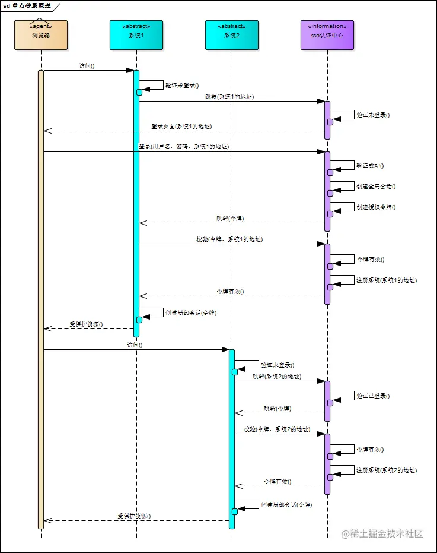
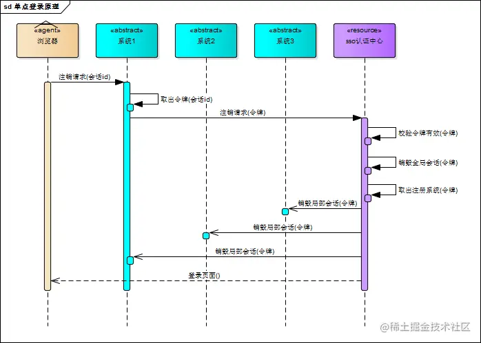

- [sso单点登录](#sso单点登录)
  - [先回顾单系统登录](#先回顾单系统登录)
  - [多系统登录问题](#多系统登录问题)
- [一键换肤](#一键换肤)

### sso单点登录
在多个应用系统中，只需要登录一次，就可以访问其他相互信任的应用系统。

#### 先回顾单系统登录
- 登录：将用户信息保存在Session对象中
    - 如果在Session对象中能查到，说明已经登录
    - 如果在Session对象中查不到，说明没登录（或者已经退出了登录）
- 注销（退出登录）：从Session中删除用户的信息
- 记住我（关闭掉浏览器后，重新打开浏览器还能保持登录状态）：配合`Cookie`来用

- 用户登录时，验证用户的账户和密码
- 生成一个Token保存在数据库中，将Token写到Cookie中
- 将用户数据保存在Session中
- 请求时都会带上Cookie，检查有没有登录，如果已经登录则放行

#### 多系统登录问题

**CAS 中央认证服务方案**

相比于单系统登录，sso需要一个独立的认证中心，只有认证中心能接受用户的用户名密码等安全信息，其他系统不提供登录入口，只接受认证中心的间接授权。间接授权通过令牌实现，sso认证中心验证用户的用户名密码没问题，创建授权令牌，在接下来的跳转过程中，授权令牌作为参数发送给各个子系统，子系统拿到令牌，即得到了授权，可以借此创建局部会话，局部会话登录方式与单系统的登录方式相同。这个过程，也就是单点登录的原理，用下图说明

**登录**


1. 用户访问系统1的受保护资源，系统1发现用户未登录，跳转至sso认证中心，并将自己的地址作为参数
2. sso认证中心发现用户未登录，将用户引导至登录页面
3. 用户输入用户名密码提交登录申请
4. sso认证中心校验用户信息，创建用户与sso认证中心之间的会话，称为全局会话，同时创建授权令牌
5. sso认证中心带着令牌跳转会最初的请求地址（系统1）
6. 系统1拿到令牌，去sso认证中心校验令牌是否有效
7. sso认证中心校验令牌，返回有效，注册系统1
8. 系统1使用该令牌创建与用户的会话，称为局部会话，返回受保护资源
9. 用户访问系统2的受保护资源
10. 系统2发现用户未登录，跳转至sso认证中心，并将自己的地址作为参数
11. sso认证中心发现用户已登录，跳转回系统2的地址，并附上令牌
12. 系统2拿到令牌，去sso认证中心校验令牌是否有效
13. sso认证中心校验令牌，返回有效，注册系统2
14. 系统2使用该令牌创建与用户的局部会话，返回受保护资源

用户登录成功之后，会与sso认证中心及各个子系统建立会话，用户与sso认证中心建立的会话称为全局会话，用户与各个子系统建立的会话称为局部会话，局部会话建立之后，用户访问子系统受保护资源将不再通过sso认证中心

**注销**


- 用户向系统1发起注销请求
- 系统1根据用户与系统1建立的会话id拿到令牌，向sso认证中心发起注销请求
- sso认证中心校验令牌有效，销毁全局会话，同时取出所有用此令牌注册的系统地址
- sso认证中心向所有注册系统发起注销请求
- 各注册系统接收sso认证中心的注销请求，销毁局部会话
- sso认证中心引导用户至登录页面


sso 单点登录，会有一个 sso 单独的域名，里面的cookie 是全局的 cookie，其它业务系统会有自己各自的局部 cookie，当业务系统局部的 cookie 不存在或者失效时候，服务端就会通过 sso 域名下的 全局的 cookie，去请求认证 cas 服务，认证通过后，由后端给自己的业务域名种上局部 cookie。

### 一键换肤
**CSS变量实现**

```css
:root {
  --theme-bg: initial; // 背景色
  --theme-color: initial; // 字体色
  --theme-boder-color: initial; // 边框色
}
```

```js
const darkTheme = 'rgb(51, 50, 50)'
const lightTheme = '#fff'
const lightBorderTheme = '#d6d6d6'

// 获取对应的主题色值
export const getThemeMap = (isLight) => {
  return {
    'theme-bg': isLight ? lightTheme : darkTheme,
    'theme-color': isLight ? darkTheme : lightTheme,
    'theme-boder-color': isLight ? lightBorderTheme : lightTheme,
  }
}

// 设置主题色值
export const setTheme = (isLight = true) => {
  const themeMap = getThemeMap(isLight)
  const body = document.body
  /* 实现方式一 */
  Object.keys(themeMap).forEach(key => {
    body.style.setProperty(`--${key}`, themeMap[key])
  })
}
```
通过 `var() `在组件中应用对应 CSS 变量，比如在头部中的使用：
```html
<style scoped>
.header {
  ...省略
  color: var(--theme-color);
  border-bottom: 1px solid var(--theme-boder-color);
  background-color: var(--theme-bg);
}
...省略
</style>
```

核心在于`body.style.setProperty()` 是 js 中用于设置元素样式的方法之一。它允许您通过修改元素的行内样式来动态改变元素的外观。

`body.style.setProperty(propertyName, value)` 方法接受两个参数：
- `propertyName` 是要修改的样式属性名，如 `"color"`、`"font-size"` 等。
- `value` 是要设置给该属性的新值，可以是一个字符串，表示新的样式值。

```javascript
var body = document.querySelector('body');
body.style.setProperty('background-color', 'red');
```

上述代码会将 `<body>` 元素的背景颜色设置为红色。


**生成多套 CSS 主题样式**

通过生成多套 CSS 主题样式，根据用户切换操作，通过 link 标签动态加载不同的主题样式，主要解决了多个主题色被编译到一个文件中导致单个文件过大.

比如将css 部分直接拆分成 ligth.css 和 dark.css 两个文件，
```js
export default function setTheme(theme = 'ligth') {
  let link = document.querySelector('#theme-link')
  let href = "/theme/" + theme + ".css"
  
  if (!link) {
    let head = document.querySelector('head')
    link = document.createElement('link')
    link.id = '#theme-link'
    link.rel = "stylesheet"
    link.href = href
    head.appendChild(link)
  } else {
    link.href = href
  }
}
```