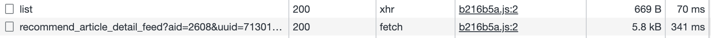

- [Ajax](#ajax)
- [axios和fetch的区别](#axios和fetch的区别)

## Ajax

## axios和fetch的区别
> https://juejin.cn/post/6934155066198720519#heading-2

Axios是对XMLHttpRequest(也是获取资源的接口方式)的封装，而Fetch是一种新的获取资源的接口方式，并不是对XMLHttpRequest的封装。

它们最大的不同点在于Fetch是浏览器原生支持，而Axios需要引入Axios库。Fetch想要实现Axios的部分功能，需要另行封装。