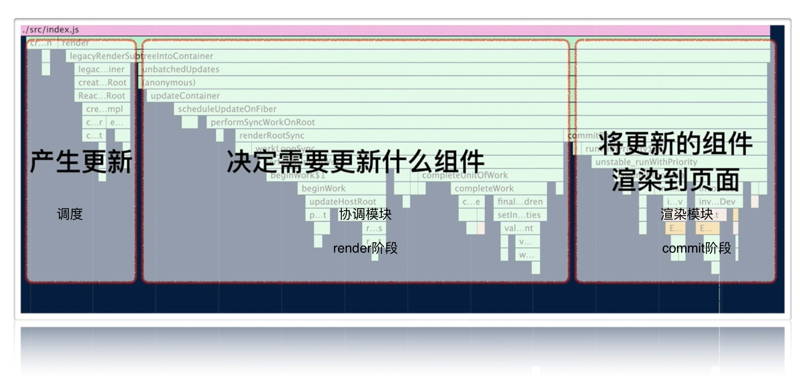
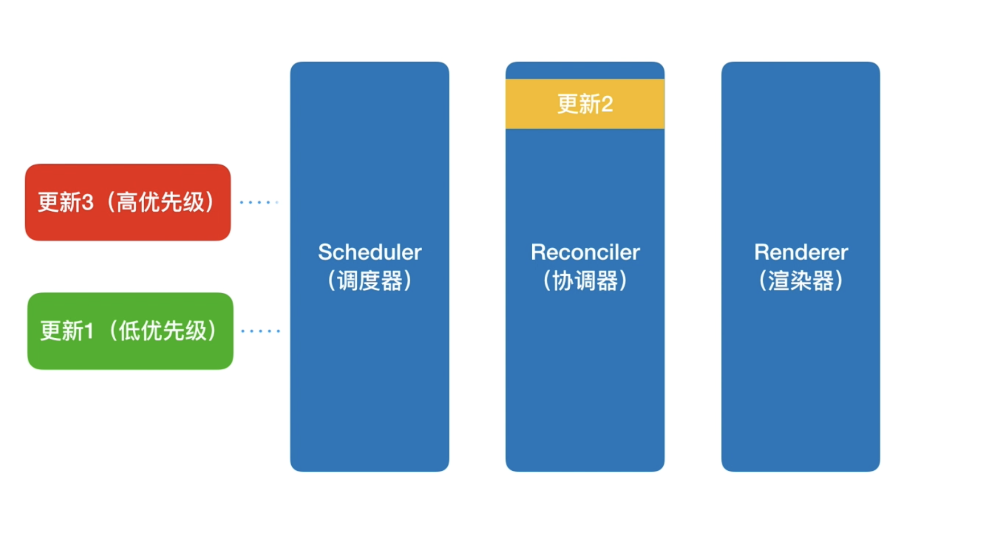
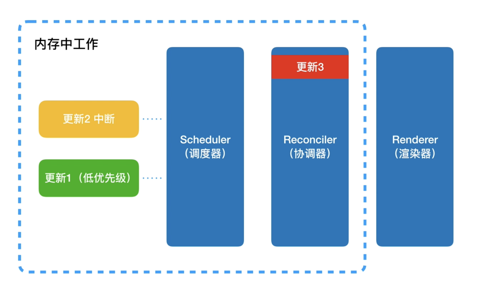
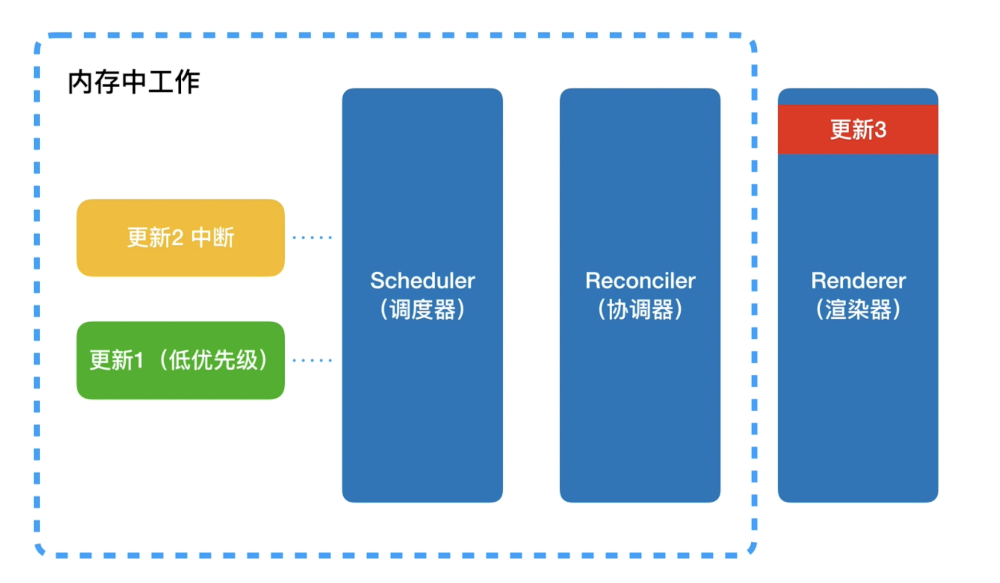
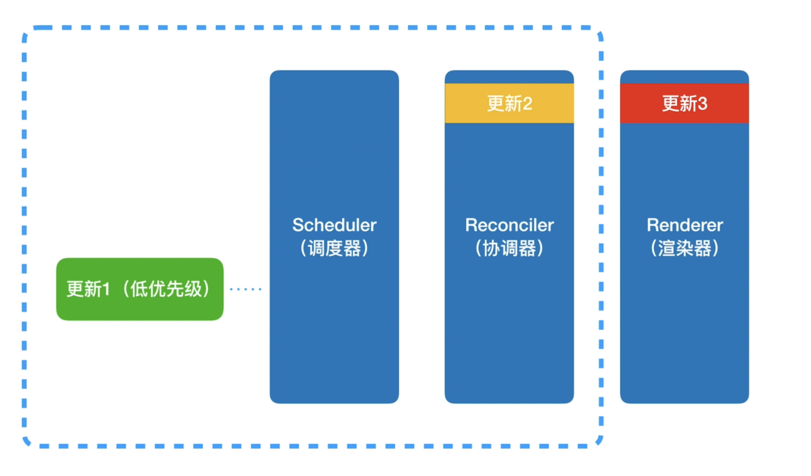
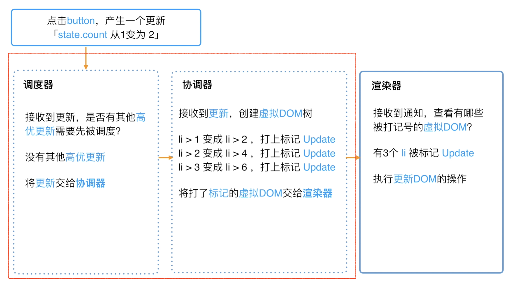
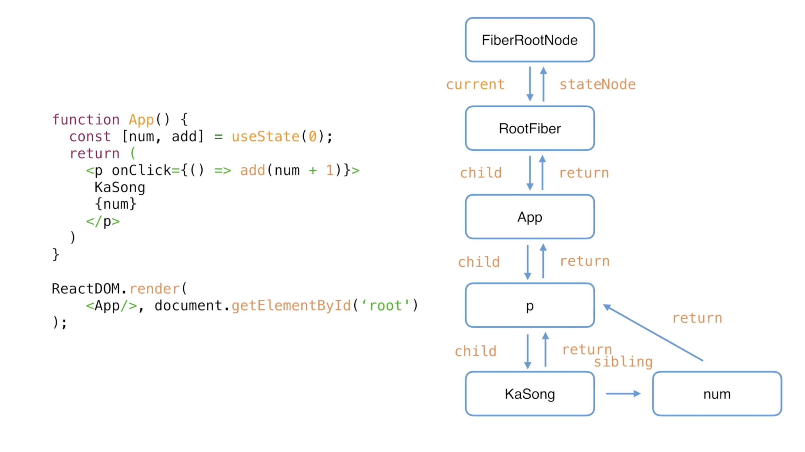
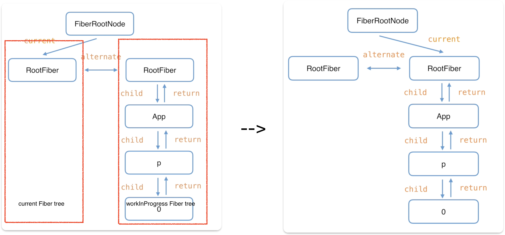

- [前言](#前言)
- [React理念](#react理念)
- [老React架构 - React 15](#老react架构---react-15)
- [新React架构 - React16](#新react架构---react16)
  - [Scheduler（调度器）](#scheduler调度器)
  - [Reconciler（协调器）render阶段](#reconciler协调器render阶段)
  - [Render（渲染器）commit阶段](#render渲染器commit阶段)
  - [例子](#例子)
  - [总结 :heavy\_exclamation\_mark:](#总结-heavy_exclamation_mark)
- [React16协调器架构 -- Fiber](#react16协调器架构----fiber)
  - [Fiber架构的心智模型](#fiber架构的心智模型)
  - [Fiber的三层含义](#fiber的三层含义)
    - [架构层面](#架构层面)
    - [作为静态的数据结构](#作为静态的数据结构)
    - [作为动态的工作单元](#作为动态的工作单元)
  - [Fiber架构的工作原理 - 双缓存 :heavy\_exclamation\_mark:](#fiber架构的工作原理---双缓存-heavy_exclamation_mark)
    - [怎么理解双缓存](#怎么理解双缓存)
    - [Fiber架构双缓存](#fiber架构双缓存)
- [总结](#总结)
- [react源码如何调试？](#react源码如何调试)

> 参考资料：React技术揭秘：https://react.iamkasong.com/preparation/idea.html#react%E7%90%86%E5%BF%B5


## 前言

React入口函数，`ReactDom.render(<p>hello world</p>, root)`

调用栈：


## React理念

React理念是：构建**快速响应**的大型 Web 应用程序。

但由于以下两个瓶颈会制约应用的响应速度：

1. **CPU瓶颈**：当遇到大计算量的操作或者设备性能不足使页面掉帧，导致卡顿。
2. **IO瓶颈**：发送网络请求后，由于需要等待数据返回才能进一步操作导致不能快速响应。

React应对这两大瓶颈的办法是：努力将同步的更新变为`可中断的异步`更新。:heart:

## 老React架构 - React 15

React15架构可以分为两层：

- `Reconciler（协调器）`—— 负责找出变化的组件，diff算法。**递归**处理虚拟DOM。
- `Renderer（渲染器）`—— 负责将变化的组件渲染到页面上，包括DOM节点的增、删、查、改。
  - `浏览器`环境渲染的Renderer
  - ReactNative渲染器，渲染App原生组件
  - ReactTest渲染器，渲染出纯Js对象用于测试
  - ReactArt渲染器，渲染到Canvas, SVG 或 VML (IE8)

React15的缺点

- 协调器和渲染器依次执行工作，
- 更新的过程是同步的。
- 当子组件更新一旦开始，中途就无法中断
- 当层级很深时，递归更新时间超过了16ms，用户交互就会卡顿。

## 新React架构 - React16

React16架构可以分为三层：

- `Scheduler（调度器）`—— 调度任务的优先级，高优任务优先进入Reconciler。:pushpin:
- `Reconciler（协调器）`—— 负责找出变化的组件 :pushpin:
- `Renderer（渲染器）`—— 负责将变化的组件渲染到页面上

**可以看到，相较于React15，React16中新增了Scheduler（调度器），让我们来了解下他。**


### Scheduler（调度器）

React实现了功能更完备的`requestIdleCallback`polyfill，这就是`Scheduler`。会在浏览器空闲时触发回调的功能外，Scheduler还提供了多种调度优先级供任务设置。
> 部分浏览器已经实现了[requestIdleCallback](https://developer.mozilla.org/zh-CN/docs/Web/API/Window/requestIdleCallback)这个API，但存在兼容性问题；并且该方法的触发受很多因素影响，所以不稳定。
> Scheduler是独立于React的库

### Reconciler（协调器）render阶段

在React15中Reconciler是递归处理虚拟DOM的。在React16中，更新工作从递归变成了可以`中断`的`循环`过程。每次循环都会调用`shouldYield`判断当前是否有剩余时间。

```js
function workLoopConcurrent() {
  // Perform work until Scheduler asks us to yield
  while (workInProgress !== null && !shouldYield()) {
    workInProgress = performUnitOfWork(workInProgress);
  }
}
```

**那么React16是如何解决中断更新时DOM渲染不完全的问题呢？**

- 在React16中，Reconciler与Renderer不再是交替工作。当Scheduler将任务交给Reconciler后，Reconciler会为变化的虚拟DOM打上代表`增/删/更新`的标记
- 整个Scheduler与Reconciler的工作都在内存中进行。只有当所有组件都完成Reconciler的工作，才会统一交给Renderer。

Reconciler内部采用了`Fiber`的架构。:heavy_exclamation_mark:

### Render（渲染器）commit阶段

Renderer根据Reconciler为虚拟DOM打的标记，同步执行对应的DOM操作。

### 例子

- 假设有三个更新，优先级依次为低、中、高。
- 当前已有`更新1`和`更新2`。由于`更新2`的优先级更高，所以协调器优先处理`更新2`。
- 当协调器在处理`更新2`的过程中，产生了`更新3`。那么`更新2`会被中断，协调器优先处理`更新3`

  
  

- 由于调度器和协调器都是在内存中进行，不会执行具体的视图操作，所以，即使有被中断的更新，用户也不会看到更新不完全的视图。
- 当协调器完成了某次更新的工作，协调器会通知渲染器执行对应的视图操作

  

- 当高优先级的更新最终完成了渲染，调度器又会开始新一轮的调度

  
  


其中红框中的步骤随时可能由于以下原因被中断：

- 有其他更高优任务需要先更新
- 当前帧没有剩余时间

由于红框中的工作都在内存中进行，不会更新页面上的DOM，所以即使反复中断，用户也不会看见更新不完全的DOM。

### 总结 :heavy_exclamation_mark:

- React16采用`Scheduler（调度器）`和`新的Reconcile(协调器)`
- Scheduler（调度器）会在浏览器空闲时触发回调的功能，还会执行其他操作。
- Reconciler(协调器)内部采用了`Fiber`的架构。目的是为了实现将**同步**的更新变为**可中断的异步**更新。
- Scheduler（调度器）和 Reconcile(协调器)的工作不会被用户看见。只有Render（渲染器）会更新页面上的Dom。所以，即使有被中断的更新，用户也不会看到更新不完全的视图。

## React16协调器架构 -- Fiber

React16**协调器**采用了`Fiber架构`，实现了`异步的可中断更新`。

### Fiber架构的心智模型

[**代数效应**](https://overreacted.io/zh-hans/algebraic-effects-for-the-rest-of-us/)：是函数式编程中的一个概念，用于将副作用从函数调用中分离。也就是说能够将副作用从函数中逻辑中分离，使得函数关注点保持存粹。

**代数效应在React中的应用 - `Hooks`**

对于类似useState、useReducer、useRef这样的Hook，我们不需要关注FunctionComponent的state在Hook中是如何保存的，React会为我们处理。

**代数效应和Generator：**

从React15到React16，协调器（Reconciler）重构的一大目的是：将老的同步更新的架构变为**异步可中断更新**。
`异步可中断更新`可以理解为：更新在执行过程中可能会被打断（浏览器时间分片用尽或有更高优任务插队），当可以继续执行时恢复之前执行的中间状态。
其实，浏览器原生就支持类似的实现，这就是`Generator`。但是Generator的一些缺陷使React团队放弃了他：

- 类似async，Generator也是传染性的，使用了Generator则上下文的其他函数也需要作出改变。这样心智负担比较重。
- Generator执行的中间状态是上下文关联的。

**代数效应与Fiber：**

- React内部实现的一套状态更新机制。支持任务不同`优先级`，可`中断与恢复`，并且恢复后可以复用之前的`中间状态`。

- 其中每个任务更新单元为`React Element`对应的`Fiber节点`。

### Fiber的三层含义

- **架构**层面，之前React15的Reconciler采用递归的方式执行，数据保存在`递归调用栈`中，所以被称为`stack Reconciler`。React16的Reconciler基于`Fiber节点`实现，被称为`Fiber Reconciler`。
- **静态的数据结构**层面，每个`Fiber节点`对应一个`React element`，保存了该组件的类型（函数组件/类组件/原生组件...）、对应的`DOM节点`等信息。
- **动态的工作单元**层面，每个Fiber节点保存了本次更新中该组件`需要更新的状态`、`需要执行的工作`（需要被删除/被插入页面中/被更新...）。

**在React16中，虚拟DOM就是fiber节点**:heavy_exclamation_mark:

#### 架构层面

每个`Fiber节点`有个对应的`React element`，多个Fiber节点是如何连接形成树呢？靠如下三个属性：

```js
// 指向父级Fiber节点
this.return = null;
// 指向子Fiber节点
this.child = null;
// 指向右边第一个兄弟Fiber节点
this.sibling = null;
```

例子：


#### 作为静态的数据结构

作为一种静态的数据结构，保存了组件相关的信息：

```js
// Fiber对应组件的类型 Function/Class/Host...
this.tag = tag;
// key属性
this.key = key;
// 大部分情况同type，某些情况不同，比如FunctionComponent使用React.memo包裹
this.elementType = null;
// 对于 FunctionComponent，指函数本身，对于ClassComponent，指class，对于HostComponent，指DOM节点tagName
this.type = null;
// Fiber对应的真实DOM节点
this.stateNode = null;
```

#### 作为动态的工作单元

作为**动态的工作单元**，每个Fiber节点保存了本次更新中该组件`需要更新的状态`、`需要执行的工作`（需要被删除/被插入页面中/被更新...）。Fiber中用如下参数保存了本次更新相关的信息，

```js
// 保存本次更新造成的状态改变相关信息
this.pendingProps = pendingProps;
this.memoizedProps = null;
this.updateQueue = null;
this.memoizedState = null;
this.dependencies = null;

this.mode = mode;

// 保存本次更新会造成的DOM操作
this.effectTag = NoEffect;
this.nextEffect = null;

this.firstEffect = null;
this.lastEffect = null;
```

### Fiber架构的工作原理 - 双缓存 :heavy_exclamation_mark:

#### 怎么理解双缓存
当我们用canvas绘制动画，每一帧绘制前都会调用ctx.clearRect清除上一帧的画面。

如果当前帧画面计算量比较大，导致清除上一帧画面到绘制当前帧画面之间有较长间隙，就会出现白屏。

为了解决这个问题，我们可以在**内存**中绘制当前帧动画，绘制完毕后直接用当前帧替换上一帧画面，由于省去了两帧替换间的计算时间，不会出现从白屏到出现画面的闪烁情况。

这种在内存中构建并直接替换的技术叫做双缓存 (opens new window)。

#### Fiber架构双缓存

React使用`“双缓存”`来完成`Fiber树`的构建与替换 —— 对应着`DOM树`的创建与更新。

在React中最多会同时存在两棵Fiber树。

- 当前屏幕上`显示内容`对应的Fiber树称为`current Fiber tree`，其对应节点为`current fiber`
- `正在内存中构建`的Fiber树称为`workInProgress Fiber tree`，其对应节点为`workInProgress fiber`

两种节点通过`alternate`属性连接。

React应用的根节点通过使`current`指针在不同`Fiber树`的`rootFiber`间切换来完成current Fiber树指向的切换。

:heavy_exclamation_mark:即当`workInProgress Fiber树`构建完成交给`Renderer`渲染在页面上后，应用根节点的`current`指针指向`workInProgress Fiber树`，此时`workInProgress Fiber树`就变为`current Fiber树`。

`每次状态更新`都会产生`新`的workInProgress Fiber树，通过`current`与`workInProgress`的`替换`，完成`DOM`更新。

fiber树的**构建/替换**分为`mount时`， `update时`。

例子：

```js
function App() {
  const [num, add] = useState(0);
  return (
    <p onClick={() => add(num + 1)}>{num}</p>
  )
}

ReactDOM.render(<App/>, document.getElementById('root'));
```

1. **mount**构建时，

   首次执行ReactDOM.render会创建fiberRootNode（源码中叫fiberRoot）和rootFiber。其中fiberRootNode是整个应用的根节点，rootFiber是`<App/>`所在组件树的根节点。

   

2. **update**时，点击p标签
   


## 总结

通过本章的学习，我们了解了React的`Scheduler(调度器)-Reconciler(协调器)-Renderer(渲染器)`架构体系

- Reconciler工作的阶段被称为`render阶段`。因为在该阶段会调用组件的render方法。
- Renderer工作的阶段被称为`commit阶段`。就像你完成一个需求的编码后执行git commit提交代码。commit阶段会把render阶段提交的信息渲染在页面上。
- render与commit阶段统称为`work`，即React在工作中。相对应的，如果任务正在Scheduler内调度，就不属于work。

## react源码如何调试？

[参考步骤](https://xiaochen1024.com/courseware/60b1b2f6cf10a4003b634718/60b1b32ecf10a4003b63471c)