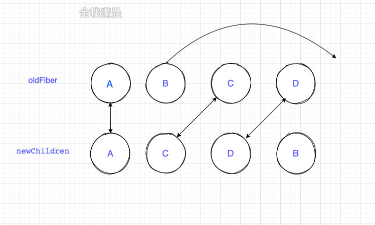
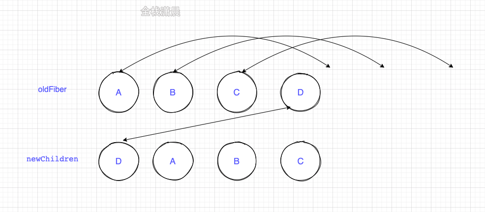

- [前置知识](#前置知识)
- [Diff算法](#diff算法)
  - [概览](#概览)
    - [Diff的瓶颈以及React如何应对](#diff的瓶颈以及react如何应对)
    - [Diff是如何实现的](#diff是如何实现的)
  - [单节点diff](#单节点diff)
  - [多节点Diff](#多节点diff)
    - [Diff思路](#diff思路)
    - [第一轮遍历](#第一轮遍历)
    - [第二轮遍历 - 处理有节点移动的情况：`newChildren`与`oldFiber`都没遍历完的情况](#第二轮遍历---处理有节点移动的情况newchildren与oldfiber都没遍历完的情况)
- [总结](#总结)

# 前置知识

`effectTag`：它表示，Render阶段结束后，通知Render（渲染器）要执行的DOM操作类型。保存在`fiber.effectTag`上。
```js
// DOM需要插入到页面中
export const Placement = /*                */ 0b00000000000010;
// DOM需要更新
export const Update = /*                   */ 0b00000000000100;
// DOM需要插入到页面中并更新
export const PlacementAndUpdate = /*       */ 0b00000000000110;
// DOM需要删除
export const Deletion = /*                 */ 0b0000000000100
```


# Diff算法

>[Diff算法](https://react.iamkasong.com/diff/prepare.html#diff%E7%9A%84%E7%93%B6%E9%A2%88%E4%BB%A5%E5%8F%8Areact%E5%A6%82%E4%BD%95%E5%BA%94%E5%AF%B9)

## 概览

>为了防止概念混淆，这里再强调下
>
>一个DOM节点在某一时刻最多会有4个节点和他相关。
>
>1. `current Fiber`。如果该DOM节点已在页面中，current Fiber代表该DOM节点对应的>Fiber节点。
>
>2. `workInProgress Fiber`。如果该DOM节点将在本次更新中渲染到页面中,workInProgress Fiber代表该DOM节点对应的Fiber节点。
>
>3. `DOM节点本身`。
>
>4. `JSX对象`。即ClassComponent的render方法的返回结果，或FunctionComponent的调用结果。JSX对象中包含描述DOM节点的信息。
>
>Diff算法的本质是对比`1`和`4`，生成`2`。

### Diff的瓶颈以及React如何应对

由于Diff操作本身也会带来性能损耗，即使在最前沿的算法中，将前后两棵树完全比对的算法的复杂程度为 O(n^3)，其中n是树中元素的数量。开销过于高昂。

因此React的diff会预设3个限制：

1. **只对同级元素进行Diff**。如果一个DOM节点在前后两次更新中跨越了层级，那么React不会尝试复用他。
2. **两个不同类型的元素会产生出不同的树**。如果元素由div变为p，React会销毁div及其子孙节点，并新建p及其子孙节点。
3. 开发者可以通过`key`来对元素diff的过程提供复用的线索。

  ```js
  // 更新前
  <div>
    <p key="ka">ka</p>
    <h3 key="song">song</h3>
  </div>
  
  // 更新后
  <div>
    <h3 key="song">song</h3>
    <p key="ka">ka</p>
  </div>
  ```

  如果没有key，React会认为div的第一个子节点由p变为h3，第二个子节点由h3变p。这符合限制2的设定，会**销毁并新建**。
  
  但是当我们用key指明了节点前后对应关系后React知道`key === "ka"`的p在更新后还存在，所以DOM节点可以复用，只是需要交下顺序。

### Diff是如何实现的

我们从Diff的入口函数[`reconcileChildFibers`](https://github.com/facebook/react/blob/1fb18e22ae66fdb1dc127347e169e73948778e5a/packages/react-reconciler/src/ReactChildFiber.new.js#L1280)出发，该函数会根据newChild（即**JSX对象**）类型调用不同的处理函数。

<details>
<summary>diff算法入口源码</summary>

```js
// 根据newChild类型选择不同diff函数处理
function reconcileChildFibers(
  returnFiber: Fiber,
  currentFirstChild: Fiber | null,
  newChild: any,
): Fiber | null {

  const isObject = typeof newChild === 'object' && newChild !== null;

  if (isObject) {
    // object类型，可能是 REACT_ELEMENT_TYPE 或 REACT_PORTAL_TYPE
    switch (newChild.$$typeof) {
      case REACT_ELEMENT_TYPE:
        // 调用 reconcileSingleElement 处理
      // // ...省略其他case
    }
  }

  if (typeof newChild === 'string' || typeof newChild === 'number') {
    // 调用 reconcileSingleTextNode 处理
    // ...省略
  }

  if (isArray(newChild)) {
    // 调用 reconcileChildrenArray 处理
    // ...省略
  }

  // 一些其他情况调用处理函数
  // ...省略

  // 以上都没有命中，删除节点
  return deleteRemainingChildren(returnFiber, currentFirstChild);
}
```

</details>


我们可以从同级的节点数量将Diff分为两类：

1. 当newChild类型为object、number、string，代表同级只有一个节点
2. 当newChild类型为Array，同级有多个节点

## 单节点diff

单节点diff流程如下：


核心在于**如何判断DOM节点是否可以复用？**

- `key`和`type`相同表示可以复用节点
- `key`不同直接标记删除节点，然后新建节点
- `key`相同`type`不同，标记删除该节点和兄弟节点，然后新创建节点

例题，判断如下JSX对象对应的DOM元素是否可以复用：

```jsx
// 习题1 更新前
<div>ka song</div>
// 更新后
<p>ka song</p>

// 习题2 更新前
<div key="xxx">ka song</div>
// 更新后
<div key="ooo">ka song</div>

// 习题3 更新前
<div key="xxx">ka song</div>
// 更新后
<p key="ooo">ka song</p>

// 习题4 更新前
<div key="xxx">ka song</div>
// 更新后
<div key="xxx">xiao bei</div>
```

- 习题1: 未设置key prop默认 key = null;，所以更新前后key相同，都为null，但是更新前type为div，更新后为p，type改变则**不能复用**。
- 习题2: 更新前后key改变，不需要再判断type，**不能复用**。
- 习题3: 更新前后key改变，不需要再判断type，**不能复用**。
- 习题4: 更新前后key与type都未改变，**可以复用**。children变化，DOM的子元素需要更新。

## 多节点Diff

需要处理的情况如下：

1. 节点更新：包括节点属性变化，节点类型变化等

   ```js
   // 之前
   <ul>
     <li key="0" className="before">0<li>
     <li key="1">1<li>
   </ul>
   
   // 之后 
   <ul>
     <li key="0" className="after">0<li> // 情况1 —— 节点属性变化
     <div key="1">1<div> // 情况2 —— 节点类型更新
   </ul>
   ```
2. 节点新增或减少
3. 节点位置变化

   ```js
   // 之前
   <ul>
     <li key="0">0<li>
     <li key="1">1<li>
   </ul>   

   // 之后
   <ul>
     <li key="1">1<li>
     <li key="0">0<li>
   </ul>
   ```

### Diff思路

在日常开发中，相较于新增和删除，**更新**组件发生的频率更高。所以Diff会**优先**判断当前节点是否属于更新。

<!-- >在我们做数组相关的算法题时，经常使用双指针从数组头和尾同时遍历以提高效率，但是这里却不行。
>
>虽然本次更新的JSX对象 newChildren为数组形式，但是和newChildren中每个组件进行比较的是current fiber，同级的Fiber节点是由sibling指针链接形成的单链表，即不支持双指针遍历。
>
>即 newChildren[0]与fiber比较，newChildren[1]与fiber.sibling比较。
>
>所以无法使用双指针优化。 -->

基于以上原因，`Diff`算法的整体逻辑会经历**两轮遍历**：

第一轮遍历：处理**更新**的节点。

第二轮遍历：处理剩下的不属于更新的节点。

### 第一轮遍历

**过程如下：**

1. let `i = 0`，遍历newChildren，将`newChildren[i]`与`oldFiber[i]`比较，判断DOM节点**是否可复用**。
2. 如果**可复用**，`i++`，继续比较`newChildren[i]与oldFiber.sibling`(sibling表示兄弟节点)，可以复用则继续遍历。
3. 如果**不可复用**，分两种情况
   - `key`不同导致不可复用（属于“节点位置变化”的情况），立即跳出整个遍历，**第一轮遍历结束**。
   - key相同，但`type`不同导致不可复用，会创建一个新的fiber节点且标记为`Placement(插入)`，并将oldFiber标记为`DELETION`(删除)，并继续遍历
4. 如果**newChildren遍历完**(即i === newChildren.length - 1)或者**oldFiber遍历完**(oldFiber.sibling === null)，跳出遍历，**第一轮遍历结束**。

**当第一轮遍历结束后，会有两种结果：**

1. 由步骤3跳出的遍历

   此时`newChildren`没有遍历完，`oldFiber`也没有遍历完。

   如下例：

   ```jsx
   // 之前
   <li key="0">0</li>
   <li key="1">1</li>
   <li key="2">2</li>
               
   // 之后
   <li key="0">0</li>
   <li key="2">1</li>
   <li key="1">2</li>
   ```

   第一个节点可复用，遍历到key === 2的节点发现key改变，不可复用，**跳出遍历，等待第二轮遍历处理**。

   此时`oldFiber`剩下key === 1、key === 2未遍历，`newChildren`剩下key === 2、key === 1未遍历。

2. 步骤4跳出的遍历

   可能newChildren遍历完，或oldFiber遍历完，或他们同时遍历完。

   ```jsx
   // 之前
   <li key="0" className="a">0</li>
   <li key="1" className="b">1</li>
               
   // 之后 情况1 —— newChildren与oldFiber都遍历完
   <li key="0" className="aa">0</li>
   <li key="1" className="bb">1</li>
               
   // 之后 情况2 —— newChildren没遍历完，oldFiber遍历完
   // newChildren剩下 key==="2" 未遍历
   <li key="0" className="aa">0</li>
   <li key="1" className="bb">1</li>
   <li key="2" className="cc">2</li>
               
   // 之后 情况3 —— newChildren遍历完，oldFiber没遍历完
   // oldFiber剩下 key==="1" 未遍历
   <li key="0" className="aa">0</li>
   ```

**总结**
第一次遍历结束后，会有如下4种情况：

1. `newChildren`与`oldFiber`同时遍历完

   是最理想的情况：只需在第一轮遍历进行组件更新。此时**Diff结束**。不进行第二次遍历。
2. `newChildren`没遍历完，`oldFiber`遍历完：

   意味着本次更新有**新节点插入**

   **第二次遍历**的工作便是将剩下的newChildren为生成的workInProgress fiber依次标记`Placement`(插入)。
3. `newChildren`遍历完，`oldFiber`没遍历完

   意味着本次更新比之前的节点数量少，**有节点被删除了**。

   所以**第二次遍历**的工作是将剩下的oldFiber，依次标记`Deletion`(删除)。
4. `newChildren`与`oldFiber`都没遍历完

   这意味着有节点在这次**更新中改变了位置**。这是Diff算法最精髓也是最难懂的部分。

### 第二轮遍历 - 处理有节点移动的情况：`newChildren`与`oldFiber`都没遍历完的情况

由于有节点在这次**更新中改变了位置**，所以不能再用位置索引`i`对比前后的节点，而要用到`key`。

为了快速的找到key对应的oldFiber，我们将所有还未处理的oldFiber存入**以key为key，oldFiber为value的Map中**。

```js
const existingChildren = mapRemainingChildren(returnFiber, oldFiber);
```

接下来遍历剩余的newChildren，通过`newChildren[i].key`就能在existingChildren中找到key相同的`oldFiber`。

既然我们的目标是寻找移动的节点，那么我们需要明确：**节点是否移动是以什么为参照物？**

我们的参照物是：**最后一个可复用的节点在oldFiber中的位置索引**（用变量`lastPlacedIndex`表示）。

用变量`oldIndex`表示当前遍历到的可复用节点在oldFiber中的位置索引。

- `if(oldIndex >= lastPlacedIndex)`，代表该可复用节点不需要移动，并执行`lastPlacedIndex = oldIndex`语句
- `if(oldIndex < lastPlacedIndex)`，代表本次更新该节点需要向右移动。

...单纯文字表达比较晦涩，跟着下面两个Demo对照着理解。

例子一:

```js
// 之前
abcd

// 之后
acdb

===第一轮遍历开始===
a（之后）vs a（之前）  
key不变，可复用
此时 a 对应的oldFiber（之前的a）在之前的数组（abcd）中索引为0
所以 lastPlacedIndex = 0;

继续第一轮遍历...

c（之后）vs b（之前）  
key改变，不能复用，跳出第一轮遍历
此时 lastPlacedIndex === 0;
===第一轮遍历结束===


===第二轮遍历开始===
newChildren === cdb，没用完，不需要执行删除旧节点
oldFiber === bcd，没用完，不需要执行插入新节点

将剩余oldFiber（bcd）保存为map

// 当前oldFiber：bcd
// 当前newChildren：cdb

继续遍历剩余newChildren

key === c 在 oldFiber中存在
const oldIndex = c（之前）.index;
此时 oldIndex === 2;  // 之前节点为 abcd，所以c.index === 2
比较 oldIndex 与 lastPlacedIndex;


如果 oldIndex >= lastPlacedIndex 代表该可复用节点不需要移动
并将 lastPlacedIndex = oldIndex;
如果 oldIndex < lastplacedIndex 该可复用节点之前插入的位置索引小于这次更新需要插入的位置索引，代表该节点需要向右移动

在例子中，oldIndex 2 > lastPlacedIndex 0，
则 lastPlacedIndex = 2;
c节点位置不变

继续遍历剩余newChildren

// 当前oldFiber：bd
// 当前newChildren：db

key === d 在 oldFiber中存在
const oldIndex = d（之前）.index;
oldIndex 3 > lastPlacedIndex 2 // 之前节点为 abcd，所以d.index === 3
则 lastPlacedIndex = 3;
d节点位置不变

继续遍历剩余newChildren

// 当前oldFiber：b
// 当前newChildren：b

key === b 在 oldFiber中存在
const oldIndex = b（之前）.index;
oldIndex 1 < lastPlacedIndex 3 // 之前节点为 abcd，所以b.index === 1
则 b节点需要**向右**移动
===第二轮遍历结束===

最终acd 3个节点都没有移动，b节点被标记为移动。
```



例子2:

```js
// 之前
abcd

// 之后
dabc

===第一轮遍历开始===
d（之后）vs a（之前）  
key改变，不能复用，跳出遍历
===第一轮遍历结束===

===第二轮遍历开始===
newChildren === dabc，没用完，不需要执行删除旧节点
oldFiber === abcd，没用完，不需要执行插入新节点

将剩余oldFiber（abcd）保存为map

继续遍历剩余newChildren

// 当前oldFiber：abcd
// 当前newChildren dabc

key === d 在 oldFiber中存在
const oldIndex = d（之前）.index;
此时 oldIndex === 3; // 之前节点为 abcd，所以d.index === 3
oldIndex 3 > lastPlacedIndex 0, 
所以d节点位置不变，且执行lastPlacedIndex = 3;

继续遍历剩余newChildren

// 当前oldFiber：abc
// 当前newChildren abc

key === a 在 oldFiber中存在
const oldIndex = a（之前）.index; // 之前节点为 abcd，所以a.index === 0
此时 oldIndex === 0;
oldIndex 0 < lastPlacedIndex 3
所以 a节点需要**向右**移动

继续遍历剩余newChildren

// 当前oldFiber：bc
// 当前newChildren bc

key === b 在 oldFiber中存在
const oldIndex = b（之前）.index; // 之前节点为 abcd，所以b.index === 1
此时 oldIndex === 1;
oldIndex 1 < lastPlacedIndex 3
所以 b节点需要**向右**移动

继续遍历剩余newChildren

// 当前oldFiber：c
// 当前newChildren c

key === c 在 oldFiber中存在
const oldIndex = c（之前）.index; // 之前节点为 abcd，所以c.index === 2
此时 oldIndex === 2;
oldIndex 2 < lastPlacedIndex 3
则 c节点需要**向右**移动

===第二轮遍历结束===
```

可以看到，我们以为从 abcd 变为 dabc，只需要将d**向左**移动到前面。

但实际上React**保持d不变**，将abc分别**向右**移动到了d的后面。

从这点可以看出，**考虑性能**，我们要尽量减少将节点从后面移动到前面的操作。(:star:**React性能优化Tips**)

# 总结

react采用的是从左到右依次比对的方式，当一个集合只是把最后一个节点移动到了第一个，react会把前面的节点依次移动，而vue只会把最后一个节点移动到最后一个