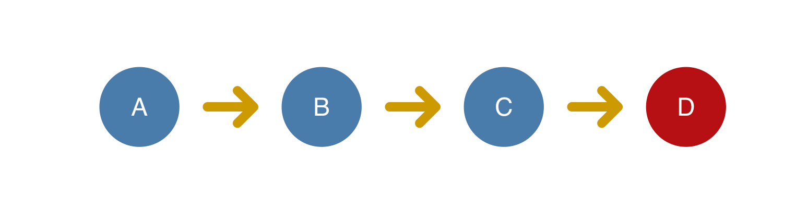
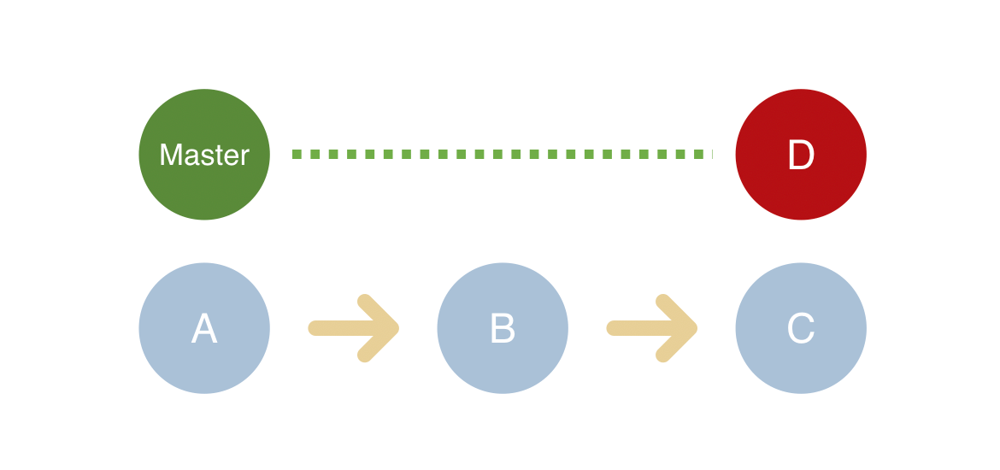
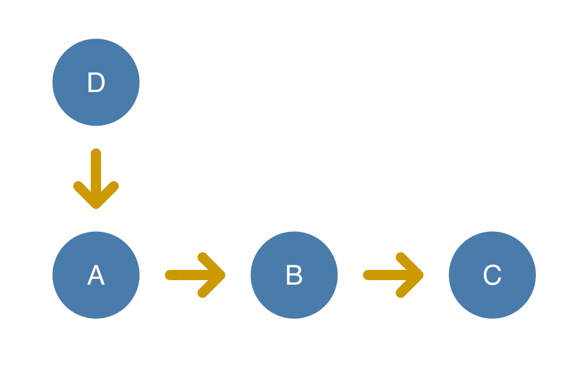
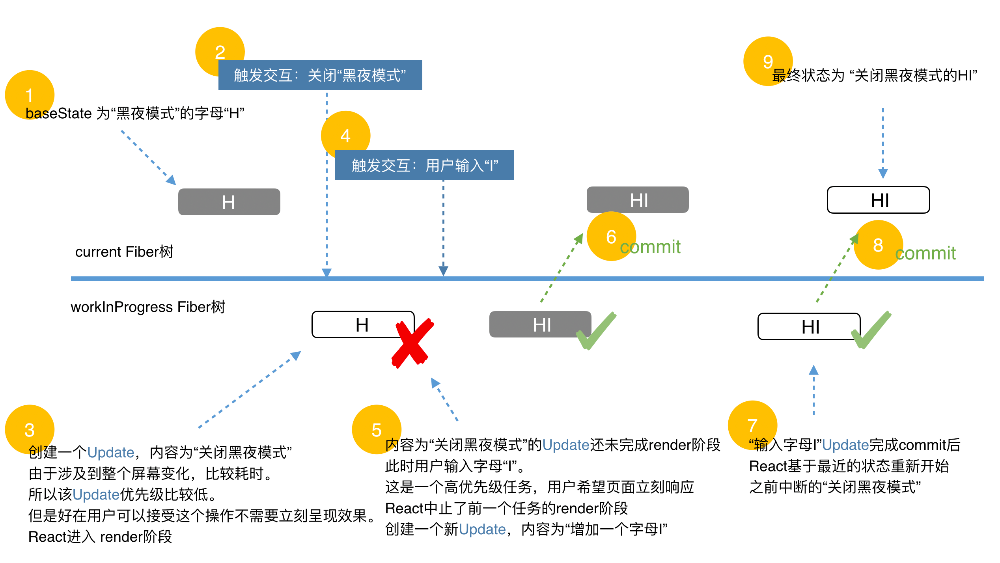

- [流程概览](#流程概览)
- [心智模式（同步，并发更新React）](#心智模式同步并发更新react)
- [触发状态更新，Update分类](#触发状态更新update分类)
- [Update :exclamation:](#update-exclamation)
  - [Update的结构](#update的结构)
  - [Update与Fiber的联系 - updateQueue](#update与fiber的联系---updatequeue)
  - [updateQueue](#updatequeue)
  - [例子:star:](#例子star)
- [调度更新，深入理解优先级](#调度更新深入理解优先级)
  - [如何保证Update不丢失](#如何保证update不丢失)
  - [如何保证状态依赖的连续性](#如何保证状态依赖的连续性)
- [ReactDOM.render](#reactdomrender)
- [this.setState](#thissetstate)

>[状态更新](https://react.iamkasong.com/state/prepare.html#%E5%87%A0%E4%B8%AA%E5%85%B3%E9%94%AE%E8%8A%82%E7%82%B9)

本节我们介绍`ClassComponent与HostRoot`的Update原理，`FunctionComponent`对应的Update在《Hooks章节》介绍

# 流程概览

```js
触发状态更新（根据场景调用不同的方法，类组件有：`render`, `setState`, 函数组件有：`useState`）
    |
    v
创建Update对象（接下来三节详解，是React响应机制的关键）
    |
    v
从fiber到root（`markUpdateLaneFromFiberToRoot`， 即从触发状态更新的fiber一直向上遍历到rootFiber，并返回rootFiber。）
    |
    v
调度更新（`ensureRootIsScheduled`，即通知Scheduler调度器根据更新的优先级，决定以同步还是异步的方式调度本次更新。）
    |
    v
render阶段（`performSyncWorkOnRoot` 或 `performConcurrentWorkOnRoot`）
    |
    v
commit阶段（`commitRoot`）
```

# 心智模式（同步，并发更新React）

将**更新机制**类比**代码版本控制**。

- 同步更新React：如果线上有个紧急bug需要修复(红色节点)，必须先将之前的代码提交。没有优先级的概念
  

- 并发更新React：紧急线上bug需要修复时，我们暂存当前分支的修改，在master分支修复bug并紧急上线。然后开发分支基于修复bug的版本继续开发。
  <figure class="third">
    
  </figure>

  待高优更新完成后，`低优更新`基于`高优更新的结果`重新更新。

# 触发状态更新，Update分类

我们将可以**触发更新的方法**所隶属的组件分类：

- ReactDOM.render —— HostRoot
- this.setState —— ClassComponent
- this.forceUpdate —— ClassComponent
- useState —— FunctionComponent
- useReducer —— FunctionComponent

一共三种组件（`HostRoot | ClassComponent | FunctionComponent`）可以触发更新。

由于不同类型组件工作方式不同，所以存在**两种不同结构的Update**

- 其中`ClassComponent与HostRoot`共用一套Update结构
- `FunctionComponent`单独使用一种Update结构。

虽然他们的结构不同，但是他们工作机制与工作流程大体相同。在本节我们介绍前一种Update（即`ClassComponent与HostRoot`），`FunctionComponent`对应的Update在《Hooks章节》介绍

# Update :exclamation:

## Update的结构

```js
const update: Update<*> = {
  eventTime, // 任务时间，通过performance.now()获取的毫秒数。
  lane, // 优先级相关字段。
  suspenseConfig, // Suspense相关，暂不关注。
  tag: UpdateState, // 更新的类型，包括UpdateState | ReplaceState | ForceUpdate | CaptureUpdate。
  payload: null, // 更新挂载的数据，不同类型组件挂载的数据不同。对于ClassComponent，payload为this.setState的第一个传参。对于HostRoot，payload为ReactDOM.render的第一个传参。
  callback: null, // 更新的回调函数。
  next: null, // 与其他Update连接形成链表。
};
```

## Update与Fiber的联系 - updateQueue

Update存在一个连接其他Update形成**链表**的字段next。

联想到React中另一种以**链表**形式组成的结构`Fiber`。

从《fiber架构-双缓存机制》一节我们知道，Fiber节点组成Fiber树，页面中最多同时存在两棵Fiber树：

- 代表当前页面状态的`current Fiber`树
- 代表正在`render阶段`的`workInProgress Fiber`树

类似Fiber节点组成Fiber树，Fiber节点上的**多个Update**会组成**链表**并被包含在`fiber.updateQueue`中。

> 什么情况下一个Fiber节点会存在多个Update？
> 比如：
> 
> ```js
> onClick() {
>   this.setState({ a: 1 })
>   this.setState({ b: 1 })
> }
> ```
>在一个ClassComponent中触发this.onClick方法，方法内部调用了两次this.setState。这会在该fiber中产生两个`Update`。

Fiber节点最多同时存在**两个updateQueue**：

- `current fiber`保存的updateQueue即`current updateQueue`
- `workInProgress fiber`保存的updateQueue即`workInProgress updateQueue`

在commit阶段完成页面渲染后，workInProgress Fiber树变为current Fiber树，workInProgress Fiber树内Fiber节点的updateQueue就变成current updateQueue。

## updateQueue

`ClassComponent与HostRoot`使用的UpdateQueue结构如下：

```js
const queue: UpdateQueue<State> = {
  baseState: fiber.memoizedState, // 本次更新前该Fiber节点的state，Update基于该state计算更新后的state
  firstBaseUpdate: null, // 本次更新前该Fiber节点已保存的Update。以链表形式存在，链表头为firstBaseUpdate，链表尾为lastBaseUpdate。之所以在更新产生前该Fiber节点内就存在Update，是由于某些Update优先级较低所以在上次render阶段由Update计算state时被跳过。
  lastBaseUpdate: null,
  shared: {
    pending: null, // 触发更新时，产生的Update会保存在shared.pending中形成单向环状链表。当由Update计算state时这个环会被剪开并连接在lastBaseUpdate后面
  },
  effects: null, // 数组。保存update.callback !== null的Update。
};
```

## 例子:star:

假设有一个fiber刚经历`commit`阶段完成渲染。
该fiber上有两个由于优先级过低所以在上次的render阶段并没有处理的Update。他们会成为下次更新的`baseUpdate`。
我们称其为u1和u2，其中`u1.next === u2`。

此时的`fiber.updateQueue`如下：

```js
fiber.updateQueue: UpdateQueue<State> = {
  baseState: u1 --> u2, 
  firstBaseUpdate: u1, 
  lastBaseUpdate: u2,
  ...
};
```

现在我们在fiber上**触发两次状态更新**，这会先后产生两个新的**Update**，我们称为`u3和u4`。

每个 update 都会通过 `enqueueUpdate` 方法**插入到 `updateQueue` 队列**上

按顺序插入u3和u4之后的`fiber.updateQueue`如下：
```js
fiber.updateQueue: UpdateQueue<State> = {
  baseState: u1 --> u2, 
  firstBaseUpdate: u1, 
  lastBaseUpdate: u2,
  shared: {
    pending: u4 ──> u3 // shared.pending 会保证始终指向最后一个插入的update
             ^      |                              
             └──────┘
  },
};
```

更新调度完成后进入**`render`阶段**。此时shared.pending的环被剪开并连接在updateQueue.lastBaseUpdate后面
```js
fiber.updateQueue: UpdateQueue<State> = {
  baseState: u1 --> u2 --> u3 --> u4, 
  ...
};
```

接下来遍历`updateQueue.baseUpdate`链表，以fiber.updateQueue.baseState为初始state，依次与遍历到的每个Update计算并产生`新的state`（该操作类比Array.prototype.reduce）。

在遍历时如果有优先级低的Update会被跳过。

当遍历完成后获得的state，就是该Fiber节点在本次更新的state（源码中叫做memoizedState）。

state的变化在render阶段产生与上次更新不同的JSX对象，通过**Diff算法**产生effectTag，在**commit阶段**渲染在页面上。

渲染完成后`workInProgress Fiber`树变为`current Fiber`树，整个更新流程结束。

# 调度更新，深入理解优先级

React根据**人机交互研究的结果**中用户对交互的预期顺序为交互产生的状态更新赋予不同优先级。

具体如下：

1. 生命周期方法：同步执行。
2. 受控的用户输入：比如输入框内输入文字，同步执行。
3. 交互事件：比如动画，高优先级执行。
4. 其他：比如数据请求，低优先级执行。

每当需要调度任务时，React会调用`Scheduler（调度器）`提供的方法runWithPriority。该方法接收一个优先级常量与一个回调函数作为参数。回调函数会以优先级高低为顺序排列在一个定时器中并在合适的时间触发。

比如：


## 如何保证Update不丢失

在render阶段，`shared.pending`的环被剪开并连接在`updateQueue.lastBaseUpdate`后面。

实际上`shared.pending`会被同时连接在`workInProgress updateQueue.lastBaseUpdate`与`current updateQueue.lastBaseUpdate`后面。

当`render`阶段被中断后重新开始时，会基于`current updateQueue`克隆出workInProgress updateQueue。由于`current updateQueue.lastBaseUpdate已`经保存了上一次的Update，所以不会丢失。

当`commit`阶段完成渲染，由于`workInProgress updateQueue.lastBaseUpdate中`保存了上一次的Update，所以 workInProgress Fiber树变成current Fiber树后也不会造成Update丢失。

## 如何保证状态依赖的连续性

当某个Update由于优先级低而被跳过时，保存在`baseUpdate`中的不仅是该Update，还包括链表中该Update之后的所有Update。

例如：
其中字母代表该Update要在页面插入的字母，数字代表优先级，值越低优先级越高。
```js
baseState: ''
shared.pending: A1 --> B2 --> C1 --> D2
```

1. 第一次render，优先级为1。
    ```js
    baseState: ''
    baseUpdate: null
    render阶段使用的Update: [A1, C1]
    memoizedState: 'AC'
    ```
    其中B2由于优先级为2，低于当前优先级，所以他及其后面的**所有Update**会被保存在baseUpdate中作为下次更新的Update（即`B2 C1 D2`）。
2. 第二次render，优先级为2。
   ```js
   baseState: 'A'
   baseUpdate: B2 --> C1 --> D2
   render阶段使用的Update: [B2, C1, D2]
   memoizedState: 'ABCD'
   ```

通过以上例子我们可以发现，React保证最终的状态一定和用户触发的交互一致，但是中间过程状态可能由于设备不同而不同。

# ReactDOM.render

1. 创建update
   
   从双缓存机制一节我们知道，首次执行`ReactDOM.render`会创建`fiberRootNode`和`rootFiber`。其中`fiberRootNode`是整个应用的根节点，`rootFiber`是要渲染组件所在组件树的根节点。

2. 创建fiber

   这一步发生在`updateContainer`方法中。

# this.setState

可以看到，this.setState内会调用`this.updater.enqueueSetState`方法。

```js
Component.prototype.setState = function (partialState, callback) {
  if (!(typeof partialState === 'object' || typeof partialState === 'function' || partialState == null)) {
    {
      throw Error( "setState(...): takes an object of state variables to update or a function which returns an object of state variables." );
    }
  }
  this.updater.enqueueSetState(this, partialState, callback, 'setState');
};
```

在`enqueueSetState`方法中就是我们熟悉的从`创建update`到`调度update`的流程了。

```js
enqueueSetState(inst, payload, callback) {
  // 通过组件实例获取对应fiber
  const fiber = getInstance(inst);

  const eventTime = requestEventTime();
  const suspenseConfig = requestCurrentSuspenseConfig();

  // 获取优先级
  const lane = requestUpdateLane(fiber, suspenseConfig);

  // 创建update
  const update = createUpdate(eventTime, lane, suspenseConfig);

  update.payload = payload;

  // 赋值回调函数
  if (callback !== undefined && callback !== null) {
    update.callback = callback;
  }

  // 将update插入updateQueue
  enqueueUpdate(fiber, update);
  // 调度update
  scheduleUpdateOnFiber(fiber, lane, eventTime);
}
```
