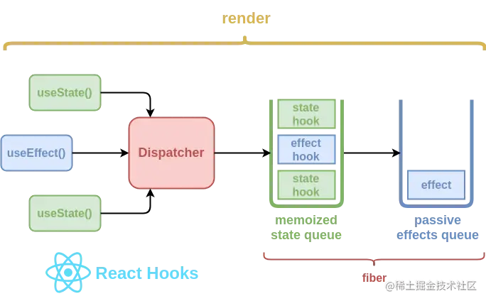

- [Hooks的优势](#hooks的优势)
- [极简实现useState](#极简实现usestate)
  - [useState做了什么？](#usestate做了什么)
  - [update数据结构](#update数据结构)
  - [update如何保存](#update如何保存)
  - [Hook数据结构](#hook数据结构)
  - [模拟React调度更新流程](#模拟react调度更新流程)
  - [计算state](#计算state)
- [总结](#总结)
- [修改state引起重渲染原理? :star:](#修改state引起重渲染原理-star)
- [常用钩子](#常用钩子)

>[React Hooks原理探究，看完不懂，你打我
](https://juejin.cn/post/6891577820821061646#heading-4)
# Hooks的优势

1. 跨组件复用: 其实 render props / HOC 也是为了复用，相比于它们，Hooks 作为官方的底层 API，最为轻量，而且改造成本小，不会影响原来的组件层次结构和传说中的嵌套地狱；
2. 类定义更为复杂:不同的生命周期会使逻辑变得分散且混乱，不易维护和管理；时刻需要关注this的指向问题；代码复用代价高，高阶组件的使用经常会使整个组件树变得臃肿；
3. 状态与UI隔离: 正是由于 Hooks 的特性，状态逻辑会变成更小的粒度，并且极容易被抽象成一个自定义 Hooks，组件中的状态和 UI 变得更为清晰和隔离。

>注意：
>
>1. 避免在 循环/条件判断/嵌套函数 中调用 hooks，保证调用顺序的稳定；
>2. 只有 函数定义组件 和 hooks 可以调用 hooks，避免在 类组件 或者 普通函数 中调用；
>3. 不能在useEffect中使用useState，React 会报错提示；
>4. 类组件不会被替换或废弃，不需要强制改造类组件，两种方式能并存；


# 极简实现useState

## useState做了什么？

先通过以下例子，来看看useState做了什么工作

```js
function App() {
  const [num, updateNum] = useState(0);
  return <p onClick={() => updateNum(num => num + 1)}>{num}</p>;
}
```

1. 通过一些途径产生`更新`，更新会造成组件`render`。此处更新可分为以下两种情况

   - 调用`ReactDOM.render`会产生`mount`(挂载)的更新，更新内容为useState的`initialValue`（即0）。
   - 点击p标签触发`updateNum`会产生一次update的更新，更新内容为`num => num + 1`。
2. 组件`render`时，以`useState`返回的num为更新后的结果。


## update数据结构

我们将`更新`定义成如下数据结构

```js
const update = {
  action, // 更新执行的函数, 对于App来说，点击p标签产生的update的action为num => num + 1。
  next: null // 与同一个Hook的其他更新形成链表 环状单向链表
}
```

## update如何保存

同一个Hooks的多个update通过**环状单向链表**关联起来

调用`updateNum`实际调用的是`dispatchAction.bind(null, hook.queue)`

更新产生的update对象会保存在`queue`中。

```js
function dispatchAction(queue, action) {
  // 创建update
  const update = {
    action,
    next: null
  }

  // 环状单向链表操作
  if (queue.pending === null) {
    update.next = update;
  } else {
    update.next = queue.pending.next;
    queue.pending.next = update;
  }
  queue.pending = update;

  // 模拟React开始调度更新
  schedule();
}
```

假如产生了两个`update`, 分别称之为u0,u1, `queue.pending`情况如下：
```js
queue.pending = u1 ---> u0   
                ^       |
                |       |
                ---------
```

更新产生的update对象会保存在`queue`中。`quene`保存在`FunctionComponent`对应的`fiber`中。

使用如下精简的`fiber`结构：

```js
// App组件对应的fiber对象
const fiber = {
  memoizedState: null, // 保存该FunctionComponent对应的Hooks链表
  stateNode: App // 指向App函数
};
```

## Hook数据结构

接下来我们关注`fiber.memoizedState`中保存的`Hook`的数据结构。

```js
hook = {
  // 保存update的queue，即上文介绍的queue
  queue: {
    pending: null
  },
  // 保存hook对应的state
  memoizedState: initialState,
  // 与下一个Hook连接形成单向无环链表
  next: null
}
```

> 关于`memoizedState`
> 在`fiber`中，`memoizedState`的意义就是指向属于这个fiber的`hooks队列的首个hook`
>
>在`hook`中的`memoizedState`则指的是当前hook缓存的`state`值
## 模拟React调度更新流程

在上文dispatchAction末尾我们通过`schedule`方法模拟React调度更新流程。

```js
function dispatchAction(queue, action) {
  // ...创建update
  // ...环状单向链表操作

  // 模拟React开始调度更新
  schedule();
}
```

现在我们来实现他。我们用`isMount`变量指代是`mount`还是`update`。

```js
// 首次render时是mount
isMount = true;

function schedule() {
  // 更新前将workInProgressHook重置为fiber保存的第一个Hook
  workInProgressHook = fiber.memoizedState;
  // 触发组件render!!!!!!!
  fiber.stateNode();
  // 组件首次render为mount，以后再触发的更新为update
  isMount = false;
}
```

## 计算state

组件render时会调用useState，他的大体逻辑如下：

```js
function useState(initialState) {
  // 当前useState使用的hook会被赋值该该变量
  let hook;

  if (isMount) {
    // ...mount时需要生成hook对象
  } else {
    // ...update时从workInProgressHook中取出该useState对应的hook
  }

  let baseState = hook.memoizedState;
  if (hook.queue.pending) {
    // ...根据queue.pending中保存的update更新state
  }
  hook.memoizedState = baseState;

  return [baseState, dispatchAction.bind(null, hook.queue)];
}
```

Hooks的第一个核心原理：**闭包**，是的Hooks返回的state和setState方法，在hooks内部都是利用闭包实现的

// TODO： 没太看懂，多看几遍

# 总结

React将同一个Hooks的多个update通过**环状单向链表**关联起来，并且在Hooks内部是利用**闭包**返回的state和setState方法。



`dispatcher` 是一个包含了 hooks 函数的共享对象。它将基于 ReactDOM 的渲染阶段被动态地分配或清理，并且它将确保用户无法在React组件外访问到Hooks

# 修改state引起重渲染原理? :star:
详见[《React核心原理3-状态更新》](../../../%E5%89%8D%E7%AB%AF%E6%A1%86%E6%9E%B6//React/React%E6%A0%B8%E5%BF%83%E5%8E%9F%E7%90%86/React%E6%A0%B8%E5%BF%83%E5%8E%9F%E7%90%863-%E7%8A%B6%E6%80%81%E6%9B%B4%E6%96%B0.md)


# 常用钩子

- `useState`: 用于定义组件的 State，对标到类组件中this.state的功能
- `useEffect`：通过依赖触发的钩子函数，常用于模拟类组件中的componentDidMount，componentDidUpdate，componentWillUnmount方法
- `useContext`: 获取 context 对象
- `useReducer`: 类似于 Redux 思想的实现，但其并不足以替代 Redux，可以理解成一个组件内部的 redux，并不是持久化存储，会随着组件被销毁而销毁；属于组件内部，各个组件是相互隔离的，单纯用它并无法共享数据；配合useContext的全局性，可以完成一个轻量级的 Redux
- `useCallback`: 缓存回调函数，避免传入的回调每次都是新的函数实例而导致依赖组件重新渲染，具有性能优化的效果；
useMemo: 用于缓存传入的 props，避免依赖的组件每次都重新渲染；
- `useRef`: 获取组件的真实节点；
- `useLayoutEffect`：DOM更新同步钩子。用法与useEffect类似，只是区别于执行时间点的不同。useEffect属于异步执行，并不会等待 DOM 真正渲染后执行，而useLayoutEffect则会真正渲染后才触发；可以获取更新后的 state；
- `自定义钩子(useXxxxx)`: 基于 Hooks 可以引用其它 Hooks 这个特性，我们可以编写自定义钩子。