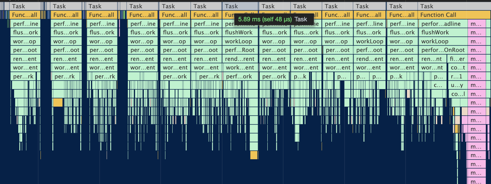

- [前言：React应用的三种模式](#前言react应用的三种模式)
- [概览](#概览)
- [Scheduler调度器的原理与实现](#scheduler调度器的原理与实现)
  - [时间切片原理](#时间切片原理)
  - [优先级调度](#优先级调度)
    - [优先级概念](#优先级概念)
    - [优先级的意义](#优先级的意义)
    - [不同优先级任务的排序](#不同优先级任务的排序)
- [lang模型](#lang模型)
- [异步可中断更新与饥饿问题](#异步可中断更新与饥饿问题)
- [Suspense的实现](#suspense的实现)
  - [简介](#简介)

# 前言：React应用的三种模式

当前React共有三种渲染模式：

- `legacy`，这是当前React使用的方式。当前没有计划删除本模式，但是这个模式可能不支持一些新功能。 -- 由`ReactDOM.render(<App />, rootNode)`开启。
  - 在该模式下，React使用**同步**的渲染方式，一旦开始渲染，将中断渲染其他任务和事件处理，直到渲染完成并提交 DOM 后再返回控制权。

- `blocking`，开启部分concurrent模式特性的中间模式。目前正在实验中。作为迁移到concurrent模式的第一个步骤。 -- 由`ReactDOM.createBlockingRoot(rootNode).render(<App />)`开启。
  - 也称为异步模式，在该模式下，React会将渲染任务拆分成**多个小任务**，在每个小任务中交错执行渲染和浏览器事件处理，从而保证在渲染过程中不会阻塞用户事件的处理。

- `concurrent`，面向未来的开发模式。我们之前讲的`任务中断/任务优先级`都是针对`concurrent`模式 -- 由`ReactDOM.createRoot(rootNode).render(<App />)`开启。
  - 是异步模式，在该模式下，React会根据**优先级**对不同任务进行排序，并进行部分渲染，以尽快实现内容的展示。
  - 在此基础上，还可以**中断渲染以响应更高优先级的任务**，以此保证了用户交互的流畅性。
  


# 概览

`Concurrent` 模式是一组 React 的新功能，可帮助应用保持响应，并根据用户的设备性能和网速进行适当的调整。由于有以下三部分底层架构的支持，才使得Concurrent模式得以实现：

- **Fiber架构**：意义在于，他将单个组件作为工作单元，使以组件为粒度的“异步可中断的更新”成为可能。
- **Scheduler调度器**：当我们配合`时间切片`，就能根据宿主环境性能，为每个工作单元分配一个可运行时间，实现**异步可中断的更新**。
  
  于是，`scheduler`（调度器）产生了。
- **lane模型**：用于控制不同`优先级`之间的关系与行为。

从源码层面讲，Concurrent Mode是一套可控的**多优先级更新架构**。以下是基于Concurrent Mode的新功能。

- `batchedUpdates`：合并多个“更新”的优化方式，以优先级为依据对更新进行合并的
- `Suspense`：可以在组件请求数据时展示一个`pending`状态。请求成功后渲染数据。本质上讲Suspense内的组件子树比组件树的其他部分拥有更低的优先级。
- `useDeferredValue`：返回一个延迟响应的值，该值可能“延后”的最长时间为`timeoutMs`。

   ```js
   const deferredValue = useDeferredValue(value, { timeoutMs: 2000 });
   ```
   在useDeferredValue内部会调用useState并触发一次更新。

   这次更新的优先级很低，所以当前如果有正在进行中的更新，不会受useDeferredValue产生的更新影响。所以useDeferredValue能够返回延迟的值。

# Scheduler调度器的原理与实现

`scheduler`包含两个功能

- 时间切片
- 优先级调度

## 时间切片原理

时间切片的本质是模拟实现`requestIdleCallback`。

除去“浏览器重排/重绘”，下图是浏览器一帧中可以用于执行JS的时机。

```js
一个task(宏任务) -- 队列中全部job(微任务) -- requestAnimationFrame -- 浏览器重排/重绘 -- requestIdleCallback
```

> 常见的宏任务有：渲染事件；用户交互事件；js脚本执行；网络请求、文件读写完成事件； 以及`setTimeout/setInterval`这样的定时器回调等等。
> 常见的微任务有：Promise.then(或.reject)，await下一句语句

`Scheduler`的时间切片功能是通过`task（宏任务）`实现的。

最常见的task当属setTimeout了。但是有个task比setTimeout执行时机更靠前，那就是`MessageChannel`。

**所以`Scheduler`将需要被执行的回调函数作为`MessageChannel`的回调执行。如果当前宿主环境不支持`MessageChannel`，则使用`setTimeout`**

在React的render阶段，开启`Concurrent Mode`时，每次遍历前，都会通过Scheduler提供的`shouldYield`方法判断是否需要中断遍历，使浏览器有时间渲染：
```js
function workLoopConcurrent() {
  // Perform work until Scheduler asks us to yield
  while (workInProgress !== null && !shouldYield()) {
    performUnitOfWork(workInProgress);
  }
}
```

- 在Schdeduler中，为任务分配的初始剩余时间为5ms。
- 随着应用运行，会通过`fps`动态调整分配给任务的可执行时间。



## 优先级调度

### 优先级概念

需要明确的一点是，Scheduler是独立于React的包，所以他的优先级也是**独立**于React的优先级的。

Scheduler对外暴露了一个方法`unstable_runWithPriority`，这个方法可以用来获取优先级。

```js
function unstable_runWithPriority(priorityLevel, eventHandler) {
  switch (priorityLevel) {
    case ImmediatePriority:
    case UserBlockingPriority:
    case NormalPriority:
    case LowPriority:
    case IdlePriority:
      break;
    default:
      priorityLevel = NormalPriority;
  }

  var previousPriorityLevel = currentPriorityLevel;
  currentPriorityLevel = priorityLevel;

  try {
    return eventHandler();
  } finally {
    currentPriorityLevel = previousPriorityLevel;
  }
}
```
可以看到，Scheduler内部存在5种优先级。在React内部凡是涉及到优先级调度的地方，都会使用unstable_runWithPriority。

比如，我们知道`commit`阶段是**同步**执行的。可以看到，commit阶段的起点commitRoot方法的优先级为`ImmediateSchedulerPriority`。

ImmediateSchedulerPriority即`ImmediatePriority`的别名，为最高优先级，会立即执行。

### 优先级的意义

Scheduler对外暴露最重要的方法便是`unstable_scheduleCallback`。该方法用于以某个**优先级**注册回调函数。

比如在React中，之前讲过在commit阶段的beforeMutation阶段会调度`useEffect`的回调：
```js
if (!rootDoesHavePassiveEffects) {
  rootDoesHavePassiveEffects = true;
  scheduleCallback(NormalSchedulerPriority, () => {
    flushPassiveEffects();
    return null;
  });
}
```
这里的回调便是通过scheduleCallback调度的，优先级为NormalSchedulerPriority，即`NormalPriority`。

虽然有了优先级，不同优先级意味着什么？**不同优先级意味着不同时长的任务过期时间，谁快过期了就先执行谁**

```js
var timeout;
switch (priorityLevel) {
  case ImmediatePriority:
    timeout = IMMEDIATE_PRIORITY_TIMEOUT; // -1
    break;
  case UserBlockingPriority:
    timeout = USER_BLOCKING_PRIORITY_TIMEOUT; // 250
    break;
  case IdlePriority:
    timeout = IDLE_PRIORITY_TIMEOUT; // maxSigned31BitInt
    break;
  case LowPriority:
    timeout = LOW_PRIORITY_TIMEOUT; // 10000
    break;
  case NormalPriority:
  default:
    timeout = NORMAL_PRIORITY_TIMEOUT; // 5000
    break;
}

var expirationTime = startTime + timeout;
```

### 不同优先级任务的排序

我们已经知道优先级意味着任务的过期时间。设想一个大型React项目，在某一刻，存在很多不同优先级的任务，对应不同的过期时间。同时，又因为任务可以被延迟，所以我们可以将这些任务按是否被延迟分为：

- 已就绪任务
- 未就绪任务

所以，Scheduler存在两个队列：

- timerQueue：保存未就绪任务
- taskQueue：保存已就绪任务

根据优先级来执行任务的过程：

1. 每当有新的未就绪的任务被注册，我们将其插入timerQueue并根据开始时间重新排列timerQueue中任务的顺序。
2. 当timerQueue中有任务就绪，即startTime <= currentTime，我们将其取出并加入taskQueue。
3. 取出taskQueue中最早过期的任务并执行他。

为了能在`O(1)`复杂度找到两个队列中时间最早的那个任务，Scheduler使用**小顶堆**实现了优先级队列

# lang模型

在React中，存在多种使用不同优先级的情况，比如（以下例子皆为Concurrent Mode开启情况）：

- 过期任务或者同步任务使用同步优先级
- 用户交互产生的更新（比如点击事件）使用高优先级
- 网络请求产生的更新使用一般优先级
- Suspense使用低优先级

React需要设计一套满足如下需要的优先级机制：

- 可以表示优先级的不同
- 可能同时存在几个同优先级的更新，所以还得能表示批的概念
- 方便进行优先级相关计算


lane模型借鉴了同样的概念，使用**31位的二进制**来表示优先级的不同和批的概念。并用**位运算**来进行优先级相关的计算。

**位数越小的赛道优先级越高，某些相邻的赛道拥有相同优先级。**

```js
export const NoLanes: Lanes = /*                        */ 0b0000000000000000000000000000000;
export const NoLane: Lane = /*                          */ 0b0000000000000000000000000000000;

// 同步优先级
export const SyncLane: Lane = /*                        */ 0b0000000000000000000000000000001;
export const SyncBatchedLane: Lane = /*                 */ 0b0000000000000000000000000000010;

export const InputDiscreteHydrationLane: Lane = /*      */ 0b0000000000000000000000000000100;
const InputDiscreteLanes: Lanes = /*                    */ 0b0000000000000000000000000011000;

const InputContinuousHydrationLane: Lane = /*           */ 0b0000000000000000000000000100000;
const InputContinuousLanes: Lanes = /*                  */ 0b0000000000000000000000011000000;

export const DefaultHydrationLane: Lane = /*            */ 0b0000000000000000000000100000000;
export const DefaultLanes: Lanes = /*                   */ 0b0000000000000000000111000000000;

const RetryLanes: Lanes = /*                            */ 0b0000011110000000000000000000000;

export const SomeRetryLane: Lanes = /*                  */ 0b0000010000000000000000000000000;

export const SelectiveHydrationLane: Lane = /*          */ 0b0000100000000000000000000000000;

const NonIdleLanes = /*                                 */ 0b0000111111111111111111111111111;

...
```


可以看到其中有几个变量占用了几条赛道，比如：
```js
const InputDiscreteLanes: Lanes = /*                    */ 0b0000000000000000000000000011000;
export const DefaultLanes: Lanes = /*                   */ 0b0000000000000000000111000000000;
const TransitionLanes: Lanes = /*                       */ 0b0000000001111111110000000000000;
```

# 异步可中断更新与饥饿问题

# Suspense的实现

## 简介

React 的 Suspense 是一种新的组件，它使得组件可以暂时挂起渲染，直到异步操作完成后再继续渲染。这对于处理代码分割（Code Splitting）和数据获取非常有用。

在 React 中，当异步组件还没有完成渲染时，我们通常需要添加 loading、error 处理、判断等条件，以便提示用户正在加载中。而使用 Suspense 可以使得代码更加简洁，没有了一堆判断和处理逻辑。

举个例子，比如我们需要加载一个懒加载的组件：

```jsx
const LazyComponent = React.lazy(() => import('./LazyComponent'));

function App() {
  return (
    <div>
      {/* 这里需要显示 loading 状态 */}
      <React.Suspense fallback={<div>Loading...</div>}>
        <LazyComponent />
      </React.Suspense>
    </div>
  );
}
```

在这个例子中，当加载 `LazyComponent` 组件时，如果组件没有拿到数据或者渲染出错，会显示 fallback 中的 loading 提示，等到数据渲染完成后再显示实际内容。

总之，React 的 Suspense 帮助我们更加优雅地处理了数据的异步加载，使得我们可以写出更简洁、易维护的代码。