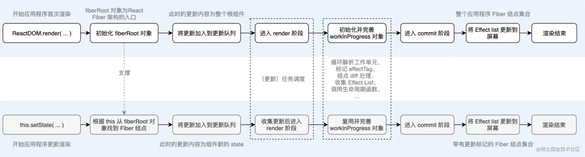
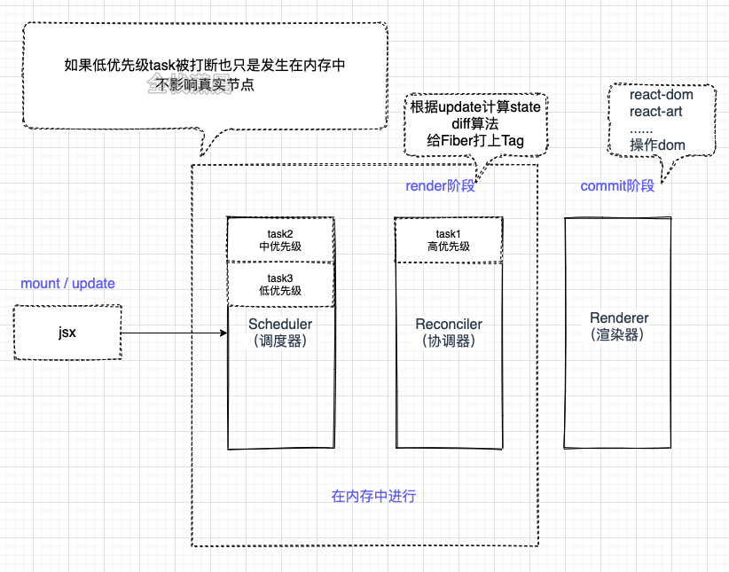
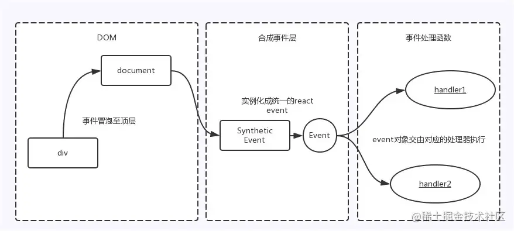

- [架构](#架构)
  - [react渲染过程](#react渲染过程)
  - [详细说明render和commit这两个阶段工作流程](#详细说明render和commit这两个阶段工作流程)
  - [diff算法](#diff算法)
  - [如何理解react框架V16的心智模式](#如何理解react框架v16的心智模式)
- [基础](#基础)
  - [React事件](#react事件)
  - [触发React重新渲染的方法？](#触发react重新渲染的方法)
  - [React插槽(Portals)，场景：对话框，模态窗](#react插槽portals场景对话框模态窗)
  - [Context - 全局状态管理方案](#context---全局状态管理方案)
  - [什么是受控组件和非受控组件？](#什么是受控组件和非受控组件)
    - [antd 表单受控模式和非受控模式？](#antd-表单受控模式和非受控模式)
  - [有状态组件和无状态组件，及其使用场景？](#有状态组件和无状态组件及其使用场景)
    - [函数组件如何实现有状态组件？](#函数组件如何实现有状态组件)
  - [对React中Fragment的理解，它的使用场景是什么？](#对react中fragment的理解它的使用场景是什么)
  - [React getDefaultProps](#react-getdefaultprops)
  - [React state和props有什么区别](#react-state和props有什么区别)
  - [如何在react中获取组件对应的Dom元素？](#如何在react中获取组件对应的dom元素)
  - [React错误边界？](#react错误边界)
- [组件通信](#组件通信)
  - [React 组件通信方式](#react-组件通信方式)
- [其他](#其他)
  - [React服务端渲染如何使用？原理是什么?](#react服务端渲染如何使用原理是什么)
  - [ReactDOMServer.rendertoString()和ReactDOM.hydrate()是什么？](#reactdomserverrendertostring和reactdomhydrate是什么)
  - [React如何进行性能优化？](#react如何进行性能优化)
- [React V15, V16, V18的之间的重大改变？](#react-v15-v16-v18的之间的重大改变)


## 架构

### react渲染过程
>https://cloud.tencent.com/developer/article/2195798
>https://juejin.cn/post/6959120891624030238#heading-27





React16架构可以分为三层：

- Scheduler（调度器）—— 调度任务的优先级，高优任务优先进入Reconciler。📌
- Reconciler（协调器）—— 负责找出变化的组件及更新细节, render阶段 📌
- Renderer（渲染器）—— 负责将变化的组件渲染到页面上 commit 阶段


1. 首先jsx经过babel的ast词法解析之后编程`React.createElement`，React.createElement函数执行之后就是jsx对象，也被称为`virtual-dom`。
2. **处理状态更新(Update)**：
   - 能触发状态更新的方法有`ReactDOM.render`、`this.setState`、`this.forceUpdate` 、`useState` 、`useReducer`
   - 每个更新都有一个更新对象`update`
   - `Update`对象会组成**头尾相连的链表**存放在`fiber.updateQueue`中。其结构下：
      ```js
      const queue: UpdateQueue<State> = {
        baseState: fiber.memoizedState, // 本次更新前该Fiber节点的state，Update基于该state计算更新后的state
        firstBaseUpdate: null, // 本次更新前该Fiber节点已保存的Update。以链表形式存在，链表头为firstBaseUpdate，链表尾为lastBaseUpdate。之所以在更新产生前该Fiber节点内就存在Update，是由于某些Update优先级较低所以在上次render阶段由Update计算state时被跳过。
        lastBaseUpdate: null,
        shared: {
          pending: null, // 触发更新时，产生的Update会保存在shared.pending中形成单向环状链表。当由Update计算state时这个环会被剪开并连接在lastBaseUpdate后面
        },
        effects: null, // 数组。保存update.callback !== null的Update。
      };
      ```
   - 
3. **调度阶段**：不管是在首次渲染还是更新状态的时候，这些渲染的任务都会经过`Scheduler`的调度，Scheduler会根据任务的优先级来决定将哪些任务优先进入render阶段。
  比如用户触发的更新优先级非常高，如果当前正在进行一个比较耗时的任务，则这个任务就会被用户触发的更新打断，先执行较高优先级的任务。具体调度规则如下：
     - 在Scheduler中初始化任务的时候会计算一个**过期时间**，不同类型的任务过期时间不同，优先级越高的任务，过期时间越短，优先级越低的任务，过期时间越长。
     - 在最新的`Lane模型`中，则可以更加细粒度的根据**二进制1的位置**，来决定任务的优先级，通过二进制的融合和相交，判断任务的优先级是否足够在此次render的渲染。
     - Scheduler会分配一个**时间片**给需要渲染的任务，如果是一个非常耗时的任务，如果在一个时间片之内没有执行完成，则会从当前渲染到的Fiber节点**暂停**计算，让出执行权给浏览器，在之后浏览器空闲的时候从之前暂停的那个Fiber节点继续后面的计算，这个计算的过程就是**计算Fiber的差异（也就是`diff`算法）**，并标记副作用。
1. **render阶段**：render阶段的主角是`Reconciler`，render阶段的主要工作是**构建Fiber树**和生成**effectList**。
   - 在mount阶段和update阶段，它会比较**jsx和当前Fiber节点的差异**（`diff`算法指的就是这个比较的过程），将带有EffectTag的Fiber节点标记出来，这些EffectTag有Placement（插入）、Update（更新）、Deletetion（删除）等。
   - 这些带有副作用Fiber节点会加入一条`EffectList(链表)`中。
   > Scheduler和Reconciler都是在内存中工作的，所以他们不影响最后的呈现。
2. **commit阶段**：会遍历`EffectList`，处理相应的生命周期，将这些**副作用应用到真实节点**，这个过程会对应不同的渲染器，在浏览器的环境中就是react-dom，在canvas或者svg中就是reac-art等。 



### 详细说明render和commit这两个阶段工作流程

**mount时**
- **render阶段**：主要工作是构建Fiber树和生成effectList。
  1. 会根据jsx对象构建新的`workInProgressFiber`树
  2. 然后将相应的fiber节点标记为`Placement`，表示这个fiber节点需要被**插入到dom树**中
  3. 然后会这些带有副作用的**fiber节点**加入一条叫做`Effect List`的链表中
- **commit阶段**：
   遍历render阶段形成的`Effect List`，执行链表上相应fiber节点的副作用，比如Placement插入，或者执行Passive（useEffect的副作用）。将这些**副作用应用到真实节点**上。

**update时**
与mount基本一致，

只是在render阶段，会根据最新状态jsx对象对比`current Fiber`，再构建新的`workInProgressFiber`树，这个对比的过程就是`diff算法`。

### diff算法
在render阶段更新Fiber节点时，我们会调用`reconcileChildFibers`对比`current Fiber`和`jsx对象`构建workInProgress Fiber，这里current Fiber是指当前dom对应的fiber树，jsx是class组件render方法或者函数组件的返回值。

详见[《React核心原理2-diff》](./React%E6%A0%B8%E5%BF%83%E5%8E%9F%E7%90%86/React%E6%A0%B8%E5%BF%83%E5%8E%9F%E7%90%862-diff.md)

### 如何理解react框架V16的心智模式

React框架V16的心智模式是指其内部实现的一种思维方式，它是基于Fiber架构实现的。Fiber是ReactV16的核心算法，它改变了React更新组件的方式，使得React能够在更新过程中支持中断和恢复。因此，ReactV16的心智模式是基于Fiber架构实现的一种新思维方式，它具有以下特点：

1. 异步更新：ReactV16采用Fiber架构实现**异步更新**机制，可以在不阻塞主线程的情况下更新组件，提高了程序的性能。
2. 可中断：Fiber架构中的任务可以被中断，使得React可以灵活地控制任务的执行，提高了程序的响应速度。
3. 可恢复：Fiber架构支持任务的恢复，如果在执行任务时出现错误，React可以回滚到之前的状态，避免了出现不稳定的情况。
4. 优先级调度：ReactV16采用了优先级调度算法，可以根据任务的优先级来确定任务的执行顺序，提高了程序的响应速度和用户体验。
综上所述，React框架V16的心智模式是基于Fiber架构实现的一种新思维方式，它具有**异步更新、可中断、可恢复和优先级调度**等特点，可以提高程序的性能和用户体验。


## 基础
### React事件

React并不是将click事件绑定到了div的真实DOM上，而是在 **`document`处监听了所有的事件，当事件发生并且冒泡到document处的时候，React将事件内容封装并交由真正的处理函数运行** 。这样的方式不仅仅减少了内存的消耗，还能在组件挂在销毁时统一订阅和移除事件。


除此之外，冒泡到document上的事件也**不是原生的浏览器事件，而是由react自己实现的合成事件（SyntheticEvent）**。



实现合成事件的目的如下：

- 首先抹平了浏览器之间的**兼容问题**，另外这是一个跨浏览器原生事件包装器，赋予了**跨浏览器开发的能力**；
- 对于原生浏览器事件来说，浏览器会给监听器创建一个事件对象。如果你有很多的事件监听，会造成**高额的内存分配问题**。但是对于合成事件来说，有一个事件池专门来管理它们的创建和销毁，当事件需要被使用时，就会从池子中**复用对象**，事件回调结束后，就会销毁事件对象上的属性，从而便于下次复用事件对象。
- 将事件统一存放在一个数组，避免频繁的新增与删除（垃圾回收）。

在React底层，主要对合成事件做了两件事：

- **事件委派**： React会把所有的事件绑定到结构的最外层，使用统一的事件监听器，这个事件监听器上维持了一个映射来保存所有组件内部事件监听和处理函数。
- **自动绑定**： React组件中，每个方法的上下文都会指向该组件的实例，即自动绑定this为当前组件。


### 触发React重新渲染的方法？

- `ReactDOM.render`、
- `this.setState`、
- `this.forceUpdate` ： 强制重渲染
- `useState` ：
- `useReducer`：
  ```js
  const initialState = 0;
  const reducer = (state, action) => {
    switch (action) {
      case 'increment': return state + 1;
      case 'decrement': return state - 1;
      case 'reset': return 0;
      default: throw new Error('Unexpected action');
    }
  };

  const Example01 = () => {
    const [count, dispatch] = useReducer(reducer,   initialState);
    return (
      <div>
        {count}
        <button onClick={() => dispatch('increment')}>+1</  button>
        <button onClick={() => dispatch('decrement')}>-1</  button>
        <button onClick={() => dispatch('reset')}>reset</ button>
      </div>
    );
  };
  ```

另外，父组件重渲染了，子组件也会重渲染。

重新渲染 render 会做些什么? - 会对新旧 VNode 进行对比，也就是我们所说的**Diff算法**。


### React插槽(Portals)，场景：对话框，模态窗
`Portal` 提供了一种将子节点渲染到存在于父组件以外的 DOM 节点的优秀的方案。

用法：`ReactDOM.createPortal(child, container);`
- 第一个参数 child 是可渲染的 React 子项，比如元素，字符串或者片段等;
- 第二个参数 container 是一个 DOM 元素。

一般情况下，组件的render函数返回的元素会被挂载在它的父级组件上
```js
import DemoComponent from './DemoComponent';
render() {
  // DemoComponent元素会被挂载在id为parent的div的元素上
  return (
    <div id="parent">
        <DemoComponent />
    </div>
  );
}
```

然而，有些元素需要被挂载在更高层级的位置。最典型的应用场景：当父组件具有`overflow: hidden`或者`z-index`的样式设置时，组件有可能被其他元素遮挡，这时就可以考虑要不要使用Portal使组件的挂载脱离父组件。例如：**对话框，模态窗**。


### Context - 全局状态管理方案
React Context 是一个全局状态管理方案，可以让数据在组件树中传递，而无需一层一层的手动传递。它包含两部分：`React.createContext` 和 `Context.Provider`。
`React.createContext` 创建一个 context，并返回一个包含 Provider 和 Consumer 的对象。


使用方法如下：

1. 创建一个 context：

```jsx
const MyContext = React.createContext(defaultValue)
```

`defaultValue` 是传递给所有没有匹配到 `Provider` 时，使用的默认值。

2. 在顶层组件中提供 context：

```jsx
<MyContext.Provider value={value}>
  <SomeComponent />
</MyContext.Provider>
```

3. 在其他组件中使用 context：

```jsx
function SomeComponent() {
  const value = useContext(MyContext);
  return (
    <div> {value} </div>
  )
}
```

> unstated-next底层实现就是context

### 什么是受控组件和非受控组件？
- **受控组件** 在使用表单来收集用户输入时，例如`<input><select><textearea>`等元素都要绑定一个change事件，当表单的状态发生变化，就会触发onChange事件，更新组件的`state`。这种组件在React中被称为受控组件
- **非受控组件** 如果一个表单组件没有value props（单选和复选按钮对应的是checked props）时，就可以称为非受控组件。在非受控组件中，可以使用一个`ref`来从DOM获得表单值。而不是为每个状态更新编写一个事件处理程序。

#### antd 表单受控模式和非受控模式？
- 受控表单就是表单项的value值都是由 state 来控制的
- 非受控表单就是每个表单项的值和 name 做了绑定，要通过 `setFieldValue` 来更改

### 有状态组件和无状态组件，及其使用场景？
**有状态组件**：
特点：
- 是**类组件**，有继承，可以使用this，可以使用react的生命周期
- 使用较多，容易频繁触发生命周期钩子函数，影响性能
- **内部使用 state**，维护自身状态的变化，有状态组件根据外部组件传入的props 和自身的 state进行渲染。

使用场景：
- 需要使用到状态的。
- 需要使用状态操作组件的（无状态组件的也可以实现新版本react hooks也可实现）

**无状态组件**
特点：
- 不依赖自身的状态state
- 可以是类组件或者函数组件。
- 可以完全避免使用 this 关键字。
- 有更高的性能。当不需要使用生命周期钩子时，应该首先使用无状态函数组件
- 组件内部**不维护 state** ，只根据外部组件传入的 props 进行渲染的组件，当 props 改变时，组件重新渲染。

#### 函数组件如何实现有状态组件？
用了 useState 就是有状态组件


### 对React中Fragment的理解，它的使用场景是什么？
在React中，组件返回的元素只能有一个根元素。为了不添加多余的DOM节点，我们可以使用Fragment标签来包裹所有的元素，Fragment标签不会渲染出任何元素。
`<>...</>` 等同于`<React.Fragment>...</React.Fragment>`

### React getDefaultProps
给对属性设置默认，但已被弃用。被`defaultProps`代替
```js
class MyComponent extends React.Component {
  static defaultProps = {
    name: "world"
  };

  render() {
    return <div>Hello, {this.props.name}!</div>;
  }
}
```


### React state和props有什么区别
- props 是传递给组件的（类似于函数的形参），而state 是在组件内被组件自己管理的（类似于在一个函数内声明的变量）。
- props 是不可修改的，所有 React 组件都必须像纯函数一样保护它们的 props 不被更改。
- state 是在组件中创建的。state 是多变的、可以修改，每次setState都异步更新的。

### 如何在react中获取组件对应的Dom元素？ 
**class组件** - `React.createRef()`
```js
class MyComponent extends React.Component {
  constructor(props) {
    super(props);
    this.myRef = React.createRef();
  }

  componentDidMount() {
    console.log(this.myRef.current);
  }

  render() {
    return <div ref={this.myRef}>Hello, world!</div>;
  }
}
```
**函数组件** - `useRef`
```js
function MyComponent() {
  const myRef = useRef(null);

  useEffect(() => {
    console.log(myRef.current);
  }, []);

  return <div ref={myRef}>Hello, world!</div>;
}
```

### React错误边界？
React错误边界是一种React组件，用于捕获子组件树中发生的错误，并显示一个错误UI界面而不是崩溃。React错误边界从上至下的工作方式与JavaScript try/catch语句相似。

```js
const WithErrorBoundary = ({ children }: React.PropsWithChildren<any>) => {
  const [hasError, setHasError] = useState(false);
  if (children === undefined) {
    return <></>;
  }
  /* 组件出现异常后的回调方法 */
  const handleError = useMemoizedFn((error: Error) => {
    setHasError(true);
  });
  return (
    <ErrorBoundary FallbackComponent={() => <ErrorPage code={-1} />} onError={handleError}>
      {!hasError && children}
    </ErrorBoundary>
  );
};

// main
ReactDOM.render(
  <WithErrorBoundary>
    <App />
  </WithErrorBoundary>, 
  rootNode
)
```


## 组件通信
### React 组件通信方式
- **⽗组件向⼦组件通讯**: ⽗组件可以向⼦组件通过传 props 的⽅式，向⼦组件进⾏通讯
- **⼦组件向⽗组件通讯**: props+回调的⽅式，⽗组件向⼦组件传递props进⾏通讯，此props为作⽤域为⽗组件⾃身的函 数，⼦组件调⽤该函数，将⼦组件想要传递的信息，作为参数，传递到⽗组件的作⽤域中
- **兄弟组件通信**: 找到这两个兄弟节点共同的⽗节点,结合上⾯两种⽅式由⽗节点转发信息进⾏通信
- **跨层级通信**: ·Context· 设计⽬的是为了共享那些对于⼀个组件树⽽⾔是“全局”的数据，例如当前认证的⽤户、主题或⾸选语⾔，对于跨越多层的全局数据通过 Context 通信再适合不过
- **全局状态管理⼯具**: 借助`Redux`或者`Unstated-next`等全局状态管理⼯具进⾏通信,这种⼯具会维护⼀个**全局状态中⼼Store**，并根据不同的事件产⽣新的状态

## 其他
### React服务端渲染如何使用？原理是什么?
详见[《前端渲染方案》](../../%E5%85%B6%E4%BB%96/%E5%89%8D%E7%AB%AF%E6%B8%B2%E6%9F%93%E6%96%B9%E6%A1%88%EF%BC%9ACSR%E3%80%81SSR%E3%80%81SSR%E3%80%81%E5%90%8C%E6%9E%84%E6%B8%B2%E6%9F%93.md)


### ReactDOMServer.rendertoString()和ReactDOM.hydrate()是什么？
`ReactDOMServer.renderToString()` 方法是服务器端渲染 API，用于将 React 组件渲染为 HTML 字符串，以在服务器端生成 HTML 页面，一旦渲染完成，它将返回一个表示 React 组件的标记字符串。

`ReactDOM.hydrate()` 方法是 React 客户端渲染 API，用于将已经在服务器端呈现的 HTML 和客户端的 React 代码进行混合和匹配，使得两端的 UI 高度一致。其实，`hydrate()` 方法本质上是对 `ReactDOM.render()` 方法的升级版，可以让 React 应用程序在客户端保持同步并且具有交互性。

当客户端加载 React 应用程序并尝试在浏览器中挂载时，`ReactDOM.hydrate()` 方法会处理并覆盖（hydrate）服务器端渲染的 HTML，同时保留所需的事件和状态处理程序。并且，`hydrate()` 方法还会与客户端的 JS 代码进行协调以确保组件及其内部状态等重要信息的正确性。

综上所述，`ReactDOMServer.renderToString()` 用于服务器端的渲染，`ReactDOM.hydrate()` 用于保持客户端和服务器端的 React 应用程序组件同步。

### React如何进行性能优化？

1. 列表项使用唯一 `key`
2. 使用代码拆分和懒加载（按需加载）
3. 用`useMemo` 来缓存大量的计算
4. 避免渲染无用内容：当您更新一个组件时，React 将会重新渲染整个组件树。您可以使用 `React.memo` 或 `useCallback` 来避免渲染不必要的内容。
5. 利用 `React.lazy` 和 `React.Suspense` 延迟加载不是立即需要的组件。


## React V15, V16, V18的之间的重大改变？

- **Fiber架构**：`React v16`引入了Fiber架构，这是一种新的渲染引擎，能够更好地控制渲染进程和响应时间，从而提高React应用的性能和稳定性。

- **Hooks**：`React v16`还引入了Hooks，这使得函数组件可以“勾入”React生命周期和状态的功能，从而消除了类组件和函数组件之间的许多不必要的差异。React v18也增加了一些新的Hooks，如useTransition和useSharedValue等。

- **Suspense**：`React v16`引入了Suspense组件，它可以在数据加载时暂停视图更新，直到异步操作完成后再继续渲染。从而使得React应用更加平稳的用户体验。

- **Concurrent Mode**：`React v18`引入了Concurrent Mode，它提高了React应用的性能和响应能力，能够更好地处理大型应用和慢速网络环境。

- **SSR改进**：`React v16和v18`都对服务器渲染进行了改进，使得React应用在服务器上运行更加高效和灵活。
