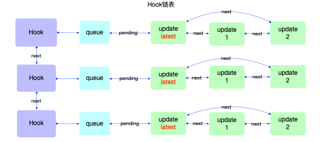
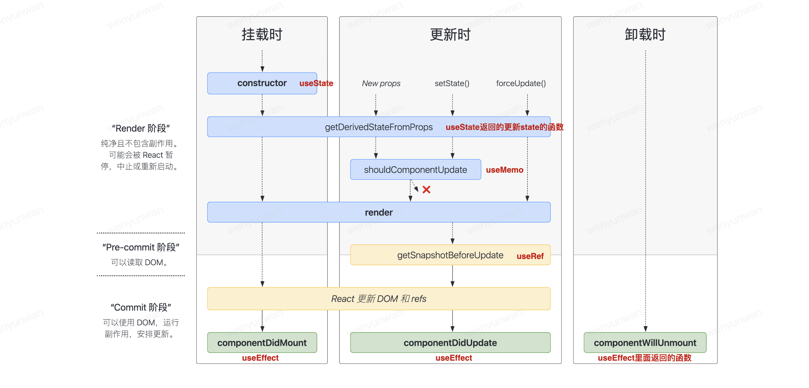

- [Hooks](#hooks)
  - [引入Hook的动机?](#引入hook的动机)
  - [Hook 是什么? 什么时候会用 Hook?](#hook-是什么-什么时候会用-hook)
  - [hooks优势](#hooks优势)
  - [hooks使用限制](#hooks使用限制)
  - [hooks数据结构](#hooks数据结构)
  - [hooks分类 :star:](#hooks分类-star)
    - [用数组模拟实现useState，useEffect](#用数组模拟实现usestateuseeffect)
  - [hooks旧引用问题](#hooks旧引用问题)
  - [为什么不能在条件语句中写hook？](#为什么不能在条件语句中写hook)
  - [hooks与声明周期](#hooks与声明周期)
  - [常用钩子](#常用钩子)
  - [useEffect 依赖为空数组与 componentDidMount 区别](#useeffect-依赖为空数组与-componentdidmount-区别)
  - [React.memo() 和 useMemo() ，useCallback()的区别](#reactmemo-和-usememo-usecallback的区别)
  - [useState与useReducer](#usestate与usereducer)
  - [useEffct与useLayoutEffect](#useeffct与uselayouteffect)
  - [useRef](#useref)
    - [为什么使用useRef能够每次拿到新鲜的值？](#为什么使用useref能够每次拿到新鲜的值)
  - [使用useContext和useReducer实现操作全局共享数据](#使用usecontext和usereducer实现操作全局共享数据)

## Hooks
### 引入Hook的动机?
在组件之间复用状态逻辑很难; 复杂组件变得难以理解; 难以理解的 class. 为了解决这些实际开发痛点, 引入了Hook.

### Hook 是什么? 什么时候会用 Hook?
- Hook 是一个特殊的函数, 它可以让你“钩入” React 的特性. 如, useState 是允许你在 React 函数组件中添加 state 的 Hook.
- 如果你在编写函数组件并意识到需要向其添加一些 state, 以前的做法是必须将其转化为 class. 现在你可以在现有的函数组件中使用 Hook.

### hooks优势
1. 跨组件**复用**: Hooks 作为官方的底层 API，最为轻量，而且改造成本小，不会影响原来的组件层次结构和传说中的嵌套地狱。每调用useHook一次都会生成一份独立的状态，这个没有什么黑魔法，函数每次调用都会开辟一份独立的内存空间。
2. 类定义更为复杂:不同的生命周期会使逻辑变得分散且混乱，不易维护和管理；时刻需要关注this的指向问题；代码复用代价高，高阶组件的使用经常会使整个组件树变得臃肿；
3. 状态与UI隔离: 正是由于 Hooks 的特性，状态逻辑会变成更小的粒度，并且极容易被抽象成一个自定义 Hooks，组件中的状态和 UI 变得更为清晰和隔离。


### hooks使用限制

1. 避免在 **循环/条件判断/嵌套函数** 中调用 hooks，保证调用顺序的稳定；（有无hook会按顺序存储在链表中，如果写在条件判断中，就没法保持链表的顺序）。可以引入 ESLint 的 Hooks 检查插件进行预防。
2. 只有 函数定义组件 和 hooks 可以调用 hooks，避免在 类组件 或者 普通函数 中调用；
> 另外，不能在useEffect中使用useState，React 会报错提示；


### hooks数据结构
>https://7km.top/main/hook-summary

fiber结构：
```js
const fiber = {
  memoizedState: null, // 保存该FunctionComponent对应的Hooks链表
  stateNode: App // 指向App函数
};
```
hook数据结构
```js
hook = {
  // 保存update对象的queue
  queue: {
    pending: null
  },
  memoizedState: initialState, // 保存hook对应的state
  next: null // 与下一个Hook连接形成单向无环链表
}
```


所以Hook是一个**链表**, 单个Hook拥有自己的状态`hook.memoizedState`和自己的更新队列`hook.queue`.


### hooks分类 :star:
- **状态Hook**(state hook)
  - 狭义上讲, `useState`, `useReducer`可以在function组件添加内部的`state`, 且useState实际上是useReducer的简易封装, 是一个最特殊(简单)的useReducer. 所以将useState, useReducer称为状态Hook.
  - 广义上讲, 只要能**实现数据持久化且没有副作用的Hook, 均可以视为状态Hook**, 所以还包括`useContext, useRef, useCallback, useMemo`等. 它们也能实现多次render时, 保持其初始值不变(即数据持久化)且没有任何副作用.
- **副作用Hook**(effect hook)
  - fiber视角, 状态Hook实现了状态持久化, 那么副作用Hook则会修改`fiber.flags`。所有存在`effect`的fiber节点, 都会被添加到父节点的`EffectList`后, 最后在`commit`阶段处理这些effect节点
  - 比如`useEffect`，`useLayoutEffect`就是最标准的effect Hook。
 ：
>https://medium.com/@ryardley/react-hooks-not-magic-just-arrays-cd4f1857236e

其实很简单，在react中，

- 在**初次渲染**的时候，按照各个hook声明生成hook对象，并把hook对象**按照声明的顺**序用**链表**保存起来。这个链表挂载在其对应的fiber节点上。在每个hook对象上，都有其一一对应的`update queue`，也是一个环状单向链表，用来保存每一次的状态更新。
- 当**更新**的时候，找到对应的hook对象（通过一个全局的cursor变量来标记），
  - 如果是**状态hook**，从hook对象的 `memoizedState` 中把上次记录的值拿出来。则再按照对应的hook对象的update queue来更新state，再重新渲染。
  - 如果是**副作用hook**，对比依赖是否改变，如果改变了，则执行**回调函数**，并更新依赖值。

fiber节点数据结构如下：
```js
const fiber = {
  memoizedState: null, // 保存该FunctionComponent对应的Hooks链表
  stateNode: App // 指向App函数
};
```
hook对象数据结构如下：
```js
hook = {
  // 保存update的queue，即上文介绍的queue
  queue: {
    pending: null
  },
  memoizedState: initialState, // 保存hook对应的state
  next: null // 与下一个Hook连接形成单向无环链表
}
```

#### 用数组模拟实现useState，useEffect
<details>

```js
import React from 'react';
import ReactDOM from 'react-dom';

// 存放 hooks 的数组
let memoizedState;
// 当前 memoizedState 下标
let cursor = 0; 
function useState(initialValue) {
  // 如果没有 state，说明是第一次执行，把 initialValue 复制给它
  memoizedState[cursor] = memoizedState[cursor] || initialValue;
  // cursor 是全局可变的，所以需要保存本次的
  const currentCursor = cursor;
  function setState(newState) {
    memoizedState[currentCursor] = newState;
    // 重新渲染
    render();
  }
  // 返回当前 state，并 cursor + 1，使 state 可以继续存储
  return [memoizedState[cursor++], setState];
}

function useEffect(callback, depArray) {
  const hasNoDeps = !depArray;
  const deps = memoizedState[cursor];
  const hasChangedDeps = deps
    ? !depArray.every((el, i) => el === deps[i])
    : true;
  if (hasNoDeps || hasChangedDeps) {
    callback();
    // 更新依赖值
    memoizedState[cursor] = depArray;
  }
  // 更新下标，得以复用
  cursor++;
}


function App() {
  const [count, setCount] = useState(0);
  const [username, setUsername] = useState('zjc');

  useEffect(() => {
    console.log(count);
  }, [count]);
  useEffect(() => {
    console.log(username);
  }, [username]);

  return (
    <div>
      <div>{count}</div>
      <button onClick={() => { setCount(count + 1) }}>click</button>
      <div>{username}</div>
      <button onClick={() => { setUsername(username + ' hello') }}>click</button>
    </div>
  );
}

function render() {
  // 在 rerender 的时候才能按照 hooks 在组件函数内的书写顺序从0依次获取 memoizedState 中的值
  cursor = 0;
  ReactDOM.render(<App />, document.getElementById('root'));
}
render();
```

</details>


### hooks旧引用问题
函数的运行是独立的，每个函数都有一份独立的作用域。函数的变量是保存在运行时的作用域里面。当我们有异步操作的时候，经常会碰到异步回调的变量引用是之前的，也就是旧的（这里也可以理解成闭包）。

比如：
```js
import React, { useState } from "react";
​
const Counter = () => {
  const [counter, setCounter] = useState(0);
​
  const onAlertButtonClick = () => {
    setTimeout(() => {
      alert("Value: " + counter);
    }, 3000);
  };
​
  return (
    <div>
      <p>You clicked {counter} times.</p>
      <button onClick={() => setCounter(counter + 1)}>Click me</button>
      <button onClick={onAlertButtonClick}>
        Show me the value in 3 seconds
      </button>
    </div>
  );
};
​
export default Counter;
```
当你点击Show me the value in 3 seconds的后，紧接着点击Click me使得counter的值从0变成1。三秒后，定时器触发，但alert出来的是0（旧值），但我们希望的结果是当前的状态1。

这个问题可以用`useRef`来解决。
  1. 保存一个值,在整个生命周期中维持不变
  2. 重新赋值ref.current不会触发重新渲染
```js
const Counter = () => {
  const [counter, setCounter] = useState(0);
  const counterRef = useRef(counter);
​
  const onAlertButtonClick = () => {
    setTimeout(() => {
      alert("Value: " + counterRef.current);
    }, 3000);
  };
​
  useEffect(() => {
    counterRef.current = counter;
  });
  ...
};
```

### 为什么不能在条件语句中写hook？
hook会按顺序存储在链表中，如果写在条件判断中，就没法保持链表的顺序

### hooks与声明周期


```js
// componentDidMount/componentWillUnmount
useEffect(()=>{
  // do something，可在这个阶段发起网络请求
  // 需要在 componentDidMount 执行的内容
  return function cleanup() {
    // 需要在 componentWillUnmount 执行的内容      
  }
}, [])
```

### 常用钩子

- `useState`: 用于定义组件的 State，对标到类组件中this.state的功能。
  ```js
  function Counter({initialCount}) {
    const [count, setCount] = useState(initialCount);
    return (
      <>
        Count: {count}
        <button onClick={() => setCount(initialCount)}  >Reset</button>
        <button onClick={() => setCount(prevCount =>  prevCount - 1)}>-</button>
        <button onClick={() => setCount(prevCount =>  prevCount + 1)}>+</button>
      </>
    );
  }
  ```
- `useEffect`：通过依赖触发的钩子函数，常用于模拟类组件中的componentDidMount，componentDidUpdate，componentWillUnmount方法。是异步执行的
  ```js
  // componentDidMount/componentWillUnmount
  useEffect(()=>{
    // do something
    // 需要在 componentDidMount 执行的内容
    return function cleanup() {
      // 需要在 componentWillUnmount 执行的内容      
    }
  }, [])
  ```
- `useLayoutEffect`：DOM更新同步钩子。用法与useEffect类似，只是区别于执行时间点的不同。`useEffect`属于**异步**执行，并不会等待 DOM 真正渲染后执行（**commit阶段，before mutation阶段（执行DOM操作前）**），而useLayoutEffect则会真正渲染后才触发（**commit阶段，layout阶段（执行DOM操作后）**）；可以获取更新后的 state；
- `useRef`: 1. 获取组件的真实节点Dom节点；2. 存储任意可变值。
- `useImperativeHandle`: 子组件利用useImperativeHandle可以让父组件输出任意数据。
  ```js
  function Child = (ref) => {
    useImperativeHandle(ref, () => ({
      search: () => getFormVals(),
    }));
    return <div>child</div>
  }

  function father = () => {
      const SearchFormRef = useRef(null);
      useEffect(() => {
        SearchFormRef.current?.search()
      }, [***])
      return  <><Child ref={SearchFormRef}/></>
  }
  ```
- `useContext`: 获取 context 对象
- `useReducer`: 类似于 Redux 思想的实现，但其并不足以替代 Redux，可以理解成一个组件内部的 redux，并不是持久化存储，会随着组件被销毁而销毁；属于组件内部，各个组件是相互隔离的，单纯用它并无法共享数据；配合`useContext`的全局性，可以完成一个轻量级的 `Redux`
- `useCallback`: 缓存回调函数，避免传入的回调每次都是新的函数实例而导致依赖组件重新渲染，具有性能优化的效果；
- `useMemo`: 缓存计算结果。接受两个参数，第一个是计算函数，第二个是依赖列表。**它会计算计算函数并将结果缓存起来，仅在依赖项发生更改时重新计算**。useMemo() 适用于需要进行高开销计算的场景。
- `自定义钩子(useXxxxx)`: 基于 Hooks 可以引用其它 Hooks 这个特性，我们可以编写自定义钩子。

### useEffect 依赖为空数组与 componentDidMount 区别
`useEffect` 与 `componentDidMount` 的作用是相似的，都是在组件挂载后执行特定的逻辑。但是它们之间有一些区别，主要有三个方面。

第一，`componentDidMount` 是类组件的生命周期方法，而 `useEffect` 是 React Hooks 中的一个特殊 Hook。

第二，`useEffect` 不仅仅在组件挂载的时候执行，它还在组件更新的时候执行。可以通过传递不同的依赖项（第二个参数）来控制 `useEffect` 函数的运行。当这个依赖项数组为空的时候，这个 effect 只会在挂载时运行一次，类似于 `componentDidMount`。当这个依赖项数组中的某个值发生变化时，这个 effect 函数就会重新运行。而如果不传递依赖项，则 effect 会在每次渲染时执行，这可能会导致一些性能问题。

第三，与 `componentDidMount` 不同，`useEffect` 中的函数可以返回一个清除函数。这个清除函数会在组件卸载或者更改依赖项导致 effect 函数被再次调用时执行。在某些情况下，可以利用这个清除函数来取消之前设置的异步定时器或订阅等操作，从而避免内存泄漏。

因此，使用 `useEffect` 可以更加灵活地控制组件的逻辑，同时也能处理一些类组件中较为困难的问题。

### React.memo() 和 useMemo() ，useCallback()的区别

- `React.memo()` 是一个高阶组件，**用于避免在不必要的情况下重渲染组件**。它通过比较组件的**前后属性以及状态**进行浅层比较，来决定是否需要重新渲染组件。React.memo() 适用于函数式组件和纯函数。

- `useMemo()` 接受两个参数，第一个是计算函数，第二个是依赖列表。**它会计算函数并将结果缓存起来，仅在依赖项发生更改时重新计算**。useMemo() 适用于需要进行高开销计算的场景。

- `useCallback()` 接受两个参数，第一个是回调函数，第二个是依赖列表。**它会对回调函数进行缓存并返回一个新的回调函数。当依赖项更改时，它会返回新的回调函数**。useCallback() 适用于需要传递给子组件或需要在依赖更新时立即更新的场景。


### useState与useReducer

本质来说，`useState`只是预置了`reducer`的`useReducer`。

### useEffct与useLayoutEffect

- `useEffect`属于异步执行，并不会等待 DOM 真正渲染后执行（**commit阶段，before mutation阶段（执行DOM操作前）**），

- `useLayoutEffect`则会真正渲染后才触发（**commit阶段，layout阶段（执行DOM操作后）**）；可以获取更新后的 state；

`useEffect`异步执行的优点是，**react渲染组件**不必等待useEffect函数执完毕，造成阻塞。
例如，下面的代码，组件就会渲染两次。
```js
import ReactDom from "react-dom";
import React, {useEffect, useLayoutEffect, useState} from  "react";
const App = () => {
    const [value, setValue] = useState(0);
    useEffect(() => {
        if (value === 0) {
            setValue(10 + Math.random() * 200);
        }
    }, [value]);
    console.log("render", value);
    return (
        <div onClick={() => setValue(0)}>
            value: {value}
        </div>
    );
};
ReactDom.render(
    <App />,
    document.getElementById("root")
);
```

当你点击div时，会出现短暂的闪烁，屏幕上会先出现0，然后出现useEffect中设定数字，但是使用useLayoutEffect则不会出现闪烁的情况，屏幕上会直接显示设定的字。

### useRef
其作用：
1. 保存一个值,在整个生命周期中维持不变
2. 重新赋值ref.current不会触发重新渲染

#### 为什么使用useRef能够每次拿到新鲜的值？

`useRef` 可以存储任意可变的值，而且每次更新组件后，`useRef` 的返回值都会是**同一个对象**。所以在函数组件中，当我们用 `useRef` 来保存一个变量时，即使进行了重新渲染，也只是当前渲染结果下的一个引用，所以可以每次拿到新鲜的值。

还有一个值得注意的地方是，当我们修改 `useRef` 存储的值时，并不会重新渲染组件。


### 使用useContext和useReducer实现操作全局共享数据
> 参考链接：https://github.com/puxiao/react-hook-tutorial/blob/master/09%20useReducer%E9%AB%98%E7%BA%A7%E7%94%A8%E6%B3%95.md

**实现原理：**
1. 用 useContext 实现“获取全局数据”
2. 用 useReducer 实现“修改全局数据”

**实现思路：**
1. 用React.createContext()定义一个全局数据对象；
2. 在父组件中用 useReducer 定义全局变量xx和负责抛出修改事件的dispatch；
3. 在父组件之外，定义负责具体修改全局变量的处理函数reducer，根据修改xx事件类型和参数，执行修改xx的值；
4. 在父组件中用 `<XxxContext.Provider value={\{Xxx, dispathch\}}>` 标签把 全局共享数据和负责抛出修改xx的dispatch 暴露给子组件；
5. 在子组件中用 useContext 获取全局变量；
6. 在子组件中用 xxContext.dispatch 去抛出修改xx的事件，携带修改事件类型和参数；
