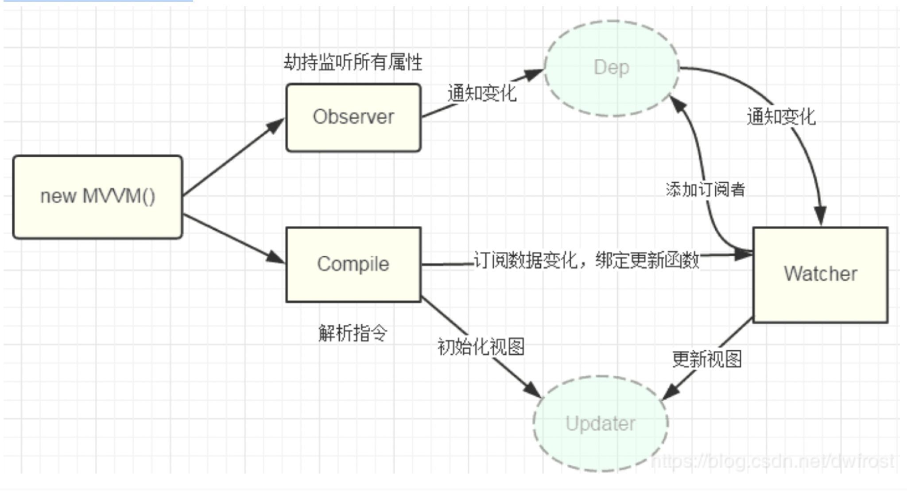
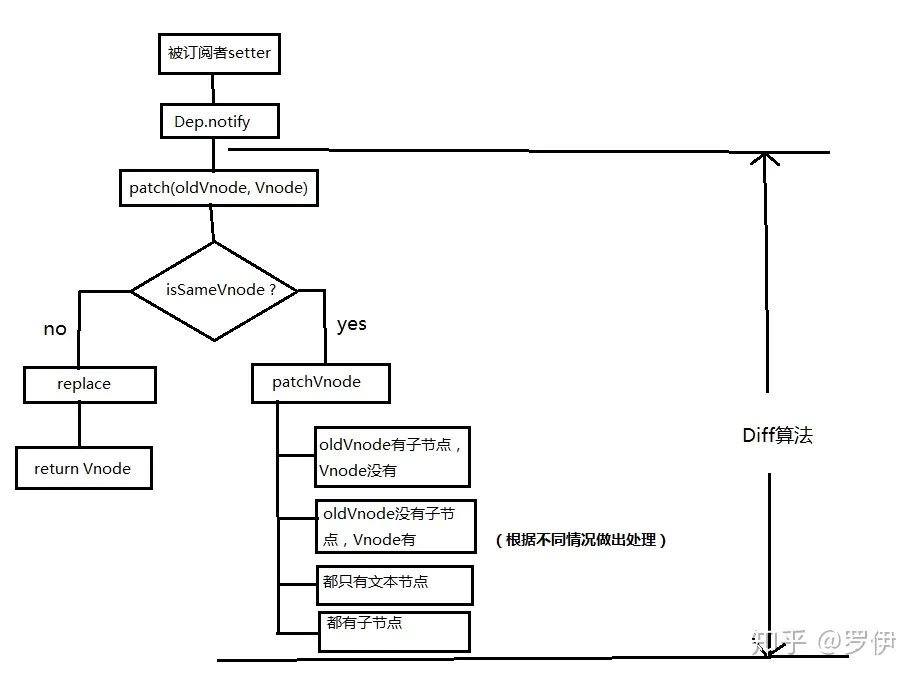

- [响应式原理（双向绑定）](#响应式原理双向绑定)
  - [Vue2.0](#vue20)
    - [mvvm](#mvvm)
    - [原理](#原理)
      - [对于`Object`来说](#对于object来说)
      - [对于`Array`来说](#对于array来说)
  - [缺陷](#缺陷)
  - [Vue3.0](#vue30)
- [diff](#diff)


[参考文档](https://tsejx.github.io/vue-guidebook/infrastructure/vue3/reactivity)

# 响应式原理（双向绑定）

## Vue2.0

### mvvm

mvvm指的是数据层（Model）-视图层（View）-数据视图（ViewModel）的响应式框架。

- Model - 包含了业务和验证逻辑的数据模型
- View - 定义屏幕中View的结构，布局和外观
- ViewModel - 扮演“View”和“Model”之间的使者，通过双向数据绑定把 View 层和 Model 层连接了起来，而 View 和 Model 之间的同步工作完全是自动的，无需人为干涉，因此开发者只需关注业务逻辑，不需要手动操作 DOM, 不需要关注数据状态的同步问题。

优点：

- 数据的双向绑定。当Model变化时，View-Model会自动更新，View也会自动变化
- 可以对View或ViewController的数据处理部分抽象出来一个函数处理model。

### 原理

在 vue.js 中是采用**数据劫持**结合**发布者-订阅者模式**的方式，通过`Object.defineProperty()`来劫持各个属性的`setter，getter`，在数据变动时发布消息给订阅者，触发相应的监听回调。

主要包括以下几个步骤：

1. 实现一个数据`监听器Observer`，能够对数据对象的所有属性进行监听，如有变动可拿到最新值并通知订阅者
2. 实现一个`指令解析器Compile`，对每个元素节点的指令进行扫描和解析，根据指令模板替换数据，以及绑定相应的更新函数
3. 实现一个`订阅者Watcher`，作为连接`Observer`和`Compile`的桥梁，能够订阅并收到每个属性变动的通知，执行指令绑定的相应回调函数，从而更新视图。
4. mvvm入口函数，整合以上三者



#### 对于`Object`来说

其过程是这样的：

1. 首先要对数据进行劫持监听，所以我们需要设置一个监听器Observer，用来监听所有属性。
2. 如果属性发生变化了，就需要告诉订阅者Watcher（这里的订阅者就是用到了这个数据的地方，依赖）看是否需要更新。
3. 因为订阅者是有很多个，所以我们需要有一个消息订阅器Dep（队列）来专门收集这些订阅者，他会在监听器Observer和订阅者Watcher之间进行统一管理。
4. 最后，我们还需要有一个指令解析器Compile，对每个节点元素进行扫描和解析，将相关指令对应初始化成一个订阅者Watcher。

此时：

- 当外界通过订阅者watcher（依赖）读取数据时，会触发getter从而将订阅者watcher添加到消息订阅器Dep中
- 当数据发生了变化时，会触发setter，从而向消息订阅器Dep中的订阅者（watcher）发送通知
- 当订阅者watcher收到通知之后，会向外界发送通知，从而触发视图的更新

大致实现的代码：

```js
function observe(target) {
  if (target && typeof target === 'Object') {
    Object.keys(target).forEach((key) => {
      defineReactive(target, key, target[key]);
    });
  }
}
function defineReactive(obj, key, val) {
  const dep = new Dep();
  // 如果属性值是对象就遍历它的属性
  observe(val);
  Object.defineProperty(obj, key, {
    get() {
      return val;
    },
    set(v) {
      val = v;
      dep.notify();
    },
  });
}
```

#### 对于`Array`来说

因为性能问题，在vue2.0版本中，对于Array类型数据没有用Object.defineProperty来实现响应式。而是用了一个`拦截器覆盖Array.prototype(数组实例原型)`。之后，每当使用array原型上的方法操作数组时，其实执行的都是拦截器中提供的方法，用这种方式来实现数据双向绑定。


大致代码实现如下：

```js
const arrayProto = Array.prototype;
const arrayMethods = Object.create(arrayProto);
const methodsToPatch = ['push', 'pop', 'shift', 'unshift', 'splice', 'sort', 'reverse'];

methodsToPatch.forEach(function (method) {
  const original = arrayProto[method];
  def(arrayMethods, method, function mutator(...args) {
    const result = original.apply(this, args);
    const ob = this.__ob__;
    ob.dep.notify();
    return result;
  });
});
```

其双向绑定过程是这样的：

1. 首先，我们在监听器类Observer中创建拦截器去覆盖那些即将要被转换成响应式Array类型数据的原型，并挂载到数组上去。
2. 然后在gtter中收集订阅者，并且用消息订阅器来存放Dep。

    数组也是在getter中收集订阅者的，因为，假如有一个数组list，在读取这个数组的时候，肯定会先触发这个名字叫做list的属性的getter。所以，Array在getter中收集订阅者，在拦截器中给订阅者发送通知。

    同时将消息订阅器Dep存放在监听器Observer实例上，在这里getter和拦截器才能都访问得到。
3. 最后向数组的订阅者发送通知，触发视图的更新
   只需要在Observer实例上拿到Dep属性，就可以向watcher发送通知了。
4. 另外数组元素的变化也需要被侦测，
   利用前面的Object侦测的原理，将每一个数组元素都变成响应式的即可。

## 缺陷

1. 需对对象的所有**属性进行循环遍历**，分别定义其getter、setter函数
2. 如果，**属性值是对象，还需要深度遍历**
3. 如果要往响应式对象中**添加属性**，其属性的变化是不可监控到的，这是因为定义响应式对象是在初始化阶段。只能用 `setter 或 delete`API 代替，例如`vue.$set`。
4. 数组的变化无法被object.defineProperty监控到（监听的性能代价太大,用**拦截器**来实现了）

## Vue3.0

在 Vue3 中用了 `Proxy`全面代替 Object.defineProperty 的响应式系统。Proxy 是比较新的浏览器特性，拦截的是整个对象而不是对象的属性，可以拦截多种方法，包括属性的访问、赋值、删除等操作，不需要初始化的时候遍历所有属性，并且是 `懒执行` 的特性，**也就是在访问到的时候才会触发，当访问到对象属性的时候才会递归代理这个对象属性**，所以性能比 Vue2 有明显的优势。

Vue 3.0 的响应式核心是 `reactive` 函数， 它接收一个普通对象，并将该对象转换为响应式对象。 在内部，reactive 函数使用了 ES6 的 Proxy 对象来实现代理，拦截了对象的 get、set 等操作，以便在数据发生变化时进行通知及重新渲染。

```js
export function reactive(target: object) {
  if (target && (target as Target)[ReactiveFlags.IS_READONLY]) {
    return target;
  }
  return createReactiveObject(target, false, mutableHandlers, mutableCollectionHandlers);
}
function createReactiveObject(
  target: Target,
  isReadonly: boolean,
  baseHandlers: ProxyHandler<any>,
  collectionHandlers: ProxyHandler<any>
) {
  const proxy = new Proxy(target, baseHandlers);
  // 用 WeakMap 收集
  proxyMap.set(target, proxy);
  return proxy;
}
```

# diff

// TODO
diff的过程是调用名为patch的函数，比较新旧节点，一边比较一边给真实DOM打补丁。
时间复杂度是o（n）

- 同级比较，再比较子节点
- 先判断一方有子节点一方没有子节点的情况(如果新的children没有子节点，将旧的子节点移除)
- 比较都有子节点的情况(**核心diff**)，用到4个指针
- 递归比较子节点