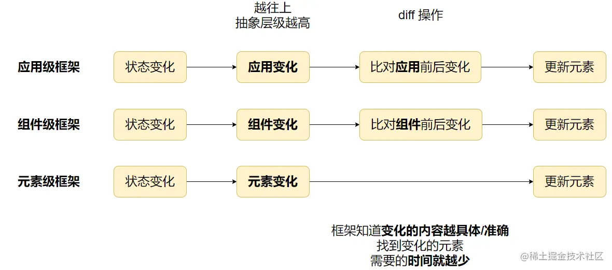

>参考文章：[浅谈前端框架原理](https://juejin.cn/post/7194473892268736549)

## 前端框架
**UI = f(state)**

其中：
* state —— 当前的视图的状态
* f —— 框架内部的运行机制
* UI —— 宿主环境的视图

这个公式说明，**框架内部运行机制根据当前状态渲染视图**，这也能看出现代框架的一个重要特性：**数据驱动**。

## 如何描述UI

* `JSX`：Facebook提出的一种 ECMAScript 的语法糖。JSX在运行时会被转换成浏览器能够识别的标准ES语法。例如React用的便是JSX。
  ```jsx
    const element = (
      <div>
        <h1>Hello!</h1>
        <h2>Good to see you here.</h2>
      </div>
    );
  ```
  JSX在编译时会被Babel编译为`React.createElement`方法。

* template 模板：它扩充的是 HTML 语法，例如VUE中的模版
  ```html
    <script setup>
    import { ref } from 'vue'

    const msg = ref('Hello World!')
    </script>

    <template>
      <h1>{{ msg }}</h1>
      <input v-model="msg">
    </template>
  ```

## 数据驱动
说的是，在数据驱动框架中，状态变化，会引起UI的变化。

框架内部运行机制的实现，可以概括为以下两个步骤：
1. 根据 state 计算出 UI 变化，如， Vue 和 React 通过对比变化前后的 VNode，知道需要更新哪些元素
2. 根据 UI 变化，执行具体宿主（如浏览器）的 API。

拆分成两个步骤是为了做到与**平台无关**。前端框架通常会抽离出一套抽象的元素操作的 API，例如：新增/删除/移动元素、修改元素属性等原子操作。不会直接操作浏览器 DOM。

例如：React、Vue 可以开发浏览器、Canvas、安卓、IOS 的系统/应用，因为其本身不与任何平台耦合，只需要提供相应的宿主 API，就能做到跨平台使用框架。

不同框架，主要的差异其实是在步骤一，如何根据 state 找到 UI 变化的部分:

* React 属于应用级框架
* Vue 属于组件级框架
* Svelte 属于元素级框架

## 前端用到的技术
### 响应式 
//TODO: 待补充
* Vue响应式

实现了细粒度的更新，是组件级应用的一种实现

### Victual DOM
Vdom的作用：
* 描述 UI
* 通过对比 VDOM 前后的变化，计算出 UI 中变化的部分。即 Diff。

Vdom优点：
* 相对于 DOM 有体积优势
* 多平台渲染能力
> VDOM 可以多平台渲染能力，但反过来，多平台渲染能力，不一定需要 VDOM
> VDOM 的最终目的，其实是用于 **Diff**，计算出 UI 中变化的部分。但刚好又可以用于多平台渲染。

**应用级框架和组件级框架**，需要使用 **VDOM 配合 Diff** 算法，计算出 UI 中变化的元素。

元素级框架，如 Svelte，由于可以直接精准的找到 UI 变化的部分，不需要 Diff，则可以直接不使用 VDOM 技术。

总结：最终目的是快速找出一组 UI 元素中变化的部分，**应用级和组件级**框架需要使用。元素级框架由于直接指导变化的元素，因此不需要。

### AOT预编译技术
在前端框架一般都有编译这一步骤，用于：
1. 代码转换，如：ts 编译为 js，Vue 将 vue 文件转换成 js
2. 编译优化
3. 代码压缩、打包

编译有两个执行时机：
* 构建时编译（AOT，预编译）：可以提前进行编译，用户直接运行编译后的代码，可以减少首屏时间。
* 运行时编译（JIT，即时编译）：会消耗更多时间用于编译，且应用代码体积会更大，因为需要包含编译的相关逻辑。

使用模板的框架，能从 AOT 预编译优化中受益，因为模板的结构固定，容易分析。JSX 则难以优化，除非约束 JSX 的灵活性
