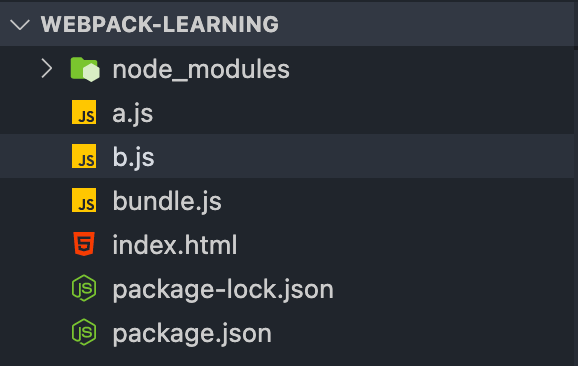
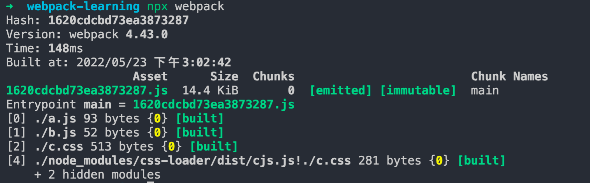
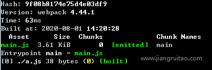
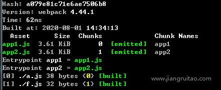
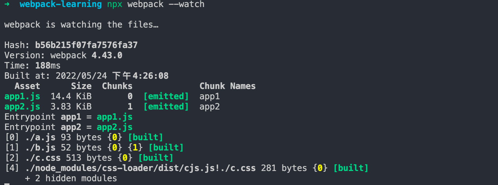
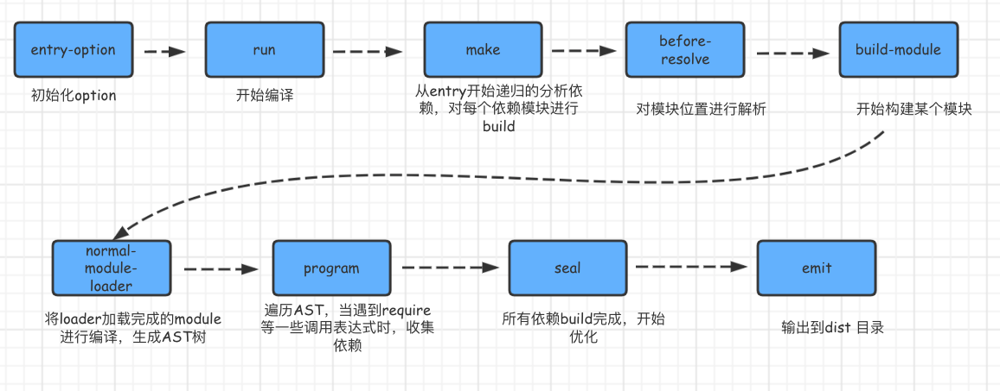

# Webpack入门
[姜瑞涛：webpack教程](https://www.jiangruitao.com/webpack)
## Webpack是什么？
Webpack是一个模块打包工具(module bundler)，因为平常多用来对前端工程打包，所以也是一个前端构建工具。
通俗的说是：`找出模块之间的依赖关系，按照一定的规则把这些模块组织合并为一个JavaScript文件`。

## 快速入门
现在我有三个文件，a.js，b.js和index.html

a.js内容：
```js
// ES6的模块化语法
import { name } from './b.js';  
console.log(name);
``` 

b.js内容：
```js
 // ES6的模块化语法
 export var name = 'Jack';
```

在HTML文件中引入a.js文件

这时用浏览器打开index.html，会报错:

`Uncaught SyntaxError: Cannot use import statement outside a module`

一方面是浏览器对原始的ES6模块默认引入方式不支持而报错，另一方面即使使用支持的方式引入也会因本地JS引入的安全问题而报错。

所以，我们可以通过Webpack把这两个文件打包成一个JS文件来解决这个问题。Webpack打包后，代码里就没有这种模块化语法了。执行以下命令：

`npx webpack a.js -o bundle.js`

上面命令的作用：从a.js文件开始，按照模块引入的顺序把所有代码打包到bundle.js文件里。注意，webpack是打包命令，后面的是打包参数。

可以看到，文件夹中多了bundle.js这个文件。这时index.html文件再去引入bundle.js就不会报错了。



这就是最简单的一个打包过程了。

## webpack配置文件
Webpack默认的配置文件是项目根目录下的webpack.config.js，在执行`npx webpack`命令的时候，Webpack会自动寻找该文件并使用其配置信息进行打包。

基于上面的代码，新增一个配置文件，内容如下：
```js
var path = require('path');  
module.exports = {
  entry: './a.js', // 打包入口
  output: {
    path: path.resolve(__dirname, ''), // webpack基于Node.js执行，path是Node中的路径解析模块。__dirname是node的一个全局变量，path.resolve(__dirname, '')表示当前文件夹根目录的绝对路径
    filename: 'bundle.js' // 打包产物
  },
  mode: 'none' // webpack打包模式，默认是'production'
};
```
这样就是使用配置文件打包的方式。

## Webpack loader
Webpack自身只支持对JS文件处理（现在的版本也支持对JSON文件处理），如果引入了一个非js文件，那么Webpack在处理该模块的时候，会在控制台报错：`Module parse failed…You may need an appropriate loader to handle this file type.`

当Webpack自身无法处理某种类型的文件的时候，我们就可以通过配置特定的`loader`，赋予Webpack来处理该类型文件的能力。

还是延续上面的文件夹，在里面再加一个c.css文件，内容如下:
```css
.hello {
    margin: 30px;
    color: blue;
}
```
然后在a.js中引入了c.css;

在html文件中加入一个div标签：
```html
<div class="hello">Hello, Loader</div>
```

配置文件暂时保持不变，看一下执行打包命令，是什么结果？—— 果然报错了

`You may need an appropriate loader to handle this file type, currently no loaders are configured to process this file.`

提示我们需要安装相应的loader来处理CSS文件。

这里需要安装两个loader
1. css-loader：解析CSS文件，包括解析@import等CSS自身的语法。
2. style-loader：把JS里的样式代码插入到html文件里。原理：JS动态生成style标签插入到html文件的head标签里。

执行`npm install css-loader@3.6.0 style-loader@1.2.1 `安装该两个loader

在webpack.config.js文件中配置这两个loader
```js
var path = require('path');  
module.exports = {
  entry: './a.js', // 打包入口
  output: {
      ... // 此处内容与前面一致
  },
  module: {
    rules: [{
      test: /\.css$/, // 表示当文件后缀是.css时，使用对应use里的loader
      use: ['style-loader', 'css-loader'] // use里面的值是数组，每一项是一个loader。loader的执行顺序是从后向前执行。
    }]
  },
  mode: 'none' // webpack打包模式，默认是'production'
};
```

这样再执行打包命令，便成功了。在浏览器打开index.html，发现CSS生效了，文字颜色变成蓝色。

# Webpack 入口与出口

## 模块化相关的知识：
- Webpack支持ES6 Module、CommonJS和AMD等模块化方法，目前常用的是ES6 Module和CommonJS。
- ES6 Module通过export导出模块，import … from '…'或import '…'导入模块。
- CommonJS通过module.exports导出模块，require('…')导入模块。
- ES6 Module通过import()函数动态导入模块，CommonJS通过require.ensure动态导入模块，现在推荐使用import()函数动态导入模块。

## 入口entry
* context：表示资源入口entry是从哪个目录为起点的。context的值是一个字符串，表示一个绝对路径。在我们没有设置context的时候，它是当前工程的根目录。
* entry：它有三种形式的值
  - 字符串：是最简单的形式，表示打包的入口JS文件。
  - 数组
    ```js
    module.exports = {
      entry: ['core-js/stable', 'regenerator-runtime/runtime', './a.  js'],
    };
    ```
    等效于：
    ```js
      // a.js
      import 'core-js/stable';
      import 'regenerator-runtime/runtime';
    ```
    ```js
    // webpack.config.js
    module.exports = {
      entry: './a.js',
    };
    ```
  - 对象：又称之为多入口配置。本质上打包后生成多个JS文件。
    ```js
    var path = require('path');  
    module.exports = {
      entry: {
        app: ['core-js/stable', 'regenerator-runtime/runtime', './a.  js'],
        vendor: './vendor'
      },
      output: {
        path: path.resolve(__dirname, ''),
        filename: '[name].js'
      },
      mode: 'none'
    };
    ```
    上方的配置分别从两个入口文件打包，每个入口文件各自寻找自己依赖的文件模块打包成一个JS文件，最终得到两个JS文件。

## 出口output
webpack的output是资源出口配置项。output是一个对象，它有几个重要的filename、path、publicPath和chunkFilename。
### filename
1. filename是打包后生成的`资源名称`，如'bundle.js

2. filename除了可以是一个文件名称，也可以是`相对地址`，例如'./js/bundljs'。

3. filename支持类似变量的方式生成`动态文件名`
    * 特定动态值`[hash]`，例如[hash]-bundle.js，其中方括号很像占位符，`hash`表  示特定的动态值。例如：
      ```js
        var path = require('path');  
        module.exports = {
          entry: './a.js',
          output: {
            path: path.resolve(__dirname, ''),
            filename: '[hash].js'
          },
          ...
          mode: 'none'
        };
      ```
      我们执行npx webpack打包，控制台显示如下。
      

      `1620cdcbd73ea3873287`表示本次打包的hash值，因此生成的文件名就是      eaf163aa8342f012d6ee.js。
    * 特定动态值`[name]`，[name]表示的是chunk的名称，打包过程中，一个资源入代表 一个chunk，一个异步模块资源也代表一个chunk。这里的`chunk`与`资源入口有关。
      - entry形式为`字符串`和`数组`，output.filename的[name]值都是`main`。
        ```js
        module.exports = {
          entry: './a.js',
          output: {
            path: path.resolve(__dirname, ''),
            filename: '[name].js'
          },
          mode: 'none'
        };
        ```
        
      - entry形式为`对象`（即多入口），[name]的值是对象的属性名，对应每一个口文 件。
        ```js
        module.exports = {
          entry: {
            app1: './a.js',
            app2: './f.js',
          },
          output: {
            path: path.resolve(__dirname, ''),
            filename: '[name].js'
          },
          mode: 'none'
        };
        ```
        


### path
path表示资源打包后输出的位置，该位置地址要是绝对路径。如果你不设置它，webpack4默认为dist目录。

需要注意的是，path输出路径表示的是在磁盘上构建生成的真实文件存放地址。

我们在开发时，一般会用`webpack-dev-server`开启一个本地服务器，这个服务器可以`自动刷新和热加载`等，它生成的文件是在`内存`中而不是在电脑磁盘。该内存中的文件路径，我们会用Webpack配置文件的`devServer`配置项的publicPath表示，它虚拟映射了电脑磁盘路径。

### publicPath
output中的publicPath表示的是资源访问路径。

注意这个publicPath指的是output的，和devServer的不一样。

path和publicPath的区别：
* path(资源输出位置)：表示的是本次打包完成后，资源存放的磁盘位置。是一个本地路径
* publicPath(资源访问路径)：代表的是，之后要引入的js css 这些的路径`前缀`。一般来说会写cdn的url。

publicPath的表现形式有两类：相对路径和绝对路径
1. 相对路径
  * output.publicPath以"./"或"../"等开头，表示要访问的资源以当前页面url作为基 础路径。
    ```js
    publicPath: ""  // 资源的访问地址是https://www.apple.com/ipad/  bundle-3fa2.js
    publicPath: "../dist/"  // 资源的访问地址是https://www.apple.com/ dist/bundle-3fa2.js
    publicPath: "./dist/"  // 资源的访问地址是https://www.apple.com/ipad/ dist/bundle-3fa2.js
    ```
  * output.publicPath以"/"开头，表示要访问的资源以当前页面的服务器地址作为基础路  径。
    ```js
    publicPath: "/"  // 资源的访问地址是https://www.apple.com/  bundle-3fa2.js。
    publicPath: "/dist/"  // 资源的访问地址是https://www.apple.com/dist/  bundle-3fa2.js。
    ```
2. 绝对路径
  output.publicPath的值以HTTP协议名称开始。一般在使用CDN的时候，因为CDN的域名与我们自己服务器的域名不一样，我们会采用这种方式。

### hash、chunkhash和contenthash区别


# Webpack预处理器loader
预处理器loader本质是一个函数，它接受一个资源模块，然后将其处理成Webpack核心能使用的形式。

在Webpack中，一切皆模块。Webpack在进行打包的时候，对所有引入的资源文件，都当作模块来处理。

现在的Webpack，自身可以处理JS和JSON文件模块，它无法理解其它类型的文件模块。此时便可以用loader来处理webpack无法处理的模块。

## loader配置
之前有用过两个loader来处理css
```js
const path = require('path');
module.exports = {
  entry: './a.js',  // a.js里引入了CSS文件
  output: {
    path: path.resolve(__dirname, ''),
    filename: 'bundle.js'
  },
  module: {
    rules: [{
      test: /\.css$/,
      use: ['style-loader', 'css-loader']
    }]
  },
  mode: 'none'
};
```
配置loader是在Webpack配置项module里进行的，Module是模块的意思，因此用这个名字可以表示这个配置项是用来解析与处理模块的。

Module配置项里一个重要的子项`rules`，它定义了loader的处理法则。

Rules是一个数组，数组每一项是一个JS对象，该对象有两个关键属性`test`和`use`。

test是一个正则表达式或正则表达式数组，模块文件名与正则匹配的会被use里的loader处理。

use可以是字符串，对象或数组，表示要使用的loader。如果该loader额外配置参数，那么可以取对象，额外参数放在options里（有部分loader放query里）。例如：
```js
use: {
  loader: 'babel-loader', 
  options: {…}
}
```

### rules其它配置
除了test和use这两个关键配置参数，rules还有exclude、include、resource、issure和enforce等参数。
1. exclude：表示被正则匹配到的文件不会被loader处理
2. include：表示loader只对匹配到的文件处理。
3. enforce：可以强制某个loader最先(pre)处理或最后(post)处理。
4. resource和issuer：在Webpack中被加载的模块我们称之为resource，而实施加载的模块我们称之为issuer。
    ```js
      rules: [{
        test: /\.css$/,
        use: ['style-loader', 'css-loader'],
        exclude: /node_modules/,
        issuer: { // 指定只有src目录下的JS引用的CSS可以被相应的loader处理
          test: /\.js$/,
          include: /src/
        }
      }]
    ```
    等价于：
    ```js
      rules: [{
        use: ['style-loader', 'css-loader'],
        resource: {
          test: /\.css$/,
          exclude: /node_modules/
        },
        issuer: {
          test: /\.js$/,
          include: /src/
        }
      }]
    ```

## 几个常用的loader
1. babel-loader：主要作用是在Webpack打包的时候，用Babel将ES6的代码转换成ES5版本的。一般配合@babel/preset-env一起使用
2. file-loader：处理文件导入地址并替换成其访问地址，并把文件输出到相应位置。
3. url-loader：是file-loader的增强版，它支持file-loader的所有功能，另外还有一个特殊的功能。可以计算出文件的base64编码。在文件体积小于我们指定的值（单位 byte）的时候，可以返回一个base64编码的DataURL来代替访问地址。使用base64编码的好处是可以减少一次网络请求，提升页面加载速度。

# Webpack插件plugin
在Webpack中使用插件非常简单，只需要在配置项里增加一个plugins项即可。plugins是一个数组，每一个数组元素是一个插件。

# plugin和loader的区别
loader是翻译官，plugin是干活滴

* loader：用来处理webpack无法处理的模块（即非js、json文件），然后你就可以利用 webpack 的打包能力，对它们进行处理。
* plugin：可以执行比转换更复杂的任务。比如打包优化、文件管理、环境注入等……

# 开发环境配置webpack
在我们平时的开发工作中，如果每次修改代码后，都要执行npx webpack然后手动刷新浏览器，那势必会严重影响我们的开发效率。

因此我们需要一些提高开发效率的机制，例如，修改代码后不需要手动执行构建命令而是会进行自动构建，重新构建后也不需要手动刷新浏览器而是会自动刷新等等。

有两种方式可以实现上述目标：
1. Webpack自带的自动构建功能，启动的时候带上`--watch`参数便可打开监听模式。
    
    

2. webpack-dev-server开发工具，即DevServer。其功能有：
    - 支持文件监听和浏览器自动刷新
    - 模块热替换
    - 可开启本地HTTP服务器，一来可以请求处理和转发，二是就不需要使用本地文件预览了
    - 支持Source Map，方便调试工作

# 如何理解module，chunk 和 bundle？
module，chunk 和 bundle 其实就是同一份逻辑代码在不同转换场景下的取了三个名字：

我们直接写出来的是 module，webpack`处理时`是 chunk，最后生成浏览器可以直接运行的结果是`bundle`。

# webpack运行过程？
Webpack 的运行流程是一个串行的过程,从启动到结束会依次执行以下流程 :

1. 初始化参数：从配置文件和 Shell 语句中读取与合并参数,得出最终的参数。
2. 开始编译：用上一步得到的参数初始化 `Compiler` 对象,加载所有配置的插件,执行对象的 run 方法开始执行编译。
3. 确定入口：根据配置中的 entry 找出所有的入口文件。
4. 编译模块：从入口文件出发,调用所有配置的 Loader 对模块进行翻译,再找出该模块依赖的模块,再递归本步骤直到所有入口依赖的文件都经过了本步骤的处理。
5. 完成模块编译：在经过第 4 步使用 Loader 翻译完所有模块后,得到了每个模块被翻译后的最终内容以及它们之间的依赖关系。
6. 输出资源：根据入口和模块之间的依赖关系,组装成一个个包含多个模块的 Chunk,再把每个 Chunk 转换成一个单独的文件加入到输出列表,这步是可以修改输出内容的最后机会。
7. 输出完成：在确定好输出内容后,根据配置确定输出的路径和文件名,把文件内容写入到文件系统。



**初始化**
- entry-options启动：从配置文件和 Shell 语句中读取与合并参数，得出最终的参数。
- run实例化：compiler：用上一步得到的参数初始化 Compiler 对象，加载所有配置的插件，执行对象的 run 方法开始执行编译

**编译构建**
- entry 确定入口：根据配置中的 entry 找出所有的入口文件
- make 编译模块：从入口文件出发，调用所有配置的 Loader 对模块进行翻译，再找出该模块依赖的模块，再递归本步骤直到所有入口依赖的文件都经过了本步骤的处理
- build module 完成模块编译：经过上面一步使用 Loader 翻译完所有模块后，得到了每个模块被翻译后的最终内容以及它们之间的依赖关系
- seal 输出资源：根据入口和模块之间的依赖关系，组装成一个个包含多个模块的 `Chunk`，再把每个 Chunk 转换成一个单独的文件加入到输出列表，这步是可以修改输出内容的最后机会
- emit 输出完成：在确定好输出内容后，根据配置确定输出的路径和文件名，把文件内容写入到文件系统


# SourceMap和webpack


TODO: 尝试自己实现一个简单的webpack？

TODO：实际项目里面的webpack是如何配置的？