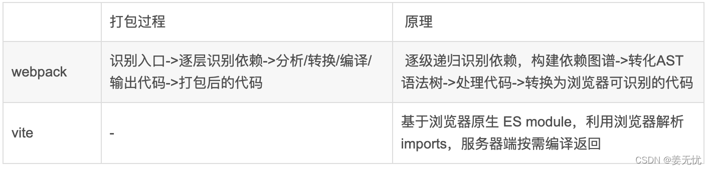

> 参考链接：https://juejin.cn/post/7112754818879324197

# webpack
* 热更新方面：webpack支持HMR，但是webpack需要全部重新编译并更新，效率较低
* tree-shaking：webpack2开始支持且消除效果不好，但是webpack5有更好的tree-shaking（去除未使用代码）
* 分包方面：webpack支持代码切割。（分包）
* ESM打包：现在webpack支持es6module输出

# rollup
优点：
1. Rollup 是一款 ES Modules 打包器，从作用上来看，Rollup 与 Webpack 非常类似。不过相比于 Webpack，Rollup要小巧的多，打包生成的文件更小。（识别commonJs需要插件）
2. 热更新：Rollup不支持HMR，在对js以外的模块的支持上不如webpack，但是如果是打包**纯js库**例如react，前期的vue的话，使用rollup是很合适的，打包的产物比较干净，没有webpack那么多工具函数
3. Rollup 的插件机制设计得相对更干净简洁，单个模块的 resolve / load / transform 跟打包环节完全解耦，所以 Vite 才能在开发时模拟 Rollup 的插件机制，并且兼容大部分 Rollup 插件
4. rollup原生支持tree-shaking

缺点：
1. 加载其他类型的资源文件或者支持导入 CommonJS 模块，又或是编译 ES 新特性，这些额外的需求 Rollup需要使用插件去完成
2. rollup并不适合开发应用使用，因为需要使用第三方模块，而目前第三方模块大多数使用CommonJs方式导出成员，并且rollup**不支持HMR**，使开发效率降低

# Vite
Vite是一种新型前端构建工具，能够显著提升前端开发体验。它主要由两部分组成：

1. 一个开发服务器，它基于 `原生 ES` 模块 提供了丰富的内建功能，如速度很快的 【模块热更新HMR】
2. 一套构建指令，它使用`Rollup`打包你的代码，并且它是预配置的，可以输出用于生产环境的优化过的静态资源

Vite主要特点如下：

1. 快速的冷启动：vite会直接启动开发服务器，不需要进行打包操作，所以不需要分析模块的依赖、不需要编译，因此启动速度非常快
2. 即时的模块热更新
3. 真正的按需编译：利用现代浏览器支持ES Module的特性，当浏览器请求某个模块的时候，再根据需要对模块的内容进行编译，这种方式大大缩短了编译时间

优点：

1. vite热更新，实现按需编译，按模块更新。（特点：快）
   * 在 Vite 中，HMR 是在原生 ESM 上执行的。当编辑一个文件时，Vite 只需要精确地使已编辑的模块与其最近的 HMR 边界之间的链失效，所以 HMR 更新始终快速。
   * Vite 同时利用 HTTP 头来加速整个页面的重新加载（再次让浏览器为我们做更多事情，**缓存**）：源码模块的请求会根据 304 Not Modified 进行协商缓存，而依赖模块请求则会通过 Cache-Control: max-age=31536000,immutable 进行强缓存，因此一旦被缓存它们将不需要再次请求。
   * 热更新原理：在热模块HMR方面，当修改一个模块的时候，仅需让浏览器重新请求该模块即可，无须像webpack那样需要把该模块的相关依赖模块全部编译一次，效率更高
2. vite在生产环境通过Rollup进行打包（特点：打包体积小），生成esm模块包。（特点：快）
   * vite在开发环境时，基于浏览器支持esm，让浏览器解析模块，然后服务器按需编译返回。同时基于`esbuild（go`进行预构建打包不常变动的第三包，并用进行缓存。（缓存+快）
   * Vite 使用 esbuild 预构建依赖。Esbuild 使用 Go 编写，所以比以 Node.js 编写的打包器预构建依赖快 10-100 倍。

缺点：
1. 生态：生态不如webpack，wepback在于loader和plugin非常丰富
2. prod环境的构建：目前用的Rollup，原因在于esbuild对于css和代码分割不是很友好
3. 还没有被大规模使用,很多问题或者诉求没有真正暴露出来

## webpack和vite的区别
**构建理念不同**
* `Vite`：依赖预构建，开发期间启动一个服务器，index.html 作为入口文件，所以 index.html 中需要有  ；index.html 为源码和模块图的一部分。
* `Webpack`：会在内部构建依赖图。webpack 会默认将 ./src/index.js 作为构建的开始；进入入口后，webpack 找出有哪些模块和库是入口起点（直接和间接）依赖的。

`Vite`：
* 非打包构建，不必打包所有内容
* 基于路由的代码拆分知道代码需要实际加载哪些部分，浏览器请求源文件时，再进行转换
* 开发构建：分为依赖和源码
    * 依赖是第三方依赖，从 node_modules 文件夹中导入的 JavaScript 模块，使用 esbuild 处理
    * 源码即是业务源代码
* 现代浏览器中的原生 ES 模块支持，浏览器在开发中承担打包工作

`Webpack`:
* 识别入口文件
* 逐级递归识别依赖，构建依赖图谱
* 分析代码、转换代码、编译代码、输出代码
* 输出打包后的代码

# 结论

Rollup更适合打包库，webpack更适合打包项目应用，vite基于rollup实现了热更新也适合打包项目。

tdesgin框架使用Vite打包