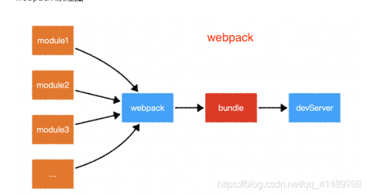
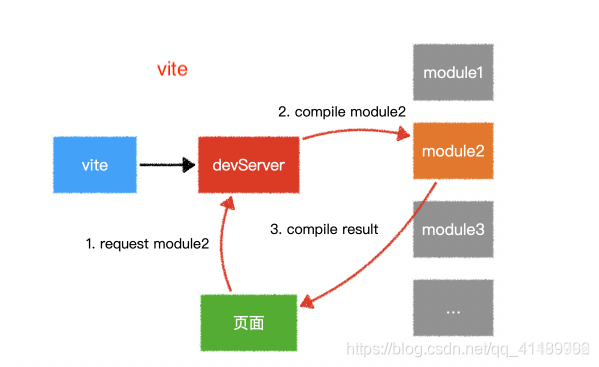

> 参考链接：https://juejin.cn/post/7112754818879324197

# webpack
* **热更新方面**：webpack支持HMR，但是webpack需要全部重新编译并更新，效率较低
* **tree-shaking**：webpack2开始支持且消除效果不好，但是webpack5有更好的tree-shaking（去除未使用代码）
* **分包方面**：webpack支持代码切割。（分包）
* **ESM打包**：现在webpack支持es6module输出

# rollup
优点：
1. Rollup 是一款 ES Modules 打包器，从作用上来看，Rollup 与 Webpack 非常类似。不过相比于 Webpack，Rollup要小巧的多，打包生成的文件更小。（识别commonJs需要插件）
2. 热更新：Rollup**不支持HMR**，在对js以外的模块的支持上不如webpack，但是如果是打包**纯js库**例如react，前期的vue的话，使用rollup是很合适的，打包的产物比较干净，没有webpack那么多工具函数
3. Rollup 的插件机制设计得相对更干净简洁，单个模块的 resolve / load / transform 跟打包环节完全解耦，所以 Vite 才能在开发时模拟 Rollup 的插件机制，并且兼容大部分 Rollup 插件
4. rollup原生支持tree-shaking

缺点：
1. 加载其他类型的资源文件或者支持导入 CommonJS 模块，又或是编译 ES 新特性，这些额外的需求 Rollup需要使用插件去完成
2. rollup并不适合开发应用使用，因为需要使用第三方模块，而目前第三方模块大多数使用CommonJs方式导出成员，并且rollup**不支持HMR**，使开发效率降低

# Vite
Vite是一种新型前端构建工具，能够显著提升前端开发体验。它主要由两部分组成：

1. **dev server**：利用浏览器的`ESM`能力（即`export/import`）来提供源文件，具有丰富的内置功能并具有高效的HMR
2. **生产构建**：生产环境利用`Rollup`来构建代码，提供指令用来优化构建过程

Vite作为一个**基于浏览器原生ESM的构建工具，它省略了开发环境的打包过程，利用浏览器去解析imports，在服务端按需编译返回**。同时，在开发环境拥有速度快到惊人的模块热更新，且热更新的速度不会随着模块增多而变慢。因此，使用Vite进行开发，至少会比Webpack快10倍左右。

Vite主要特点如下：

1. 快速的冷启动：vite会直接启动开发服务器，不需要进行打包操作，所以不需要分析模块的依赖、不需要编译，因此启动速度非常快
2. 即时的模块热更新
3. 真正的按需编译：利用现代浏览器支持ES Module的特性，当浏览器请求某个模块的时候，再根据需要对模块的内容进行编译，这种方式大大缩短了编译时间

**核心理念：Bundless 开发环境构建**
浏览器的原生 ES Modules 能力允许在不将代码打包到一起的情况下运行 JavaScript 应用。Vite 的核心理念很简单，就是借助浏览器原生 ES Modules 能力，当浏览器发出请求时，为浏览器按需提供 ES Module 文件，浏览器获取 ES Module 文件会直接执行。

## 构建原理
`Vite` 的原理是借助了**浏览器**对 ESM 规范的支持。先启动开发服务器，利用新一代浏览器的ESM能力，无需打包，直接请求所需模块并实时编译
* 对于**依赖**，Vite 将会使用 esbuild **预构建依赖**。esbuild 使用 Go 编写，速度比以 JS 快很多
* 对于**源码**：通常包含需要被转换的文件，例如 JSX，CSS 或者 Vue/Svelte 组件；Vite 以 原生 ESM 方式提供源码，让**浏览器**接管打包程序的部分工作，Vite 只需要在浏览器请求源码的时候进行转换并且按需提供源码。
## 热更新原理
Vite 的热加载原理，其实就是在客户端与服务端建立了一个 websocket 连接，当代码被修改时，服务端发送消息通知客户端去请求修改模块的代码，完成热更新。

- 服务端：服务端做的就是监听代码文件的改变，在合适的时机向客户端发送 websocket 信息通知客户端去请求新的模块代码。
- 客户端：Vite 中客户端的 websocket 相关代码在处理 html 中时被写入代码中。可以看到在处理 html 时，vite/client 的相关代码已经被插入。

## vite优化
- **依赖预构建**，Vite 在首次启动时，会进行依赖预构建。依赖预构建有两个目的：
  - CommonJs 和 UMD 的兼容性：开发阶段，Vite 的 Dev Server 将所有代码视为原生 ES 模块。因此，Vite 必须将 CommonJS 或 UMD 发布的依赖项转为 ESM。
  - 性能：Vite 将有很多内部模块的依赖视为单个模块，以提升页面加载性能。比如，lodash-es 拥有超过 600 个内部模块，当 import {debounce} from 'lodash-es'; 时，浏览器会同时发起超过 600 个请求，并行请求过多将会显著影响页面加载性能。因此预构建将 lodash-es 视为一个模块，浏览器只需要发起一个请求。
- **缓存**
  - 文件系统缓存：Vite 会将预构建的依赖缓存到 node_modules/.vite ，它根据几个源决定是否需要重新运行预构建步骤：
    - package.json 中的 `dependencies` 列表；
    - 包管理的 `lockfile`，例如 package-lock.json，yarn.lock 或者 pnpm-lock.yaml
    - 可能在 `vite.config.js` 相关字段中配置过的。
    只有在上述其中一项发生更改时，才需要重新运行预构建。
    如果处于某些原因，你想要强制 Vite 重新构建依赖，你可以用   `--force` 命令选项启动开发服务器，或者手动删除 node_modules/.vite 目录。
  - 浏览器缓存：解析后的依赖请求会以 HTTP 头 max-age=31536000,immutable 强缓存，以提高开发时的页面重载性能。

  
## webpack和vite的区别
1. **开发环境中的构建理念不同**
   * `webpack` 处理应用程序时，它会在内部从一个或多个入口点构建一个 依赖图(dependency graph)，然后将你项目中所需的每一个模块组合成一个或多个 bundles，它们均为静态资源，用于展示你的内容。先打包生成bundle，再启动开发服务器。
   * `Vite` 的原理是借助了**浏览器**对 ESM 规范的支持。先启动开发服务器，利用新一代浏览器的ESM能力，无需打包，直接请求所需模块并实时编译
     * 对于**依赖**，Vite 将会使用 esbuild **预构建依赖**。esbuild 使用 Go 编写，速度比以 JS 快很多
     * 对于**源码**：通常包含需要被转换的文件，例如 JSX，CSS 或者 Vue/Svelte 组件；Vite 以 原生 ESM 方式提供源码，让**浏览器**接管打包程序的部分工作，Vite 只需要在浏览器请求源码的时候进行转换并且按需提供源码。
   

2. **热更新机制不同**
   * Webpack的热更新需要整个模块链重新打包和替换，对于大型项目可能会有延迟；
   * Vite的热更新则只会针对改动的模块进行更新，提高了更新速度。

# 结论

Rollup更适合打包库，webpack更适合打包项目应用，vite基于rollup实现了热更新也适合打包项目。

tdesgin框架使用Vite打包