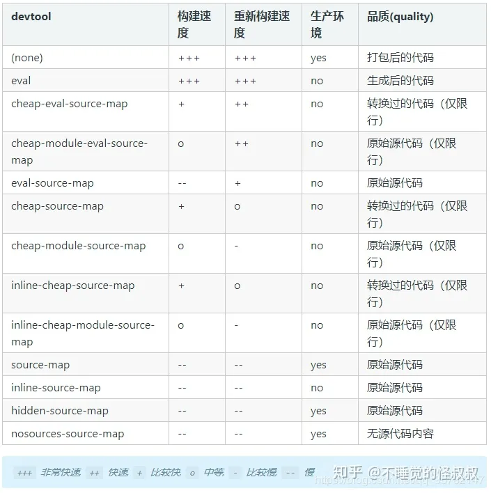
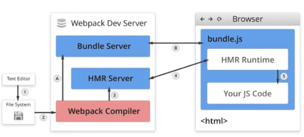
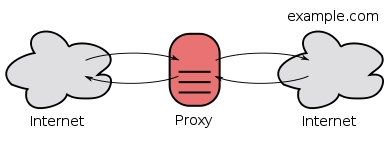

- [webpack的作用是什么？](#webpack的作用是什么)
- [webpack核心概念](#webpack核心概念)
  - [Entry](#entry)
  - [Output](#output)
  - [Module](#module)
  - [Chunk](#chunk)
  - [Loader](#loader)
  - [Plugin](#plugin)
  - [Loader和Plugin的区别，以及如何自定义Loader和Plugin？](#loader和plugin的区别以及如何自定义loader和plugin)
    - [自定义Loader](#自定义loader)
    - [自定义Plugin](#自定义plugin)
- [webpack打包流程？](#webpack打包流程)
- [sourceMap是什么？](#sourcemap是什么)
- [webpack-dev-server（待细看）](#webpack-dev-server待细看)
- [Webpack热更新HMR（存疑，待细看)](#webpack热更新hmr存疑待细看)
- [Webpack Proxy工作原理](#webpack-proxy工作原理)
  - [浏览器跨域判定的原理](#浏览器跨域判定的原理)
  - [webpack proxy原理](#webpack-proxy原理)
  - [实际项目举例](#实际项目举例)
- [如何借助Webpack来优化性能？](#如何借助webpack来优化性能)


>https://juejin.cn/post/6943468761575849992#heading-5
>
>https://segmentfault.com/a/1190000041100811

# webpack的作用是什么？
* **模块打包：** 可以将**不同模块的文件打包整合**在一起，提高项目性能，可维护性，解决浏览器频繁请求文件的问题。
* **编译兼容：** 通过webpack的`Loader`机制，解决**浏览器兼容**问题，并可以编译转换诸如`.less, .vue, .jsx`这类在浏览器无法识别的格式文件，提高开发效率。
* **能力扩展：** 通过webpack的`Plugin`机制，进一步实现诸如**按需加载，代码压缩**等一系列功能，提高项目的自动化程度，工程效率以及打包输出的质量。


# webpack核心概念

## Entry
入口起点(entry point)指示 webpack 应该使用哪个模块,来作为构建其内部依赖图的开始。
进入入口起点后,webpack 会找出有哪些模块和库是入口起点（直接和间接）依赖的。
每个依赖项随即被处理,最后输出到称之为 `bundles` 的文件中。(个人将bunles理解为结果文件)

## Output
output 属性告诉 webpack 在哪里输出它所创建的 bundles， 以及如何命名这些文件,默认值为 ./dist。
也就是说，output定义了打包的`输出`。

## Module
模块,在 Webpack 里一切皆模块,一个模块对应着一个文件。Webpack 会从配置的 Entry 开始递归找出所有依赖的模块。

## Chunk
代码块,一个 Chunk 由多个模块组合而成，用于代码合并与分割。

## Loader
loader 让 webpack 能够去处理那些`非js`文件（webpack 自身只理解 JavaScript）。并可以对代码做polyfill，解决一些浏览器兼容问题。
>core-js 是js标准库的polyfill

Loader本质就是一个`函数`，在该函数中对接收到的内容进行转换，返回转换后的结果。因为 Webpack 只认识 JavaScript，所以 Loader 就成了**翻译官**，对其他类型的资源进行转译的预处理工作。


loader配置语法如下：
```json
module.exports = {
  module: {
    rules: [
      {
        test: /\.css$/, // 匹配规则，一般为正则表达式
        use: [
          { loader: 'style-loader' },
          {
            loader: 'css-loader',
            options: { modules: true }
          },
          { loader: 'sass-loader' }
        ]
      }
    ]
  }
};
```

针对每个文件类型，loader是支持以数组的形式配置多个的，因此当Webpack在转换该文件类型的时候，会**按顺序链式调用**每一个loader，前一个loader返回的内容会作为下一个loader的入参。因此loader的开发需要遵循一些规范，比如返回值必须是**标准的JS代码字符串**，以保证下一个loader能够正常工作，同时在开发上需要严格遵循“单一职责”，只关心loader的输出以及对应的输出。


常见loader：
1. style-loader：将css添加到DOM的内联样式标签style里，然后通过 dom 操作去加载 css。
2. css-loader :允许将css文件通过require的方式引入，并返回css代码。
3. less-loader: 处理less，将less代码转换成css。
4. sass-loader: 处理sass，将scss/sass代码转换成css。
5. awesome-typescript-loader：将 TypeScript 转换成 JavaScript，性能优于 ts-loader。
6. eslint-loader：通过 ESLint 检查 JavaScript 代码。
7. tslint-loader：通过 TSLint检查 TypeScript 代码。


## Plugin
loader 被用于转换某些类型的模块,而插件则可以用于执行范围更广的任务。比如：按需加载，代码压缩，文件管理、环境注入等。

在 Webpack 运行的生命周期中会广播出许多事件，Plugin 可以监听这些事件，在合适的时机通过 Webpack 提供的 API 改变输出结果。

配置语法：
```json
const HtmlWebpackPlugin = require('html-webpack-plugin'); // 通过 npm 安装
const webpack = require('webpack'); // 访问内置的插件
module.exports = {
  ...
  plugins: [
    new webpack.ProgressPlugin(),
    new HtmlWebpackPlugin({ template: './src/index.html' }),
  ],
};
```

Plugin从本质上来说，就是一个具有apply方法Javascript对象。apply 方法会被 webpack compiler 调用，并且在整个编译生命周期都可以访问 compiler 对象。


常用的plugin有:
1. html-webpack-plugin：html 模板处理
2. webpack-bundle-analyzer: 可视化 Webpack 输出文件的体积


## Loader和Plugin的区别，以及如何自定义Loader和Plugin？
* Loader 运行在打包文件**之前**，Loader在 module.rules 中配置，作为模块的解析规则，类型为数组。每一项都是一个 Object，内部包含了 test(类型文件)、loader、options (参数)等属性。
* Plugins 在**整个编译周期**都起作用，Plugin在 plugins 中单独配置，类型为数组，每一项是一个 Plugin 的实例，参数都通过构造函数传入。

>PS：loader是翻译官，plugin是干活滴
### 自定义Loader
Loader本质上来说就是一个函数，函数中的 this 作为上下文会被 webpack 填充，因此我们不能将 loader设为一个箭头函数。该函数接受一个参数，为 webpack 传递给 loader 的文件源内容。

函数中有异步操作或同步操作，异步操作通过 this.callback 返回，返回值要求为 string 或者 Buffer，如下。

```js
// 导出一个函数，source为webpack传递给loader的文件源内容
module.exports = function(source) {
    const content = doSomeThing2JsString(source);
    
    // 如果 loader 配置了 options 对象，那么this.query将指向 options
    const options = this.query;
    
    // 可以用作解析其他模块路径的上下文
    console.log('this.context');
    
    /*
     * this.callback 参数：
     * error：Error | null，当 loader 出错时向外抛出一个 error
     * content：String | Buffer，经过 loader 编译后需要导出的内容
     * sourceMap：为方便调试生成的编译后内容的 source map
     * ast：本次编译生成的 AST 静态语法树，之后执行的 loader 可以直接使用这个 AST，进而省去重复生成 AST 的过程
     */
    this.callback(null, content); // 异步
    return content; // 同步
}
```

### 自定义Plugin
Webpack编译会创建两个核心对象：`compiler和compilation`。

* `compiler`：包含了 Webpack 环境的所有的配置信息，包括 options，loader 和 plugin，和 webpack 整个生命周期相关的钩子.这个对象在 Webpack 启动时候被实例化，它是**全局唯一**的，可以简单地把它理解为 **Webpack 实例**
* `compilation`：作为 Plugin 内置事件回调函数的参数，包含了当前的**模块资源、编译生成资源、变化的文件以及被跟踪依赖的状态信息**。当检测到一个文件变化，一次新的 Compilation 将被创建。

如果需要自定义Plugin，也需要遵循一定的规范：
* 插件必须是一个函数或者是一个包含 apply 方法的对象，这样才能访问compiler实例
* 传给每个插件的 compiler 和 compilation 对象都是同一个引用，因此不建议修改
* 异步的事件需要在插件处理完任务时调用回调函数通知 Webpack 进入下一个流程，不然会卡住

```js
class MyPlugin {
    // Webpack 会调用 MyPlugin 实例的 apply 方法给插件实例传入 compiler 对象
  apply (compiler) {
    // 找到合适的事件钩子，实现自己的插件功能
    compiler.hooks.emit.tap('MyPlugin', compilation => {
        // compilation: 当前打包构建流程的上下文
        console.log(compilation);
        // do something...
    })
  }
}
```

生命周期钩子有：
* entry-option ：初始化 option
* compile： 真正开始的编译，在创建 compilation 对象之前
* compilation ：生成好了 compilation 对象
* make：从 entry 开始递归分析依赖，准备对每个模块进行 build
* after-compile： 编译 build 过程结束
* emit ：在将内存中 assets 内容写到磁盘文件夹之前
* after-emit ：在将内存中 assets 内容写到磁盘文件夹之后
* done： 完成所有的编译过程
* failed： 编译失败的时候

# webpack打包流程？
Webpack 的运行流程是一个串行的过程,从启动到结束会依次执行以下流程 :
1. 读取webpack的`配置参数`；
2.启动webpack，创建`Compiler`对象并开始解析项目；
3.从`入口`文件（entry）开始解析，并且找到其导入的依赖模块，递归遍历分析，形成`依赖关系树`；
4.对不同文件类型的依赖模块文件使用对应的`Loader`进行编译，最终转为Javascript文件；
5. 整个过程中webpack会通过**发布订阅模式**，向外抛出一些`hooks`，而webpack的插件即可通过监听这些关键的事件节点，执行`插件任务`进而达到干预输出结果的目的。
6. 根据入口和模块之间的依赖关系,组装成一个个包含多个模块的 `Chunk`,再把每个 Chunk 转换成一个单独的文件加入到输出列表，再根据配置确定输出的路径和文件名，把文件内容写入到文件系统。


# sourceMap是什么？
sourceMap是一项将编译、打包、压缩后的代码映**射回源代码**的技术，由于打包压缩后的代码并没有阅读性可言，一旦在开发中报错或者遇到问题，直接在混淆代码中debug问题会带来非常糟糕的体验，sourceMap可以帮助我们快速定位到源代码的位置，提高我们的开发效率。

在webpack.config.js中设置`devtool: 'none'`来关闭source map功能。devtool属性可以接受以下值：




# webpack-dev-server（待细看）
webpack-dev-server是 webpack 官方推出的一款**开发工具**，将自动编译和自动刷新浏览器等一系列对开发友好的功能全部集成在了一起。同时，为了提高开发者日常的开发效率，只适用在开发阶段。


# Webpack热更新HMR（存疑，待细看)
Webpack的热更新（Hot Module Replacement），缩写为`HMR`。这个机制可以做到不用刷新浏览器而将新变更的模块替换掉旧的模块。

在Webpack中配置开启热模块也非常的简单，只需要添加如下代码即可。
```js
const webpack = require('webpack')
module.exports = {
  // ...
  devServer: {
    hot: true // 开启 HMR 特性
    // hotOnly: true
  }
}
```

webpack热更新步骤如下：
1. 通过webpack-dev-server创建两个服务器：提供静态资源的服务（express server）和Socket服务
    * `express server` 负责直接提供静态资源的服务（打包后的资源直接被浏览器请求和解析）
    * `socket server` 是一个 websocket 的长连接，双方可以通信
2. 当 socket server 监听到对应的模块发生变化时，会生成两个文件.json（manifest文件）和.js文件（update chunk）
3. 通过长连接，socket server 可以直接将这两个文件主动发送给客户端（浏览器）
4. 浏览器拿到两个新的文件后，通过`HMR runtime机制`，加载这两个文件，并且针对修改的模块进行更新



* `Webpack Compile`：将 JS 源代码编译成 bundle.js
* `HMR Server`：用来将热更新的文件输出给 HMR Runtime
* `Bundle Server`：静态资源文件服务器，提供文件访问路径
* `HMR Runtime`：socket服务器，会被注入到浏览器，更新文件的变化
* `bundle.js`：构建输出的文件
* 在HMR Runtime 和 HMR Server之间建立 `websocket`，即图上4号线，用于实时更新文件变化

# Webpack Proxy工作原理
在项目开发中不可避免会遇到跨越问题，Webpack中的`Proxy`就是解决前端`跨域`的方法之一。所谓代理，指的是在接收客户端发送的请求后**转发**给其他服务器的行为，webpack中提供服务器的工具为`webpack-dev-server`。


配置如下：
```js
const path = require('path')

module.exports = {
    // ...
    devServer: {
        contentBase: path.join(__dirname, 'dist'),
        compress: true,
        port: 9000,
        proxy: {
            '/api': {
                target: 'https://api.github.com', // 表示的是代理到的目标地址。
                pathRewrite: ***, //默认情况下，我们的 /api-hy 也会被写入到URL中，如果希望删除，可以使用pathRewrite。
                secure: ***, //默认情况下不接收转发到https的服务器上，如果希望支持，可以设置为false。
                changeOrigin: ***, //它表示是否更新代理后请求的 headers 中host地址。
            }
        }
        // ...
    }
}
```

## 浏览器跨域判定的原理
1. 浏览器先根据同源策略对前端页面和后台交互地址做匹配，若同源，则直接发送数据请求。若不同源，则发送跨域请求，浏览器会在请求的http header中加上一个 `Origin`字段，标明这个请求是从哪里发出来的。例如：`Origin: http://localhost.com:3003`

2. 服务器解析程序收到浏览器**跨域请求**后，根据自身配置返回对应文件头，若未配置过任何允许跨域，则文件头里不包含Access-control-Allow-origin字段。若配置过域名，则返回`Access-control-Allow-origin` + 对应配置规则里的域名的方式。

3. 浏览器根据接受到的http文件头里的Access-Control-Allow-origin字段做匹配，若无该字段，说明不允许跨域，若有该字段，则对字段内容和当前域名做对比，如果同源，则说明可以跨域，浏览器发送请求。如果不同源，则说明该域名不可跨域，不发生请求。

一个支持`CORS`的web服务器，有如下的判定字段，他们会在响应的header中写明:
1. Access-Control-Allow-Origin：允许跨域的Origin列表
2. Access-Control-Allow-Methods：允许跨域的方法列表
3. Access-Control-Allow-Headers：允许跨域的Header列表
4. Access-Control-Expose-Headers：允许暴露给JavaScript代码的Header列表
5. Access-Control-Max-Age：最大的浏览器缓存时间，单位为s
   
## webpack proxy原理
proxy工作原理实质上是利用`http-proxy-middleware` 这个http代理中间件，实现请求转发给其他服务器。背后使用node来做server。

当本地发送请求的时候，代理服务器响应该请求，并将请求转发到目标服务器，目标服务器响应数据后再将数据返回给代理服务器，最终再由代理服务器将数据响应给本地，原理图如下：



在代理服务器传递数据给本地浏览器的过程中，**两者同源（协议，域名，端口）**，并不存在跨域行为，这时候浏览器就能正常接收数据。

> **服务器与服务器**之间请求数据并不会存在跨域行为，跨域行为是**浏览器安全策略限制**

**代理服务器和浏览器之间为什么同源？**
对于浏览器来说，并不感知职工请求是不是被转发过，浏览器只知道请求来自于同一个域，所以就认为是同源是的。
## 实际项目举例
1. 前端项目本地服务启动在`http://localhost:3003`， 后台服务启动在`http://localhost:3000`。（如果直接发送请求会跨域，因为端口号不同）
2. 项目用axios发送请求，并将baseURL配置为`'/api' `，用来标识这是调用后台接口的请求。实际请求路径的效果等同于`http://localhost:3003/api`。
3. webpack的devServer中配置
   ```json
    devServer: {
        host: 'localhost',
        port: 3003,
        proxy: {
            '/api': {
                target: `http://localhost:3000`, // 表示的是代理到的目标地址。
                changeOrigin: true, //它表示是否更新代理后请求的 headers 中host地址。
            }
        }
        // ...
    }
   ```
4. 在第2步骤的基础上，由前端页面发送请求获取列表信息（`http://localhost:3000/api/getList`），此时前端页面(`http://localhost:3000`)和后台交互地址（`http://localhost:3000/api`）是**同源**(协议，域名，端口均一致)的，因此会直接把请求发生出去。
5. 请求发生出去之后，会被webpack proxy拦截，匹配到了`api`标识，因此会按照第3步配置（`target`），将请求转发到真正的后台服务器上，也就是`http://localhost:3000`上。
6. 后台服务器收到请求后进行处理，并将响应返回。webpack proxy会再次拦截，但proxy不会改变请求头中的任何信息。所以浏览器收到proxy返回的请求响应时，还是认为该响应是来自于**同源**服务器的。因此不会有跨域问题，可以正常的发送请求和接受响应。

# 如何借助Webpack来优化性能？
为一个项目的打包构建工具，在完成项目开发后经常需要利用Webpack对前端项目进行性能优化，常见的优化手段有如下几个方面：
* JS代码压缩：例如`terser`是一个JavaScript的解释、绞肉机、压缩机的工具集，可以帮助我们压缩、丑化我们的代码，让bundle更小。
* CSS代码压缩：CSS压缩通常用于去除无用的空格等
* Html文件代码压缩：
* 文件大小压缩：对文件的大小进行压缩，可以有效减少http传输过程中宽带的损耗
* 图片压缩
* Tree Shaking：Tree Shaking 是一个术语，在计算机中表示消除`死代码`，依赖于ES Module的静态语法分析。在webpack实现Trss shaking有两种不同的方案：
  * **usedExports**：通过标记某些函数是否被使用，之后通过Terser来进行优化的
  * **sideEffects**：跳过整个模块/文件，直接查看该文件是否有副作用
* 代码分离：默认情况下，所有的JavaScript代码（业务代码、第三方依赖、暂时没有用到的模块）在首页全部都加载，就会影响首页的加载速度。如果可以分出出更小的bundle，以及控制资源加载优先级，从而优化加载性能。例如：`splitChunksPlugin`
* 内联 chunk：一些必须加载的代码可以用webpack来实现内联chunk。
  
总结一下，Webpack对前端性能的优化，主要是通过**文件体积大小**入手，主要的措施有**分包**、**减少Http请求次数**等。

