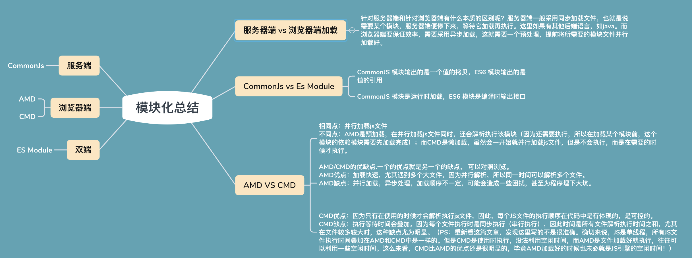
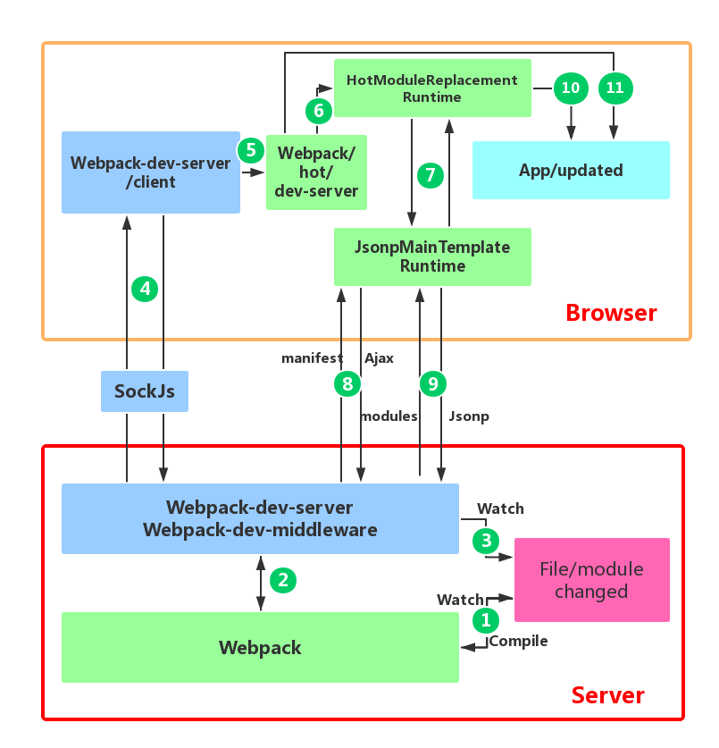

- [模块化相关的知识：](#模块化相关的知识)
- [webpack的作用是什么？](#webpack的作用是什么)
- [webpack核心概念](#webpack核心概念)
  - [Entry](#entry)
  - [Output](#output)
    - [filename](#filename)
    - [path](#path)
    - [publicPath](#publicpath)
  - [Module](#module)
  - [Chunk](#chunk)
  - [Loader](#loader)
  - [Plugin](#plugin)
  - [Loader和Plugin的区别，以及如何自定义Loader和Plugin？](#loader和plugin的区别以及如何自定义loader和plugin)
    - [自定义Loader](#自定义loader)
    - [自定义Plugin](#自定义plugin)
- [webpack如何工作？:star:](#webpack如何工作star)
- [webpack打包流程？:star:](#webpack打包流程star)
- [如何理解module，chunk 和 bundle？](#如何理解modulechunk-和-bundle)
- [sourceMap是什么？](#sourcemap是什么)
- [Webpack Proxy工作原理 (webpack-dev-server)](#webpack-proxy工作原理-webpack-dev-server)
  - [浏览器跨域判定的原理](#浏览器跨域判定的原理)
  - [webpack proxy原理](#webpack-proxy原理)
  - [实际项目举例](#实际项目举例)
- [Webpack热更新HMR](#webpack热更新hmr)
- [如何借助Webpack来优化性能？](#如何借助webpack来优化性能)
- [webpack5 和 4 的区别？](#webpack5-和-4-的区别)
- [如何优化 Webpack 的构建速度？](#如何优化-webpack-的构建速度)
- [Babel原理？](#babel原理)


>https://juejin.cn/post/6943468761575849992#heading-5
>
>https://segmentfault.com/a/1190000041100811
>
> [姜瑞涛：webpack教程](https://www.jiangruitao.com/webpack)


# 模块化相关的知识：

Webpack支持`ES6 Module`、`CommonJS`和`AMD`等模块化方法，目前常用的是ES6 Module和CommonJS。
- `ES6 Module`通过`export`导出模块，`import … from '…'`或`import '…'`导入模块。
- `CommonJS`通过`module.exports`导出模块，`require('…')`导入模块。
- `ES6 Module`通过`import()`函数动态导入模块，`CommonJS`通过`require.ensure`动态导入模块，现在推荐使用import()函数动态导入模块。



# webpack的作用是什么？
* **模块打包：** 可以将**不同模块的文件打包整合**在一起，提高项目性能，可维护性，解决浏览器频繁请求文件的问题。
* **编译兼容：** 通过webpack的`Loader`机制，解决**浏览器兼容**问题，并可以编译转换诸如`.less, .vue, .jsx`这类在浏览器无法识别的格式文件，提高开发效率。
* **能力扩展：** 通过webpack的`Plugin`机制，进一步实现诸如**按需加载，代码压缩**等一系列功能，提高项目的自动化程度，工程效率以及打包输出的质量。
* **混淆代码**，代码打包的同时进行混淆，提高代码的安全性
* **热加载**，开发环境下修改代码，页面实时刷新。
* **tree-shaking**：打包过程中自动剔除没有使用的代码。


# webpack核心概念

## Entry
入口起点(entry point)指示 webpack 应该使用哪个模块,来作为构建其内部依赖图的开始。
进入入口起点后,webpack 会找出有哪些模块和库是入口起点（直接和间接）依赖的。
每个依赖项随即被处理,最后输出到称之为 `bundles` 的文件中。(个人将bunles理解为结果文件)

entry：它有三种形式的值:
- **字符串**：是最简单的形式，表示打包的入口JS件。
- **数组**
  ```js
  module.exports = {
    entry: ['core-js/stable', 'regenerator-runtime/runtime', './a.js'],
  };
  ```
  等效于：
  ```js
    // a.js
    import 'core-js/stable';
    import 'regenerator-runtime/runtime';
  ```
  ```js
  // webpack.config.js
  module.exports = {
    entry: './a.js',
  };
  ```
- **对象**：又称之为多入口配置。本质上打包后生成个JS文件。
  ```js
  var path = require('path');  
  module.exports = {
    entry: {
      app: ['core-js/stable', 'regenerator-runtime/runtime', './a.js'],
      vendor: './vendor'
    },
    output: {
      path: path.resolve(__dirname, ''),
      filename: '[name].js'
    },
    mode: 'none'
  };
  ```
  上方的配置分别从两个入口`app`，`vendor`文件打包，每个入口文件自寻找自己依赖的文件模块打包成一个JS文件，最终得两个JS文件。

## Output
output 属性告诉 webpack 在哪里输出它所创建的 bundles， 以及如何命名这些文件,默认值为 ./dist。
也就是说，output定义了打包的`输出`。output对象有`filename、path、publicPath`属性

### filename
filename表示输出的文件名，有以下几种形式：
- **字符串**表示**资源名称**，如`bundle.js`
- **相对地址**，例如`./js/bundljs`。
- filename支持类似变量的方式生成**动态文件名**
  - 特定动态值`[hash]`，例如[hash]-bundle.js，其中方括号很像占位符，`hash`表  示特定的动态值。例如：
    ```js
      var path = require('path');  
      module.exports = {
        entry: './a.js',
        output: {
          path: path.resolve(__dirname, ''),
          filename: '[hash].js'
        },
        ...
        mode: 'none'
      };
    ```
    我们执行npx webpack打包，控制台显示如下。
    
    `1620cdcbd73ea3873287`表示本次打包的hash值，因此生成的文件名就是      eaf163aa8342f012d6ee.js。

  - 特定动态值`[name]`。[name]表示的是chunk的名称，打包过程中，一个资源入代表 一个chunk，一个异步模块资源也代表一个chunk。这里的`chunk`与资源入口有关。
    - entry形式为`字符串`和`数组`，output.filename的[name]值都是`main`。
      ```js
      module.exports = {
        entry: './a.js',
        output: {
          path: path.resolve(__dirname, ''),
          filename: '[name].js'
        },
        mode: 'none'
      };
      ```
      
    - entry形式为`对象`（即多入口），[name]的值是对象的属性名，对应每一个口文件。
      ```js
      module.exports = {
        entry: {
          app1: './a.js',
          app2: './f.js',
        },
        output: {
          path: path.resolve(__dirname, ''),
          filename: '[name].js'
        },
        mode: 'none'
      };
      ```
      

### path

path表示资源打包后输出的位置，该位置地址要是绝对路径。如果你不设置它，webpack4默认为`dist`目录。

需要注意的是，path输出路径表示的是在**磁盘上构建生成的真实文件存放地址**。

我们在开发时，一般会用`webpack-dev-server`开启一个本地服务器，这个服务器可以`自动刷新和热加载`等，它生成的文件是在`内存`中而不是在电脑磁盘。该内存中的文件路径，我们会用Webpack配置文件的`devServer`配置项的publicPath表示，它虚拟映射了电脑磁盘路径。

### publicPath

output中的publicPath表示的是资源访问路径。

path和publicPath的区别：

* path(资源输出位置)：表示的是本次打包完成后，资源存放的磁盘位置。是一个本地路径
* publicPath(资源访问路径)：代表的是，之后要引入的js css 这些的路径`前缀`。一般来说会写**cdn的url**。

publicPath的表现形式有两类：`相对路径和绝对路径`

## Module
模块,在 Webpack 里一切皆模块,一个模块对应着一个文件。Webpack 会从配置的 Entry 开始递归找出所有依赖的模块。

## Chunk
代码块,一个 Chunk 由多个模块组合而成，用于代码合并与分割。

## Loader
loader 让 webpack 能够去处理那些`非js`文件（webpack 自身只理解 JavaScript）。并可以对代码做polyfill，解决一些浏览器兼容问题。
>core-js 是js标准库的polyfill

Loader本质就是一个`函数`，在该函数中对接收到的内容进行转换，返回转换后的结果。因为 Webpack 只认识 JavaScript，所以 Loader 就成了**翻译官**，对其他类型的资源进行转译的预处理工作。


loader配置语法如下：
```json
module.exports = {
  module: {
    rules: [
      {
        test: /\.css$/, // 匹配规则，一般为正则表达式
        use: [
          { loader: 'style-loader' },
          {
            loader: 'css-loader',
            options: { modules: true }
          },
          { loader: 'sass-loader' }
        ]
      }
    ]
  }
};
```

针对每个文件类型，loader是支持以数组的形式配置多个的，因此当Webpack在转换该文件类型的时候，会**按顺序链式调用**每一个loader，前一个loader返回的内容会作为下一个loader的入参。因此loader的开发需要遵循一些规范，比如返回值必须是**标准的JS代码字符串**，以保证下一个loader能够正常工作，同时在开发上需要严格遵循“单一职责”，只关心loader的输出以及对应的输出。


常见loader：
1. style-loader：将css添加到DOM的内联样式标签style里，然后通过 dom 操作去加载 css。
2. css-loader :允许将css文件通过require的方式引入，并返回css代码。
3. less-loader: 处理less，将less代码转换成css。
4. sass-loader: 处理sass，将scss/sass代码转换成css。
5. awesome-typescript-loader：将 TypeScript 转换成 JavaScript，性能优于 ts-loader。
6. eslint-loader：通过 ESLint 检查 JavaScript 代码。
7. tslint-loader：通过 TSLint检查 TypeScript 代码。


## Plugin
loader 被用于转换某些类型的模块,而插件则可以用于执行范围更广的任务。比如：**按需加载，代码压缩，文件管理、环境注入**等。

在 Webpack 运行的生命周期中会广播出许多事件，Plugin 可以监听这些事件，在合适的时机通过 Webpack 提供的 API 改变输出结果。

配置语法：
```json
const HtmlWebpackPlugin = require('html-webpack-plugin'); // 通过 npm 安装
const webpack = require('webpack'); // 访问内置的插件
module.exports = {
  ...
  plugins: [
    new webpack.ProgressPlugin(),
    new HtmlWebpackPlugin({ template: './src/index.html' }),
  ],
};
```

Plugin从本质上来说，就是一个具有`apply`方法Javascript对象。apply 方法会被 webpack compiler 调用，并且在整个编译生命周期都可以访问 `compiler` 对象。

Webpack编译会创建两个核心对象：`compiler和compilation`。
* `compiler`：包含了 Webpack 环境的所有的配置信息，包括 options，loader 和 plugin，和 webpack 整个生命周期相关的钩子.这个对象在 Webpack 启动时候被实例化，它是**全局唯一**的，可以简单地把它理解为 **Webpack 实例**
* `compilation`：作为 Plugin 内置事件回调函数的参数，包含了当前的**模块资源、编译生成资源、变化的文件以及被跟踪依赖的状态信息**。当检测到一个文件变化，一次新的 Compilation 将被创建。


常用的plugin有:
1. html-webpack-plugin：html 模板处理
2. webpack-bundle-analyzer: 可视化 Webpack 输出文件的体积


## Loader和Plugin的区别，以及如何自定义Loader和Plugin？

* `loader`：用来处理webpack无法处理的模块（即非js、json文件），然后你就可以利用 webpack 的打包能力，对它们进行处理。运行在打包文件**之前**。Loader在 module.rules 中配置，作为模块的解析规则，类型为**数组**。每一项都是一个 **Object**，内部包含了 test(类型文件)、loader、options (参数)等属性。
* `plugin`：可以执行比转换更复杂的任务。比如打包优化、文件管理、环境注入等……在**整个编译周期**都起作用。Plugin在 plugins 中单独配置，类型为**数组**，每一项是一个 Plugin 的**实例**，参数都通过构造函数传入。

>PS：loader是翻译官，plugin是干活滴
### 自定义Loader
Loader本质上来说就是一个函数，函数中的 this 作为上下文会被 webpack 填充，因此我们**不能将 loader设为一个箭头函数**。该函数接受一个参数，即 webpack 传递给 loader 的文件源内容。**该函数的工作就是获得处理前的源内容，对源内容进行处理后，返回处理后的内容**。

loader 有两种方式返回处理后的内容：
1. **return source**
    ```js
    module.exports = function (source) {
      // 处理 source ...
      const content = source.replace("hello", "哈哈");
      // 如果 loader 配置了 options 对象，那么this.query将指向 options
      const options = this.query;
      return content;
    }
    ```

2. **this.callback()**，this.callback 是 webpack 给 loader 注入的 API，方便 loader 和 webpack之间通信。
   ```js
    module.exports = function (source) {
     // 处理 source
      const content = source.replace("hello", "哈哈");
      // 如果 loader 配置了 options 对象，那么this.query将指向 options
      const options = this.query;
      // 使用 this.callback 返回内容
      this.callback(null, content);
      // 使用 this.callback 返回内容时，该 loader 必须返回    undefined，
      // 以让 Webpack 知道该 loader 返回的结果在 this.callback 中，而不是 return 中 
      return
    };
   ```
   `this.callback` 的详细用法如下：
   ```js
   this.callback(
       // 当无法转换源内容时，给 Webpack 返回一个 Error
       err: Error | null,
       // 源内容转换后的内容
       content: string | Buffer,
       // 用于把转换后的内容得出原内容的 Source Map，方便调试
       sourceMap?: SourceMap,
       // 如果本次转换为原内容生成了 AST 语法树，可以把这个 AST 返回，
       // 以方便之后需要 AST 的 Loader 复用该 AST，以避免重复生成 AST，提升性能
       abstractSyntaxTree?: AST
   );
   ```

### 自定义Plugin
Webpack编译会创建两个核心对象：`compiler和compilation`。

* `compiler`：包含了 Webpack 环境的所有的配置信息，包括 options，loader 和 plugin，和 webpack 整个生命周期相关的钩子.这个对象在 Webpack 启动时候被实例化，它是**全局唯一**的，可以简单地把它理解为 **Webpack 实例**
* `compilation`：作为 Plugin 内置事件回调函数的参数，包含了当前的**模块资源、编译生成资源、变化的文件以及被跟踪依赖的状态信息**。当检测到一个文件变化，一次新的 Compilation 将被创建。

如果需要自定义Plugin，也需要遵循一定的规范：
* 插件必须是一个函数或者是一个包含 apply 方法的对象，这样才能访问compiler实例
* 传给每个插件的 compiler 和 compilation 对象都是同一个引用，因此不建议修改
* 异步的事件需要在插件处理完任务时调用回调函数通知 Webpack 进入下一个流程，不然会卡住

```js
class MyPlugin {
    // Webpack 会调用 MyPlugin 实例的 apply 方法给插件实例传入 compiler 对象
  apply (compiler) {
    // 找到合适的事件钩子，实现自己的插件功能
    compiler.hooks.emit.tap('MyPlugin', compilation => {
        // compilation: 当前打包构建流程的上下文
        console.log(compilation);
        // do something...
    })
  }
}
```

生命周期钩子有：
* entry-option ：初始化 option
* compile： 真正开始的编译，在创建 compilation 对象之前
* compilation ：生成好了 compilation 对象
* make：从 entry 开始递归分析依赖，准备对每个模块进行 build
* after-compile： 编译 build 过程结束
* emit ：在将内存中 assets 内容写到磁盘文件夹之前
* after-emit ：在将内存中 assets 内容写到磁盘文件夹之后
* done： 完成所有的编译过程
* failed： 编译失败的时候


# webpack如何工作？:star:
Webpack 打包过程：

- 从一个入口文件开始，基于代码文件中的所有 import，export，require 构建依赖树；
- 编译 JS/CSS 等模块；
- 使用算法排序、重写、连接代码；
- 优化。

开发环境的 Webpack：

- 打包所有代码；
- 启动 webpack-dev-server 托管打包好的代码；
- 启动 websocket 处理热更新 HMR。

**应用规模越大，启动和热更新代码越慢**。及时启动了热更新，每次代码变更也需要重新生产 Bundle 文件。

# webpack打包流程？:star:
Webpack 的运行流程是一个串行的过程,从启动到结束会依次执行以下流程 :
1. 读取webpack的`配置参数`；
2. 启动webpack，创建`Compiler`对象并开始解析项目；
3. 从`入口`文件（entry）开始解析，并且找到其导入的依赖模块，递归遍历分析，形成`依赖关系树`；
4. 对不同文件类型的依赖模块文件使用对应的`Loader`进行编译，最终转为Javascript文件；
5. 整个过程中webpack会向外抛出一些**事件**，而webpack的插件即可通过监听这些关键的事件节点，执行`插件任务`进而达到干预输出结果的目的。
6. 根据入口和模块之间的依赖关系,组装成一个个包含多个模块的 `Chunk`,再把每个 Chunk 转换成一个单独的文件加入到输出列表，再根据配置确定输出的路径和文件名，把文件内容写入到文件系统。

# 如何理解module，chunk 和 bundle？
module，chunk 和 bundle 其实就是同一份逻辑代码在不同转换场景下的取了三个名字：

我们直接写出来的是 module，webpack`处理时`是 chunk，最后生成浏览器可以直接运行的结果是`bundle`。

# sourceMap是什么？
sourceMap是**一项将编译、打包、压缩后的代码映射回源代码的技术**，由于打包压缩后的代码并没有阅读性可言，一旦在开发中报错或者遇到问题，直接在混淆代码中debug问题会带来非常糟糕的体验，sourceMap可以帮助我们快速定位到源代码的位置，提高我们的开发效率。

在webpack.config.js中设置`devtool: 'none'`来关闭source map功能。devtool属性可以接受以下值：


# Webpack Proxy工作原理 (webpack-dev-server)
在项目开发中不可避免会遇到跨越问题，Webpack中的`Proxy`就是解决前端`跨域`的方法之一。所谓代理，指的是在接收客户端发送的请求后**转发**给其他服务器的行为，webpack中提供服务器的工具为`webpack-dev-server`。

> webpack-dev-server是 webpack 官方推出的一款**开发工具**，将自动编译和自动刷新浏览器等一系列对开发友好的功能全部集成在了一起。同时，为了提高开发者日常的开发效率，只适用在开发阶段。
> 其功能有：
>    - 支持文件监听和浏览器自动刷新
>    - 模块热替换
>    - 可开启本地HTTP服务器，一来可以请求处理和转发，二是就不需要使用本地文件预览了
>    - 支持Source Map，方便调试工作


配置如下：
```js
const path = require('path')

module.exports = {
    // ...
    devServer: {
        contentBase: path.join(__dirname, 'dist'),
        compress: true,
        port: 9000,
        proxy: {
            '/api': {
                target: 'https://api.github.com', // 表示的是代理到的目标地址。
                pathRewrite: ***, //默认情况下，我们的 /api-hy 也会被写入到URL中，如果希望删除，可以使用pathRewrite。
                secure: ***, //默认情况下不接收转发到https的服务器上，如果希望支持，可以设置为false。
                changeOrigin: ***, //它表示是否更新代理后请求的 headers 中host地址。
            }
        }
        // ...
    }
}
```

## 浏览器跨域判定的原理
对于简单请求来说：（非简单请求请看《浏览器安全 - 页面安全》）
1. **浏览器**先根据同源策略对前端页面和后台交互地址做匹配，
   * 若同源，则直接发送数据请求。
   * 若不同源，则发送跨域请求，浏览器会在请求的http header中加上一个 `Origin`字段，标明这个请求是从哪里发出来的。例如：`Origin: http://www.wanwan.com`
2. 服务器解析程序收到浏览器**跨域请求**后，如果服务器认为这个请求可以接受，就在 `Access-Control-Allow-Origin` 头部中回发相同的源信息， 如`Access-Control-Allow-Origin：http://www.wanwan.com`。（如果是公共资源，可回发`*`）
3. 浏览器收到服务器的响应后，根据接受到的响应头里的`Access-Control-Allow-origin`字段与**当前域名**做匹配，浏览器就会驳回请求。正常情况下，浏览器会处理请求。
4. 注意，请求和响应都不包含 cookie 信息。

   

> PS：如果需要包含 `cookie` 信息，ajax 请求需要设置 xhr 的属性 `withCredentials` 为 true，服务器需要设置响应头部 `Access-Control-Allow-Credentials`: true。


一个支持`CORS（跨域资源共享）`的web服务器，有如下的判定字段，他们会在响应的header中写明:
1. Access-Control-Allow-Origin：允许跨域的Origin列表
2. Access-Control-Allow-Methods：允许跨域的方法列表
3. Access-Control-Allow-Headers：允许跨域的Header列表
4. Access-Control-Expose-Headers：允许暴露给JavaScript代码的Header列表
5. Access-Control-Max-Age：最大的浏览器缓存时间，单位为s
6. 等
   
## webpack proxy原理
proxy工作原理实质上是利用`http-proxy-middleware` 这个http代理中间件，实现请求转发给其他服务器。背后使用node来做server。

当本地发送请求的时候，代理服务器响应该请求，并将请求转发到目标服务器，目标服务器响应数据后再将数据返回给代理服务器，最终再由代理服务器将数据响应给本地，原理图如下：


在代理服务器传递数据给本地浏览器的过程中，**两者同源（协议，域名，端口）**，并不存在跨域行为，这时候浏览器就能正常接收数据。

> **服务器与服务器**之间请求数据并不会存在跨域行为，跨域行为是**浏览器安全策略限制**

**代理服务器和浏览器之间为什么同源？**
对于浏览器来说，并不感知请求是不是被转发过，浏览器只知道请求来自于同一个域，所以就认为是同源是的。
## 实际项目举例
1. 前端项目本地服务启动在`http://localhost:3003`， 后台服务启动在`http://localhost:3000`。（如果直接发送请求会跨域，因为端口号不同）
2. 项目用axios发送请求，并将baseURL配置为`'/api' `，用来标识这是调用后台接口的请求。实际请求路径的效果等同于`http://localhost:3003/api`。
3. webpack的devServer中配置
   ```json
    devServer: {
        host: 'localhost',
        port: 3003,
        proxy: {
            '/api': {
                target: `http://localhost:3000`, // 表示的是代理到的目标地址。
                changeOrigin: true, //它表示是否更新代理后请求的 headers 中host地址。
            }
        }
        // ...
    }
   ```
4. 在第2步骤的基础上，由前端页面发送请求获取列表信息（`http://localhost:3003/api/getList`），此时前端页面(`http://localhost:3003`)和后台交互地址（`http://localhost:3003/api`）是**同源**(协议，域名，端口均一致)的，因此会直接把请求发生出去。
5. 请求发生出去之后，会被webpack proxy拦截，匹配到了`api`标识，因此会按照第3步配置（`target`），将请求转发到真正的后台服务器上，也就是`http://localhost:3000`上。
6. 后台服务器收到请求后进行处理，并将响应返回。webpack proxy会再次拦截，但proxy不会改变请求头中的任何信息。所以浏览器收到proxy返回的请求响应时，还是认为该响应是来自于**同源**服务器的。因此不会有跨域问题，可以正常的发送请求和接受响应。


# Webpack热更新HMR

>https://zhuanlan.zhihu.com/p/30669007

Webpack的热更新（Hot Module Replacement），缩写为`HMR`。这个机制可以做到不用刷新浏览器而将新变更的模块替换掉旧的模块。

webpack-dev-server 提供了实时重加载的功能，但是不能局部刷新。需借助了HotModuleReplacementPlugin。


**如何开启热更新？**
```js
const webpack = require('webpack')
module.exports = {
  // ...
  devServer: {
    hot: true // 开启 HMR 特性
    // hotOnly: true
  }
}
```

**关于webpack-dev-server**:
webpack-dev-server 主要包含了三个部分：
1. webpack: 负责编译代码
2. webpack-dev-middleware: 主要负责构建内存文件系统，把webpack的 OutputFileSystem 替换成 InMemoryFileSystem。同时作为Express的中间件拦截请求，从内存文件系统中把结果拿出来。
3. express：负责搭建请求路由服务。

**工作流程**:
1. 启动dev-server，webpack开始构建，在编译期间会向 entry 文件注入热更新代码；
2. Client 首次打开后，Server 和 Client 基于Socket建立通讯渠道；
3. 修改文件，Server 端监听文件发送变动，webpack开始编译，直到编译完成会触发"Done"事件；
4. Server通过socket 发送消息告知 Client；
5. Client根据Server的消息（hash值和state状态），通过ajax请求获取 Server 的manifest描述文件；
6. Client对比当前 modules tree ，再次发请求到 Server 端获取新的JS模块；
7. Client获取到新的JS模块后，会更新 modules tree并替换掉现有的模块；
8. 最后调用 `module.hot.accept()` 完成热更新；

<details>
<summary>更详细版</summary>

webpack热更新流程如下：
图是webpack 配合 `webpack-dev-server` 进行应用开发的模块热更新流程图。
 

>其中：
>- 红色框内是服务端，橙色框是浏览器端。
>- 绿色的方框是 webpack 代码控制的区域。蓝色方框是 webpack-dev-server 代码控制的区域，洋红色的方框是文件系统，文件修改后的变化就发生在这，而青色的方框是应用本身。

1. 第一步，在 webpack 的 watch 模式下，文件（代码文件）发生修改，webpack 监听到文件变化，根据配置文件对模块重新编译打包，并将打包后的代码通过JS对象保存在**内存**中。
2. 第二步，是 `webpack-dev-server` 和 webpack 之间的接口交互，具体是dev-server 的中间件 `webpack-dev-middleware` 和 `webpack` 之间的交互，中间间用 webpack 暴露的 API对代码变化进行监控，并且告诉 webpack，将代码打包到内存中。
3. 第三步是 `webpack-dev-server` 对文件（静态文件，与第一步监控不同）变化的一个监控。当配置文件中的devServer.watchContentBase 为 true 的时，Server 会监听这些配置文件夹中静态文件的变化，通知浏览器端对应用进行 `live reload`。注意，这儿是**浏览器刷新**，和 HMR 是两个概念。
4. 第四步,通过 `sockjs`（`webpack-dev-server `的依赖）在浏览器端和服务端之间建立一个 **websocket 长连接**，将 webpack 编译打包的各个阶段的状态信息告知浏览器端，同时也包括第三步中 Server 监听静态文件变化的信息。浏览器端根据这些 socket 消息进行不同的操作。当然服务端传递的最主要信息还是新模块的 `hash` 值，后面的步骤根据这一 hash 值来进行模块热替换。
5. 第五步，由于webpack-dev-server/client 端并不能够请求更新的代码，也不会执行热更模块操作，所以把这些工作又交回给了 webpack。`webpack/hot/dev-server`根据 webpack-dev-server/client 传给它的信息以及 dev-server 的配置决定是刷新浏览器呢还是进行模块热更新。
6. 第六步，`HotModuleReplacement.runtime` 是客户端 HMR 的中枢，它接收到上一步传递给他的新模块的 hash 值，它通过 `JsonpMainTemplate.runtime `向 server 端发送 `Ajax` 请求，服务端返回一个 json，该 json 包含了所有要更新的模块的 hash 值，获取到更新列表后，该模块再次通过 `jsonp` 请求，获取到最新的模块代码。这就是上图中 7、8、9 步骤。
7. 第十步，`HotModulePlugin` 将会对新旧模块进行对比，决定是否更新模块，在决定更新模块后，检查模块之间的依赖关系，更新模块的同时更新模块间的依赖引用。
8. 最后一步，当 HMR 失败后，回退到 `live reload` 操作，也就是进行**浏览器刷新**来获取最新打包代码。

</details>


# 如何借助Webpack来优化性能？
为一个项目的打包构建工具，在完成项目开发后经常需要利用Webpack对前端项目进行性能优化，常见的优化手段有如下几个方面：
* JS代码压缩：例如`terser`是一个JavaScript的解释、绞肉机、压缩机的工具集，可以帮助我们压缩、丑化我们的代码，让bundle更小。
* CSS代码压缩：CSS压缩通常用于去除无用的空格等
* Html文件代码压缩：
* 文件大小压缩：对文件的大小进行压缩，可以有效减少http传输过程中宽带的损耗
* 图片压缩
* Tree Shaking：Tree Shaking 是一个术语，在计算机中表示消除`死代码`，依赖于ES Module的静态语法分析。在webpack实现Trss shaking有两种不同的方案：
  * **usedExports**：通过标记某些函数是否被使用，之后通过Terser来进行优化的
  * **sideEffects**：跳过整个模块/文件，直接查看该文件是否有副作用
* 代码分离：默认情况下，所有的JavaScript代码（业务代码、第三方依赖、暂时没有用到的模块）在首页全部都加载，就会影响首页的加载速度。如果可以分出出更小的bundle，以及控制资源加载优先级，从而优化加载性能。例如：`splitChunksPlugin`
* 内联 chunk：一些必须加载的代码可以用webpack来实现内联chunk。
  

总结一下，Webpack对前端性能的优化，主要是通过**文件体积大小**入手，主要的措施有**分包**、**减少Http请求次数**等。


# webpack5 和 4 的区别？
1. 性能优化： Webpack 5对构建性能进行了优化，构建速度比Webpack 4更快。
   1. 压缩：webpack5支持多线程压缩，压缩速度更快
   2. 模块传递：webpack4中，办法是尽可能的压缩代码。webpack5使用**模块树**传递的方式，将每个模块构建前的 meta 信息进行了**缓存，尝试减少不必要的构建**。
   3. webpack5默认使用 `webassembly` ，webpack4 则默认使用 jsonp。webassembly 比 jsonp 更快

2. 改进的缓存： Webpack 5中默认使用持久性缓存，这样每次构建后，只会编译和打包更改的代码，从而提高了构建速度。
   
6. 支持Web Assembly： Webpack 5可以支持Web Assembly模块类型，从而可以更快地加载和启动。

7. 现代代码处理： Webpack 5可以支持将现代代码打包为现代浏览器和旧版浏览器两个版本，以便旧版本浏览器也可以顺利加载现代代码。

8. 改进的代码分割： Webpack 5中的代码分割默认使用ES module语法，这使得代码生成更加智能且效率更高。

6. 移除废弃特性： Webpack 5移除了一些废弃的特性，比如Loader特性，以便更好地支持新的模块类型。

> tcc项目是用的webpack4版本
# 如何优化 Webpack 的构建速度？
- **优化 Loader**：优化 Loader 的文件搜索范围，再将编译过的文件缓存起来。
- `HappyPack`: 可以将 Loader 的同步执行转换为并行的，这样就能充分利用系统资源来加快打包效率了
  ```json
  module: {
    loaders: [
      {
        test: /\.js$/,
        include: [resolve('src')],
        exclude: /node_modules/,
        // id 后面的内容对应下面
        loader: 'happypack/loader?id=happybabel'
      }
    ]
  },
  plugins: [
    new HappyPack({
      id: 'happybabel',
      loaders: ['babel-loader?cacheDirectory'],
      // 开启 4 个线程
      threads: 4
    })
  ]
  ```

# Babel原理？
babel是什么？
Babel是一个流行的JavaScript编译器，它可以把新的代码转换为向后兼容的JavaScript代码，使开发者可以无须担心不同浏览器的兼容性问题。