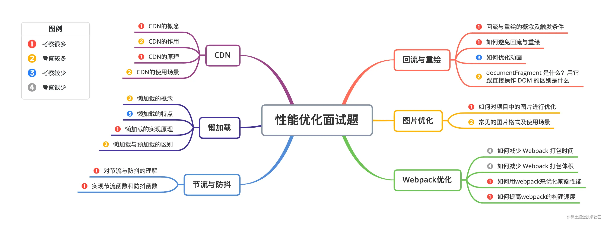

- [性能指标](#性能指标)
- [优化方案](#优化方案)
  - [CDN](#cdn)
  - [懒加载](#懒加载)
    - [懒加载与预加载的区别](#懒加载与预加载的区别)
  - [避免回流与重绘](#避免回流与重绘)
  - [节流和防抖](#节流和防抖)
  - [文件优化](#文件优化)
  - [网络相关](#网络相关)
  - [Webpack](#webpack)
  - [监控相关](#监控相关)

>https://alienzhou.github.io/fe-performance-journey/5-subresources/
>
>http://caibaojian.com/interview-map/frontend/performance.html
>https://juejin.cn/post/6941278592215515143#heading-35

# 性能指标

|指标名|含义|优秀数据|
|--|--|--|
|FP|页面首个像素点渲染时间|1000ms以内|
|FCP|页面首次内容渲染时间|1000ms以内|
|LCP|最大内容渲染时间|2000ms以内|
|FID|用户首次和网站进行交互到浏览器响应该事件的实际延时时间|100ms以内|
|TTI|首次可交互时间||
|CLS|页面累计布局偏移总和|0.1以内|

# 优化方案


## CDN

`CDN`是指一种通过互联网互相连接的电脑网络系统，利用**最靠近**每位用户的服务器，更快、更可靠地将音乐、图片、视频、应用程序及其他文件发送给用户，来提供高性能、可扩展性及低成本的网络内容传递给用户。

典型的CDN系统由下面三个部分组成：
- **分发服务系统**： 最基本的工作单元就是`Cache`设备，cache（边缘cache）负责直接响应最终用户的访问请求，把缓存在本地的内容快速地提供给用户。同时cache还负责与源站点进行内容**同步**，把更新的内容以及本地没有的内容从源站点获取并保存在本地。
- **负载均衡系统**：主要功能是负责对所有发起服务请求的用户进行访问调度，确定提供给用户的最终实际访问地址。
- **运营管理系统**：负责处理业务层面的与外界系统交互所必须的收集、整理、交付工作，包含客户管理、产品管理、计费管理、统计分析等功能。

**CDN的作用**：
- 性能方面：
  - 用户收到的内容来自最近的数据中心，延迟更低，内容加载更快
  - 部分资源请求分配给了CDN，减少了服务器的负载
- 安全方面：CDN有助于防御DDoS、MITM等网络攻击

## 懒加载

懒加载也叫做**延迟加载、按需加载**

优点：
- 减少无用资源的加载：使用懒加载明显减少了服务器的压力和流量，同时也减小了浏览器的负担。
- 提升用户体验: 如果同时加载较多图片，可能需要等待的时间较长，这样影响了用户体验，而使用懒加载就能大大的提高用户体验。
- 防止加载过多图片而影响其他资源文件的加载 ：会影响网站应用的正常使用。

### 懒加载与预加载的区别

两者主要区别是一个是提前加载，一个是迟缓甚至不加载。
- 懒加载也叫延迟加载，指的是在长网页中延迟加载图片的时机，当用户需要访问时，再去加载
- 预加载指的是将所需的资源提前请求加载到本地，这样后面在需要用到时就直接从缓存取资源。

## 避免回流与重绘
**回流**：当渲染树中部分或者全部元素的**尺寸、结构或者属性**发生变化时会触发浏览器回流。

**重绘**：更新元素的绘制属性（元素的颜色、背景色、边框等），会触发重绘制。

>当触发回流时，一定会触发重绘，但是重绘不一定会引发回流。

**如何避免回流和重绘**
- 使用 class 操作样式，而不是频繁操作 style
- 避免使用 table 布局
- 避免频繁操作DOM，可以创建一个文档片段`documentFragment`，在它上面应用所有DOM操作，最后再把它添加到文档中
- Debounce window resize 事件
- 对 dom 属性的读写要分离
- will-change: transform 做优化，等

## 节流和防抖

- **防抖**是指在事件被触发 n 秒后再执行回调，如果在这 n 秒内事件又被触发，则重新计时。
  - 适用于**按钮提交场景**：防⽌多次提交按钮，只执⾏最后提交的⼀次
- **节流**是指规定一个单位时间，在这个单位时间内，只能有一次触发事件的回调函数执行，如果在同一个单位时间内某事件被触发多次，只有一次能生效。
  - 适用于**拖拽场景，缩放场景，动画场景**

手写防抖：
```js
function debounce(fn, wait) {
  var timer = null;

  return function() {
    var context = this,
      args = [...arguments];

    // 如果此时存在定时器的话，则取消之前的定时器重新记时
    if (timer) {
      clearTimeout(timer);
      timer = null;
    }

    // 设置定时器，使事件间隔指定事件后执行
    timer = setTimeout(() => {
      fn.apply(context, args);
    }, wait);
  };
}
```

手写节流
```js
// 时间戳版
function throttle(fn, delay) {
  let preTime = Date.now();

  return function() {
    let context = this,
      args = [...arguments],
      nowTime = Date.now();

    // 如果两次时间间隔超过了指定时间，则执行函数。
    if (nowTime - preTime >= delay) {
      preTime = Date.now();
      return fn.apply(context, args);
    }
  };
}
```

## 文件优化

- `图片加载优化`
  - 减少图片使用，用css替代
  - 小图使用base64格式，或SVG
  - 雪碧图
  - 使用`WebP`格式图片，它提供了有损压缩与无损压缩（可逆压缩）的图片文件格式
- `其他文件优化`
  - CSS 文件放在 head 中
  - 服务端开启文件压缩功能
  - 将 script 标签放在 **body 底部**，因为 JS 文件执行会阻塞渲染。或者把 script 标签放在任意位置然后加上 `defer` ，表示该文件会并行下载，但是会放到 HTML 解析完成后顺序执行。对于没有任何依赖的 JS 文件可以加上 `async` ，表示加载和渲染后续文档元素的过程将和 JS 文件的加载与执行并行无序进行。
  - `webworker`：执行 JS 代码过长会卡住渲染，对于需要很多时间计算的代码可以考虑使用 Webworker。`Webworker` 可以让我们另开一个线程执行脚本而不影响渲染。
- `CDN`：静态资源尽量使用 CDN 加载，由于浏览器对于单个域名有并发请求上限，可以考虑使用多个 CDN 域名。对于 CDN 加载静态资源需要注意 CDN 域名要与主站不同，否则每次请求都会带上主站的 Cookie。

## 网络相关

- `DNS预解析`：DNS 解析也是需要时间的，可以通过预解析的方式来预先获得域名所对应的 IP。

  ```html
  <link rel="dns-prefetch" href="//yuchengkai.cn" />
  ```

- `缓存`：
  - 本地web存储
  - http缓存强缓存、协商缓存。详见[《缓存 - 浏览器(http)缓存》](../浏览器/缓存-浏览器(http)缓存(强缓存，协商缓存))章节。
    - 选择合适的缓存策略：
      - 对于某些不需要缓存的资源，可以使用 Cache-control: no-store ，表示该资源不需要缓存
      - 对于频繁变动的资源，可以使用 Cache-Control: no-cache 并配合 ETag 使用，表示该资源已被缓存，但是每次都会发送请求询问资源是否更新。
      - 对于代码文件来说，通常使用 Cache-Control: max-age=31536000 并配合策略缓存使用，然 后对文件进行指纹处理，一旦文件名变动就会立刻下载新的文件。
- `http/2.0`：在 HTTP / 2.0 中引入了多路复用，能够让多个请求使用同一个 TCP 链接，极大的加快了网页的加载速度。并且还支持 Header 压缩，进一步的减少了请求的数据大小。
  > 详见[《网络(2) - http1、2、3》](../%E6%B5%8F%E8%A7%88%E5%99%A8/%E7%BD%91%E7%BB%9C(2)-http1%E3%80%812%E3%80%813.md)章节


## Webpack
- 对于 Webpack4，打包项目使用 `production` 模式，这样会自动开启**代码压缩**
- 使用 ES6 模块来开启 `tree shaking`，这个技术可以移除没有使用的代码
- 优化图片，对于小图可以使用 `base64` 的方式写入文件中
- 按照路由拆分代码，实现**按需加载**
- 给打包出来的文件名添加哈希，实现浏览器**缓存**文件
- `Code Splitting`: 将代码按路由维度或者组件**分块**(chunk),这样做到按需加载,同时可以充分利⽤浏览器缓存

## 监控相关
：一个合理的性能优化方案，一定是通过线上的性能监控数据，或者前端自动化性能测试分析，发现性能问题，针对发现的问题进行分析与定位，然后进行对应的性能优化，最后上线观察。之后又会进入到下一个性能优化的循环中。所以推行性能优化，一定要注重优化工程的可持续性。

**性能监控工具**

[lighthouse](https://github.com/GoogleChrome/lighthouse)

公司内部：rum