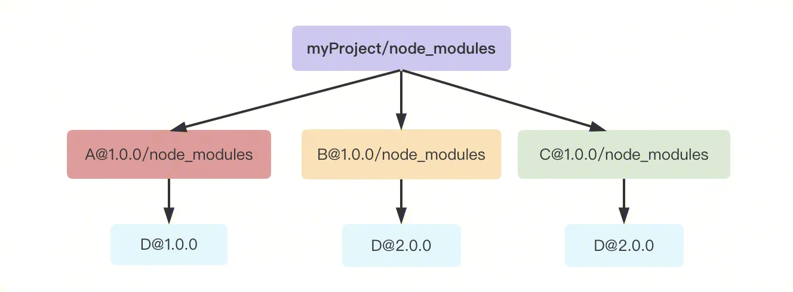
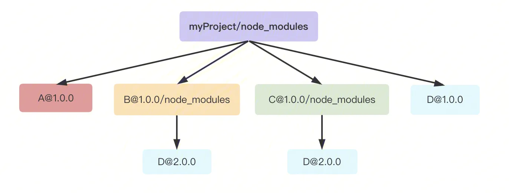
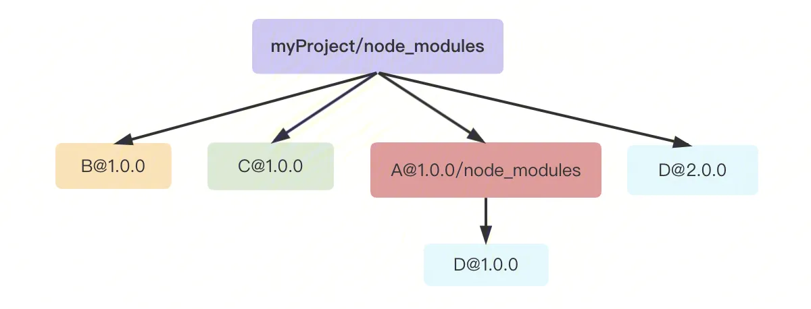
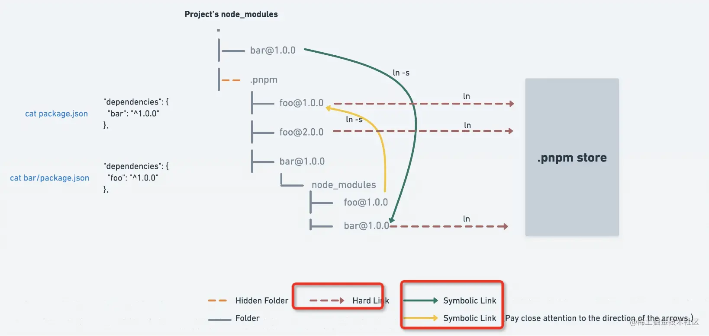
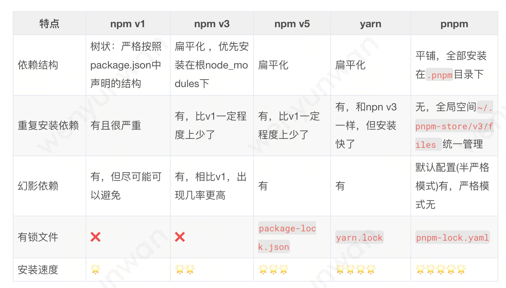

- [前端模块化](#前端模块化)
- [npm、yarn、pnpm](#npmyarnpnpm)
  - [npm v1 v2(树状结构)](#npm-v1-v2树状结构)
  - [npm v3(扁平化结构)](#npm-v3扁平化结构)
  - [npm v5 和yarn(扁平化结构 + .lock)](#npm-v5-和yarn扁平化结构--lock)
  - [pnpm](#pnpm)
  - [总结](#总结)
- [dependencies devDependencies peerDependencies三者的区别](#dependencies-devdependencies-peerdependencies三者的区别)
- [npm发包流程](#npm发包流程)

## 前端模块化
模块化原因：现代Web网站正不断向APP演进
代码复杂性不断增加
项目越来越大
代码部署需要通过分包不断优化
代码重用需求
...

模块化标准：
* `CommonJS`：CommonJS规范主要用于服务端编程，加载模块是`同步`的，这并不适合在浏览器环境，因为同步意味着阻塞加载，浏览器资源是异步加载的，因此有了AMD CMD解决方案。
  ```
  暴露模块：module.exports = value 或 exports.xxx = value
  引入模块：require(xxx)，如果是第三方模块，xxx为模块名；如果是自定义模块，xxx为模块文件路径
  ```
* `AMD`：在浏览器环境中`异步`加载模块，而且可以并行加载多个模块。不过，AMD规范开发成本高，代码的阅读和书写比较困难，模块定义方式的语义不顺畅。
* `CMD`：CMD规范与AMD规范很相似，都用于浏览器编程，依赖就近，延迟执行，可以很容易在Node.js中运行。不过，依赖SPM 打包，模块的加载逻辑偏重
* `ES6`：在语言标准的层面上，实现了模块功能，而且实现得相当简单，完全可以取代 CommonJS 和 AMD 规范，成为浏览器和服务器通用的模块解决方案。
  ```js
  /** 定义模块 math.js **/
  var basicNum = 0;
  var add = function (a, b) {
      return a + b;
  };
  export { basicNum, add };

  /** 引用模块 **/
  import { basicNum, add } from './math';
  function test(ele) {
      ele.textContent = add(99 + basicNum);
  }
  ```

ES6 模块与 CommonJS 模块的差异：
1. CommonJS 模块输出的是一个值的拷贝，ES6 模块输出的是值的引用。
2. CommonJS 模块是运行时加载，ES6 模块是编译时输出接口。
3.  `ES6 Module`通过`import()`函数动态导入模块，`CommonJS`通过`require.ensure`动态导入模块，现在推荐使用import()函数动态导入模块。
## npm、yarn、pnpm
### npm v1 v2(树状结构)
npm在版本3之前处理依赖的方式简单粗暴，以递归的形式，严格按照 package.json 结构以及子依赖包的 package.json 结构将依赖安装到他们**各自**的 node_modules 中。

**例子：**
我们的项目 myProject 现在依赖了两个模块：A、B，模块A又依赖 D@1.0.0，模块B又依赖 D@2.0.0，模块C又依赖 D@2.0.0
```json
{
  "name": "myProject",
  "dependencies": {
    "A": "^1.0.0",
    "B": "^1.0.0",
  }
  "devDependencies": {
    "C": "^1.0.0",
  }
}
```
执行 npm install 后，node_modules 目录中的模块结构如下：



**优点：**
1. 层级关系直观：node_modules 的结构和 package.json 结构一一对应，层级结构明显直观，并且保证了每次安装目录结构都是相同的。
   
**缺点：**
1. 占据比较大的磁盘空间，模块重复安装：在不同层级的依赖中，就算是依赖同一个模块，都需要重新安装一次
2. 层级嵌套深：系统对文件路径都会有一个最大长度的限制，嵌套层级过深可能导致不可预知的问题（比如无法直接删除）。


### npm v3(扁平化结构)
为了解决以上问题，NPM 在版本3 做了一次较大更新。其将之前的嵌套结构改为扁平结构。

**安装原则**
* 安装模块时，不管其是直接依赖还是子依赖的依赖（间接依赖），优先将其安装在 `node_modules 根目录`。

* 当安装到相同模块时，判断在 node_modules `根`目录已安装的模块版本是否符合新模块的版本范围，如果符合则跳过，不用再次安装；不符合则在`当前模块`的 node_modules 下安装该版本的模块。

还是上面的例子，如果使用npm版本3安装依赖，则最后的依赖结构应该如下图：



**优点：**
1. 在满足 Node.js 的模块查找规则的同时降低了依赖层级，一定程度上缓解了占用磁盘空间（其实并没有完全解决，比如上图的依赖D@2.0.0还是会被安装多次）和路径过长的问题
   
**缺点：**
1. **依赖的目录结构不确定**：如上面的例子，如果B和C被先安装，那么最后的依赖结构如下图:
    
2. **npm包分身**：相同版本的子依赖包被不同的项目依赖所依赖时会安装两次，比如还是上面的例子，A先被安装（依赖D@2.0.0被安装了两次）
3. **幽灵依赖**：可以在项目中使用没有在package.json 中声明的依赖。


### npm v5 和yarn(扁平化结构 + .lock)
* **npm5+ 和 yarn** 是通过铺平的`扁平化`的方式来管理 node_modules，解决了嵌套方式的部分问题，同时还实现了`.lock`来`锁定`依赖版本的功能。
  
* npm：**串行**安装，按照队列安装每个 package，必须要等到当前 package 安装完成之后，才能继续后面的安装
* yarn：**并行**安装：同步安装所有包

yarn最大的优点就是比npm安装速度**快**。

但依然未解决`幽灵依赖`问题。

### pnpm
pnpm即Performant NPM，高性能npm。

**特点：**
* 提高安装速度：不用安装那么多重复的包，
* 节约磁盘空间，安装过的依赖会复用缓存，甚至包版本升级带来的变化都只 diff
* 非常优雅的解决`幽灵依赖`问题


则是用了另一种方式，不再是复制了，而是都从`全局 store 硬连接`到 node_modules/.pnpm，然后之间通过`软链接`来组织依赖关系。这样不但节省磁盘空间，也没有幽灵依赖问题，安装速度还快，从机制上来说完胜 npm 和 yarn。



它有三层结构：
* 第一层：解决幽灵依赖问题
  1. 采用`树状结构`，将项目直接依赖的文件（包）写在项目的`node_modules`下。
  2. 项目的根 node_modules 里面依赖和 package.json 里声明的一一对应，在项目的package.json里定义了什么包就只能依赖什么包，即只会有 package.json下声明的包，不会有次级依赖的包。
* 第二层：解决包重复安装问题
  1. 项目的 node_modules 下有 .pnpm 文件夹，以`平铺`的形式储存着所有的包（包括`次级依赖`）。
  2. 每个项目根 node_modules 下安装的包以`软链接`(符号链接)方式将内容指向 node_modules/.pnpm 中的包。
* 第三层：
  1. 所有包都安装在本地磁盘全局目录`~/.pnpm-store/v3/files` 下，.pnpm目录下的所有依赖都是以`硬链接`方式指向这个位置。
  2. 全局统一管理路径，跨项目复用，同一版本的包仅存储一份内容，甚至不同版本的包也仅存储 diff 内容。

缺点：pnpm查看子级依赖很不方便。

### 总结


## dependencies devDependencies peerDependencies三者的区别
* **dependencies**：这里的依赖是会被最终构建到**生产环境**的依赖，比如React
* **devDependencies**：**开发过程**中的依赖，比如eslint
* **peerDependencies**：目的是提示`宿主环境`去安装满足 peerDependencies 所指定依赖的包。更多的是在公共库或者三方插件中使用
   
   举个例子：antd 的 package.json 中的 dependencies，发现并未安装  `react` 和 `react-dom`，但是随意打开一个组件你就会发现，它依赖 react 和 react-dom。

   但antd 的 package.json 中 peerDependencies，如下：
   ```json
   "peerDependencies": {
     "react": ">=16.9.0",
     "react-dom": ">=16.9.0"
   },
   ```
   antd 不能独立的运行，需要使用它的项目中安装了 react 和 react-dom 才可以运行。
## npm发包流程
1. 初始化
2. 构建：该过程涉及到使用webpack(或者rollup、vite)打出一个静态资源包
3. npm publish
