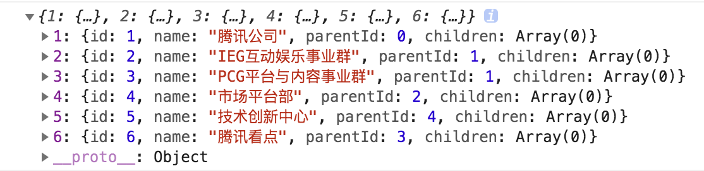

## 问题背景

有时候业务开发的过程中可能会有这样的情况：
接口返回一段这样的扁平化数据结构，
```json
[
  { id: 1, name: '腾讯公司', parentId: 0 },
  { id: 2, name: 'IEG互动娱乐事业群', parentId: 1 },
  { id: 3, name: 'PCG平台与内容事业群', parentId: 1 },
  { id: 4, name: '市场平台部', parentId: 2 },
  { id: 5, name: '技术创新中心', parentId: 4 },
  { id: 6, name: '腾讯看点', parentId: 3 }
]
```

但实际上页面需要树形结构渲染或处理逻辑，需要转化成这样的 tree 结构：
<details>
<summary>点击展示代码</summary>
<pre><code>
[
  {
    id: 1,
    name: '腾讯公司',
    parentId: 0,
    children: [
      {
        id: 2,
        name: 'IEG互动娱乐事业群',
        parentId: 1,
        children: [
          {
            id: 4,
            name: '市场平台部',
            parentId: 2,
            children: [
              {
                id: 5,
                name: '技术创新中心',
                parentId: 4
              }
            ]
          }
        ]
      },
      {
        id: 3,
        name: 'PCG平台与内容事业群',
        parentId: 1,
        children: [
          {
            id: 6,
            name: '腾讯看点',
            parentId: 3
          }
        ]
      }
    ]
  }
]
</code><pre>
</details>


如果后端不肯改成这样的数据结构，只能前端处理了。方法有以下几种：

## 递归实现
可以解决问题，但效率很低
```js
function convertTree(list) {
  let temp = []
  list.forEach(ele => {
    const tempEle = recursionChildren(temp, ele)
    if (tempEle) {
      tempEle.children ? tempEle.children.push(ele) : tempEle.children = [ele]
    } else {
      temp.push(ele)
    }
  })
  return temp
}
function recursionChildren(arr, ele) {
  let temp = false
  for(const val of arr) {
    if (val.id === ele.parentId) {
      temp = val
      break
    } else if (val.children) {
      temp = recursionChildren(val.children, ele)
    }
  }
  return temp
}
```

## map映射
```js
function arrayToTree(arr) {
  const result = []
  const map = {}
  for (const item of arr) {
    const { id, parentId } = item

    // 这里的判断是为了确认之前有没有添加过它的子级（原因在最后的注释）
    if (!map[id]) {
      map[id] = {
        children: []
      }
    }

    map[id] = {
      ...item,
      children: map[id]['children'] // 如上一个注释
    }

    const treeItem =  map[id];

    if (parentId === 0) {
      result.push(treeItem);
    } else {
      // map 是否存在此父级，不存在则添加此父级的空 children
      if (!map[parentId]) {
        map[parentId] = {
          children: [],
        }
      }
      map[parentId].children.push(treeItem)
    }

  }
  return result;
}
```

## sort排序
```js
function arrayToTree(arr) {
  arr.sort((a, b) => a.id - b.id)
  const result = []
  const map = {}
  for (const item of arr) {
    const { id, parentId } = item
    map[id] = {
      ...item,
      children: []
    }
    const treeItem = map[id]
    if (!parentId || !map[parentId]) {
      result.push(treeItem)
    } else {
      map[parentId]?.children.push(treeItem)
    }
  }
  return result
}
```

## reduce方法
```js
const listToTree = list => {
  const info = list.reduce(
    (map, node) => ((map[node.id] = node), (node.children = []), map),
    {}
  )
  return list.filter(node => {
    // 这行代码 && 右边表达式是给 node 是子节点运行的
    node.parentId &&
      info[node.parentId] &&
      info[node.parentId].children.push(node)

    return node.parentId ? !info[node.parentId] : true;
  })
}
```
`info` 的数据结构如下：


