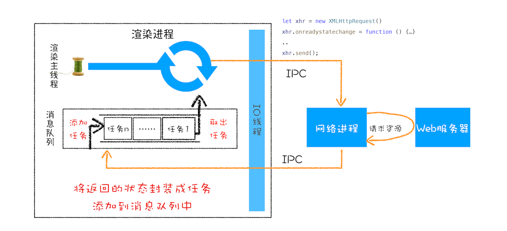
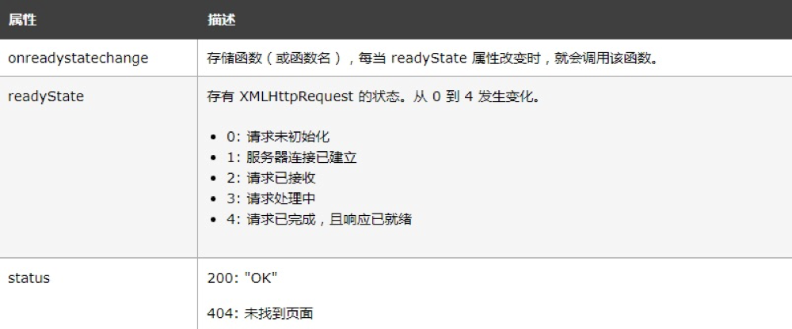

- [前言](#前言)
- [XMLHttpRequest](#xmlhttprequest)
  - [XMLHttpRequest 运作机制](#xmlhttprequest-运作机制)
    - [第一步：创建 XMLHttpRequest 对象](#第一步创建-xmlhttprequest-对象)
    - [第二步：为 xhr 对象注册回调函数](#第二步为-xhr-对象注册回调函数)
    - [第三步：配置基础的请求信息](#第三步配置基础的请求信息)
    - [第四步：发起请求](#第四步发起请求)
  - [XMLHttpRequest 4个重要的属性:onreadystatechange, readyState, status，withCredentials](#xmlhttprequest-4个重要的属性onreadystatechange-readystate-statuswithcredentials)
  - [XMLHttpRequest 使用过程中的“坑”](#xmlhttprequest-使用过程中的坑)
- [Ajax](#ajax)
- [Axios](#axios)
  - [Ajax 和 Axios的区别](#ajax-和-axios的区别)
- [Ajax和Fetch的区别](#ajax和fetch的区别)
- [Axios和Fetch的区别](#axios和fetch的区别)


> web API: 浏览器提供的一套操作浏览器功能和页面元素的接口

# 前言

在 XMLHttpRequest 出现之前，如果服务器数据有更新，依然需要重新**刷新整个页面**。

而 XMLHttpRequest 提供了从 Web 服务器获取数据的能力，如果你想要更新某条数据，只需要通过 XMLHttpRequest 请求服务器提供的接口，就可以获取到服务器的数据，

然后再操作 DOM 来更新页面内容，整个过程只需要更新网页的一部分就可以了，

而不用像之前那样还得刷新整个页面，这样既有效率又不会打扰到用户。

# XMLHttpRequest

XMLHttpRequest可以做到：

- 在不重新加载页面的情况下更新网页
- 在页面已加载后从服务器请求数据
- 在页面已加载后从服务器接收数据
- 在后台向服务器发送数据


## XMLHttpRequest 运作机制

`XMLHttpRequest`背后的实现机制，具体工作过程你可以参考下图：



`XMLHttpRequest`使用方法如下：

```js

 function GetWebData(URL){
    /**
     * 1:新建XMLHttpRequest请求对象
     */
    let xhr = new XMLHttpRequest()

    /**
     * 2:注册相关事件回调处理函数 
     */
    xhr.onreadystatechange = function () {
        switch(xhr.readyState){
          case 0: //请求未初始化
            console.log("请求未初始化")
            break;
          case 1://OPENED
            console.log("OPENED")
            break;
          case 2://HEADERS_RECEIVED
            console.log("HEADERS_RECEIVED")
            break;
          case 3://LOADING  
            console.log("LOADING")
            break;
          case 4://DONE
            if(this.status == 200||this.status == 304){
                console.log(this.responseText);
                }
            console.log("DONE")
            break;
        }
    }

    xhr.ontimeout = function(e) { console.log('ontimeout') }
    xhr.onerror = function(e) { console.log('onerror') }

    /**
     * 3:打开请求,配置参数
     */
    xhr.open('Get', URL, true);//创建一个Get请求,采用异步
    xhr.timeout = 3000 //设置xhr请求的超时时间
    xhr.responseType = "text" //设置响应返回的数据格式
    xhr.setRequestHeader("X_TEST","time.geekbang")

    /**
     * 4:发送请求
     */
    xhr.send();
}
```

### 第一步：创建 XMLHttpRequest 对象

当执行到`let xhr = new XMLHttpRequest()`后，JavaScript 会创建一个 XMLHttpRequest 对象 `xhr`，用来执行实际的网络请求操作。

### 第二步：为 xhr 对象注册回调函数

因为网络请求比较耗时，所以要注册回调函数，这样后台任务执行完成之后就会通过调用回调函数来告诉其执行结果。

XMLHttpRequest 的回调函数主要有下面几种：
* `ontimeout`，用来监控超时请求，如果后台请求超时了，该函数会被调用
* `onerror`，用来监控出错信息，如果后台请求出错了，该函数会被调用；
* `onreadystatechange`，用来监控后台请求过程中的状态，比如可以监控到 HTTP 头加载完成的消息、HTTP 响应体消息以及数据加载完成的消息等。

### 第三步：配置基础的请求信息

首先要通过 `open` 接口配置一些基础的请求信息，包括请求的地址、请求方法（是 get 还是 post）和请求方式（同步还是异步请求）。

然后通过 xhr 内部属性类配置一些其他可选的请求信息，你可以参考文中示例代码，我们通过xhr.timeout = 3000来配置超时时间，也就是说如果请求超过 3000 毫秒还没有响应，那么这次请求就被判断为失败了。

### 第四步：发起请求

一切准备就绪之后，就可以调用`xhr.send`来发起网络请求了。你可以对照上面那张请求流程图，可以看到：

1. 渲染进程会将请求发送给网络进程，
2. 然后网络进程负责资源的下载，
3. 等网络进程接收到数据之后，就会利用 IPC 来通知渲染进程；
4. 渲染进程接收到消息之后，会将 xhr 的回调函数封装成任务并添加到消息队列中，
5. 等主线程循环系统执行到该任务的时候，就会根据相关的状态来调用对应的回调函数。

* 如果网络请求出错了，就会执行 xhr.onerror；
* 如果超时了，就会执行 xhr.ontimeout；
* 如果是正常的数据接收，就会执行 `onreadystatechange` 来反馈相应的状态。

## XMLHttpRequest 4个重要的属性:onreadystatechange, readyState, status，withCredentials


- `withCredentials`：指定在涉及到**跨域请求**的时候，是否携带`cookie`信息，默认值为false。(写在客户端)
  
## XMLHttpRequest 使用过程中的“坑”

1. 跨域问题 (然如何解决跨域问题，相见[《安全-页面安全(跨域，网站攻击)》](../浏览器/安全-页面安全(跨域，网站攻击))章节)
2. HTTPS 混合内容的问题：是指 HTTPS 页面中包含了不符合 HTTPS 安全要求的内容，比如包含了 `HTTP` 资源，通过 HTTP 加载的图像、视频、样式表、脚本等，都属于混合内容。
   
   使用 XMLHttpRequest 请求时，浏览器认为这种请求可能是攻击者发起的，会阻止此类危险的请求。

   

# Ajax

`Ajax` ，全称 Asynchronous JavaScript and XML（异步 JavaScript 和 XML），是通过 `XMLHttpRequest` 对象来实现异步数据传输的**技术方案**。它通过在后台与服务器进行少量数据交换，实现了只需要更新局部内容而不需要重新加载整个页面，从而提高了页面的加载速度和性能。

ps：记住，ajax只是一种技术方案而已，核心技术是XMLHttpRequest。

# Axios

[参考链接](https://juejin.im/post/5b55c118f265da0f6f1aa354)

`axios`库，它是基于promise的http库，可运行在**浏览器端和node.js**中。他有很多优秀的特性，例如拦截请求和响应、取消请求、转换json、客户端防御CSRF等。

**请求拦截**
```js
axios.interceptors.request.use(    
    config => {        
        // 每次发送请求之前判断vuex中是否存在token        
        // 如果存在，则统一在http请求的header都加上token，这样后台根据token判断你的登录情况
        // 即使本地存在token，也有可能token是过期的，所以在响应拦截器中要对返回状态进行判断 
        const token = store.state.token;        
        token && (config.headers.Authorization = token);        
        return config;    
    },    
    error => {        
        return Promise.error(error);    
})
```
**响应拦截**
```js
axios.interceptors.response.use(    
    response => {   
        // 如果返回的状态码为200，说明接口请求成功，可以正常拿到数据     
        // 否则的话抛出错误
        if (response.status === 200) {            
            return Promise.resolve(response);        
        } else {            
            return Promise.reject(response);        
        }    
    },    
    // 服务器状态码不是2开头的的情况
    // 这里可以跟你们的后台开发人员协商好统一的错误状态码    
    // 然后根据返回的状态码进行一些操作，例如登录过期提示，错误提示等等
    // 下面列举几个常见的操作，其他需求可自行扩展
    error => {            
        if (error.response.status) {            
            switch (error.response.status) {                
                // 401: 未登录
                // 未登录则跳转登录页面，并携带当前页面的路径
                // 在登录成功后返回当前页面，这一步需要在登录页操作。         
                case 401:                    
                    ...
                    break;

                // 403 token过期
                // 登录过期对用户进行提示
                // 清除本地token和清空vuex中token对象
                // 跳转登录页面                
                case 403:
                     ...                  
                    break; 

                // 404请求不存在
                case 404:
                    ...
                    break;
                // 其他错误，直接抛出错误提示
                default:
                    ...
            }
            return Promise.reject(error.response);
        }
    }    
});
```

**封装get方法**
我们通过定义一个get函数，get函数有两个参数，第一个参数表示我们要请求的url地址，第二个参数是我们要携带的请求参数。get函数返回一个promise对象，当axios其请求成功时resolve服务器返回 值，请求失败时reject错误值。最后通过export抛出get函数。
```js
export function get(url, params){    
    return new Promise((resolve, reject) =>{        
        axios.get(url, {            
            params: params        
        }).then(res => {
            resolve(res.data);
        }).catch(err =>{
            reject(err.data)        
    })    
});}
```

**封装post方法**
原理同get基本一样，但post方法必须要使用对提交从参数对象进行`序列化`(将对象的状态信息转换为可以存储或传输的形式的过程)的操作。
```js
export function post(url, params) {
    return new Promise((resolve, reject) => {
         axios.post(url, QS.stringify(params))
        .then(res => {
            resolve(res.data);
        })
        .catch(err =>{
            reject(err.data)
        })
    });
}
```

## Ajax 和 Axios的区别

1. `Ajax` 是基于`原生的 XMLHTTPRequest 对象`实现的，而 `Axios` 是基于 `Promise 封装的 ajax 库`。
2. Axios 相比 Ajax API 更加简洁易用，例如 Axios 可以用一行代码即可实现对一个 URL 的 GET 请求。
3. Axios 可以对`请求和响应进行拦截`，可以在发送请求或收到响应时对其进行处理，Ajax 则没有这个功能，需要手动实现。
4. Axios 支持`服务端请求`和`浏览器端请求`两种环境下使用，同时也支持将请求、响应和错误信息进行统一配置和管理，可以提高代码的可维护性。
5. Axios 可以通过配置`全局默认参数`和实例化单个请求的方式实现不同场景下的不同请求类型，而 Ajax 只能通过手动修改参数和方法来实现相同的功能。

# Ajax和Fetch的区别

Ajax和Fetch都是用于向服务器发送请求并获取响应的技术，它们的主要区别在于以下几点：

1. API设计：Ajax使用`XMLHttpRequest（XHR）对象`来发送和接收数据，而Fetch使用`fetch() API`进行请求和响应。

2. 返回值方式：使用Ajax时，我们需要手动处理XHR对象的状态变化和响应数据，而Fetch API返回了一个Promise对象，使得处理响应数据更加简单直接。

3. 浏览器兼容性：Ajax可以在所有现代浏览器中运行，而Fetch的兼容性较差，只有最新的浏览器才支持。

4. 请求和取消：在使用Ajax时，我们可以通过XHR对象的abort()方法取消正在进行的请求；而Fetch API没有提供类似的方法，需要通过新的API来实现。

5. 默认不带Cookie：当使用Fetch API发送请求时，默认情况下不会自动发送Cookie，需要设置请求选项才能携带Cookie；Ajax则可以自动将Cookie发送到服务器。

# Axios和Fetch的区别

Axios 和 Fetch 都是 JavaScript 中用于发送网络请求的工具。它们之间的区别有以下几点：

- Axios 可以在 Node.js 和浏览器两种环境中使用，而 Fetch 只能在浏览器环境中使用；
- Axios 支持取消请求和自定义请求拦截器，而 Fetch 不太方便实现取消请求和请求拦截；
- Axios 的 API 更加灵活和易于使用，Fetch 的 API 相对简单，使用起来不太方便。
  