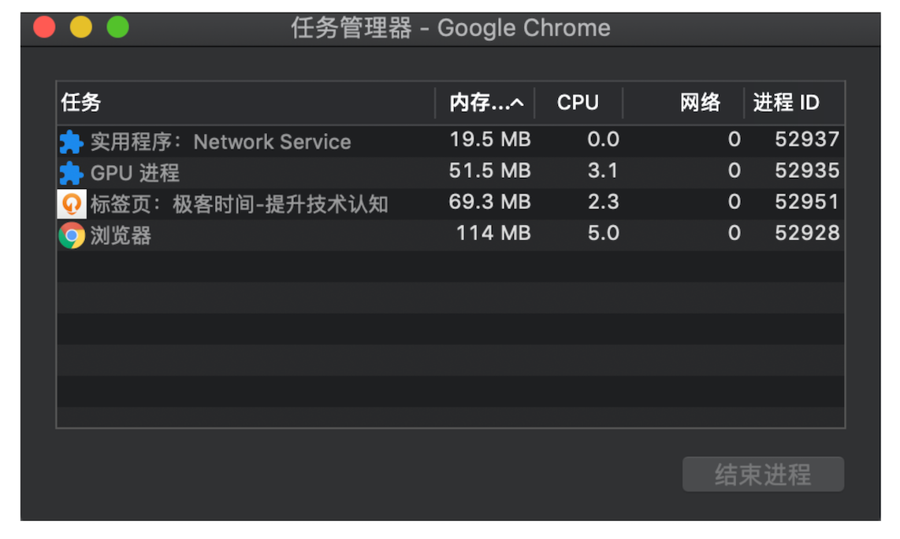
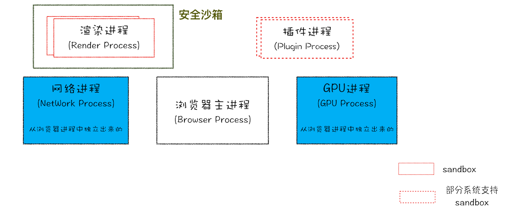
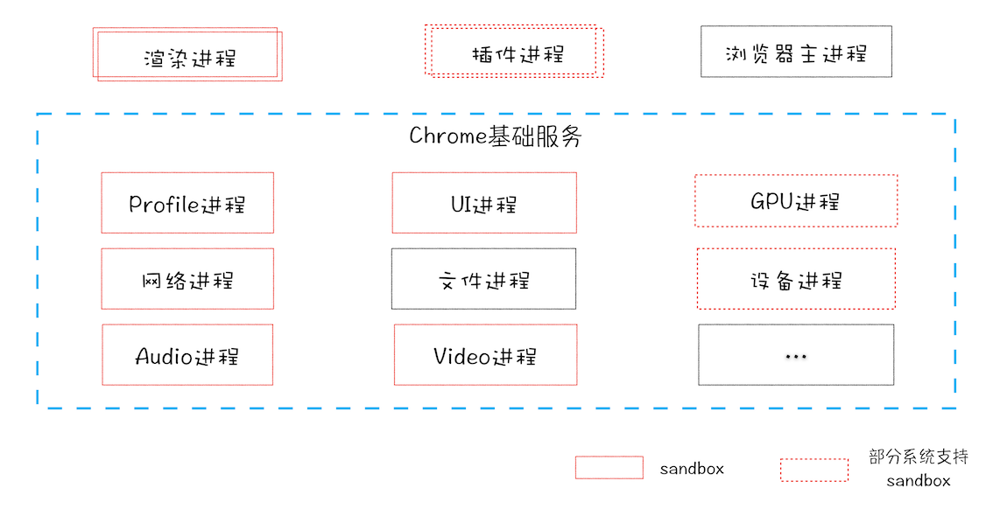
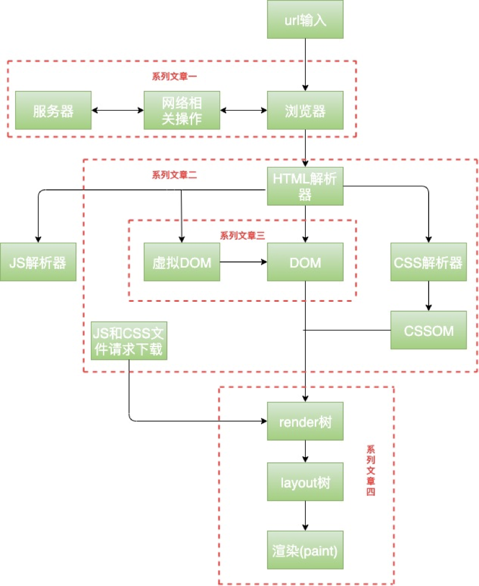

- [浏览器多进程架构](#浏览器多进程架构)
  - [进程和线程](#进程和线程)
  - [单进程浏览器时代](#单进程浏览器时代)
  - [目前，多进程浏览器时代(浏览器进程、渲染进程、GPU进程、网络进程、插件进程)](#目前多进程浏览器时代浏览器进程渲染进程gpu进程网络进程插件进程)
  - [未来，面向服务的架构](#未来面向服务的架构)
- [从输入 URL 到页面展示，这中间发生了什么？](#从输入-url-到页面展示这中间发生了什么)

本文知识都是基于chrome浏览器的，

因为 Chrome、微软的 Edge 以及国内的大部分主流浏览器，都是基于 Chromium 二次开发而来；而 Chrome 是 Google 的官方发行版，特性和 Chromium 基本一样，只存在一些产品层面差异；再加上 Chrome 是目前世界上使用率最高的浏览器‘

[参考链接](https://time.geekbang.org/column/article/113513?utm_term=zeusQYFJN&utm_source=app&utm_medium=geektime&utm_campaign=216-end&utm_content=v8zhuanlankaipianci0316)

# 浏览器多进程架构
chrome打开一个页面至少需要启动4个进程

至少需要 1 个网络进程 、1 个浏览器进程、1 个 GPU 进程以及 1 个渲染进程，共 4 个；如果打开的页面有运行插件的话，还需要再加上 1 个插件进程。

## 进程和线程
* **多线程**可以**并行**处理任务，但是线程是不能单独存在的，它是由**进程**来启动和管理的。
* 一个**进程**就是一个程序的**运行实例**。详细解释就是，启动一个程序的时候，操作系统会为该程序创建一块内存，用来存放代码、运行中的数据和一个执行任务的主线程，我们把这样的一个运行环境叫进程。

**线程是依附于进程的，而进程中使用多线程并行处理能提升运算效率**

进程和线程之间的关系有以下 4 个特点：
* 进程中的任意一线程执行出错，都会导致整个进程的崩溃。
* **线程**之间**共享**进程中的数据。
* 当一个进程关闭之后，操作系统会回收进程所占用的内存。
* **进程**之间的内容相互**隔离**。

## 单进程浏览器时代
**单进程浏览器是指浏览器的所有功能模块都是运行在同一个进程里**，这些模块包含了网络、插件、JavaScript 运行环境、渲染引擎和页面等。

在 `2007` 年之前，市面上浏览器都是单进程的。

单进程浏览器架构如下图：

这会导致浏览器有**不稳定，不流畅，不安全**的问题。

* **不稳定**
  * 早期浏览器需要借助于**插件**来实现诸如 Web 视频、Web 游戏等各种强大的功能，但是插件是最容易出问题的模块，所以一个插件的意外崩溃会引起整个浏览器的崩溃。
  * **渲染引擎模块**也是不稳定的，通常一些复杂的 JavaScript 代码就有可能引起渲染引擎模块的崩溃。和插件一样，渲染引擎的崩溃也会导致整个浏览器的崩溃。
* **不流畅**
   * 所有页面的渲染模块、JavaScript 执行环境以及插件都是运行在同一个线程中的。一旦某个js脚本陷入无限循环，就会导致整个浏览器失去响应，变卡顿。
   * 另外**内存泄露**也会导致进程变慢
* **不安全**
  

## 目前，多进程浏览器时代(浏览器进程、渲染进程、GPU进程、网络进程、插件进程)
目前最新的Chrome进程架构如下图：

多进程自然的解决了不稳定和不流畅的问题，同时还利用了安全沙箱解决了不安全的问题。

从图中可以看出，最新的 Chrome 浏览器包括：1 个`浏览器（Browser）主进程`、1 个 `GPU 进程`、1 个`网络（NetWork）进程`、多个`渲染进程`和多个`插件进程`。

* `浏览器进程`。主要负责**界面显示**、用户交互、子进程管理，同时提供存储等功能。
* `渲染进程`。核心任务是将 HTML、CSS 和 JavaScript 转换为用户可以与之交互的网页，排版引擎 Blink 和 JavaScript 引擎 V8 都是运行在该进程中，默认情况下，Chrome 会为每个 Tab 标签创建一个渲染进程。因为渲染进程所有的内容都是通过网络获取的，会存在一些恶意代码利用浏览器漏洞对系统进行攻击，出于安全考虑，渲染进程都是运行在**沙箱模式**下。
  >如果从一个页面打开了另一个新页面（左键直接点击打开的），而新页面和当前页面属于**同一站点**的话，那么新页面会复用父页面的渲染进程。
* `GPU 进程`。GPU 的使用初衷是为了实现 3D CSS 的效果，只是随后网页、Chrome 的 UI 界面都选择采用 GPU 来绘制。
* `网络进程`。主要负责页面的网络资源加载，之前是作为一个模块运行在浏览器进程里面的，直至最近才独立出来，成为一个单独的进程。
* `插件进程`。主要是负责插件的运行，因插件易崩溃，所以需要通过插件进程来隔离，以保证插件进程崩溃不会对浏览器和页面造成影响。

虽然多进程模型提升了浏览器的稳定性、流畅性和安全性，但同样不可避免地带来了一些**问题**：
* 更高的资源占用。
* 更复杂的体系架构。浏览器各模块之间耦合性高、扩展性差等问题，会导致现在的架构已经很难适应新的需求了。

## 未来，面向服务的架构
2016年，Chrome团队提出了`SOA`(面向服务的架构)。

也就是说 Chrome 整体架构会朝向现代操作系统所采用的“面向服务的架构” 方向发展，原来的各种模块会被重构成独立的`服务`（Service），每个服务（Service）都可以在独立的进程中运行，访问服务（Service）必须使用定义好的接口，通过 `IPC` 来通信，从而**构建一个更内聚、松耦合、易于维护和扩展的系统**，更好实现 Chrome 简单、稳定、高速、安全的目标。

Chrome 最终要把 UI、数据库、文件、设备、网络等模块重构为基础服务，类似操作系统底层服务，下面是 Chrome“面向服务的架构”的进程模型图：

> `IPC`指的是进程间通信，常见的方式有：管道（包括无名管道和命名管道）、消息队列、信号量、共享存储、Socket、Streams 等

# 从输入 URL 到页面展示，这中间发生了什么？
>[参考链接](https://time.geekbang.org/column/article/117637?utm_term=zeusQYFJN&utm_source=app&utm_medium=geektime&utm_campaign=216-end&utm_content=v8zhuanlankaipianci0316)

是一道经典的面试题，能比较全面地考察应聘者知识的掌握程度，其中涉及到了`网络、操作系统、Web` 等一系列的知识。

**整个过程需要各个进程之间的配合**
* 浏览器进程主要负责用户交互、子进程管理和文件储存等功能。
* 网络进程是面向渲染进程和浏览器进程等提供网络下载功能。
* 渲染进程的主要职责是把从网络下载的 HTML、JavaScript、CSS、图片等资源解析为可以显示和交互的页面。运行在安全沙箱中

要详细的说的话，可以从下面这几个方面讲
* 缓存：`强缓存，协商缓存，启发式缓存`
* DNS解析：`域名到IP地址的转换的过程`
* 如果有CDN，还要加上CDN：`内容分发网络`
* tcp三次握手
* http通信
* 生成渲染树
* 浏览器屏幕绘制
* tcp四次挥手

具体过程如下：
1. 首先，在浏览器地址栏中输入url，**浏览器进程**通过进程间通信（`IPC`）把url请求发送给网络进程。
2. **网络进程**接收到url请求后检查本地**缓存**（`缓存-系统缓存-路由器缓存`）是否缓存了该请求资源，如果有则将该资源返回给**浏览器进程**。若没有，则跳到第三步操作。
3. **网络进程**向web服务器发起`http`请求（网络请求），过程如下：
   1. `域名解析(DNS解析)`，解析获取相应的IP地址。
   2. 利用ip地址和服务器建立tcp连接（`tcp三次握手`）。
   3. 构建请求头信息，发送http请求
   4. 服务器响应后，网络进程接收响应头和响应信息，并解析响应内容
4. **网络进程**解析响应流程:
   1. 检查状态码，如果是`301/302`，则需要重定向，从Location自动中读取地址，如果是`200`，则继续处理请求。
   2. 200响应处理：
      * 检查响应类型Content-Type，如果是字节流类型，则将该请求提交给下载管理器，该导航流程结束，不再进行后续的渲染
      * 如果是html则通知**浏览器进程**准备渲染进程，准备进行渲染
5. 准备**渲染进程**：浏览器进程检查当前url是否和之前打开的渲染进程**根域名**是否相同，如果相同，则复用原来的进程，如果不同，则开启新的渲染进程
6. 浏览器向渲染进程发起“提交文档”的消息，渲染进程收到消息后，会和网络进程建立传输数据的“管道”，文档数据传输完成后，渲染进程会返回“确认提交”的消息给浏览器进程
7. 浏览器收到“确认提交”的消息后，会更新浏览器的页面状态，包括了安全状态、地址栏的 URL、前进后退的历史状态，并更新web页面，此时的web页面是空白页
8. **渲染进程**对文档进行页面解析和子资源加载，解析html源码,生成Dom树、解析css样式生成css tree、生成渲染树，回流，重绘，渲染。最后显示在屏幕中新页面显示出来。
9.  tcp四次挥手，http1.1之后可以保持长链接