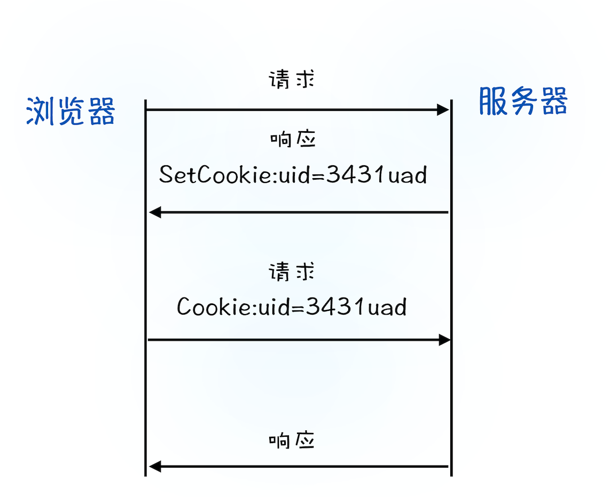

- [Cookie，document.cookie](#cookiedocumentcookie)
  - [Cookie的参数](#cookie的参数)
  - [Cookie函数](#cookie函数)
  - [登录状态是如何保持的？](#登录状态是如何保持的)
- [Web 存储对象：LocalStorage，sessionStorage](#web-存储对象localstoragesessionstorage)
  - [Storage事件](#storage事件)
- [IndexedDB](#indexeddb)
- [Cookie、Session、token的区别](#cookiesessiontoken的区别)
  - [session](#session)
  - [cookie](#cookie)
  - [token](#token)


[参考链接](https://zh.javascript.info/data-storage)

# Cookie，document.cookie
Cookie 是直接存储在浏览器中的一小串数据。它们是 HTTP 协议的一部分，由 [RFC 6265](https://www.rfc-editor.org/rfc/rfc6265) 规范定义。

Cookie 通常是由 Web 服务器使用响应 `Set-Cookie` HTTP-header 设置的。然后浏览器使用 Cookie HTTP-header 将它们自动添加到（几乎）每个对相同域的请求中。

Cookie的常见用处之一是身份验证：
1. 登录后，服务器在响应中使用 `Set-Cookie` HTTP-header 来设置具有唯一“会话标识符（session identifier）”的 cookie。
2. 下次当请求被发送到同一个域时，浏览器会使用 Cookie HTTP-header 通过网络发送 `cookie`。
3. 所以服务器知道是谁发起了请求。


可以用 `document.cookie` 属性从浏览器访问 cookie。

限制：
1. Cookie大小限制为`4K`
2. 每个域的 cookie 总数不得超过 20+ 左右，具体限制取决于浏览器。

```
document.cookie = "username=John Doe; expires=Thu, 18 Dec 2013 12:00:00 GMT; path=/"    // 设置cookie
document.cookie = "username=; expires=Thu, 01 Jan 1970 00:00:00 GMT"    // 删除cookie
```
## Cookie的参数


* `path`：表示该路径下的页面可以访问该 cookie
  
  如果一个 cookie 带有 path=/admin 设置，那么该 cookie 在 `/admin 和 /admin/something` 下都是可见的，但是在 /home 或 其他 下不可见。

  通常，我们应该将 path 设置为根目录：`path=/`，以使 cookie 对此网站的所有页面可见。
* `domain`：控制了可访问 cookie 的域。
  
  比如：`document.cookie = "name=value;domain=.baidu.com"`，所有*.baidu.com的主机都可以访问该cookie。
* `expires，max-age`：为了让 cookie 在**浏览器关闭**后仍然存在，我们可以设置 expires 或 max-age 选项中的一个。
  ```
  expires=Tue, 19 Jan 2038 03:14:07 GMT
  max-age=3600
  ```
* `secure`：表示Cookie 应只能被通过 HTTPS 传输。
* `samesite`：选项通常有 `Strict`、`Lax` 和 `None` 三个值。
   * Strict：那么浏览器会完全禁止第三方 Cookie。
   * Lax：从第三方站点的链接打开和从第三方站点提交 Get 方式的表单这两种方式都会携带 Cookie。但如果在第三方站点中使用 Post 方法，或者通过 img、iframe 等标签加载的 URL，这些场景都不会携带 Cookie。
   * None：在任何情况下都会发送 Cookie 数据。

    它旨在防止 `CSRF`（跨网站请求伪造）攻击。
* `httpOnly`：这个选项禁止任何 JavaScript 访问 cookie。我们使用 document.cookie 看不到此类 cookie，也无法对此类 cookie 进行操作。

    设置了httpOnly, 如果用户访问了带有黑客 JavaScript 代码的页面，黑客代码将执行但无法通过 document.cookie 获取到包含用户身份验证信息的 cookie。所以攻击会被预防。

    可以用于防范`XSS`攻击。
## Cookie函数
* getCookie(name)
* setCookie(name, value, options)
* deleteCookie(name)


## 登录状态是如何保持的？
* 用户打开登录页面，在登录框里填入用户名和密码，点击确定按钮。点击按钮会触发页面脚本生成用户登录信息，然后调用 **POST** 方法提交用户登录信息给服务器。
* 服务器接收到浏览器提交的信息之后，查询后台，验证用户登录信息是否正确，如果正确的话，会生成一段表示用户身份的字符串，并把该字符串写到响应头的 `Set-Cookie` 字段里，如下所示，然后把响应头发送给浏览器。  
  ```
  Set-Cookie: UID=3431uad;
  ```
* 浏览器在接收到服务器的响应头后，开始解析响应头，如果遇到响应头里含有 Set-Cookie 字段的情况，浏览器就会把这个字段信息**保存到本地**。比如把UID=3431uad保持到本地。
* 当用户再次访问时，浏览器会发起 HTTP 请求，但在发起请求之前，浏览器会读取之前保存的 `Cookie` 数据，并自动把数据写进**请求头**里的 Cookie 字段里（如下所示），然后浏览器再将请求头发送给服务器。
  ```
  Cookie: UID=3431uad;
  ```
* 服务器在收到 HTTP 请求头数据之后，就会查找请求头里面的`Cookie`字段信息，当查找到包含`UID=3431uad`的信息时，服务器查询后台，并判断该用户是**已登录状态**，然后生成含有该用户信息的页面数据，并把生成的数据发送给浏览器。
* 浏览器在接收到该含有当前用户的页面数据后，就可以正确展示用户登录的状态信息了。



简单地说，如果服务器端发送的响应头内有 Set-Cookie 的字段，那么浏览器就会将该字段的内容**保持到本地**。当下次客户端再往该服务器发送请求时，客户端会自动在请求头中加入 Cookie 值后再发送出去。服务器端发现客户端发送过来的 Cookie 后，会去检查究竟是从哪一个客户端发来的连接请求，然后对比服务器上的记录，最后得到该用户的状态信息。
# Web 存储对象：LocalStorage，sessionStorage
Web 存储对象 localStorage 和 sessionStorage 允许我们在浏览器上保存键/值对。

我们已经有了 cookie。为什么还要其他存储对象呢？
* 与 cookie 不同，**Web 存储对象不会随每个请求被发送到服务器**。因此，我们可以保存更多数据。大多数现代浏览器都允许保存至少 `5MB` 的数据（或更多），并且具有用于配置数据的设置。
还有一点和 cookie 不同，服务器无法通过 HTTP header 操纵存储对象。一切都是* 在 `JavaScript` 中完成的。
* key 和 value 都必须为`字符串`。
* 存储绑定到源（`域/协议/端口三者`）。也就是说，不同协议或子域对应不同的存储对象，它们之间无法访问彼此数据。


两个存储对象都提供相同的方法和属性：
```
setItem(key, value) —— 存储键/值对。
getItem(key) —— 按照键获取值。
removeItem(key) —— 删除键及其对应的值。
clear() —— 删除所有数据。
key(index) —— 获取该索引下的键名。
length —— 存储的内容的长度。
```

|localStorage|sessionStorage|
|--|--|
|在**同源**的所有标签页和窗口之间共享数据。|在当前浏览器标签页中可见，包括同源的 iframe（同一标签页下的 iframe 之间是共享）。|
|浏览器重启后数据仍然保留|页面刷新后数据仍然保留（但标签页关闭后数据则不再保留）|

<!-- ## localStorage
localStorage有以下的特点：
* 在**同源**的所有标签页和窗口之间共享数据。
* 数据**不会过期**。它在浏览器重启甚至系统重启后仍然存在。

## sessionStorage
sessionStorage的使用频率比localStorage低，它的使用有以下限制：
* sessionStorage 的数据只存在于**当前浏览器标签页**。
    * 具有相同页面的另一个标签页中将会有不同的存储。
    * 但是，它在同一标签页下的 iframe 之间是共享的（假如它们来自相同的源）。
* 数据在页面刷新后仍然保留，但在**关闭/重新**打开浏览器标签页后**不会被保留** -->


## Storage事件
当 localStorage 或 sessionStorage 中的数据更新(例如：setItem，removeItem，clear 方法)后，storage 事件就会触发，它具有以下属性：
* key —— 发生更改的数据的 key（如果调用的是 .clear() 方法，则为 null）。
* oldValue —— 旧值（如果是新增数据，则为 null）。
* newValue —— 新值（如果是删除数据，则为 null）。
* url —— 发生数据更新的文档的 url。
* storageArea —— 发生数据更新的 localStorage 或 sessionStorage 对象。


该事件会在所有可访问到存储对象的 window 对象上触发

假设有两个窗口，它们具有相同的页面。所以 localStorage 在它们之间是共享的。

如果两个窗口都在监听 window.onstorage 事件，那么每个窗口都会对另一个窗口中发生的更新作出反应。
```js
// 在其他文档对同一存储进行更新时触发
window.onstorage = event => { // 也可以使用 window.addEventListener('storage', event => {
  if (event.key != 'now') return;
  alert(event.key + ':' + event.newValue + " at " + event.url);
};

localStorage.setItem('now', Date.now());
```

# IndexedDB
IndexedDB 是一个浏览器内建的数据库，它比 localStorage 强大得多。
* 通过支持多种类型的键，来存储几乎可以是任何类型的值。
* 支撑事务的可靠性。
* 支持键值范围查询、索引。
* 和 localStorage 相比，它可以存储更大的数据量。

IndexedDB 适用于离线应用，可与 ServiceWorkers 和其他技术相结合使用。

# Cookie、Session、token的区别
## session
  session的中文翻译是“会话”，当用户打开某个web应用时，便与web服务器产生一次session。服务器使用session把用户的信息临时保存在了服务器上，用户离开网站后session会被销毁。
## cookie
  cookie是保存在本地终端的数据。在后端设置,保存在客户端本地文件,通过set-cookie设置且Cookie的内容自动在请求的时候被传递到服务器。大小不超过`4KB`，它的主要用途有保存登录信息，比如你登录某个网站市场可以看到“记住密码”，这通常就是通过在 Cookie 中存入一段辨别用户身份的数据来实现的。域的cookie数量是有限的。
## token
token的意思是“令牌”，是用户身份的验证方式，最简单的token组成:uid(用户唯一的身份标识)、time(当前时间的时间戳)、sign(签名，由token的前几位+盐以哈希算法压缩成一定长的十六进制字符串，可以防止恶意第三方拼接token请求服务器)。还可以把不变的参数也放进token，避免多次查库